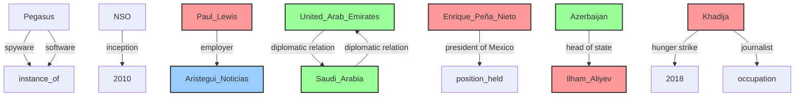
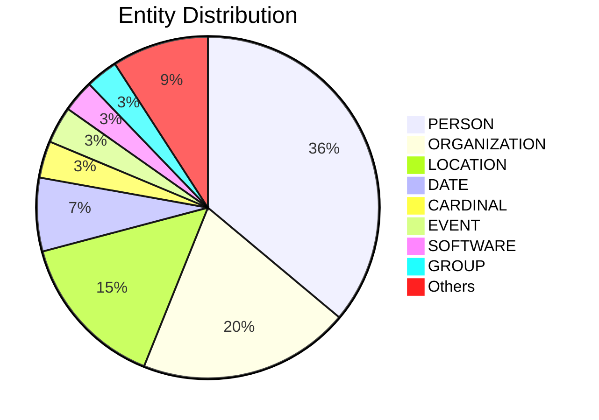

# Video Intelligence Report: Global Spyware Scandal: Exposing Pegasus Part One (full documentary) | FRONTLINE

**URL**: https://www.youtube.com/watch?v=6ZVj1_SE4Mo
**Channel**: FRONTLINE PBS | Official
**Duration**: 53:15
**Published**: 2023-01-03
**Processed**: 2025-06-27 20:26:04

**Processing Cost**: 🟡 $0.4074

## Executive Summary

A global investigation revealed the widespread misuse of Pegasus spyware, developed by the NSO Group. This powerful surveillance technology, capable of accessing nearly all data on a compromised phone, has been used to target journalists, activists, and dissidents worldwide.  A collaborative effort between 17 news outlets uncovered a list of 50,000 phone numbers potentially targeted, including those of politicians, royals, and business leaders.  The investigation highlights the lack of control over the use of Pegasus and the ethical concerns surrounding its deployment by authoritarian regimes.  While NSO claims to sell the software for legitimate purposes, the evidence strongly suggests widespread abuse, raising serious questions about the global surveillance landscape.

## 📊 Quick Stats Dashboard

<b>Click to toggle stats</b>

| Metric | Count | Visualization |
|--------|-------|---------------|
| Transcript Length | 28,229 chars | ██████████████ |
| Word Count | 4,989 words | █████████ |
| Entities Extracted | 230  | 🔵🔵🔵🔵🔵🔵🔵🔵🔵🔵🔵🔵🔵🔵🔵🔵🔵🔵🔵🔵 |
| Relationships Found | 10  | 🔗 |
| Key Points | 25  | 📌📌📌📌📌📌📌📌 |
| Topics | 3  | 🏷️🏷️🏷️ |
| Graph Nodes | 234  | ⭕⭕⭕⭕⭕⭕⭕⭕⭕⭕⭕⭕⭕⭕⭕⭕⭕⭕⭕⭕ |
| Graph Edges | 9  |  |

## 🏷️ Main Topics

<b>View all topics</b>

1. Pegasus Spyware
2. Global Surveillance
3. NSO Group

## 🕸️ Knowledge Graph Visualization

<b>Interactive relationship diagram (Mermaid)</b>

*Note: This diagram shows the top 20 relationships. For the complete graph, use the GEXF file with Gephi.*

## 🔍 Entity Analysis

### Entity Type Distribution

<b>🏷️ BOOK (1 found)</b>

| Name | Confidence | Source |
|------|------------|--------|
| 1984 | 🟩 0.86 | SpaCy |

<b>🏷️ CARDINAL (8 found)</b>

| Name | Confidence | Source |
|------|------------|--------|
| About 1,000 | 🟩 0.85 | SpaCy |
| About 50,000 | 🟩 0.85 | SpaCy |
| More Than 15,000 | 🟩 0.85 | SpaCy |
| More Than 80 | 🟩 0.85 | SpaCy |
| One | 🟩 0.85 | SpaCy |
| Tens Of Thousands | 🟩 0.85 | SpaCy |
| Three | 🟩 0.85 | SpaCy |
| Two | 🟩 0.85 | SpaCy |

<b>📆 DATE (16 found)</b>

| Name | Confidence | Source |
|------|------------|--------|
| July 2021 | 🟩 0.89 | SpaCy |
| 2010 | 🟩 0.86 | SpaCy |
| A Big Year | 🟩 0.85 | SpaCy |
| A Couple Of Weeks Ago | 🟩 0.85 | SpaCy |
| About A Year | 🟩 0.85 | SpaCy |
| Months | 🟩 0.85 | SpaCy |
| The Last 10 Years | 🟩 0.85 | SpaCy |
| Today | 🟩 0.85 | SpaCy |
| 2018 | 🟩 0.82 | SpaCy |
| Between 2019 And 2020, 2020 | 🟩 0.82 | SpaCy |
| 2019 | 🟩 0.81 | SpaCy |
| 2015 | 🟩 0.80 | SpaCy |
| 1300 | 🟨 0.76 | SpaCy |
| About 2006, 2007 | 🟨 0.75 | SpaCy |
| early May of this year | 🟨 0.73 | SpaCy |

*... and 1 more date entities*

<b>📅 EVENT (8 found)</b>

| Name | Confidence | Source |
|------|------------|--------|
| Investigation | 🟩 0.95 | SpaCy |
| Frontline's Global Spyware Scandal exposing Pegasus | 🟩 0.85 | SpaCy |
| Global Spyware Scandal | 🟩 0.85 | SpaCy |
| Pegasus al CISEN | 🟩 0.85 | SpaCy |
| Pegasus al ejército | 🟩 0.85 | SpaCy |
| COVID crisis | 🟩 0.81 | SpaCy |
| Dictatorship | 🟨 0.76 | SpaCy |
| Hunger Strike | 🟨 0.73 | SpaCy |

<b>🏷️ FACILITY (2 found)</b>

| Name | Confidence | Source |
|------|------------|--------|
| Del Lado Derecho | 🟩 0.85 | SpaCy |
| Tenía Cada Una De Las Aplicaciones De Las Que | 🟩 0.85 | SpaCy |

<b>🏷️ GROUP (7 found)</b>

| Name | Confidence | Source |
|------|------------|--------|
| Aliyev | 🟩 0.85 | SpaCy |
| Mexican | 🟩 0.85 | SpaCy |
| Moroccan | 🟩 0.85 | SpaCy |
| Nosotros | 🟩 0.85 | SpaCy |
| Saudis | 🟩 0.85 | SpaCy |
| Turkish | 🟩 0.85 | SpaCy |
| We | 🟩 0.83 | SpaCy |

<b>📍 LOCATION (34 found)</b>

| Name | Confidence | Source |
|------|------------|--------|
| Israel | 🟩 0.92 | SpaCy |
| Istanbul | 🟩 0.92 | SpaCy |
| Turkey | 🟩 0.91 | SpaCy |
| Mexico | 🟩 0.91 | SpaCy |
| India | 🟩 0.90 | SpaCy |
| Hungary | 🟩 0.90 | SpaCy |
| Casa Blanca | 🟩 0.89 | SpaCy |
| UAE airport | 🟩 0.89 | SpaCy |
| Baku | 🟩 0.89 | SpaCy |
| Kazakhstan | 🟩 0.89 | SpaCy |
| Paris | 🟩 0.89 | SpaCy |
| Airport | 🟩 0.87 | SpaCy |
| Azerbaijan | 🟩 0.87 | SpaCy |
| United Arab Emirates | 🟩 0.87 | SpaCy |
| Casa | 🟩 0.85 | SpaCy |

*... and 19 more location entities*

<b>💰 MONEY (2 found)</b>

| Name | Confidence | Source |
|------|------------|--------|
| Money | 🟩 0.88 | SpaCy |
| 1 Billion Dollars | 🟩 0.86 | SpaCy |

<b>🏷️ ORDINAL (1 found)</b>

| Name | Confidence | Source |
|------|------------|--------|
| First | 🟩 0.85 | SpaCy |

<b>🏢 ORGANIZATION (46 found)</b>

| Name | Confidence | Source |
|------|------------|--------|
| Frontline | 🟩 0.98 | SpaCy |
| Visa | 🟩 0.95 | SpaCy |
| Aristegui Noticias | 🟩 0.95 | SpaCy |
| Company | 🟩 0.94 | SpaCy |
| The Guardian | 🟩 0.91 | SpaCy |
| The Washington Post | 🟩 0.91 | SpaCy |
| Le Monde | 🟩 0.90 | SpaCy |
| Cnn | 🟩 0.89 | SpaCy |
| NSO group | 🟩 0.88 | SpaCy |
| Proceso | 🟩 0.88 | SpaCy |
| Apple Music | 🟩 0.87 | SpaCy |
| Amnesty International Security Lab | 🟩 0.87 | SpaCy |
| Cisen | 🟩 0.87 | SpaCy |
| Amazon Prime Video | 🟩 0.85 | SpaCy |
| Cuando | 🟩 0.85 | SpaCy |

*... and 31 more organization entities*

<b>👤 PERSON (83 found)</b>

| Name | Confidence | Source |
|------|------------|--------|
| Alejandro Encinas | 🟩 0.99 | SpaCy |
| Alejandro Caballero | 🟩 0.98 | SpaCy |
| Khadija | 🟩 0.96 | SpaCy |
| Civilians | 🟩 0.95 | SpaCy |
| Activists | 🟩 0.95 | SpaCy |
| Karina Maciel | 🟩 0.95 | SpaCy |
| Enrique Peña Nieto | 🟩 0.95 | SpaCy |
| Jamal Khashoggi | 🟩 0.94 | SpaCy |
| Presidente | 🟩 0.94 | SpaCy |
| Emilio | 🟩 0.93 | SpaCy |
| Hatice Cengiz | 🟩 0.92 | SpaCy |
| Hanan | 🟩 0.92 | SpaCy |
| Sandra Nogales | 🟩 0.91 | SpaCy |
| Dana Priest | 🟩 0.91 | SpaCy |
| Latifa Al Maktoum | 🟩 0.90 | SpaCy |

*... and 68 more person entities*

<b>🏷️ PLATFORM (1 found)</b>

| Name | Confidence | Source |
|------|------------|--------|
| Platform | 🟨 0.79 | SpaCy |

<b>📦 PRODUCT (7 found)</b>

| Name | Confidence | Source |
|------|------------|--------|
| Phone | 🟩 0.95 | SpaCy |
| Android | 🟩 0.85 | SpaCy |
| Androids | 🟩 0.85 | SpaCy |
| Fuera de la vigencia | 🟩 0.85 | SpaCy |
| Android phones | 🟨 0.76 | SpaCy |
| Teléfono | 🟨 0.75 | SpaCy |
| Device | 🟨 0.70 | SpaCy |

<b>🏷️ SOFTWARE (7 found)</b>

| Name | Confidence | Source |
|------|------------|--------|
| Software | 🟩 0.95 | SpaCy |
| Pegasus | 🟩 0.89 | SpaCy |
| Telegram | 🟩 0.88 | SpaCy |
| Pegasus spyware | 🟩 0.85 | SpaCy |
| El Software | 🟩 0.85 | SpaCy |
| Program | 🟩 0.84 | SpaCy |
| WhatsApp | 🟨 0.72 | SpaCy |

<b>🏷️ TECHNOLOGY (3 found)</b>

| Name | Confidence | Source |
|------|------------|--------|
| Technologies | 🟩 0.95 | SpaCy |
| Tools | 🟩 0.95 | SpaCy |
| Technology | 🟩 0.84 | SpaCy |

<b>🏷️ TIME (2 found)</b>

| Name | Confidence | Source |
|------|------------|--------|
| The minute | 🟩 0.85 | SpaCy |
| 17 Hours | 🟨 0.78 | SpaCy |

<b>🏷️ WEAPON (1 found)</b>

| Name | Confidence | Source |
|------|------------|--------|
| Military Weapon | 🟨 0.71 | SpaCy |

<b>🏷️ WORK_OF_ART (1 found)</b>

| Name | Confidence | Source |
|------|------------|--------|
| ¿Pues | 🟩 0.85 | SpaCy |

## 🔗 Relationship Network

<b>Relationship type distribution</b>

| Predicate | Count | Percentage |
|-----------|--------|------------|
| diplomatic relation | 2 | ████ 20.0% |
| spyware | 1 | ██ 10.0% |
| inception | 1 | ██ 10.0% |
| employer | 1 | ██ 10.0% |
| president of Mexico | 1 | ██ 10.0% |
| software | 1 | ██ 10.0% |
| head of state | 1 | ██ 10.0% |
| hunger strike | 1 | ██ 10.0% |
| journalist | 1 | ██ 10.0% |

<b>Key relationships (top 30)</b>

1. **Pegasus** *spyware* **instance of** 🟩 (0.85)
2. **NSO** *inception* **2010** 🟩 (0.85)
3. **Paul Lewis** *employer* **Aristegui Noticias** 🟩 (0.85)
4. **United Arab Emirates** *diplomatic relation* **Saudi Arabia** 🟩 (0.85)
5. **Saudi Arabia** *diplomatic relation* **United Arab Emirates** 🟩 (0.85)
6. **Enrique Peña Nieto** *president of Mexico* **position held** 🟩 (0.85)
7. **Pegasus** *software* **instance of** 🟩 (0.85)
8. **Azerbaijan** *head of state* **Ilham Aliyev** 🟩 (0.85)
9. **Khadija** *hunger strike* **2018** 🟩 (0.85)
10. **Khadija** *journalist* **occupation** 🟩 (0.85)

## 💡 Key Insights

<b>Top 10 key points</b>

1. 🔴 Pegasus spyware used to monitor journalists, human rights activists, and dissidents globally.
2. 🔴 NSO Group's ambition to make the world safer, but its spyware is considered a military weapon used against civilians.
3. 🔴 Lack of control over how countries use Pegasus, leading to misuse.
4. 🔴 Pegasus's technology is far ahead of government regulation and public understanding.
5. 🔴 Targeted individuals include politicians, royals, business leaders, and journalists.
6. 🔴 Once infected, a phone is completely compromised.
7. 🔴 Need for reporters, tech expertise, and help identifying phone numbers.
8. 🔴 The data identifies NSO customers and targets, which is a game changer in the cyber surveillance industry.
9. 🔴 NSO claims only three cases of misuse in the last 10 years and took serious action in these instances.
10. 🔴 The main task was identifying names behind phone numbers, as phone numbers alone were insufficient.

## 📁 Generated Files

<b>Click to see all files</b>

| File | Format | Size | Description |
|------|--------|------|-------------|
| `transcript.txt` | TXT | 27.7 KB | Plain text transcript |
| `transcript.json` | JSON | 149.3 KB | Full structured data |
| `entities.csv` | CSV | 9.7 KB | All entities in spreadsheet format |
| `relationships.csv` | CSV | 487 B | All relationships in spreadsheet format |
| `knowledge_graph.json` | JSON | 23.8 KB | Complete graph structure |
| `knowledge_graph.gexf` | GEXF | 67.9 KB | Import into Gephi for visualization |
| `metadata.json` | JSON | 4.2 KB | Video metadata and statistics |
| `manifest.json` | JSON | 2.8 KB | File index with checksums |
| `report.md` | Markdown | 8.0 KB | This report |
| `chimera_format.json` | JSON | 80.3 KB | Chimera-compatible format |

---
*Generated by ClipScribe v2.6.0 on 2025-06-27 at 20:26:04*

💡 **Tip**: This markdown file supports Mermaid diagrams. View it in a compatible editor for interactive diagrams.
