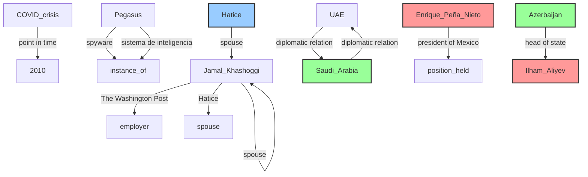
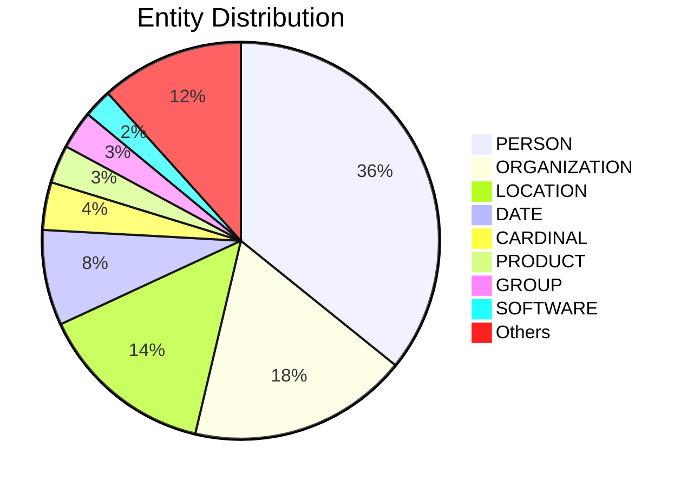

# Video Intelligence Report: Global Spyware Scandal: Exposing Pegasus Part One (full documentary) | FRONTLINE

**URL**: https://www.youtube.com/watch?v=6ZVj1_SE4Mo
**Channel**: FRONTLINE PBS | Official
**Duration**: 53:15
**Published**: 2023-01-03
**Processed**: 2025-06-29 16:39:33

**Processing Cost**: 🟡 $0.1826

## Executive Summary

The transcript details a comprehensive global investigation into Pegasus, a powerful and controversial spyware developed by the Israeli company NSO Group. Originally marketed for combating terrorism and serious crime, Pegasus has been widely misused to monitor journalists, human rights activists, and dissidents across the globe. The investigation, a two-part series titled 'Global Spyware Scandal, Exposing Pegasus' by Frontline and Forbidden Films, revealed the alarming scale and impact of this surveillance, likening the technology's intrusive capabilities to something 'beyond science fiction' and even unimaginable by George Orwell.

The investigation was sparked by a leaked database containing approximately 50,000 phone numbers from 2016 to 2020. This massive undertaking involved an unprecedented collaboration of 17 news outlets and over 80 journalists, including prominent organizations like The Washington Post, The Guardian, and Le Monde. A critical challenge was identifying the individuals behind these numbers and forensically proving Pegasus infections, a task made possible by the crucial expertise of Claudio Ganyeri and the Amnesty International Security Lab. Pegasus, designed for iPhones and Androids, can compromise virtually all data on a device, including encrypted messages, and remotely activate microphones and cameras, effectively turning a personal phone into a pervasive surveillance tool.

Despite NSO Group's claims of selling Pegasus exclusively to governments for legitimate purposes and rigorous misuse prevention, the investigation uncovered widespread abuse, with targets identified in multiple countries such as India, Mexico, Hungary, Azerbaijan, and Kazakhstan. The scandal underscores the significant gap between the rapid advancement of surveillance technology and the lagging pace of government regulation and public understanding. The potential use of Pegasus against figures like Jamal Khashoggi, who was killed in 2018, highlights the severe real-world implications of this technology for privacy, human rights, and democratic processes.

## 📊 Quick Stats Dashboard

<b>Click to toggle stats</b>

| Metric | Count | Visualization |
|--------|-------|---------------|
| Transcript Length | 30,276 chars | ███████████████ |
| Word Count | 5,401 words | ██████████ |
| Entities Extracted | 257  | 🔵🔵🔵🔵🔵🔵🔵🔵🔵🔵🔵🔵🔵🔵🔵🔵🔵🔵🔵🔵 |
| Relationships Found | 11  | 🔗 |
| Key Points | 43  | 📌📌📌📌📌📌📌📌📌📌📌📌📌📌 |
| Topics | 11  | 🏷️🏷️🏷️🏷️🏷️🏷️🏷️🏷️🏷️🏷️🏷️ |
| Graph Nodes | 241  | ⭕⭕⭕⭕⭕⭕⭕⭕⭕⭕⭕⭕⭕⭕⭕⭕⭕⭕⭕⭕ |
| Graph Edges | 10  | ➡️ |

## 🏷️ Main Topics

<b>View all topics</b>

1. Cyber Surveillance
2. Spyware
3. Pegasus Spyware
4. NSO Group
5. Journalism
6. Human Rights
7. Privacy
8. International Relations
9. Digital Security
10. Investigative Journalism
11. Government Misuse of Technology

## 🕸️ Knowledge Graph Visualization

<b>Interactive relationship diagram (Mermaid)</b>

*Note: This diagram shows the top 20 relationships. For the complete graph, use the GEXF file with Gephi.*

## 🔍 Entity Analysis

### Entity Type Distribution

<b>🏷️ BOOK (1 found)</b>

| Name | Confidence | Source |
|------|------------|--------|
| 1984 | 🟩 0.86 | SpaCy |

<b>🏷️ CARDINAL (10 found)</b>

| Name | Confidence | Source |
|------|------------|--------|
| 10 | 🟩 0.85 | SpaCy |
| 17 | 🟩 0.85 | SpaCy |
| 40 | 🟩 0.85 | SpaCy |
| About 50,000 | 🟩 0.85 | SpaCy |
| More Than 15,000 | 🟩 0.85 | SpaCy |
| More Than 80 | 🟩 0.85 | SpaCy |
| One | 🟩 0.85 | SpaCy |
| Tens Of Thousands | 🟩 0.85 | SpaCy |
| Three | 🟩 0.85 | SpaCy |
| Two | 🟩 0.85 | SpaCy |

<b>🏷️ CHARACTER (3 found)</b>

| Name | Confidence | Source |
|------|------------|--------|
| Hanan Atar | 🟩 0.95 | SpaCy |
| Jamal Khashoggi | 🟩 0.89 | SpaCy |
| Maggie | 🟩 0.88 | SpaCy |

<b>🏷️ COMPANY (3 found)</b>

| Name | Confidence | Source |
|------|------------|--------|
| Apple Music | 🟨 0.80 | SpaCy |
| Company | 🟨 0.78 | SpaCy |
| Pegasus Spyware | 🟨 0.73 | SpaCy |

<b>📆 DATE (20 found)</b>

| Name | Confidence | Source |
|------|------------|--------|
| July 2021 | 🟩 0.89 | SpaCy |
| 2010 | 🟩 0.85 | SpaCy |
| 1300 | 🟩 0.85 | SpaCy |
| 1984 | 🟩 0.85 | SpaCy |
| A Big Year | 🟩 0.85 | SpaCy |
| A Couple Of Weeks Ago | 🟩 0.85 | SpaCy |
| About A Year | 🟩 0.85 | SpaCy |
| Every Day | 🟩 0.85 | SpaCy |
| Four Days | 🟩 0.85 | SpaCy |
| Months | 🟩 0.85 | SpaCy |
| The 12Th | 🟩 0.85 | SpaCy |
| The Last 10 Years | 🟩 0.85 | SpaCy |
| Today | 🟩 0.85 | SpaCy |
| 2015 | 🟩 0.81 | SpaCy |
| October of 2018 | 🟩 0.80 | SpaCy |

*... and 5 more date entities*

<b>📅 EVENT (5 found)</b>

| Name | Confidence | Source |
|------|------------|--------|
| Global Spyware Scandal | 🟩 0.95 | SpaCy |
| Investigation | 🟩 0.95 | SpaCy |
| COVID crisis | 🟨 0.80 | SpaCy |
| Hunger Strike | 🟨 0.74 | SpaCy |
| Islamic ceremony | 🟨 0.72 | SpaCy |

<b>🏷️ FACILITY (3 found)</b>

| Name | Confidence | Source |
|------|------------|--------|
| Del Lado Derecho | 🟩 0.85 | SpaCy |
| Tenía Cada Una De Las Aplicaciones De Las Que | 🟩 0.85 | SpaCy |
| the Pegasus Spyware | 🟩 0.85 | SpaCy |

<b>🏷️ GROUP (8 found)</b>

| Name | Confidence | Source |
|------|------------|--------|
| Aliyev | 🟩 0.85 | SpaCy |
| Dans | 🟩 0.85 | SpaCy |
| Islamic | 🟩 0.85 | SpaCy |
| Jamal | 🟩 0.85 | SpaCy |
| Mexican | 🟩 0.85 | SpaCy |
| Moroccan | 🟩 0.85 | SpaCy |
| Saudis | 🟩 0.85 | SpaCy |
| Turkish | 🟩 0.85 | SpaCy |

<b>📍 LOCATION (37 found)</b>

| Name | Confidence | Source |
|------|------------|--------|
| World | 🟩 0.95 | SpaCy |
| Istanbul | 🟩 0.92 | SpaCy |
| Turkey | 🟩 0.91 | SpaCy |
| Israel | 🟩 0.91 | SpaCy |
| Hungary | 🟩 0.91 | SpaCy |
| Kazakhstan | 🟩 0.91 | SpaCy |
| Mexico | 🟩 0.90 | SpaCy |
| India | 🟩 0.90 | SpaCy |
| United States | 🟩 0.90 | SpaCy |
| Azerbaijan | 🟩 0.90 | SpaCy |
| Baku | 🟩 0.89 | SpaCy |
| Paris | 🟩 0.89 | SpaCy |
| Washington | 🟩 0.88 | SpaCy |
| UAE airport | 🟩 0.87 | SpaCy |
| Como Presidente | 🟩 0.85 | SpaCy |

*... and 22 more location entities*

<b>💰 MONEY (2 found)</b>

| Name | Confidence | Source |
|------|------------|--------|
| Money | 🟩 0.88 | SpaCy |
| $1 Billion | 🟩 0.87 | SpaCy |

<b>🏷️ OPERATION (1 found)</b>

| Name | Confidence | Source |
|------|------------|--------|
| Surveillance | 🟩 0.95 | SpaCy |

<b>🏷️ ORDINAL (3 found)</b>

| Name | Confidence | Source |
|------|------------|--------|
| 6Th | 🟩 0.85 | SpaCy |
| 9Th | 🟩 0.85 | SpaCy |
| First | 🟩 0.85 | SpaCy |

<b>🏢 ORGANIZATION (46 found)</b>

| Name | Confidence | Source |
|------|------------|--------|
| Aristegui Noticias | 🟩 0.96 | SpaCy |
| Activists | 🟩 0.95 | SpaCy |
| Frontline | 🟩 0.95 | SpaCy |
| Le Monde | 🟩 0.92 | SpaCy |
| The Guardian | 🟩 0.92 | SpaCy |
| The Washington Post | 🟩 0.92 | SpaCy |
| Proceso | 🟩 0.91 | SpaCy |
| Cnn | 🟩 0.90 | SpaCy |
| Emirates Airlines | 🟩 0.88 | SpaCy |
| Amnesty International Security Lab | 🟩 0.87 | SpaCy |
| The NSO Group | 🟩 0.87 | SpaCy |
| Android | 🟩 0.85 | SpaCy |
| Casa | 🟩 0.85 | SpaCy |
| Con La Finalidad De Elaborar | 🟩 0.85 | SpaCy |
| Cuando | 🟩 0.85 | SpaCy |

*... and 31 more organization entities*

<b>👤 PERSON (92 found)</b>

| Name | Confidence | Source |
|------|------------|--------|
| Alejandro Caballero | 🟩 0.99 | SpaCy |
| Alejandro Encinas | 🟩 0.98 | SpaCy |
| Jamal Khashoggi | 🟩 0.96 | SpaCy |
| Karina Maciel | 🟩 0.95 | SpaCy |
| Enrique Peña Nieto | 🟩 0.94 | SpaCy |
| Hatice | 🟩 0.93 | SpaCy |
| Khadija Ismayilova | 🟩 0.93 | SpaCy |
| Presidente | 🟩 0.93 | SpaCy |
| Jamal | 🟩 0.92 | SpaCy |
| Damian | 🟩 0.91 | SpaCy |
| Sandra Nogales | 🟩 0.91 | SpaCy |
| Ilham Aliyev | 🟩 0.91 | SpaCy |
| Claudio Ganyeri | 🟩 0.91 | SpaCy |
| Latifa Al Maktoum | 🟩 0.91 | SpaCy |
| Craig Timberg | 🟩 0.90 | SpaCy |

*... and 77 more person entities*

<b>🏷️ PLATFORM (1 found)</b>

| Name | Confidence | Source |
|------|------------|--------|
| Platform | 🟨 0.80 | SpaCy |

<b>📦 PRODUCT (8 found)</b>

| Name | Confidence | Source |
|------|------------|--------|
| Technology | 🟩 0.95 | SpaCy |
| Visa | 🟩 0.90 | SpaCy |
| Pegasus | 🟩 0.90 | SpaCy |
| Activists | 🟩 0.85 | SpaCy |
| WhatsApp | 🟩 0.80 | SpaCy |
| Android phones | 🟨 0.80 | SpaCy |
| Androids | 🟨 0.77 | SpaCy |
| Signal | 🟨 0.71 | SpaCy |

<b>🏷️ SHOW (1 found)</b>

| Name | Confidence | Source |
|------|------------|--------|
| Television | 🟨 0.72 | SpaCy |

<b>🏷️ SOFTWARE (6 found)</b>

| Name | Confidence | Source |
|------|------------|--------|
| Software | 🟩 0.95 | SpaCy |
| Spyware | 🟩 0.95 | SpaCy |
| Telegram | 🟩 0.89 | SpaCy |
| Pegasus | 🟩 0.88 | SpaCy |
| Program | 🟨 0.80 | SpaCy |
| WhatsApp | 🟨 0.72 | SpaCy |

<b>🏷️ TECHNOLOGY (2 found)</b>

| Name | Confidence | Source |
|------|------------|--------|
| Pegasus | 🟩 0.95 | SpaCy |
| Technology | 🟩 0.84 | SpaCy |

<b>🏷️ TIME (2 found)</b>

| Name | Confidence | Source |
|------|------------|--------|
| The minute | 🟩 0.85 | SpaCy |
| 17 Hours | 🟨 0.75 | SpaCy |

<b>🏷️ WEAPON (2 found)</b>

| Name | Confidence | Source |
|------|------------|--------|
| Pegasus | 🟩 0.81 | SpaCy |
| Military Weapon | 🟨 0.75 | SpaCy |

<b>🏷️ WORK_OF_ART (1 found)</b>

| Name | Confidence | Source |
|------|------------|--------|
| ¿Pues | 🟩 0.85 | SpaCy |

## 🔗 Relationship Network

<b>Relationship type distribution</b>

| Predicate | Count | Percentage |
|-----------|--------|------------|
| spouse | 2 | ███ 18.2% |
| diplomatic relation | 2 | ███ 18.2% |
| spyware | 1 | █ 9.1% |
| point in time | 1 | █ 9.1% |
| The Washington Post | 1 | █ 9.1% |
| Hatice | 1 | █ 9.1% |
| president of Mexico | 1 | █ 9.1% |
| sistema de inteligencia | 1 | █ 9.1% |
| head of state | 1 | █ 9.1% |

<b>Key relationships (top 30)</b>

1. **Pegasus** *spyware* **instance of** 🟩 (0.85)
2. **COVID crisis** *point in time* **2010** 🟩 (0.85)
3. **Jamal Khashoggi** *The Washington Post* **employer** 🟩 (0.85)
4. **Jamal Khashoggi** *Hatice* **spouse** 🟩 (0.85)
5. **Hatice** *spouse* **Jamal Khashoggi** 🟩 (0.85)
6. **Jamal Khashoggi** *spouse* **Jamal Khashoggi** 🟩 (0.85)
7. **UAE** *diplomatic relation* **Saudi Arabia** 🟩 (0.85)
8. **Saudi Arabia** *diplomatic relation* **UAE** 🟩 (0.85)
9. **Enrique Peña Nieto** *president of Mexico* **position held** 🟩 (0.85)
10. **Pegasus** *sistema de inteligencia* **instance of** 🟩 (0.85)
11. **Azerbaijan** *head of state* **Ilham Aliyev** 🟩 (0.85)

## 💡 Key Insights

<b>Top 10 key points</b>

1. 🔴 Pegasus is designed to infect both iPhones and Android devices.
2. 🔴 Once infected, Pegasus can extract and access all data from a device, including phonebooks, geolocation, messages, photos, and even encrypted messages from apps like Signal and WhatsApp.
3. 🔴 Pegasus can remotely access and control the microphone and camera of an infected phone.
4. 🔴 A crucial piece of information discovered was the rumor that Pegasus Spyware might have been used against Jamal Khashoggi, who was killed in 2018.
5. 🔴 Pegasus has been extensively used to monitor and track journalists, human rights activists, and dissidents globally.
6. 🔴 The investigation is a two-part series titled 'Global Spyware Scandal, Exposing Pegasus' by Frontline, in collaboration with Forbidden Films.
7. 🔴 Pegasus spyware is described as a 'military weapon used against civilians', highlighting its dangerous nature.
8. 🔴 There is a significant lack of control over how countries use Pegasus, leading to its reported misuse.
9. 🔴 The technology of Pegasus is far ahead of government regulation and public understanding.
10. 🔴 There was prior suspicion that NSO Group's powerful surveillance instrument would be abused by authoritarian regimes, but no systemic proof existed until this investigation.

## 📁 Generated Files

<b>Click to see all files</b>

| File | Format | Size | Description |
|------|--------|------|-------------|
| `transcript.txt` | TXT | 29.7 KB | Plain text transcript |
| `transcript.json` | JSON | 171.0 KB | Full structured data |
| `entities.csv` | CSV | 10.6 KB | All entities in spreadsheet format |
| `relationships.csv` | CSV | 536 B | All relationships in spreadsheet format |
| `knowledge_graph.json` | JSON | 24.2 KB | Complete graph structure |
| `knowledge_graph.gexf` | GEXF | 69.6 KB | Import into Gephi for visualization |
| `metadata.json` | JSON | 4.2 KB | Video metadata and statistics |
| `report.md` | Markdown | 8.0 KB | This report |

---
*Generated by ClipScribe v2.6.0 on 2025-06-29 at 16:39:33*

💡 **Tip**: This markdown file supports Mermaid diagrams. View it in a compatible editor for interactive diagrams.
