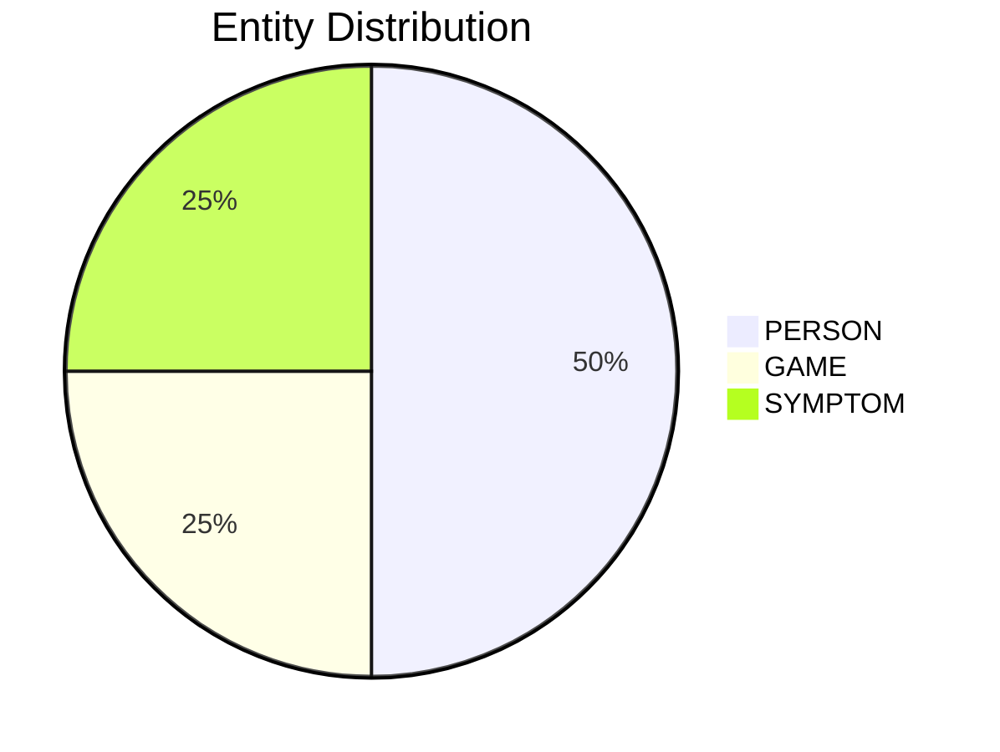

# Video Intelligence Report: Rick Astley - Never Gonna Give You Up (Official Video) (4K Remaster)

**URL**: https://www.youtube.com/watch?v=dQw4w9WgXcQ
**Channel**: Rick Astley
**Duration**: 3:33
**Published**: 2009-10-24
**Processed**: 2025-06-27 19:08:50

**Processing Cost**: 🟢 $0.0272

## Executive Summary

This transcript is a powerful declaration of unwavering love and commitment from a speaker to their beloved. The speaker establishes an intimate understanding of the relationship, acknowledging that both parties are familiar with the 'rules' of love and that a 'full commitment' is the speaker's primary intention. A key promise made is that such profound devotion is unique and not something the recipient would receive from 'any other guy', setting a tone of exclusivity and deep personal investment. The speaker's eagerness to articulate their feelings underscores a desire for clear communication and mutual understanding, especially given the recipient's perceived shyness.

The core of the message is a series of resolute promises, repeatedly emphasizing an unbreakable bond. The speaker vows 'Never gonna give you up', 'Never gonna let you down', 'Never gonna run around and desert you', 'Never gonna make you cry', 'Never gonna say goodbye', and 'Never gonna tell a lie and hurt you'. These pledges form the foundational assurance of loyalty, trust, and emotional safety, painting a picture of a relationship built on steadfastness and protection from harm.

The transcript also highlights a long-standing history between the two individuals, noting that they've 'known each other for so long'. There's an empathetic acknowledgment of the recipient's unspoken feelings, with the line 'Your heart's been aching but you're too shy to say it', indicating a deep intuitive connection where 'Inside we both know what's been going on'. The speaker asserts a shared understanding of the 'game' of their relationship and a readiness to fully engage in it. This reinforces the idea that the speaker is not only committed but also deeply attuned to the emotional landscape of the other person.

Through intense repetition of the core promises, the transcript reinforces the sincerity and permanency of the speaker's dedication. The repeated assurances serve to dispel any doubts and solidify the commitment, making it clear that the speaker's resolve is absolute and unconditional. The message is one of eternal fidelity, promising a future free from abandonment, betrayal, or emotional pain, and underscoring the speaker's unwavering and comprehensive devotion to the recipient.

## 📊 Quick Stats Dashboard

<b>Click to toggle stats</b>

| Metric | Count | Visualization |
|--------|-------|---------------|
| Transcript Length | 1,767 chars |  |
| Word Count | 354 words |  |
| Entities Extracted | 4  |  |
| Relationships Found | 0  |  |
| Key Points | 49  | 📌📌📌📌📌📌📌📌📌📌📌📌📌📌📌📌 |
| Topics | 7  | 🏷️🏷️🏷️🏷️🏷️🏷️🏷️ |
| Graph Nodes | 4  |  |
| Graph Edges | 0  |  |

## 🏷️ Main Topics

<b>View all topics</b>

1. Love and Romance
2. Commitment and Loyalty
3. Trust and Devotion
4. Relationship Dynamics
5. Emotional Expression
6. Unconditional Love
7. Fidelity

## 🔍 Entity Analysis

### Entity Type Distribution

<b>🏷️ GAME (1 found)</b>

| Name | Confidence | Source |
|------|------------|--------|
| Game | 🟩 0.91 | SpaCy |

<b>👤 PERSON (2 found)</b>

| Name | Confidence | Source |
|------|------------|--------|
| We | 🟩 0.95 | SpaCy |
| You | 🟨 0.74 | SpaCy |

<b>🏷️ SYMPTOM (1 found)</b>

| Name | Confidence | Source |
|------|------------|--------|
| Aching | 🟩 0.95 | SpaCy |

## 💡 Key Insights

<b>Top 10 key points</b>

1. 🔴 The speaker promises never to abandon the recipient (give up).
2. 🔴 The speaker promises never to disappoint the recipient (let down).
3. 🔴 The speaker promises never to leave the recipient (desert).
4. 🔴 The speaker promises never to cause the recipient sadness (cry).
5. 🔴 The speaker promises never to end the relationship (say goodbye).
6. 🔴 The speaker promises never to deceive or harm the recipient (tell a lie and hurt).
7. 🔴 The speaker reiterates the promise never to abandon the recipient.
8. 🔴 The speaker reiterates the promise never to disappoint the recipient.
9. 🔴 The speaker reiterates the promise never to leave the recipient.
10. 🔴 The speaker reiterates the promise never to cause the recipient sadness.

## 📁 Generated Files

<b>Click to see all files</b>

| File | Format | Size | Description |
|------|--------|------|-------------|
| `transcript.txt` | TXT | 1.7 KB | Plain text transcript |
| `transcript.json` | JSON | 20.4 KB | Full structured data |
| `entities.csv` | CSV | 173 B | All entities in spreadsheet format |
| `knowledge_graph.json` | JSON | 471 B | Complete graph structure |
| `knowledge_graph.gexf` | GEXF | 1.9 KB | Import into Gephi for visualization |
| `metadata.json` | JSON | 3.1 KB | Video metadata and statistics |
| `report.md` | Markdown | 0 B | This report |

---
*Generated by ClipScribe v2.6.0 on 2025-06-27 at 19:08:50*

💡 **Tip**: This markdown file supports Mermaid diagrams. View it in a compatible editor for interactive diagrams.
