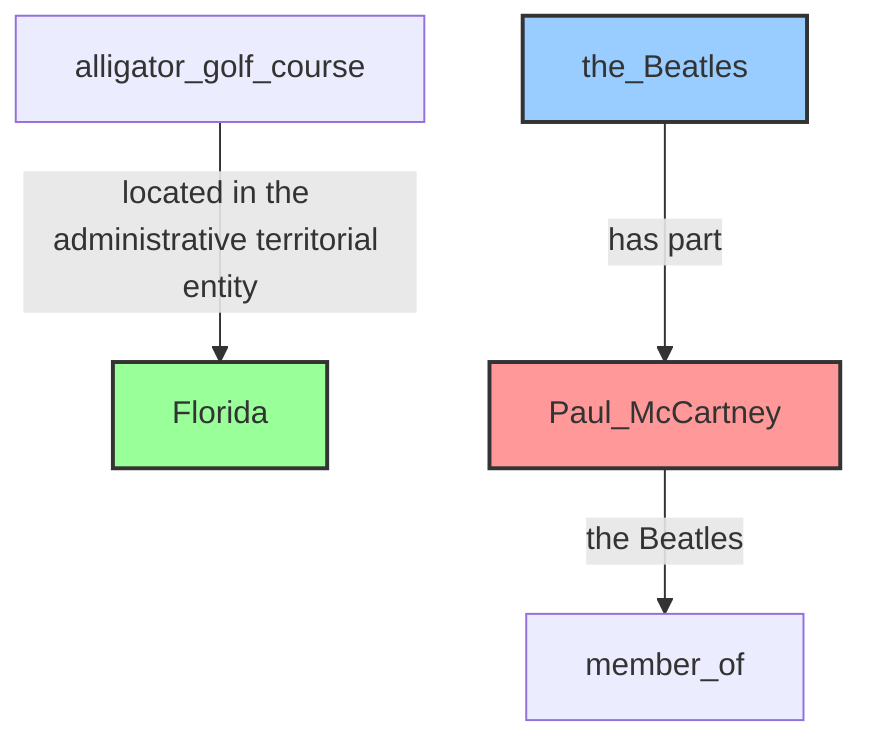
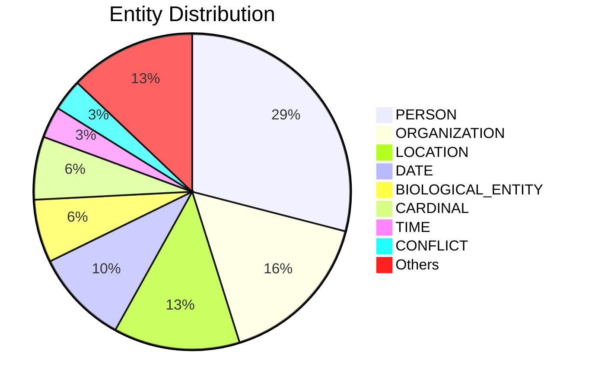

# Video Intelligence Report: The Undebunkable

**URL**: https://www.youtube.com/watch?v=sWy1qmMoToM
**Channel**: Captain Disillusion
**Duration**: 7:07
**Published**: 2016-07-11
**Processed**: 2025-06-27 19:18:45

**Processing Cost**: 🟢 $0.0544

## Executive Summary

The transcript, initially presented as a genuine debunking session by Captain Disillusion, quickly devolves into a satirical portrayal of extreme skepticism and conspiracy theorizing. Captain Disillusion 'debunks' various internet videos, including an alligator golf course video, the Flyboard Air, and 'printing on water,' by applying flawed reasoning and dismissing credible evidence. He argues that things appear fake if they don't conform to his immediate understanding or if a single 'ufologist' claims them to be a hoax.

His skepticism escalates into full-blown conspiracy theories, as he questions the authenticity of the moon landing (suggesting NASA faked it on a sound stage), claims Paul McCartney was replaced by a look-alike after a 1966 car crash, and asserts that 9/11 was an 'orchestrated hoax' with actors, and that other tragedies are 'probably not real' orchestrated events by 'powerful people' who are always 'in control.' This extreme viewpoint is presented as a coping mechanism, where accepting a conspiracy is less terrifying than the alternative of chaos.

However, the narrative shifts dramatically with the introduction of 'Zeitgeist,' who challenges Captain Disillusion's cynical perspective. Zeitgeist explains that true critical thinking and the ability to discern real from fake come from a genuine willingness to change opinions based on new facts, rather than mistrusting everything. The message concludes with an appeal to 'learn to enjoy being wrong,' highlighting that this leads to a better understanding of the world, empathy, and the avoidance of causing pain to those who have experienced real tragedies. The segment ultimately serves as a critique of harmful skepticism and promotes a balanced, open-minded approach to information.

## 📊 Quick Stats Dashboard

<b>Click to toggle stats</b>

| Metric | Count | Visualization |
|--------|-------|---------------|
| Transcript Length | 5,690 chars | ██ |
| Word Count | 1,023 words | ██ |
| Entities Extracted | 31  | 🔵🔵🔵 |
| Relationships Found | 3  |  |
| Key Points | 32  | 📌📌📌📌📌📌📌📌📌📌 |
| Topics | 8  | 🏷️🏷️🏷️🏷️🏷️🏷️🏷️🏷️ |
| Graph Nodes | 32  | ⭕⭕⭕ |
| Graph Edges | 3  |  |

## 🏷️ Main Topics

<b>View all topics</b>

1. Skepticism
2. Conspiracy Theories
3. Critical Thinking
4. Media Literacy
5. Internet Hoaxes
6. Debunking
7. Empathy
8. Satire

## 🕸️ Knowledge Graph Visualization

<b>Interactive relationship diagram (Mermaid)</b>

*Note: This diagram shows the top 20 relationships. For the complete graph, use the GEXF file with Gephi.*

## 🔍 Entity Analysis

### Entity Type Distribution

<b>🏷️ BIOLOGICAL_ENTITY (2 found)</b>

| Name | Confidence | Source |
|------|------------|--------|
| Alligator | 🟩 0.90 | SpaCy |
| It | 🟨 0.76 | SpaCy |

<b>🏷️ CARDINAL (2 found)</b>

| Name | Confidence | Source |
|------|------------|--------|
| 3,000 | 🟩 0.85 | SpaCy |
| Two | 🟩 0.85 | SpaCy |

<b>🏷️ CHARACTER (1 found)</b>

| Name | Confidence | Source |
|------|------------|--------|
| Zeitgeist | 🟨 0.71 | SpaCy |

<b>🏷️ CONFLICT (1 found)</b>

| Name | Confidence | Source |
|------|------------|--------|
| Global Conspiracy | 🟩 0.83 | SpaCy |

<b>📆 DATE (3 found)</b>

| Name | Confidence | Source |
|------|------------|--------|
| Just A Few Years Ago | 🟩 0.85 | SpaCy |
| Last Month | 🟩 0.85 | SpaCy |
| 1966 | 🟨 0.80 | SpaCy |

<b>📅 EVENT (1 found)</b>

| Name | Confidence | Source |
|------|------------|--------|
| Bombing | 🟨 0.75 | SpaCy |

<b>📍 LOCATION (4 found)</b>

| Name | Confidence | Source |
|------|------------|--------|
| Florida | 🟩 0.91 | SpaCy |
| Hollywood | 🟩 0.85 | SpaCy |
| Earth | 🟩 0.85 | SpaCy |
| Western Hemisphere | 🟩 0.83 | SpaCy |

<b>🏢 ORGANIZATION (5 found)</b>

| Name | Confidence | Source |
|------|------------|--------|
| the Beatles | 🟩 0.95 | SpaCy |
| Nasa | 🟩 0.91 | SpaCy |
| Guinness World Records | 🟩 0.85 | SpaCy |
| The Flyboard Air | 🟩 0.85 | SpaCy |
| Wikipedia | 🟨 0.76 | SpaCy |

<b>👤 PERSON (9 found)</b>

| Name | Confidence | Source |
|------|------------|--------|
| People | 🟩 0.95 | SpaCy |
| Zachary | 🟩 0.86 | SpaCy |
| Beatles | 🟩 0.85 | SpaCy |
| Occam | 🟩 0.85 | SpaCy |
| Zeitgeist | 🟩 0.85 | SpaCy |
| You | 🟩 0.84 | SpaCy |
| Paul McCartney | 🟩 0.81 | SpaCy |
| Ufologist | 🟨 0.75 | SpaCy |
| Captain Disillusion | 🟨 0.73 | SpaCy |

<b>📦 PRODUCT (1 found)</b>

| Name | Confidence | Source |
|------|------------|--------|
| Flyboard Air | 🟨 0.77 | SpaCy |

<b>🏷️ SONG (1 found)</b>

| Name | Confidence | Source |
|------|------------|--------|
| Music | 🟨 0.78 | SpaCy |

<b>🏷️ TIME (1 found)</b>

| Name | Confidence | Source |
|------|------------|--------|
| Tonight | 🟩 0.85 | SpaCy |

## 🔗 Relationship Network

<b>Relationship type distribution</b>

| Predicate | Count | Percentage |
|-----------|--------|------------|
| located in the administrative territorial entity | 1 | ██████ 33.3% |
| the Beatles | 1 | ██████ 33.3% |
| has part | 1 | ██████ 33.3% |

<b>Key relationships (top 30)</b>

1. **alligator golf course** *located in the administrative territorial entity* **Florida** 🟩 (0.85)
2. **Paul McCartney** *the Beatles* **member of** 🟩 (0.85)
3. **the Beatles** *has part* **Paul McCartney** 🟩 (0.85)

## 💡 Key Insights

<b>Top 10 key points</b>

1. 🔴 A new voice, Zeitgeist, interjects, stating 'It is terrifying. But the terror wears off.' (The turning point of the satire).
2. 🔴 Zeitgeist emphasizes that true power comes from 'an honest willingness to change your opinions and beliefs based on new facts'.
3. 🔴 He broadly states, 'You can't trust anything you see on the Internet or hear on the news anymore. Period. End of thought process.'
4. 🔴 He states that the idea of 'no one was in control' would be 'terrifying'.
5. 🔴 Zeitgeist explains that enduring disillusionment allows one to 'see the world through new eyes'.
6. 🔴 Zeitgeist states that 'rationality and critical thinking lead to empathy and social growth'.
7. 🔴 Zeitgeist clarifies that the power to discern real from fake doesn't come from being an expert or mistrusting everything.
8. 🔴 Zeitgeist advises to 'learn to enjoy being wrong' for the world to make more sense and to feel less 'out of step with the rest of humanity'.
9. 🔴 He 'debunks' the alligator video, stating it's fake because the alligator is 'too big,' pixels look 'weird,' and walking seems 'animated'.
10. 🔴 He challenges the existence of Flyboard Air, questioning the sudden technological leap, the weight-to-lift ratio, and the fuel source.

## 📁 Generated Files

<b>Click to see all files</b>

| File | Format | Size | Description |
|------|--------|------|-------------|
| `transcript.txt` | TXT | 5.6 KB | Plain text transcript |
| `transcript.json` | JSON | 33.5 KB | Full structured data |
| `entities.csv` | CSV | 1.3 KB | All entities in spreadsheet format |
| `relationships.csv` | CSV | 218 B | All relationships in spreadsheet format |
| `knowledge_graph.json` | JSON | 3.5 KB | Complete graph structure |
| `knowledge_graph.gexf` | GEXF | 10.4 KB | Import into Gephi for visualization |
| `metadata.json` | JSON | 738 B | Video metadata and statistics |
| `report.md` | Markdown | 8.0 KB | This report |

---
*Generated by ClipScribe v2.6.0 on 2025-06-27 at 19:18:45*

💡 **Tip**: This markdown file supports Mermaid diagrams. View it in a compatible editor for interactive diagrams.
