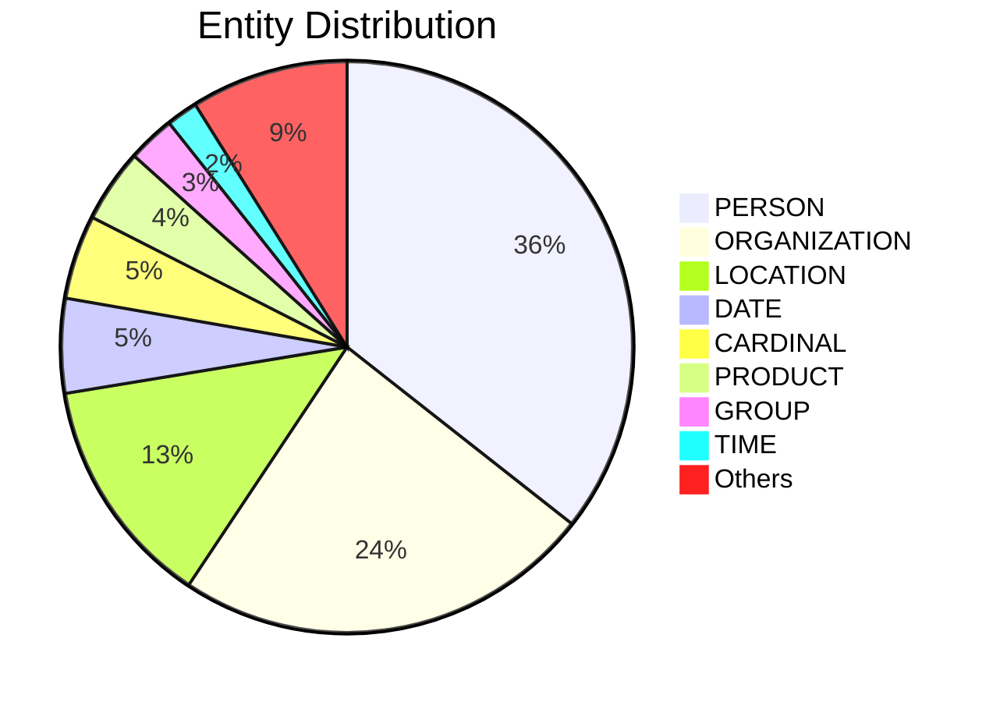

# Video Intelligence Report: Global Spyware Scandal: Exposing Pegasus Part Two (full documentary) | FRONTLINE

**URL**: https://www.youtube.com/watch?v=xYMWTXIkANM
**Channel**: FRONTLINE PBS | Official
**Duration**: 53:18
**Published**: 2023-01-10
**Processed**: 2025-06-27 19:28:48

**Processing Cost**: 🟡 $0.4077

## Executive Summary

A joint investigation by 70 news outlets revealed the widespread misuse of the Pegasus spyware, developed by NSO Group.  The spyware, described as a military-grade tool, has been used by governments globally to target civilians, including journalists, activists, politicians, and even heads of state. The investigation focused on the targeting of over 1000 individuals in France, potentially by Morocco, and highlighted the case of Princess Latifa, whose attempted escape from Dubai seems to have involved the use of Pegasus to track her and her associates. The investigation also revealed the infection of David Haigh, a human rights activist working on Princess Latifa's case, further underscoring the spyware's misuse for suppressing dissent and targeting human rights defenders.

## 📊 Quick Stats Dashboard

<b>Click to toggle stats</b>

| Metric | Count | Visualization |
|--------|-------|---------------|
| Transcript Length | 31,795 chars | ███████████████ |
| Word Count | 5,598 words | ███████████ |
| Entities Extracted | 337  | 🔵🔵🔵🔵🔵🔵🔵🔵🔵🔵🔵🔵🔵🔵🔵🔵🔵🔵🔵🔵 |
| Relationships Found | 14  | 🔗 |
| Key Points | 14  | 📌📌📌📌 |
| Topics | 4  | 🏷️🏷️🏷️🏷️ |
| Graph Nodes | 332  | ⭕⭕⭕⭕⭕⭕⭕⭕⭕⭕⭕⭕⭕⭕⭕⭕⭕⭕⭕⭕ |
| Graph Edges | 14  | ➡️ |

## 🏷️ Main Topics

<b>View all topics</b>

1. Global Spyware Scandal
2. NSO Group
3. PEGASUS Spyware
4. Human Rights Violations

## 🕸️ Knowledge Graph Visualization

```mermaid
graph TD
    %% Top Entity Relationships
    Pegasus_software -->|"spyware"| instance_of
    Sheikh_Mohammed_bin_Rashid_Al_Maktoum -->|"Princess Latifa"| child
    Princess_Latifa -->|"child"| Princess_Latifa
    Sheikh_Mohammed_bin_Rashid_Al_Maktoum -->|"father"| Princess_Latifa
    Dubai_Princess -->|"located in the administrative territorial entity"| Dubai
    Jumeirah -->|"located in the administrative territorial entity"| Dubai
    Israeli_Defense_Ministry -->|"country"| Israel
    Cecilio_Pineda -->|"country of citizenship"| Mexico
    Forbidden_Stories -->|"publication date"| 2021
    Spain -->|"Catalonia"| contains_administrative_territorial_entity
    Catalonia -->|"Spain"| country
    UAE -->|"diplomatic relation"| Saudi_Arabia
    Saudi_Arabia -->|"diplomatic relation"| UAE
    Köszönöm_szépen -->|"language of work or name"| Hungarian

    %% Styling
    class Sheikh_Mohammed_bin_Rashid_Al_Maktoum personClass
    class Princess_Latifa personClass
    class Dubai locationClass
    class Jumeirah locationClass
    class Israeli_Defense_Ministry organizationClass
    class Israel locationClass
    class Mexico locationClass
    class Forbidden_Stories organizationClass
    class Spain locationClass
    class Catalonia locationClass
    class Saudi_Arabia locationClass
    classDef personClass fill:#ff9999,stroke:#333,stroke-width:2px
    classDef organizationClass fill:#99ccff,stroke:#333,stroke-width:2px
    classDef locationClass fill:#99ff99,stroke:#333,stroke-width:2px
    classDef productClass fill:#ffcc99,stroke:#333,stroke-width:2px
```

<b>Interactive relationship diagram (Mermaid)</b>

*Note: This diagram shows the top 20 relationships. For the complete graph, use the GEXF file with Gephi.*

## 🔍 Entity Analysis

### Entity Type Distribution

<b>🏷️ CARDINAL (16 found)</b>

| Name | Confidence | Source |
|------|------------|--------|
| 14 | 🟩 0.85 | SpaCy |
| 17 | 🟩 0.85 | SpaCy |
| 18 | 🟩 0.85 | SpaCy |
| 60 | 🟩 0.85 | SpaCy |
| 70 | 🟩 0.85 | SpaCy |
| 80 | 🟩 0.85 | SpaCy |
| About 15 | 🟩 0.85 | SpaCy |
| At Least 37 | 🟩 0.85 | SpaCy |
| Dozens | 🟩 0.85 | SpaCy |
| Eight | 🟩 0.85 | SpaCy |
| Five | 🟩 0.85 | SpaCy |
| More than 50,000 | 🟩 0.85 | SpaCy |
| One | 🟩 0.85 | SpaCy |
| qu'Israël | 🟩 0.85 | SpaCy |
| Two | 🟩 0.85 | SpaCy |

*... and 1 more cardinal entities*

<b>🏷️ CHANNEL (1 found)</b>

| Name | Confidence | Source |
|------|------------|--------|
| Amazon Prime Video | 🟩 0.82 | SpaCy |

<b>🏷️ COMPANY (2 found)</b>

| Name | Confidence | Source |
|------|------------|--------|
| Consortium Of Media Partners | 🟩 0.88 | SpaCy |
| Frontline | 🟩 0.87 | SpaCy |

<b>🏷️ CONFLICT (1 found)</b>

| Name | Confidence | Source |
|------|------------|--------|
| Violencia | 🟨 0.73 | SpaCy |

<b>📆 DATE (18 found)</b>

| Name | Confidence | Source |
|------|------------|--------|
| Mars 2019 | 🟩 0.87 | SpaCy |
| July 2017 | 🟩 0.86 | SpaCy |
| About 15, 20 Minutes | 🟩 0.85 | SpaCy |
| Every Day | 🟩 0.85 | SpaCy |
| Just Weeks | 🟩 0.85 | SpaCy |
| Several Years Ago | 🟩 0.85 | SpaCy |
| The End Of The Day | 🟩 0.85 | SpaCy |
| The Next Day | 🟩 0.85 | SpaCy |
| The Past Several Years | 🟩 0.85 | SpaCy |
| The Same Day After Months | 🟩 0.85 | SpaCy |
| Those Two Weeks | 🟩 0.85 | SpaCy |
| Today | 🟩 0.85 | SpaCy |
| Two Days | 🟩 0.85 | SpaCy |
| הפעלת | 🟩 0.85 | SpaCy |
| the 3rd of August 2020 | 🟩 0.83 | SpaCy |

*... and 3 more date entities*

<b>🏷️ DISEASE (1 found)</b>

| Name | Confidence | Source |
|------|------------|--------|
| Pegasus | 🟩 0.95 | SpaCy |

<b>📅 EVENT (4 found)</b>

| Name | Confidence | Source |
|------|------------|--------|
| Investigation | 🟩 0.95 | SpaCy |
| לביקור | 🟩 0.85 | SpaCy |
| Polish Watergate | 🟩 0.83 | SpaCy |
| Crise Politique | 🟨 0.76 | SpaCy |

<b>🏷️ FACILITY (1 found)</b>

| Name | Confidence | Source |
|------|------------|--------|
| Del Del Narcotráfico | 🟩 0.85 | SpaCy |

<b>🏷️ GROUP (9 found)</b>

| Name | Confidence | Source |
|------|------------|--------|
| British | 🟩 0.85 | SpaCy |
| Cinq | 🟩 0.85 | SpaCy |
| Dans | 🟩 0.85 | SpaCy |
| Drian | 🟩 0.85 | SpaCy |
| Indian | 🟩 0.85 | SpaCy |
| Israeli | 🟩 0.85 | SpaCy |
| Moroccan | 🟩 0.85 | SpaCy |
| N'Y | 🟩 0.85 | SpaCy |
| Palestinians | 🟩 0.85 | SpaCy |

<b>🏷️ LANGUAGE (1 found)</b>

| Name | Confidence | Source |
|------|------------|--------|
| Hungarian | 🟩 0.85 | SpaCy |

<b>📍 LOCATION (44 found)</b>

| Name | Confidence | Source |
|------|------------|--------|
| הונגריה | 🟩 0.96 | SpaCy |
| Dubai | 🟩 0.94 | SpaCy |
| Región | 🟩 0.91 | SpaCy |
| Guerrero | 🟩 0.91 | SpaCy |
| Burj Al Arab | 🟩 0.91 | SpaCy |
| Jumeirah | 🟩 0.91 | SpaCy |
| London | 🟩 0.90 | SpaCy |
| Saudi Arabia | 🟩 0.89 | SpaCy |
| Hungary | 🟩 0.88 | SpaCy |
| Israel | 🟩 0.88 | SpaCy |
| Magyarország | 🟩 0.88 | SpaCy |
| Catalonia | 🟩 0.87 | SpaCy |
| Polski | 🟩 0.87 | SpaCy |
| Israël | 🟩 0.87 | SpaCy |
| Élysée | 🟩 0.86 | SpaCy |

*... and 29 more location entities*

<b>🏷️ MILITARY_UNIT (1 found)</b>

| Name | Confidence | Source |
|------|------------|--------|
| Indian special forces | 🟩 0.83 | SpaCy |

<b>💰 MONEY (3 found)</b>

| Name | Confidence | Source |
|------|------------|--------|
| Qu'Effectivement | 🟩 0.85 | SpaCy |
| Over A Billion Dollars | 🟩 0.83 | SpaCy |
| Money | 🟨 0.74 | SpaCy |

<b>🏷️ OPERATION (1 found)</b>

| Name | Confidence | Source |
|------|------------|--------|
| Operation | 🟨 0.70 | SpaCy |

<b>🏷️ ORDINAL (1 found)</b>

| Name | Confidence | Source |
|------|------------|--------|
| First | 🟩 0.85 | SpaCy |

<b>🏢 ORGANIZATION (80 found)</b>

| Name | Confidence | Source |
|------|------------|--------|
| Forbidden Films | 🟩 0.95 | SpaCy |
| ועדת החוץ והביטחון | 🟩 0.94 | SpaCy |
| Politicians | 🟩 0.93 | SpaCy |
| הכנסת | 🟩 0.93 | SpaCy |
| Magyar Kormánnyal | 🟩 0.93 | SpaCy |
| Le Monde | 🟩 0.93 | SpaCy |
| Detained International | 🟩 0.90 | SpaCy |
| Hamas | 🟩 0.89 | SpaCy |
| 8200 | 🟩 0.89 | SpaCy |
| The Guardian | 🟩 0.89 | SpaCy |
| European Parliament | 🟩 0.88 | SpaCy |
| The Washington Post | 🟩 0.88 | SpaCy |
| Parlaments | 🟩 0.88 | SpaCy |
| El Crimen Organizado | 🟩 0.87 | SpaCy |
| Pegasus Project | 🟩 0.87 | SpaCy |

*... and 65 more organization entities*

<b>🏷️ PERCENTAGE (1 found)</b>

| Name | Confidence | Source |
|------|------------|--------|
| 100% | 🟩 0.85 | SpaCy |

<b>👤 PERSON (120 found)</b>

| Name | Confidence | Source |
|------|------------|--------|
| François de Rugy | 🟩 0.99 | SpaCy |
| רם בן ברק | 🟩 0.98 | SpaCy |
| ויקטור אורבן | 🟩 0.97 | SpaCy |
| Laurent Richard | 🟩 0.97 | SpaCy |
| Activists | 🟩 0.95 | SpaCy |
| People | 🟩 0.95 | SpaCy |
| David Haigh | 🟩 0.94 | SpaCy |
| Jamal Khashoggi | 🟩 0.94 | SpaCy |
| Mohammed VI | 🟩 0.93 | SpaCy |
| נתניהו | 🟩 0.92 | SpaCy |
| Tedros Ghebreyesus | 🟩 0.92 | SpaCy |
| Hannah Neumann | 🟩 0.92 | SpaCy |
| Princess Latifa | 🟩 0.91 | SpaCy |
| Emmanuel Macron qui | 🟩 0.91 | SpaCy |
| Sheikh Mohammed | 🟩 0.90 | SpaCy |

*... and 105 more person entities*

<b>📦 PRODUCT (14 found)</b>

| Name | Confidence | Source |
|------|------------|--------|
| Pegasus | 🟩 0.95 | SpaCy |
| Spyware | 🟩 0.95 | SpaCy |
| F-35 | 🟩 0.85 | SpaCy |
| l'Algérie | 🟩 0.85 | SpaCy |
| Ouais | 🟩 0.85 | SpaCy |
| Pero | 🟩 0.85 | SpaCy |
| Qu'Il Va | 🟩 0.85 | SpaCy |
| כמה כמה שיפורים | 🟩 0.85 | SpaCy |
| שאי אפשר | 🟩 0.85 | SpaCy |
| Phones | 🟨 0.76 | SpaCy |
| Product | 🟨 0.75 | SpaCy |
| Jet Skis | 🟨 0.75 | SpaCy |
| Yacht | 🟨 0.72 | SpaCy |
| Computers | 🟨 0.71 | SpaCy |

<b>🏷️ PROTOCOL (1 found)</b>

| Name | Confidence | Source |
|------|------------|--------|
| Sms | 🟨 0.71 | SpaCy |

<b>🏷️ SOFTWARE (3 found)</b>

| Name | Confidence | Source |
|------|------------|--------|
| Nso | 🟩 0.95 | SpaCy |
| Pegasus | 🟩 0.91 | SpaCy |
| Pegasus software | 🟨 0.73 | SpaCy |

<b>🏷️ TECHNOLOGY (2 found)</b>

| Name | Confidence | Source |
|------|------------|--------|
| Pegasus | 🟩 0.95 | SpaCy |
| Technology | 🟨 0.71 | SpaCy |

<b>🏷️ TIME (6 found)</b>

| Name | Confidence | Source |
|------|------------|--------|
| about 3 AM in the morning | 🟩 0.85 | SpaCy |
| The Next 12 Hours | 🟩 0.85 | SpaCy |
| The Next Morning | 🟩 0.85 | SpaCy |
| The Same Minute | 🟩 0.85 | SpaCy |
| The several hours | 🟩 0.85 | SpaCy |
| 42 Minutes | 🟨 0.74 | SpaCy |

<b>🏷️ WEAPON (4 found)</b>

| Name | Confidence | Source |
|------|------------|--------|
| Pegasus | 🟩 0.85 | SpaCy |
| Military Weapons | 🟨 0.78 | SpaCy |
| F-35 | 🟨 0.72 | SpaCy |
| Regulations | 🟨 0.72 | SpaCy |

<b>🏷️ WORK_OF_ART (2 found)</b>

| Name | Confidence | Source |
|------|------------|--------|
| Frontline's Global Spyware Scandal: Exposing Pegasus | 🟩 0.85 | SpaCy |
| Sabes que Cecilio Pineda | 🟩 0.85 | SpaCy |

## 🔗 Relationship Network

<b>Relationship type distribution</b>

| Predicate | Count | Percentage |
|-----------|--------|------------|
| located in the administrative territorial entity | 2 | ██ 14.3% |
| diplomatic relation | 2 | ██ 14.3% |
| spyware | 1 | █ 7.1% |
| Princess Latifa | 1 | █ 7.1% |
| child | 1 | █ 7.1% |
| father | 1 | █ 7.1% |
| country | 1 | █ 7.1% |
| country of citizenship | 1 | █ 7.1% |
| publication date | 1 | █ 7.1% |
| Catalonia | 1 | █ 7.1% |
| Spain | 1 | █ 7.1% |
| language of work or name | 1 | █ 7.1% |

<b>Key relationships (top 30)</b>

1. **Pegasus software** *spyware* **instance of** 🟩 (0.85)
2. **Sheikh Mohammed bin Rashid Al Maktoum** *Princess Latifa* **child** 🟩 (0.85)
3. **Princess Latifa** *child* **Princess Latifa** 🟩 (0.85)
4. **Sheikh Mohammed bin Rashid Al Maktoum** *father* **Princess Latifa** 🟩 (0.85)
5. **Dubai Princess** *located in the administrative territorial entity* **Dubai** 🟩 (0.85)
6. **Jumeirah** *located in the administrative territorial entity* **Dubai** 🟩 (0.85)
7. **Israeli Defense Ministry** *country* **Israel** 🟩 (0.85)
8. **Cecilio Pineda** *country of citizenship* **Mexico** 🟩 (0.85)
9. **Forbidden Stories** *publication date* **2021** 🟩 (0.85)
10. **Spain** *Catalonia* **contains administrative territorial entity** 🟩 (0.85)
11. **Catalonia** *Spain* **country** 🟩 (0.85)
12. **UAE** *diplomatic relation* **Saudi Arabia** 🟩 (0.85)
13. **Saudi Arabia** *diplomatic relation* **UAE** 🟩 (0.85)
14. **Köszönöm szépen** *language of work or name* **Hungarian** 🟩 (0.85)

## 💡 Key Insights

<b>Top 10 key points</b>

1. 🔴 PEGASUS spyware, developed by NSO, is a powerful tool used for surveillance, described as a military weapon used against civilians worldwide.
2. 🔴 Princess Latifa's attempted escape and subsequent return to Dubai involved the use of Pegasus to track her and her associates.
3. 🔴 The spyware's lack of control over its usage by countries raises serious ethical concerns.
4. 🔴 Over 1000 French individuals were potentially targeted by Morocco, including journalists, lawyers, activists, government members, and President Macron himself.
5. 🔴 The investigation team confirmed President Macron's number was active by sending him an SMS, resulting in contact from the Élysée Palace.
6. 🔴 Moroccan dissidents and even the King of Morocco were on the target list.
7. 🔴 The UAE's use of Pegasus against Princess Latifa highlights its use in autocratic regimes.
8. 🔴 Haigh's infection occurred while he possessed videos and evidence from Latifa about her captivity.
9. 🔴 The investigation involves a joint effort by 70 news outlets, including The Washington Post, The Guardian, and Le Monde, collaborating with Forbidden Films.
10. 🔴 Former French minister François de Rugy cooperated with the investigation, confirming he was targeted by Morocco.

## 📁 Generated Files

<b>Click to see all files</b>

| File | Format | Size | Description |
|------|--------|------|-------------|
| `transcript.txt` | TXT | 33.4 KB | Plain text transcript |
| `transcript.json` | JSON | 211.3 KB | Full structured data |
| `entities.csv` | CSV | 14.5 KB | All entities in spreadsheet format |
| `relationships.csv` | CSV | 810 B | All relationships in spreadsheet format |
| `knowledge_graph.json` | JSON | 36.0 KB | Complete graph structure |
| `knowledge_graph.gexf` | GEXF | 97.0 KB | Import into Gephi for visualization |
| `metadata.json` | JSON | 4.1 KB | Video metadata and statistics |
| `manifest.json` | JSON | 2.8 KB | File index with checksums |
| `report.md` | Markdown | 16.0 KB | This report |
| `chimera_format.json` | JSON | 114.1 KB | Chimera-compatible format |

---
*Generated by ClipScribe v2.6.0 on 2025-06-27 at 19:28:48*

💡 **Tip**: This markdown file supports Mermaid diagrams. View it in a compatible editor for interactive diagrams.
