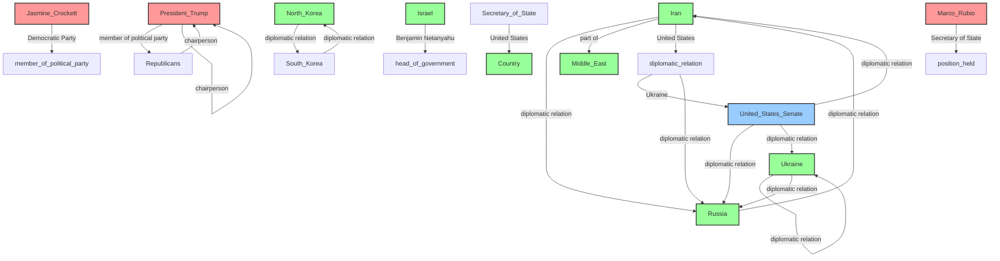
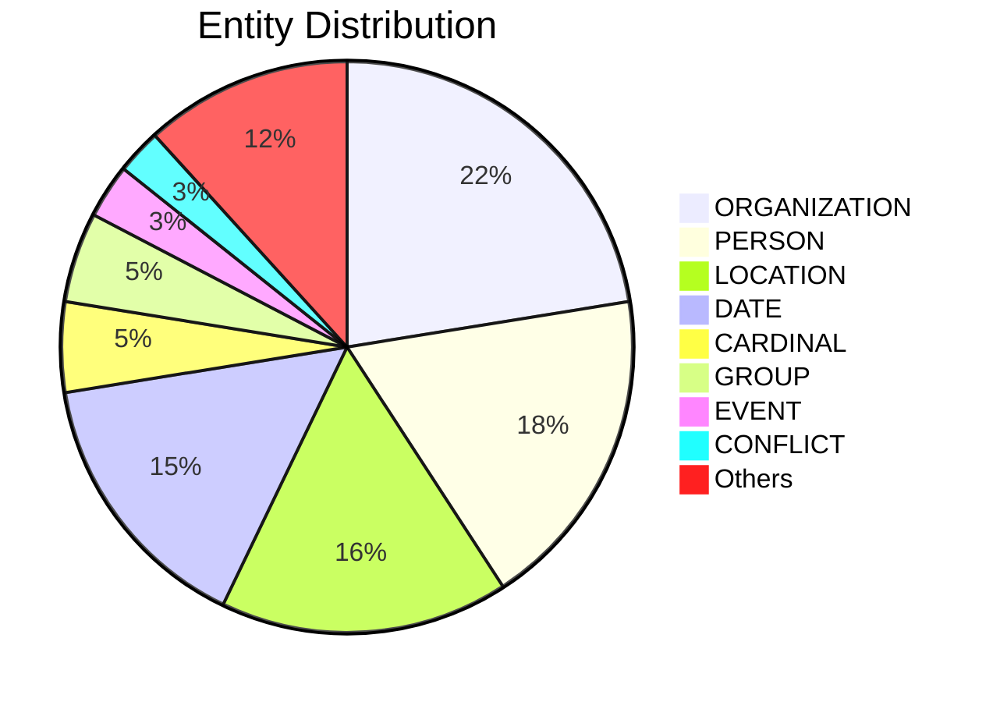

# Video Intelligence Report: Press Secretary Karoline Leavitt Briefs Members of the Media, June 19, 2025

**URL**: https://www.youtube.com/watch?v=3MYm2XzvrM4
**Channel**: The White House
**Duration**: 29:26
**Published**: 2025-06-19
**Processed**: 2025-06-28 14:50:56

**Processing Cost**: 🟡 $0.1009

## Executive Summary

The press briefing commenced by highlighting significant achievements in border security under the Trump administration. It was reported that Border Patrol saw a 93% decrease in illegal alien crossings at the Southwest border compared to May 2024 under Joe Biden. A key accomplishment noted was that zero illegal aliens were released into the United States in May under Trump, a direct contrast to Biden's policies that allegedly wasted resources and jeopardized national security. The President's decision to terminate these "reckless Biden-era practices" was credited with the border's "unprecedented levels of operational success." The administration plans to intensify efforts to arrest and deport millions of criminal illegal aliens who entered during the Biden presidency, specifically targeting "sanctuary cities" with full support for ICE officers. Simultaneously, the briefing praised ICE officers as heroes upholding the rule of law. 

## 📊 Quick Stats Dashboard

<b>Click to toggle stats</b>

| Metric | Count | Visualization |
|--------|-------|---------------|
| Transcript Length | 32,552 chars | ████████████████ |
| Word Count | 5,682 words | ███████████ |
| Entities Extracted | 196  | 🔵🔵🔵🔵🔵🔵🔵🔵🔵🔵🔵🔵🔵🔵🔵🔵🔵🔵🔵 |
| Relationships Found | 21  | 🔗🔗 |
| Key Points | 40  | 📌📌📌📌📌📌📌📌📌📌📌📌📌 |
| Topics | 11  | 🏷️🏷️🏷️🏷️🏷️🏷️🏷️🏷️🏷️🏷️🏷️ |
| Graph Nodes | 187  | ⭕⭕⭕⭕⭕⭕⭕⭕⭕⭕⭕⭕⭕⭕⭕⭕⭕⭕ |
| Graph Edges | 21  | ➡️➡️ |

## 🏷️ Main Topics

<b>View all topics</b>

1. Immigration Policy
2. Border Security
3. Economic Policy
4. Wage Growth
5. Tax Reform
6. Foreign Policy
7. Iran Nuclear Deal
8. Technology Regulation
9. TikTok Ban
10. Government Operations
11. Public Approval

## 🕸️ Knowledge Graph Visualization

<b>Interactive relationship diagram (Mermaid)</b>

*Note: This diagram shows the top 20 relationships. For the complete graph, use the GEXF file with Gephi.*

## 🔍 Entity Analysis

### Entity Type Distribution

<b>🏷️ CARDINAL (10 found)</b>

| Name | Confidence | Source |
|------|------------|--------|
| 1.4 Million | 🟩 0.85 | SpaCy |
| 100 Million | 🟩 0.85 | SpaCy |
| Four | 🟩 0.85 | SpaCy |
| Millions | 🟩 0.85 | SpaCy |
| More Than 117,000 | 🟩 0.85 | SpaCy |
| Nearly 80 Million | 🟩 0.85 | SpaCy |
| One | 🟩 0.85 | SpaCy |
| Six | 🟩 0.85 | SpaCy |
| Two | 🟩 0.85 | SpaCy |
| Zero | 🟩 0.85 | SpaCy |

<b>🏷️ CONFLICT (5 found)</b>

| Name | Confidence | Source |
|------|------------|--------|
| Ceasefire | 🟩 0.81 | SpaCy |
| Skirmish | 🟨 0.77 | SpaCy |
| Direct Conflict | 🟨 0.75 | SpaCy |
| Global Conflicts | 🟨 0.71 | SpaCy |
| Wars | 🟨 0.70 | SpaCy |

<b>📆 DATE (30 found)</b>

| Name | Confidence | Source |
|------|------------|--------|
| Last Month | 🟩 0.95 | SpaCy |
| July 4th | 🟩 0.87 | SpaCy |
| 60-Day | 🟩 0.85 | SpaCy |
| 90 Days | 🟩 0.85 | SpaCy |
| 90-Day | 🟩 0.85 | SpaCy |
| A Couple Of Weeks | 🟩 0.85 | SpaCy |
| A Federal Holiday | 🟩 0.85 | SpaCy |
| A Few Weeks Ago | 🟩 0.85 | SpaCy |
| A Year | 🟩 0.85 | SpaCy |
| About Two Weeks | 🟩 0.85 | SpaCy |
| Decades | 🟩 0.85 | SpaCy |
| Every Day | 🟩 0.85 | SpaCy |
| Nearly 60 Years | 🟩 0.85 | SpaCy |
| The First Week | 🟩 0.85 | SpaCy |
| The Last Week | 🟩 0.85 | SpaCy |

*... and 15 more date entities*

<b>📅 EVENT (6 found)</b>

| Name | Confidence | Source |
|------|------------|--------|
| Independence Day | 🟩 0.85 | SpaCy |
| Leak Investigation | 🟩 0.81 | SpaCy |
| Gdp | 🟨 0.80 | SpaCy |
| Mass Closures | 🟨 0.77 | SpaCy |
| Mental Illness | 🟨 0.74 | SpaCy |
| Federal Holiday | 🟨 0.71 | SpaCy |

<b>🏷️ GROUP (10 found)</b>

| Name | Confidence | Source |
|------|------------|--------|
| Americans | 🟩 0.85 | SpaCy |
| Chinese | 🟩 0.85 | SpaCy |
| Democrats | 🟩 0.85 | SpaCy |
| Europeans | 🟩 0.85 | SpaCy |
| Iranians | 🟩 0.85 | SpaCy |
| Israeli | 🟩 0.85 | SpaCy |
| Middle Eastern | 🟩 0.85 | SpaCy |
| non-US | 🟩 0.85 | SpaCy |
| Republicans | 🟩 0.85 | SpaCy |
| South Korean | 🟩 0.85 | SpaCy |

<b>📍 LOCATION (32 found)</b>

| Name | Confidence | Source |
|------|------------|--------|
| Natanz | 🟩 0.95 | SpaCy |
| Isfahan | 🟩 0.95 | SpaCy |
| Ports Of Entry | 🟩 0.95 | SpaCy |
| Homeland | 🟩 0.95 | SpaCy |
| Country | 🟩 0.95 | SpaCy |
| Qom | 🟩 0.94 | SpaCy |
| Ukraine | 🟩 0.92 | SpaCy |
| Russia | 🟩 0.91 | SpaCy |
| Geneva | 🟩 0.89 | SpaCy |
| Tennessee | 🟩 0.89 | SpaCy |
| North Korea | 🟩 0.88 | SpaCy |
| South China Sea | 🟩 0.86 | SpaCy |
| Washington | 🟩 0.86 | SpaCy |
| Iran | 🟩 0.86 | SpaCy |
| Israel | 🟩 0.86 | SpaCy |

*... and 17 more location entities*

<b>🏷️ MARKET (2 found)</b>

| Name | Confidence | Source |
|------|------------|--------|
| Oil Market | 🟩 0.90 | SpaCy |
| Markets | 🟩 0.88 | SpaCy |

<b>🏷️ MEDICAL_PROCEDURE (3 found)</b>

| Name | Confidence | Source |
|------|------------|--------|
| Hormone Therapy | 🟩 0.81 | SpaCy |
| Transgender Medical Procedures | 🟨 0.71 | SpaCy |
| Puberty blockers | 🟨 0.71 | SpaCy |

<b>🏷️ MILITARY_UNIT (3 found)</b>

| Name | Confidence | Source |
|------|------------|--------|
| Border Patrol | 🟩 0.96 | SpaCy |
| Israeli uh | 🟩 0.85 | SpaCy |
| Idf | 🟩 0.80 | SpaCy |

<b>💰 MONEY (4 found)</b>

| Name | Confidence | Source |
|------|------------|--------|
| More Than 40 Million | 🟩 0.85 | SpaCy |
| Nearly $14,000 | 🟩 0.83 | SpaCy |
| Billions Of Dollars | 🟩 0.83 | SpaCy |
| As Much As $11,000 | 🟨 0.77 | SpaCy |

<b>🏷️ ORDINAL (3 found)</b>

| Name | Confidence | Source |
|------|------------|--------|
| First | 🟩 0.85 | SpaCy |
| Juneteenth | 🟩 0.85 | SpaCy |
| Second | 🟩 0.85 | SpaCy |

<b>🏢 ORGANIZATION (44 found)</b>

| Name | Confidence | Source |
|------|------------|--------|
| Biden administration | 🟩 0.95 | SpaCy |
| Medicare | 🟩 0.95 | SpaCy |
| Democratic Party | 🟩 0.92 | SpaCy |
| Republican party | 🟩 0.92 | SpaCy |
| Department of State | 🟩 0.92 | SpaCy |
| Secret Service | 🟩 0.91 | SpaCy |
| The Council of Economic Advisors | 🟩 0.91 | SpaCy |
| United States Senate | 🟩 0.90 | SpaCy |
| Fbi | 🟩 0.90 | SpaCy |
| Europeans | 🟩 0.89 | SpaCy |
| Cea | 🟩 0.89 | SpaCy |
| Department of Justice | 🟩 0.88 | SpaCy |
| Republicans | 🟩 0.88 | SpaCy |
| Free Press | 🟩 0.87 | SpaCy |
| Republican Senators | 🟩 0.87 | SpaCy |

*... and 29 more organization entities*

<b>🏷️ PERCENTAGE (4 found)</b>

| Name | Confidence | Source |
|------|------------|--------|
| 93% | 🟩 0.87 | SpaCy |
| Nearly 2% | 🟩 0.87 | SpaCy |
| At Least 5% | 🟩 0.81 | SpaCy |
| 54% | 🟩 0.80 | SpaCy |

<b>👤 PERSON (36 found)</b>

| Name | Confidence | Source |
|------|------------|--------|
| Nikki Haley | 🟩 0.96 | SpaCy |
| Special Envoy Whitkoff | 🟩 0.94 | SpaCy |
| Xi Jinping's | 🟩 0.93 | SpaCy |
| Jasmine Crockett | 🟩 0.92 | SpaCy |
| President Trump | 🟩 0.92 | SpaCy |
| Mark Levin | 🟩 0.91 | SpaCy |
| Marjorie Taylor Green | 🟩 0.91 | SpaCy |
| Marco Rubio | 🟩 0.91 | SpaCy |
| President Obama | 🟩 0.90 | SpaCy |
| Lindsay Graham | 🟩 0.90 | SpaCy |
| Joe Biden's | 🟩 0.90 | SpaCy |
| Tucker Carlson | 🟩 0.90 | SpaCy |
| Josh Hawley | 🟩 0.89 | SpaCy |
| Francesca | 🟩 0.89 | SpaCy |
| Caroline | 🟩 0.89 | SpaCy |

*... and 21 more person entities*

<b>🏷️ TIME (3 found)</b>

| Name | Confidence | Source |
|------|------------|--------|
| Afternoon | 🟩 0.85 | SpaCy |
| The Past 24 Hours | 🟩 0.85 | SpaCy |
| This Morning | 🟩 0.85 | SpaCy |

<b>🏷️ WEAPON (1 found)</b>

| Name | Confidence | Source |
|------|------------|--------|
| Nuclear Weapon | 🟩 0.90 | SpaCy |

## 🔗 Relationship Network

<b>Relationship type distribution</b>

| Predicate | Count | Percentage |
|-----------|--------|------------|
| diplomatic relation | 10 | █████████ 47.6% |
| chairperson | 2 | █ 9.5% |
| United States | 2 | █ 9.5% |
| member of political party | 1 |  4.8% |
| Ukraine | 1 |  4.8% |
| part of | 1 |  4.8% |
| Democratic Party | 1 |  4.8% |
| Benjamin Netanyahu | 1 |  4.8% |
| Secretary of State | 1 |  4.8% |
| continent | 1 |  4.8% |

<b>Key relationships (top 30)</b>

1. **President Trump** *member of political party* **Republicans** 🟩 (0.85)
2. **Republicans** *chairperson* **President Trump** 🟩 (0.85)
3. **President Trump** *chairperson* **President Trump** 🟩 (0.85)
4. **Iran** *diplomatic relation* **Russia** 🟩 (0.85)
5. **Russia** *diplomatic relation* **Iran** 🟩 (0.85)
6. **Ukraine** *diplomatic relation* **Ukraine** 🟩 (0.85)
7. **United States Senate** *diplomatic relation* **Russia** 🟩 (0.85)
8. **Ukraine** *diplomatic relation* **Russia** 🟩 (0.85)
9. **United States Senate** *diplomatic relation* **Ukraine** 🟩 (0.85)
10. **diplomatic relation** *Ukraine* **United States Senate** 🟩 (0.85)
11. **diplomatic relation** *diplomatic relation* **Russia** 🟩 (0.85)
12. **Iran** *part of* **Middle East** 🟩 (0.85)
13. **Jasmine Crockett** *Democratic Party* **member of political party** 🟩 (0.85)
14. **North Korea** *diplomatic relation* **South Korea** 🟩 (0.85)
15. **South Korea** *diplomatic relation* **North Korea** 🟩 (0.85)
16. **Israel** *Benjamin Netanyahu* **head of government** 🟩 (0.85)
17. **Secretary of State** *United States* **Country** 🟩 (0.85)
18. **Marco Rubio** *Secretary of State* **position held** 🟩 (0.85)
19. **United States Senate** *diplomatic relation* **Iran** 🟩 (0.85)
20. **Iran** *United States* **diplomatic relation** 🟩 (0.85)
21. **Spain** *continent* **Europe** 🟩 (0.85)

## 💡 Key Insights

<b>Top 10 key points</b>

1. 🔴 In the month of May under the Trump administration, zero illegal aliens were released into the United States by Border Patrol.
2. 🔴 Border Patrol observed a 93% decrease in illegal alien crossings at the Southwest border compared to May 2024 under Joe Biden.
3. 🔴 President Trump immediately terminated the 'reckless Biden-era practice' of releasing illegal aliens.
4. 🔴 The Trump administration is dramatically ramping up efforts to arrest and deport millions of criminal illegal aliens admitted under Joe Biden.
5. 🔴 President Trump directed ICE officers to carry out the 'single largest mass deportation operation in history'.
6. 🔴 Real blue-collar wages are up nearly 2% in the first five months of the Trump administration, the strongest growth in nearly 60 years.
7. 🔴 The Council of Economic Advisors (CEA) found the 'one big beautiful bill' will raise take-home pay by nearly $14,000 for the average family of four.
8. 🔴 The CEA also found the bill will increase wages by as much as $11,000 for the average worker.
9. 🔴 President Trump signed an executive order to extend the TikTok ban for 90 days to allow time for a deal.
10. 🔴 President Trump's efforts to secure the homeland are working, showing positive results.

## 📁 Generated Files

<b>Click to see all files</b>

| File | Format | Size | Description |
|------|--------|------|-------------|
| `transcript.txt` | TXT | 31.8 KB | Plain text transcript |
| `transcript.json` | JSON | 157.2 KB | Full structured data |
| `entities.csv` | CSV | 8.7 KB | All entities in spreadsheet format |
| `relationships.csv` | CSV | 1.0 KB | All relationships in spreadsheet format |
| `knowledge_graph.json` | JSON | 20.9 KB | Complete graph structure |
| `knowledge_graph.gexf` | GEXF | 58.3 KB | Import into Gephi for visualization |
| `metadata.json` | JSON | 644 B | Video metadata and statistics |
| `report.md` | Markdown | 8.0 KB | This report |

---
*Generated by ClipScribe v2.6.0 on 2025-06-28 at 14:50:56*

💡 **Tip**: This markdown file supports Mermaid diagrams. View it in a compatible editor for interactive diagrams.
