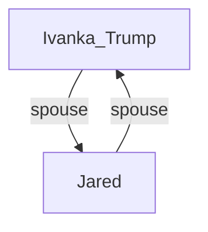
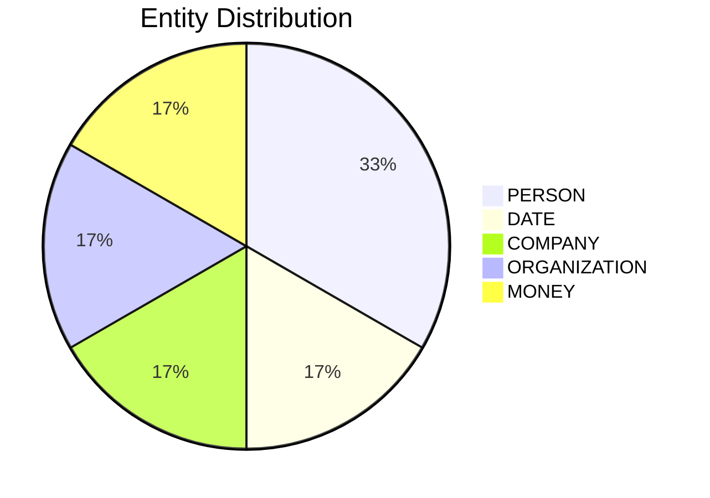

# Video Intelligence Report: 5 Things To Know: June 27, 2025

**URL**: https://www.youtube.com/watch?v=Am1Of0F9YxE
**Channel**: CNBC Television
**Duration**: 1:57
**Published**: 2025-06-27
**Processed**: 2025-07-18 23:27:35

**Processing Cost**: 🟢 $0.0067

## Executive Summary

This report outlines five significant developments across finance, technology, media, and celebrity news. In the economic sphere, markets anticipate the release of core PCE data, the Fed's preferred inflation measure, which economists project to show a 2.6% year-over-year increase, a slight uptick from April's figures. This data is expected at 8:30 Eastern time, setting the tone for the opening bell.

Corporate news features major changes at Tesla, where CEO Elon Musk has reportedly fired the vice president of manufacturing operations, a detail gleaned from internal organizational charts viewed by CNBC. The media landscape also sees shifts, with the American edition of Vogue Magazine seeking a new head of editorial content. This role was previously held for decades by Anna Wintour, who will transition to chief content officer at Condé Nast and global editorial director at Vogue. Additionally, Uber is in discussions with co-founder Travis Kalanick regarding potential funding for his acquisition of the U.S. subsidiary of Chinese company Pony AI, as reported by the New York Times.

Finally, the report highlights a high-profile celebrity event: Amazon founder Jeff Bezos and his fiancée Lauren Sanchez have arrived in Venice, Italy, for their extravagant wedding, rumored to cost over 50 million euros/dollars. The couple, observed leaving the luxury Aman Hotel with extensive security, is expected to marry 'today' on the picturesque island of San Giorgio, located directly opposite St. Mark's. The event is anticipated to be a 'big wedding weekend' with approximately 200 confirmed guests, including renowned figures such as Mick Jagger, Ivanka Trump (with her husband Jared), Oprah Winfrey, and Bill Gates.

## 📊 Quick Stats Dashboard

<b>Click to toggle stats</b>

| Metric | Count | Visualization |
|--------|-------|---------------|
| Transcript Length | 1,581 chars |  |
| Word Count | 281 words |  |
| Entities Extracted | 6  |  |
| Relationships Found | 2  |  |
| Key Points | 27  | 📌📌📌📌📌📌📌📌📌 |
| Topics | 8  | 🏷️🏷️🏷️🏷️🏷️🏷️🏷️🏷️ |
| Graph Nodes | 8  |  |
| Graph Edges | 2  |  |

## 🏷️ Main Topics

<b>View all topics</b>

1. Economic Forecasts
2. Corporate Management
3. Technology Industry
4. Media and Publishing
5. Business Acquisitions
6. Celebrity Events
7. Inflation Data
8. Luxury Travel

## 🕸️ Knowledge Graph Visualization

<b>Interactive relationship diagram (Mermaid)</b>

*Note: This diagram shows the top 20 relationships. For the complete graph, use the GEXF file with Gephi.*

## 🔍 Entity Analysis

### Entity Type Distribution

<b>🏷️ COMPANY (1 found)</b>

| Name | Confidence | Source |
|------|------------|--------|
| Uber | 🟩 0.95 | None |

<b>📆 DATE (1 found)</b>

| Name | Confidence | Source |
|------|------------|--------|
| Decades | 🟨 0.74 | None |

<b>💰 MONEY (1 found)</b>

| Name | Confidence | Source |
|------|------------|--------|
| Over $50 Million | 🟨 0.78 | None |

<b>🏢 ORGANIZATION (1 found)</b>

| Name | Confidence | Source |
|------|------------|--------|
| Fed | 🟩 0.95 | None |

<b>👤 PERSON (2 found)</b>

| Name | Confidence | Source |
|------|------------|--------|
| Ding | 🟨 0.71 | None |
| Mick Jagger | 🟨 0.71 | None |

## 🔗 Relationship Network

<b>Relationship type distribution</b>

| Predicate | Count | Percentage |
|-----------|--------|------------|
| spouse | 2 | ████████████████████ 100.0% |

<b>Key relationships (top 30)</b>

1. **Ivanka Trump** *spouse* **Jared** 🟩 (0.84)
2. **Jared** *spouse* **Ivanka Trump** 🟩 (0.84)

## 💡 Key Insights

<b>Top 10 key points</b>

1. 🔴 Economists are expecting a year-over-year increase of 2.6% for core PCE.
2. 🔴 Tesla CEO Elon Musk has fired the EV maker's vice president of manufacturing operations.
3. 🔴 The American edition of Vogue Magazine is set to hire a new head of editorial content.
4. 🔴 Anna Wintour will remain chief content officer at Condé Nast.
5. 🔴 Anna Wintour will also remain global editorial director at Vogue.
6. 🔴 Uber is in discussions with its co-founder Travis Kalanick.
7. 🔴 Kalanick's acquisition is of the US subsidiary of Chinese company Pony AI.
8. 🔴 Amazon founder Jeff Bezos and his fiancée Lauren Sanchez have arrived in Venice, Italy.
9. 🔴 They are expected to be married today.
10. 🔴 The wedding location is the small island of San Giorgio.

## 📁 Generated Files

<b>Click to see all files</b>

| File | Format | Size | Description |
|------|--------|------|-------------|
| `transcript.txt` | TXT | 1.5 KB | Plain text transcript |
| `transcript.json` | JSON | 31.0 KB | Full structured data |
| `entities.csv` | CSV | 212 B | All entities in spreadsheet format |
| `relationships.csv` | CSV | 115 B | All relationships in spreadsheet format |
| `knowledge_graph.json` | JSON | 1007 B | Complete graph structure |
| `knowledge_graph.gexf` | GEXF | 3.4 KB | Import into Gephi for visualization |
| `metadata.json` | JSON | 648 B | Video metadata and statistics |
| `manifest.json` | JSON | 9.0 KB | File index with checksums |
| `report.md` | Markdown | 0 B | This report |
| `chimera_format.json` | JSON | 15.1 KB | Chimera-compatible format |

---
*Generated by ClipScribe v2.6.0 on 2025-07-18 at 23:27:35*

💡 **Tip**: This markdown file supports Mermaid diagrams. View it in a compatible editor for interactive diagrams.
