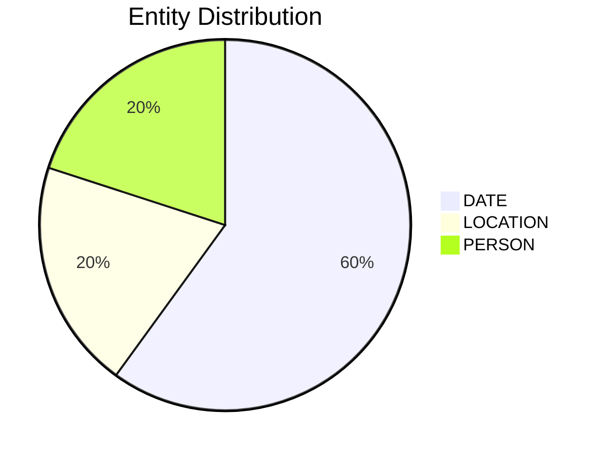

# Video Intelligence Report: 5 Things To Know: June 25, 2025

**URL**: https://www.youtube.com/watch?v=8cgHKnQVMgM
**Channel**: CNBC Television
**Duration**: 1:25
**Published**: 2025-06-25
**Processed**: 2025-07-20 10:09:27

**Processing Cost**: 🟢 $0.0049

## Executive Summary

This market update provides five key insights ahead of the opening bell, covering legislative, corporate, and tech sector news. Treasury Secretary Scott Bassant indicated that the Senate is set to vote this Friday on President Trump's tax and spending bill. Furthermore, Bassant predicted that House and Senate Republicans are nearing a deal on the salt deduction cap, expected within the next 24 to 48 hours.

In corporate finance, Polymarket is reportedly close to securing $200 million in a funding round, which would elevate its valuation to approximately one billion dollars. Concurrently, an investment platform named Republic is launching innovative digital tokens. These tokens, leveraging blockchain technology, are designed to mirror the performance of private shares in companies like SpaceX, aiming to democratize access for investors typically excluded from such opportunities, although this method has yet to be vetted by regulators.

Finally, the chip sector is under the spotlight, with Ambrella, a chip design firm, experiencing a notable stock gain of over 20% yesterday amid reports of a potential sale involving bankers. Micron Technologies' quarterly results are anticipated after today's closing bell, with investors closely watching for insights into its capacity to meet the surging demand for high bandwidth memory chips crucial for AI applications. The broader chip market is also thriving, highlighted by Nvidia's shares soaring 40% in just the last two months, underscoring a robust trend across the sector since the S&P 500's April low.

## 📊 Quick Stats Dashboard

<b>Click to toggle stats</b>

| Metric | Count | Visualization |
|--------|-------|---------------|
| Transcript Length | 1,434 chars |  |
| Word Count | 241 words |  |
| Entities Extracted | 5  |  |
| Relationships Found | 0  |  |
| Key Points | 29  | 📌📌📌📌📌📌📌📌📌 |
| Topics | 9  | 🏷️🏷️🏷️🏷️🏷️🏷️🏷️🏷️🏷️ |
| Graph Nodes | 5  |  |
| Graph Edges | 0  |  |

## 🏷️ Main Topics

<b>View all topics</b>

1. Financial Markets
2. Legislative News
3. Corporate Finance
4. Technology Sector
5. Chip Industry
6. Investment Platforms
7. Blockchain Technology
8. Artificial Intelligence (AI)
9. Stock Market Trends

## 🔍 Entity Analysis

### Entity Type Distribution

<b>📆 DATE (3 found)</b>

| Name | Confidence | Source |
|------|------------|--------|
| The Last Two Months | 🟨 0.79 | None |
| The Next 24 To 48 Hours | 🟨 0.79 | None |
| Quarterly | 🟨 0.74 | None |

<b>📍 LOCATION (1 found)</b>

| Name | Confidence | Source |
|------|------------|--------|
| Republic | 🟩 0.83 | None |

<b>👤 PERSON (1 found)</b>

| Name | Confidence | Source |
|------|------------|--------|
| Trump | 🟨 0.71 | None |

## 💡 Key Insights

<b>Top 10 key points</b>

1. 🔴 Treasury Secretary Scott Bassant believes the Senate is on track for a vote.
2. 🔴 The Senate vote is scheduled for this Friday.
3. 🔴 The vote concerns President Trump's tax and spending bill.
4. 🔴 Yesterday, Bassant predicted a deal between House and Senate Republicans.
5. 🔴 The predicted deal is regarding the salt deduction cap.
6. 🔴 Reports indicate Polymarket is close to raising $200 million.
7. 🔴 This funding round would value Polymarket, a prediction market company, at about a billion dollars.
8. 🔴 An investment platform is launching new digital tokens.
9. 🔴 The tokens are designed to mirror the performance of SpaceX's private shares.
10. 🔴 The investment platform mentioned is called Republic.

## 📁 Generated Files

<b>Click to see all files</b>

| File | Format | Size | Description |
|------|--------|------|-------------|
| `transcript.txt` | TXT | 1.4 KB | Plain text transcript |
| `transcript.json` | JSON | 26.0 KB | Full structured data |
| `entities.csv` | CSV | 207 B | All entities in spreadsheet format |
| `knowledge_graph.json` | JSON | 595 B | Complete graph structure |
| `knowledge_graph.gexf` | GEXF | 2.2 KB | Import into Gephi for visualization |
| `metadata.json` | JSON | 642 B | Video metadata and statistics |
| `manifest.json` | JSON | 9.4 KB | File index with checksums |
| `report.md` | Markdown | 0 B | This report |
| `chimera_format.json` | JSON | 14.2 KB | Chimera-compatible format |

---
*Generated by ClipScribe v2.6.0 on 2025-07-20 at 10:09:27*

💡 **Tip**: This markdown file supports Mermaid diagrams. View it in a compatible editor for interactive diagrams.
