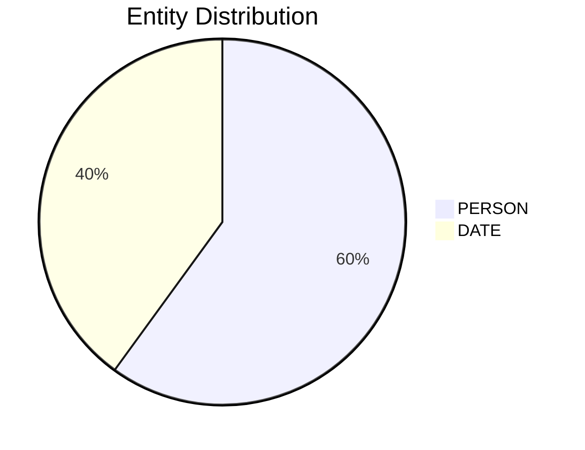

# Video Intelligence Report: 5 Things To Know: June 23, 2025

**URL**: https://www.youtube.com/watch?v=_7Fw86mfCUk
**Channel**: CNBC Television
**Duration**: 3:49
**Published**: 2025-06-23
**Processed**: 2025-07-20 10:09:30

**Processing Cost**: 🟢 $0.0131

## Executive Summary

The transcript provides a concise overview of several significant news items across finance, technology, and sports. It begins by covering geopolitical fallout, specifically the ambiguous damage to Iran's nuclear program following US strikes, a claim amplified by President Trump. Initially, this news caused turbulence in oil prices and stock futures, which later stabilized.

Technologically, the segment highlights Tesla's launch of its Robo taxi service in Austin, Texas, emphasizing its autonomous nature while noting the presence of human safety monitors. Furthermore, it delves into Apple's strategic considerations regarding AI, with internal discussions about potentially acquiring Perplexity AI.

A substantial portion of the discussion centers on the NBA, celebrating the Oklahoma City Thunder's hypothetical 2025 NBA championship victory over the Indiana Pacers, comparing their record to the legendary 1996-97 Chicago Bulls. This segues into a critical examination of the declining NBA finals ratings, questioning whether it's a 'small market problem' or a broader issue of viewer engagement. The speakers express concern over player injuries, like Haliburton's Achilles, advocating for more protective officiating in playoffs, and acknowledging the financial implications of low viewership for major investors like their parent company.

The conversation concludes with reflections on the need for teams to prioritize defense, even in the regular season and All-Star games, suggesting that the current 'running and gunning' style might be contributing to the league's ratings challenges and player injuries.

## 📊 Quick Stats Dashboard

<b>Click to toggle stats</b>

| Metric | Count | Visualization |
|--------|-------|---------------|
| Transcript Length | 4,189 chars | ██ |
| Word Count | 770 words | █ |
| Entities Extracted | 5  |  |
| Relationships Found | 0  |  |
| Key Points | 29  | 📌📌📌📌📌📌📌📌📌 |
| Topics | 8  | 🏷️🏷️🏷️🏷️🏷️🏷️🏷️🏷️ |
| Graph Nodes | 5  |  |
| Graph Edges | 0  |  |

## 🏷️ Main Topics

<b>View all topics</b>

1. Geopolitics
2. Financial Markets
3. Technology and AI
4. Automotive Industry
5. NBA Basketball
6. Sports Business
7. Sports Injuries
8. Sports Ratings

## 🔍 Entity Analysis

### Entity Type Distribution

<b>📆 DATE (2 found)</b>

| Name | Confidence | Source |
|------|------------|--------|
| The Next Season | 🟨 0.79 | None |
| The Weekend | 🟨 0.74 | None |

<b>👤 PERSON (3 found)</b>

| Name | Confidence | Source |
|------|------------|--------|
| Thunder | 🟨 0.71 | None |
| Trump | 🟨 0.71 | None |
| Ben Stiller | 🟨 0.71 | None |

## 💡 Key Insights

<b>Top 10 key points</b>

1. 🔴 The full extent of damage to Iran's nuclear program remains unclear following recent US strikes.
2. 🔴 President Trump claimed 
3. 🔴 Tesla has launched its Robo taxi service in Austin, Texas, carrying paying customers.
4. 🔴 Apple is reportedly considering a significant acquisition to enhance its AI technology.
5. 🔴 The Oklahoma City Thunder hypothetically defeated the Indiana Pacers last night to win the 2025 NBA championship.
6. 🔴 The discussion shifts to the NBA's business problem, particularly concerning declining ratings for the finals.
7. 🔴 The importance of improving ratings is highlighted due to significant financial investments, such as their parent company's NBA rights.
8. 🔴 The segment begins by highlighting five key things to know before today's opening bell.
9. 🔴 However, these market moves have since reversed, with Brent and WTI oil prices stable and stock futures higher.
10. 🔴 The Robo taxi cars operate without human drivers, though human safety monitors are present inside.

## 📁 Generated Files

<b>Click to see all files</b>

| File | Format | Size | Description |
|------|--------|------|-------------|
| `transcript.txt` | TXT | 4.1 KB | Plain text transcript |
| `transcript.json` | JSON | 34.3 KB | Full structured data |
| `entities.csv` | CSV | 206 B | All entities in spreadsheet format |
| `knowledge_graph.json` | JSON | 594 B | Complete graph structure |
| `knowledge_graph.gexf` | GEXF | 2.2 KB | Import into Gephi for visualization |
| `metadata.json` | JSON | 656 B | Video metadata and statistics |
| `manifest.json` | JSON | 11.3 KB | File index with checksums |
| `report.md` | Markdown | 0 B | This report |
| `chimera_format.json` | JSON | 17.9 KB | Chimera-compatible format |

---
*Generated by ClipScribe v2.6.0 on 2025-07-20 at 10:09:30*

💡 **Tip**: This markdown file supports Mermaid diagrams. View it in a compatible editor for interactive diagrams.
