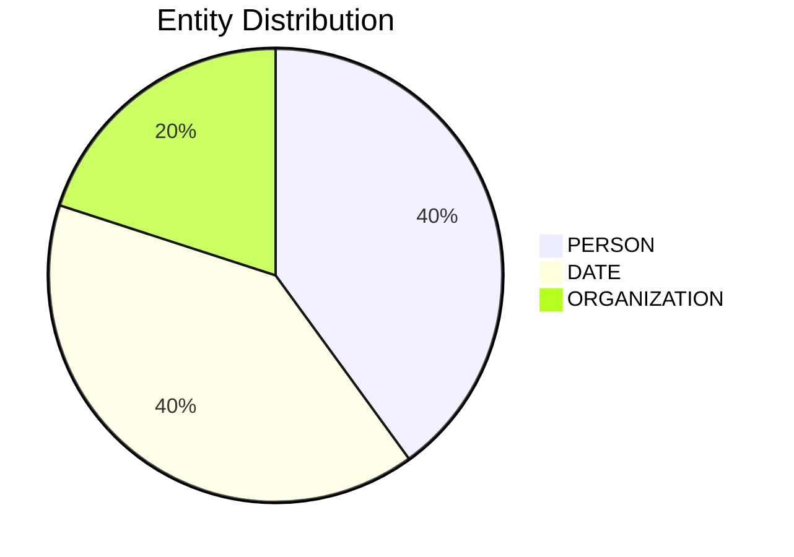

# Video Intelligence Report: 5 Things To Know: June 20, 2025

**URL**: https://www.youtube.com/watch?v=10zFSNRcyFM
**Channel**: CNBC Television
**Duration**: 1:21
**Published**: 2025-06-20
**Processed**: 2025-07-20 10:09:32

**Processing Cost**: 🟢 $0.0046

## Executive Summary

This broadcast from Squad Box 5 provides an overview of various significant developments across geopolitics, technology, and business ahead of the day's opening bell. Geopolitically, President Trump is expected to decide within the next two weeks whether the United States will intervene in the Middle East conflict. Concurrently, Iran's foreign minister is scheduled to meet with his counterparts from Britain, France, and Germany in Switzerland today to discuss international matters. In the technology sector, Softbank is reportedly in talks with Taiwan Semiconductor to collaborate on building a trillion-dollar industrial complex in Arizona. This ambitious project aims to focus on the development of robots and artificial intelligence, according to a Bloomberg report. Meanwhile, Microsoft is said to be considering pausing its negotiations with OpenAI due to unresolved disagreements concerning key issues, specifically the size of Microsoft's future stake in the AI company, as reported by the Financial Times. Further news regarding Microsoft indicates that the company plans to implement several thousand job cuts across its sales and other teams within the coming weeks. Additionally, a recent incident involved a SpaceX Starship rocket, which exploded during routine testing at the Starbase facility in Texas on Wednesday. While SpaceX characterized the event as a 'major anomaly' on social media, they confirmed that all personnel remained safe. Elon Musk, CEO of SpaceX, downplayed the incident on his platform X, humorously remarking, 'just a scratch.'

## 📊 Quick Stats Dashboard

<b>Click to toggle stats</b>

| Metric | Count | Visualization |
|--------|-------|---------------|
| Transcript Length | 1,458 chars |  |
| Word Count | 244 words |  |
| Entities Extracted | 5  |  |
| Relationships Found | 0  |  |
| Key Points | 37  | 📌📌📌📌📌📌📌📌📌📌📌📌 |
| Topics | 10  | 🏷️🏷️🏷️🏷️🏷️🏷️🏷️🏷️🏷️🏷️ |
| Graph Nodes | 5  |  |
| Graph Edges | 0  |  |

## 🏷️ Main Topics

<b>View all topics</b>

1. Geopolitics
2. International Relations
3. Technology
4. Artificial Intelligence
5. Robotics
6. Corporate Partnerships
7. Employment
8. Aerospace
9. Space Exploration
10. Business News

## 🔍 Entity Analysis

### Entity Type Distribution

<b>📆 DATE (2 found)</b>

| Name | Confidence | Source |
|------|------------|--------|
| The Next Several Weeks | 🟨 0.79 | None |
| The Next Two Weeks | 🟨 0.79 | None |

<b>🏢 ORGANIZATION (1 found)</b>

| Name | Confidence | Source |
|------|------------|--------|
| the Financial Times | 🟨 0.71 | None |

<b>👤 PERSON (2 found)</b>

| Name | Confidence | Source |
|------|------------|--------|
| Trump | 🟨 0.71 | None |
| Foreign Minister | 🟨 0.71 | None |

## 💡 Key Insights

<b>Top 10 key points</b>

1. 🔴 President Trump is set to decide on US involvement in the Middle East conflict.
2. 🔴 Iran's foreign minister is scheduled to meet with international counterparts.
3. 🔴 Softbank is exploring a partnership.
4. 🔴 The partnership is with Taiwan Semiconductor.
5. 🔴 The goal is to construct a trillion dollar industrial complex.
6. 🔴 A focus of the complex is building robots.
7. 🔴 Another focus of the complex is artificial intelligence development.
8. 🔴 Microsoft is considering halting negotiations.
9. 🔴 Microsoft is planning job cuts.
10. 🔴 A SpaceX Starship rocket exploded.

## 📁 Generated Files

<b>Click to see all files</b>

| File | Format | Size | Description |
|------|--------|------|-------------|
| `transcript.txt` | TXT | 1.4 KB | Plain text transcript |
| `transcript.json` | JSON | 24.6 KB | Full structured data |
| `entities.csv` | CSV | 243 B | All entities in spreadsheet format |
| `knowledge_graph.json` | JSON | 631 B | Complete graph structure |
| `knowledge_graph.gexf` | GEXF | 2.2 KB | Import into Gephi for visualization |
| `metadata.json` | JSON | 656 B | Video metadata and statistics |
| `manifest.json` | JSON | 7.6 KB | File index with checksums |
| `report.md` | Markdown | 0 B | This report |
| `chimera_format.json` | JSON | 15.2 KB | Chimera-compatible format |

---
*Generated by ClipScribe v2.6.0 on 2025-07-20 at 10:09:32*

💡 **Tip**: This markdown file supports Mermaid diagrams. View it in a compatible editor for interactive diagrams.
