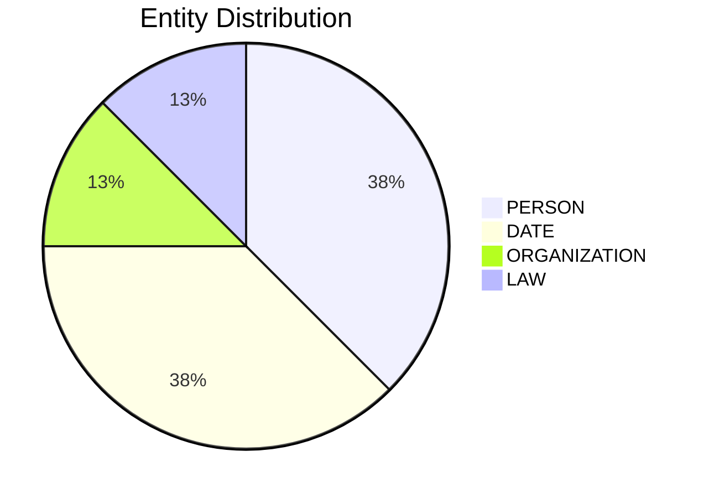

# Video Intelligence Report: 5 Things To Know: June 18, 2025

**URL**: https://www.youtube.com/watch?v=FPa82id02bY
**Channel**: CNBC Television
**Duration**: 2:48
**Published**: 2025-06-18
**Processed**: 2025-07-20 10:09:35

**Processing Cost**: 🟢 $0.0096

## Executive Summary

The transcript covers several significant developments across geopolitics, corporate strategy, and US domestic policy. Internationally, Israel and Iran have been exchanging air strikes for the sixth consecutive day. This ongoing conflict has prompted discussions within current and former Trump administration circles about potential US responses, including the possibility of a direct US strike on Iran, signaling escalating tensions in the Middle East.

Domestically, Amazon's CEO, Andy Jassy, announced that the company's corporate workforce is projected to shrink in the coming years. This reduction is attributed to Amazon's increasing adoption of generative AI tools and agents, which Jassy noted would lead to fewer people being needed for certain roles and more for others. In New York City politics, Democratic Mayoral candidate Brad Lander gained public attention after being arrested by federal agents at an immigration court in Manhattan. Lander had reportedly linked arms with an individual authorities were attempting to detain, and his wife publicized the incident on X, suggesting the arrest might boost his campaign.

On the legislative front, the US Senate successfully passed the 'Genius Act,' a bill designed to regulate US dollar-pegged stable coins, with a notable bipartisan vote of 68 to 30. Attention now shifts to the House, which is actively working on its own stable coin legislation, indicating a concerted effort towards digital currency regulation. Concurrently, the non-partisan Congressional Budget Office (CBO) released a report projecting that former President Trump's package of tax cuts would increase federal deficits by $2.8 trillion over the next decade, even after accounting for other economic effects. This CBO finding counters the argument from Congressional Republicans that tax cuts would sufficiently spur economic growth to offset any governmental revenue losses.

## 📊 Quick Stats Dashboard

<b>Click to toggle stats</b>

| Metric | Count | Visualization |
|--------|-------|---------------|
| Transcript Length | 2,870 chars | █ |
| Word Count | 513 words | █ |
| Entities Extracted | 8  |  |
| Relationships Found | 0  |  |
| Key Points | 34  | 📌📌📌📌📌📌📌📌📌📌📌 |
| Topics | 12  | 🏷️🏷️🏷️🏷️🏷️🏷️🏷️🏷️🏷️🏷️🏷️🏷️ |
| Graph Nodes | 8  |  |
| Graph Edges | 0  |  |

## 🏷️ Main Topics

<b>View all topics</b>

1. Geopolitics
2. International Relations
3. US Foreign Policy
4. Corporate Strategy
5. Artificial Intelligence
6. US Domestic Politics
7. Mayoral Elections
8. Immigration
9. Financial Regulation
10. Cryptocurrency
11. Economic Policy
12. Taxation

## 🔍 Entity Analysis

### Entity Type Distribution

<b>📆 DATE (3 found)</b>

| Name | Confidence | Source |
|------|------------|--------|
| The Coming Years | 🟨 0.79 | None |
| The Next Decade | 🟨 0.79 | None |
| The Sixth Straight Day | 🟨 0.79 | None |

<b>🏷️ LAW (1 found)</b>

| Name | Confidence | Source |
|------|------------|--------|
| the Genius Act | 🟨 0.71 | None |

<b>🏢 ORGANIZATION (1 found)</b>

| Name | Confidence | Source |
|------|------------|--------|
| Congressional Republicans | 🟩 0.82 | None |

<b>👤 PERSON (3 found)</b>

| Name | Confidence | Source |
|------|------------|--------|
| Trump | 🟨 0.71 | None |
| Brad Lander | 🟨 0.71 | None |
| Booker | 🟨 0.71 | None |

## 💡 Key Insights

<b>Top 10 key points</b>

1. 🔴 Israel and Iran have been trading air strikes for six straight days.
2. 🔴 Current and former Trump administration officials informed NBC News of potential US response options.
3. 🔴 A possible US strike on Iran is among the options being considered by the president.
4. 🔴 New York City Democratic Mayoral candidate Brad Lander was released from custody.
5. 🔴 Brad Lander was arrested by federal agents at an immigration court in Manhattan.
6. 🔴 The Senate passed a bill to regulate US dollar-pegged stable coins, known as the Genius Act.
7. 🔴 The non-partisan Congressional Budget Office (CBO) reported on President Trump's tax cuts.
8. 🔴 The CBO stated Trump's package of tax cuts would increase deficits by $2.8 trillion over the next decade.
9. 🟡 Amazon's CEO, Andy Jassy, announced that the company's corporate workforce will shrink in the coming years.
10. 🟡 The reduction in Amazon's workforce is due to the adoption of more generative AI tools and agents.

## 📁 Generated Files

<b>Click to see all files</b>

| File | Format | Size | Description |
|------|--------|------|-------------|
| `transcript.txt` | TXT | 2.8 KB | Plain text transcript |
| `transcript.json` | JSON | 35.6 KB | Full structured data |
| `entities.csv` | CSV | 348 B | All entities in spreadsheet format |
| `knowledge_graph.json` | JSON | 922 B | Complete graph structure |
| `knowledge_graph.gexf` | GEXF | 3.1 KB | Import into Gephi for visualization |
| `metadata.json` | JSON | 641 B | Video metadata and statistics |
| `manifest.json` | JSON | 10.7 KB | File index with checksums |
| `report.md` | Markdown | 0 B | This report |
| `chimera_format.json` | JSON | 20.9 KB | Chimera-compatible format |

---
*Generated by ClipScribe v2.6.0 on 2025-07-20 at 10:09:35*

💡 **Tip**: This markdown file supports Mermaid diagrams. View it in a compatible editor for interactive diagrams.
