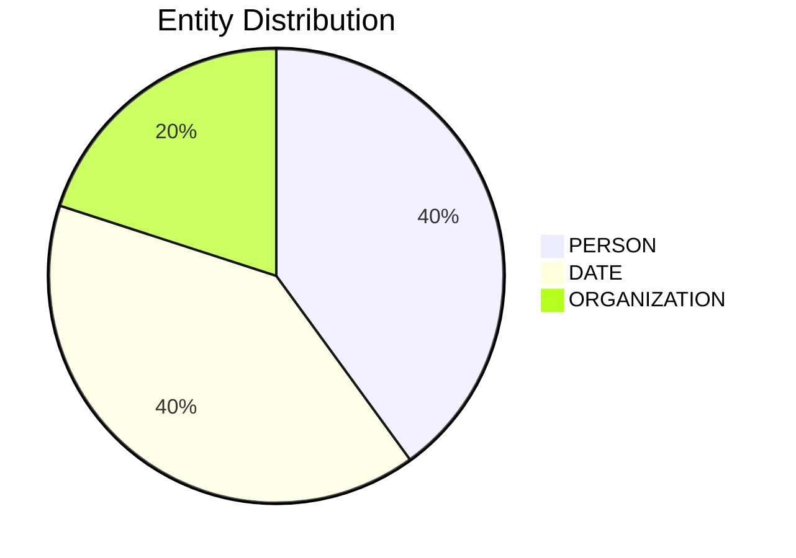

# Video Intelligence Report: 5 Things To Know: June 16, 2025

**URL**: https://www.youtube.com/watch?v=u2tHfa8X-sg
**Channel**: CNBC Television
**Duration**: 1:40
**Published**: 2025-06-16
**Processed**: 2025-07-19 10:38:43

**Processing Cost**: 🟢 $0.0057

## Executive Summary

The report highlights five significant global developments impacting markets. Firstly, in the Middle East, Israel's military has declared aerial superiority over Iran's capital, Tehran, marking the fourth consecutive day of conflict stemming from Israel's initial attacks on Iran's nuclear infrastructure. Concurrently, the US Embassy branch in Tel Aviv sustained minor damage from nearby explosion shockwaves, though no American personnel were harmed, as confirmed by US Ambassador to Israel, Mike Huckabee.

Economically, a major business deal sees President Trump's approval of Nippon Steel's roughly $15 billion acquisition of US Steel, a culmination of an 18-month negotiation. This deal includes a substantial $11 billion in new investments by Nippon Steel slated for completion by 2028, and is projected to significantly boost Nippon's annual steel production capacity from 63 million to 86 million metric tons. In the fashion sector, Kering's shares surged in Europe amid reports of Luca de Meo, current Renault CEO, being appointed as Kering's new CEO, although Kering has not verified this, Renault confirmed de Meo's departure to pursue opportunities outside the automotive industry.

In technology and cybersecurity news, Taiwan's Commerce Ministry has imposed stricter export controls by adding Chinese chipmakers Huawei and SMIC to its restricted list, necessitating permits for Taiwanese companies to sell products to them. Lastly, a cyber attack targeting the Washington Post compromised email accounts of several journalists, particularly those on the national security and economic policy teams. The paper's executive editor informed staff about the intrusion, and the Washington Post suspects a foreign government's involvement in the attack.

## 📊 Quick Stats Dashboard

<b>Click to toggle stats</b>

| Metric | Count | Visualization |
|--------|-------|---------------|
| Transcript Length | 1,657 chars |  |
| Word Count | 266 words |  |
| Entities Extracted | 5  |  |
| Relationships Found | 0  |  |
| Key Points | 22  | 📌📌📌📌📌📌📌 |
| Topics | 9  | 🏷️🏷️🏷️🏷️🏷️🏷️🏷️🏷️🏷️ |
| Graph Nodes | 5  |  |
| Graph Edges | 0  |  |

## 🏷️ Main Topics

<b>View all topics</b>

1. International Relations
2. Military Conflict
3. Cybersecurity
4. Business Acquisitions
5. Corporate Leadership Changes
6. Trade Policy
7. Middle East
8. US Foreign Policy
9. Technology Export Controls

## 🔍 Entity Analysis

### Entity Type Distribution

<b>📆 DATE (2 found)</b>

| Name | Confidence | Source |
|------|------------|--------|
| The Fourth Day | 🟨 0.79 | None |
| The Year 2028 | 🟨 0.79 | None |

<b>🏢 ORGANIZATION (1 found)</b>

| Name | Confidence | Source |
|------|------------|--------|
| Renault | 🟩 0.95 | None |

<b>👤 PERSON (2 found)</b>

| Name | Confidence | Source |
|------|------------|--------|
| Kering | 🟩 0.87 | None |
| Trump | 🟨 0.71 | None |

## 💡 Key Insights

<b>Top 10 key points</b>

1. 🔴 President Trump approved Nippon Steel's nearly $15 billion bid for US Steel.
2. 🔴 Israel's military claims aerial superiority over Iran's capital, Tehran.
3. 🔴 Israel initiated attacks on Iran's nuclear infrastructure.
4. 🔴 Taiwan's Commerce Ministry added Chinese chipmakers Huawei and SMIC to its export control list.
5. 🔴 A cyber attack compromised email accounts of several Washington Post journalists.
6. 🟡 This is the fourth day of fighting between Israel and Iran.
7. 🟡 The deal includes $11 billion in new investments by Nippon Steel into US Steel by the year 2028.
8. 🟡 Shares of French fashion house Kering are up sharply in European trading.
9. 🟡 Taiwanese companies now require permits to sell products to Huawei and SMIC.
10. 🟡 The Washington Post suspects a foreign government is responsible for the cyber attack.

## 📁 Generated Files

<b>Click to see all files</b>

| File | Format | Size | Description |
|------|--------|------|-------------|
| `transcript.txt` | TXT | 1.6 KB | Plain text transcript |
| `transcript.json` | JSON | 24.9 KB | Full structured data |
| `entities.csv` | CSV | 194 B | All entities in spreadsheet format |
| `knowledge_graph.json` | JSON | 582 B | Complete graph structure |
| `knowledge_graph.gexf` | GEXF | 2.2 KB | Import into Gephi for visualization |
| `metadata.json` | JSON | 1.5 KB | Video metadata and statistics |
| `manifest.json` | JSON | 8.3 KB | File index with checksums |
| `report.md` | Markdown | 0 B | This report |
| `chimera_format.json` | JSON | 13.8 KB | Chimera-compatible format |

---
*Generated by ClipScribe v2.6.0 on 2025-07-19 at 10:38:43*

💡 **Tip**: This markdown file supports Mermaid diagrams. View it in a compatible editor for interactive diagrams.
