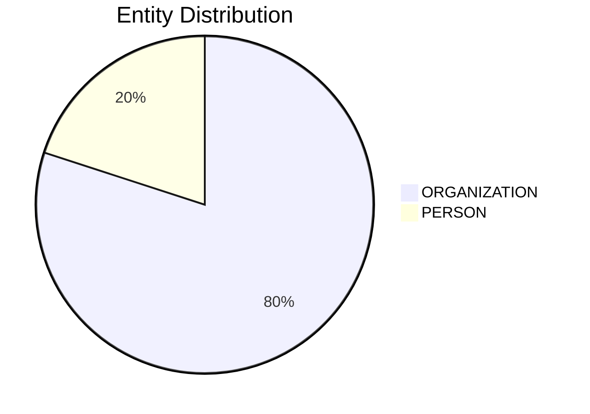

# Video Intelligence Report: 5 Things To Know: June 13, 2025

**URL**: https://www.youtube.com/watch?v=xX4AoirekqI
**Channel**: CNBC Television
**Duration**: 1:37
**Published**: 2025-06-13
**Processed**: 2025-07-20 10:09:40

**Processing Cost**: 🟢 $0.0055

## Executive Summary

Today's financial opening bell is preceded by several significant global events. In the Middle East, Israel has launched a series of strikes against Iran's nuclear infrastructure, which Iran's elite Revolutionary Guard Corps claims resulted in the death of its top commander. In response, Iran launched drones, which Israel is working to neutralize. Iran has confirmed damage to a key nuclear enrichment site but asserts no radiation contamination has occurred.\n\nSimultaneously, an investigation is underway in Western India following an airliner crash. While local media reports indicate that one of the Boeing 787 Dreamliner's black boxes has been recovered, this remains unconfirmed. Notably, one passenger miraculously survived the crash.\n\nDomestically, a federal appeals court has ruled in favor of the Trump administration, allowing it to maintain control and deployment of thousands of National Guard troops in California, specifically in Los Angeles. This ruling overturns a lower court's decision that had deemed the National Guard deployment illegal, a measure taken by the White House in response to immigration-related protests. Furthermore, the House of Representatives has narrowly passed a proposal to cancel over $9 billion in approved federal funding, with more than $8 billion allocated for foreign aid and approximately $1 billion intended for the Corporation for Public Broadcasting, which supports PBS and NPR.\n\nIn the tech sector, The New York Times reports that a consortium of venture capital firms intends to acquire approximately $250 million worth of shares in Elon Musk's artificial intelligence company, XAI. Documents reviewed by the newspaper reveal that employees will have the opportunity to sell some of their shares in a tender offer, valuing XAI at an estimated $113 billion.

## 📊 Quick Stats Dashboard

<b>Click to toggle stats</b>

| Metric | Count | Visualization |
|--------|-------|---------------|
| Transcript Length | 1,627 chars |  |
| Word Count | 264 words |  |
| Entities Extracted | 5  |  |
| Relationships Found | 0  |  |
| Key Points | 35  | 📌📌📌📌📌📌📌📌📌📌📌 |
| Topics | 11  | 🏷️🏷️🏷️🏷️🏷️🏷️🏷️🏷️🏷️🏷️🏷️ |
| Graph Nodes | 5  |  |
| Graph Edges | 0  |  |

## 🏷️ Main Topics

<b>View all topics</b>

1. International Relations
2. Military Actions
3. Nuclear Energy
4. Aviation Accidents
5. US Government and Politics
6. Defense and National Security
7. Fiscal Policy
8. Public Broadcasting
9. Artificial Intelligence
10. Venture Capital
11. Corporate Finance

## 🔍 Entity Analysis

### Entity Type Distribution

<b>🏢 ORGANIZATION (4 found)</b>

| Name | Confidence | Source |
|------|------------|--------|
| Boeing 787 Dreamliner | 🟩 0.82 | None |
| the New York Times | 🟨 0.71 | None |
| Corporation for Public Broadcasting | 🟨 0.71 | None |
| The White House | 🟨 0.71 | None |

<b>👤 PERSON (1 found)</b>

| Name | Confidence | Source |
|------|------------|--------|
| Top Commander | 🟨 0.71 | None |

## 💡 Key Insights

<b>Top 10 key points</b>

1. 🔴 Israel carried out strikes against Iran's nuclear infrastructure.
2. 🔴 One passenger survived the airliner crash.
3. 🔴 The tender offer values XAI at approximately $113 billion.
4. 🔴 Iran's elite Revolutionary Guard Corps stated its top commander was killed.
5. 🔴 Israel is actively working to bring down drones launched by Iran.
6. 🔴 Iran reported that a key nuclear enrichment site sustained damage.
7. 🔴 Investigators are searching the site of an airliner crash in Western India.
8. 🔴 A federal appeals court issued a ruling regarding the Trump administration.
9. 🔴 The ruling allows the Trump administration to maintain control of National Guard troops.
10. 🔴 The White House moved to deploy troops in response to protests.

## 📁 Generated Files

<b>Click to see all files</b>

| File | Format | Size | Description |
|------|--------|------|-------------|
| `transcript.txt` | TXT | 1.6 KB | Plain text transcript |
| `transcript.json` | JSON | 26.8 KB | Full structured data |
| `entities.csv` | CSV | 315 B | All entities in spreadsheet format |
| `knowledge_graph.json` | JSON | 703 B | Complete graph structure |
| `knowledge_graph.gexf` | GEXF | 2.3 KB | Import into Gephi for visualization |
| `metadata.json` | JSON | 650 B | Video metadata and statistics |
| `manifest.json` | JSON | 10.0 KB | File index with checksums |
| `report.md` | Markdown | 0 B | This report |
| `chimera_format.json` | JSON | 15.8 KB | Chimera-compatible format |

---
*Generated by ClipScribe v2.6.0 on 2025-07-20 at 10:09:40*

💡 **Tip**: This markdown file supports Mermaid diagrams. View it in a compatible editor for interactive diagrams.
