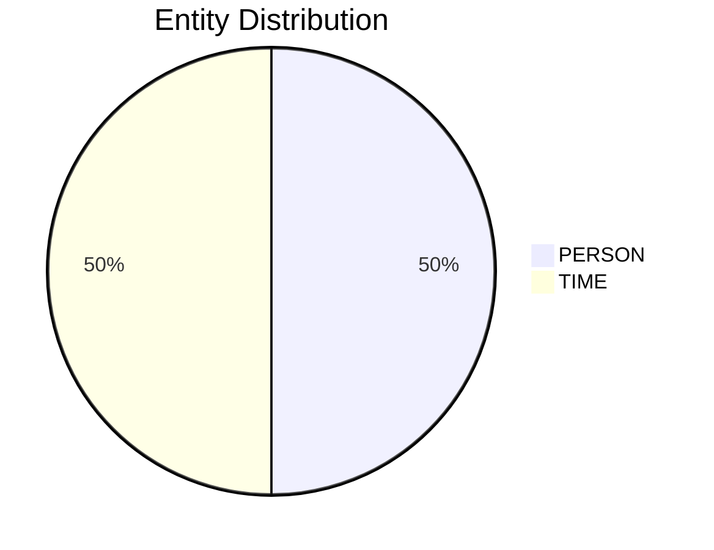

# Video Intelligence Report: 5 Things To Know: June 11, 2025

**URL**: https://www.youtube.com/watch?v=Nkx1Q6mAIxc
**Channel**: CNBC Television
**Duration**: 2:09
**Published**: 2025-06-11
**Processed**: 2025-07-20 10:09:42

**Processing Cost**: 🟢 $0.0074

## Executive Summary

The report highlights five key developments ahead of today's opening bell. Firstly, Elon Musk publicly expressed regret for his recent criticisms of President Trump on X, acknowledging that his posts last week 'went too far'. This apology was made in the early hours, sparking discussion about Musk's unusual sleep habits, despite his past statements about aiming for at least six hours of sleep for optimal performance. 

Secondly, Elon Musk also announced that Tesla's highly anticipated Robo taxi service is tentatively scheduled to launch in Austin, Texas, on June 22nd. Musk emphasized the company's extreme caution regarding safety, indicating a meticulous approach before deployment. This news follows a period of anticipation for Tesla's autonomous driving solutions. 

Thirdly, negotiators from the United States and China have reportedly reached an agreement aimed at reactivating the Geneva consensus. This original deal, established in May, involved measures such as suspending certain tariffs and easing key export restrictions between the two economic powers. However, the agreement's progress has been complicated by mutual accusations of non-compliance and cheating since its initial signing. 

Fourth, a federal appeals court has ruled to keep President Trump's sweeping tariffs in effect while it reviews a lower court's decision that had previously blocked them. The lower court's ruling contended that President Trump had exceeded his authority under the Emergency Economic Powers Act, which was cited to justify the tariffs. Oral arguments for this significant review are slated for July 31st. Finally, Treasury Secretary Scott Bezant was identified as a potential candidate for the next Fed chair by a Bloomberg report, with advisors reportedly recommending him for the position. However, the White House promptly dismissed this report as 'fake news'.

## 📊 Quick Stats Dashboard

<b>Click to toggle stats</b>

| Metric | Count | Visualization |
|--------|-------|---------------|
| Transcript Length | 2,163 chars | █ |
| Word Count | 393 words |  |
| Entities Extracted | 2  |  |
| Relationships Found | 0  |  |
| Key Points | 31  | 📌📌📌📌📌📌📌📌📌📌 |
| Topics | 7  | 🏷️🏷️🏷️🏷️🏷️🏷️🏷️ |
| Graph Nodes | 2  |  |
| Graph Edges | 0  |  |

## 🏷️ Main Topics

<b>View all topics</b>

1. Tech News
2. US Politics
3. International Relations
4. Trade Policy
5. Economic Policy
6. Business Leadership
7. Autonomous Vehicles

## 🔍 Entity Analysis

### Entity Type Distribution

<b>👤 PERSON (1 found)</b>

| Name | Confidence | Source |
|------|------------|--------|
| Trump | 🟨 0.71 | None |

<b>🏷️ TIME (1 found)</b>

| Name | Confidence | Source |
|------|------------|--------|
| At Least Six Hours | 🟨 0.77 | None |

## 💡 Key Insights

<b>Top 10 key points</b>

1. 🔴 Elon Musk walked back his criticism of President Trump.
2. 🔴 Musk wrote he regrets some of his posts about President Trump last week.
3. 🔴 Elon Musk announced Tesla's Robo taxi service is tentatively set to launch.
4. 🔴 The tentative launch date for the Robo taxi service is June 22nd.
5. 🔴 US and China negotiators have reportedly reached an agreement.
6. 🔴 A federal appeals court will allow President Trump's sweeping tariffs to remain in effect.
7. 🔴 Arguments for the federal appeals court review are scheduled for July 31st.
8. 🔴 Treasury Secretary Scott Bezant is a contender to be the next Fed chair.
9. 🔴 The White House called the Bloomberg report 'fake news'.
10. 🔴 The report highlights five key developments for the opening bell.

## 📁 Generated Files

<b>Click to see all files</b>

| File | Format | Size | Description |
|------|--------|------|-------------|
| `transcript.txt` | TXT | 2.1 KB | Plain text transcript |
| `transcript.json` | JSON | 23.0 KB | Full structured data |
| `entities.csv` | CSV | 106 B | All entities in spreadsheet format |
| `knowledge_graph.json` | JSON | 308 B | Complete graph structure |
| `knowledge_graph.gexf` | GEXF | 1.4 KB | Import into Gephi for visualization |
| `metadata.json` | JSON | 643 B | Video metadata and statistics |
| `manifest.json` | JSON | 7.7 KB | File index with checksums |
| `report.md` | Markdown | 0 B | This report |
| `chimera_format.json` | JSON | 13.2 KB | Chimera-compatible format |

---
*Generated by ClipScribe v2.6.0 on 2025-07-20 at 10:09:42*

💡 **Tip**: This markdown file supports Mermaid diagrams. View it in a compatible editor for interactive diagrams.
