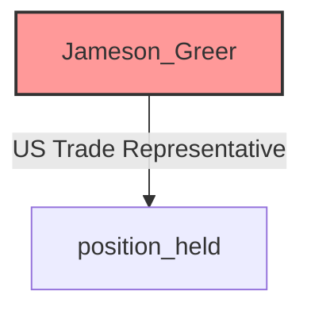
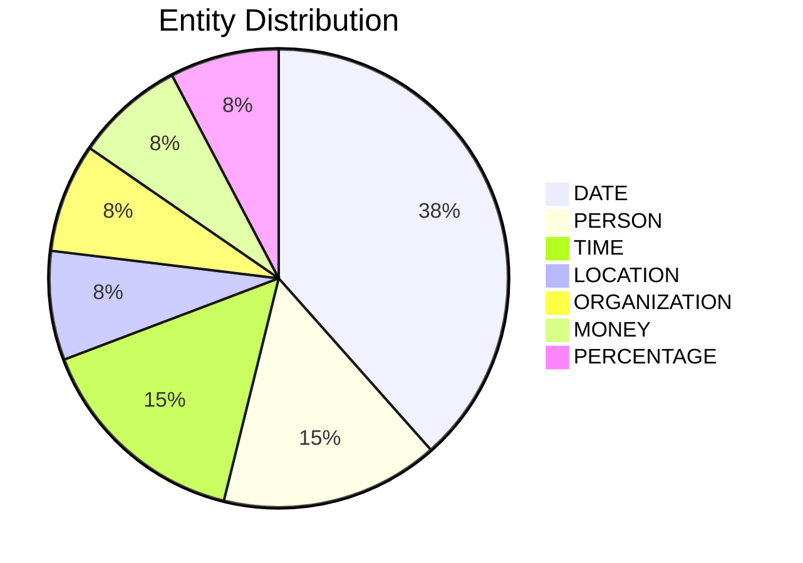

# Video Intelligence Report: 5 Things To Know: June 9, 2025

**URL**: https://www.youtube.com/watch?v=itYisy19Cmc
**Channel**: CNBC Television
**Duration**: 2:37
**Published**: 2025-06-09
**Processed**: 2025-07-18 23:27:54

**Processing Cost**: 🟢 $0.0090

## Executive Summary

The market outlook ahead of the opening bell highlights key developments in international trade and domestic policy. President Trump's top trade officials, including Treasury Secretary Scott Bessent, Commerce Secretary Howard Lutnick, and US Trade Representative Jameson Greer, are currently in London meeting with Chinese counterparts. These discussions follow recent data from China indicating a significant 34.5% drop in exports to the US in May and a fourth consecutive month of decline in China's Consumer Price Index (CPI), raising concerns about domestic prices.

Simultaneously, a US trade team in India has extended its negotiations, originally scheduled for last Thursday and Friday, through Tuesday. This extension, reported by Bloomberg, suggests positive progress in the talks. Domestically, President Trump confirmed an imminent announcement for his next Fed chair pick, hinting at former Fed Governor Kevin Warsh as a highly regarded candidate, despite Warsh's potentially more hawkish stance compared to current Fed Chair Jay Powell.

In collegiate sports, a landmark federal judge's approval of a $2.6 billion settlement late Friday will enable direct payments from universities to athletes. This decision allows Division I schools to distribute approximately $20 million annually to their athletes, ushering in a new era for college sports. While it promises to channel billions into revenue-generating sports like football and basketball, there's concern it could jeopardize funding for non-revenue sports, particularly at smaller institutions. The discussion also touched upon the timing of the Fed chair announcement, noting Jay Powell's term extends until May 2026.

## 📊 Quick Stats Dashboard

<b>Click to toggle stats</b>

| Metric | Count | Visualization |
|--------|-------|---------------|
| Transcript Length | 2,526 chars | █ |
| Word Count | 439 words |  |
| Entities Extracted | 13  | 🔵 |
| Relationships Found | 1  |  |
| Key Points | 33  | 📌📌📌📌📌📌📌📌📌📌📌 |
| Topics | 9  | 🏷️🏷️🏷️🏷️🏷️🏷️🏷️🏷️🏷️ |
| Graph Nodes | 14  | ⭕ |
| Graph Edges | 1  |  |

## 🏷️ Main Topics

<b>View all topics</b>

1. International Trade
2. US-China Relations
3. US-India Relations
4. Economic Indicators
5. US Monetary Policy
6. Federal Reserve
7. College Sports
8. Athlete Compensation
9. Government Officials

## 🕸️ Knowledge Graph Visualization

<b>Interactive relationship diagram (Mermaid)</b>

*Note: This diagram shows the top 20 relationships. For the complete graph, use the GEXF file with Gephi.*

## 🔍 Entity Analysis

### Entity Type Distribution

<b>📆 DATE (5 found)</b>

| Name | Confidence | Source |
|------|------------|--------|
| A Fourth Consecutive Month | 🟨 0.79 | None |
| Less Than A Year | 🟨 0.79 | None |
| May, May of 2026 | 🟨 0.79 | None |
| last Thursday and | 🟨 0.79 | None |
| Friday evening | 🟨 0.74 | None |

<b>📍 LOCATION (1 found)</b>

| Name | Confidence | Source |
|------|------------|--------|
| the United States | 🟨 0.71 | None |

<b>💰 MONEY (1 found)</b>

| Name | Confidence | Source |
|------|------------|--------|
| Billions Of Dollars | 🟨 0.78 | None |

<b>🏢 ORGANIZATION (1 found)</b>

| Name | Confidence | Source |
|------|------------|--------|
| Fed | 🟩 0.95 | None |

<b>🏷️ PERCENTAGE (1 found)</b>

| Name | Confidence | Source |
|------|------------|--------|
| 34 And A Half% | 🟨 0.71 | None |

<b>👤 PERSON (2 found)</b>

| Name | Confidence | Source |
|------|------------|--------|
| Jameson Greer | 🟨 0.71 | None |
| Trump | 🟨 0.71 | None |

<b>🏷️ TIME (2 found)</b>

| Name | Confidence | Source |
|------|------------|--------|
| Evening | 🟨 0.72 | None |
| Overnight | 🟨 0.72 | None |

## 🔗 Relationship Network

<b>Relationship type distribution</b>

| Predicate | Count | Percentage |
|-----------|--------|------------|
| US Trade Representative | 1 | ████████████████████ 100.0% |

<b>Key relationships (top 30)</b>

1. **Jameson Greer** *US Trade Representative* **position held** 🟩 (0.88)

## 💡 Key Insights

<b>Top 10 key points</b>

1. 🔴 A federal judge approved a $2.6 billion settlement for college athletes.
2. 🔴 President Trump's trade officials are in London for talks with Chinese counterparts.
3. 🔴 New data revealed a 34.5% drop in China's exports to the US in May.
4. 🔴 President Trump announced that his choice for the next Fed chair is imminent.
5. 🔴 A significant decision regarding college athletes was approved late Friday.
6. 🔴 The settlement allows for direct payments from universities to players.
7. 🔴 China's domestic prices are a concern as CPI declined for the fourth consecutive month.
8. 🔴 A US trade team in India has extended its stay for ongoing negotiations.
9. 🔴 President Trump holds Kevin Warsh in very high regard.
10. 🔴 Division I schools can distribute approximately $20 million per year to their athletes.

## 📁 Generated Files

<b>Click to see all files</b>

| File | Format | Size | Description |
|------|--------|------|-------------|
| `transcript.txt` | TXT | 2.5 KB | Plain text transcript |
| `transcript.json` | JSON | 44.5 KB | Full structured data |
| `entities.csv` | CSV | 478 B | All entities in spreadsheet format |
| `relationships.csv` | CSV | 105 B | All relationships in spreadsheet format |
| `knowledge_graph.json` | JSON | 1.5 KB | Complete graph structure |
| `knowledge_graph.gexf` | GEXF | 4.9 KB | Import into Gephi for visualization |
| `metadata.json` | JSON | 648 B | Video metadata and statistics |
| `manifest.json` | JSON | 13.0 KB | File index with checksums |
| `report.md` | Markdown | 0 B | This report |
| `chimera_format.json` | JSON | 24.6 KB | Chimera-compatible format |

---
*Generated by ClipScribe v2.6.0 on 2025-07-18 at 23:27:54*

💡 **Tip**: This markdown file supports Mermaid diagrams. View it in a compatible editor for interactive diagrams.
