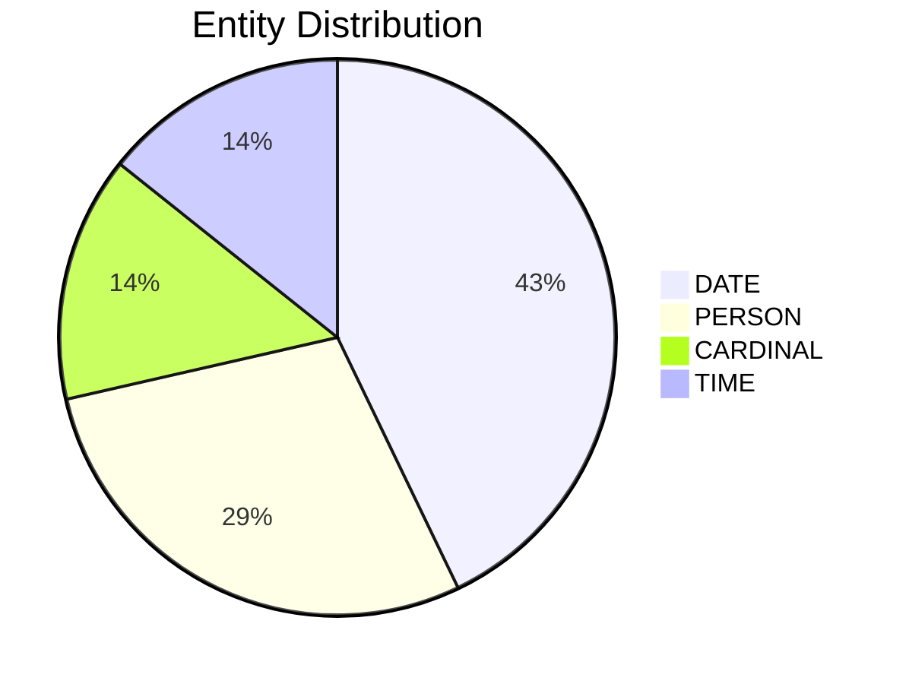

# Video Intelligence Report: 5 Things To Know: June 6, 2025

**URL**: https://www.youtube.com/watch?v=EMX1oO-RpnM
**Channel**: CNBC Television
**Duration**: 2:25
**Published**: 2025-06-06
**Processed**: 2025-07-18 23:27:57

**Processing Cost**: 🟢 $0.0083

## Executive Summary

The transcript provides a morning briefing on key financial news, beginning with economic indicators for "jobs Friday." Polled forecasters anticipate an increase of 125,000 non-farm payrolls in May, with the unemployment rate expected to remain stable. This forecast contrasts with a recent weaker ADP report, prompting discussion about the reliability of various job market indicators, such as jobless claims or JOLTS, which might be more accurate measures.

The market highlights significant movements in several company shares. Circle, a stablecoin company, experienced a dramatic surge in its shares, rising to $94 in pre-market trading, representing a 13% increase from the previous day, where it opened at $69 after being priced at $31. Lululemon also drew attention, with its revenue beating estimates, though comparable sales growth of 1% fell short of the 3% expectation. As a result, Lululemon cut its full-year guidance, attributing the decision to a "dynamic macro environment," and its CFO announced plans for strategic price increases to mitigate the effects of tariffs.

Docusign shares saw a sharp decline despite beating earnings and revenue estimates, primarily due to weaker-than-expected billings in the first quarter and a current quarter guidance that also came in below estimates. In contrast, Broadcom reported slightly higher earnings and revenue than analysts expected, with its current quarter guidance also exceeding estimates, driven by strong AI revenue growth. However, Broadcom's stock is experiencing a pullback after a significant run-up since early April, which coincided with President Trump's announcement of sweeping tariff plans, causing the stock to be up approximately 70% from its April low. Concerns were raised during Broadcom's recent call regarding whether the pace of AI growth will meet prior expectations.

## 📊 Quick Stats Dashboard

<b>Click to toggle stats</b>

| Metric | Count | Visualization |
|--------|-------|---------------|
| Transcript Length | 2,278 chars | █ |
| Word Count | 401 words |  |
| Entities Extracted | 7  |  |
| Relationships Found | 0  |  |
| Key Points | 33  | 📌📌📌📌📌📌📌📌📌📌📌 |
| Topics | 8  | 🏷️🏷️🏷️🏷️🏷️🏷️🏷️🏷️ |
| Graph Nodes | 7  |  |
| Graph Edges | 0  |  |

## 🏷️ Main Topics

<b>View all topics</b>

1. Financial Markets
2. Economic Indicators
3. Corporate Earnings
4. Stock Performance
5. Tariffs
6. Artificial Intelligence (AI)
7. Cryptocurrency
8. Macro Environment

## 🔍 Entity Analysis

### Entity Type Distribution

<b>🏷️ CARDINAL (1 found)</b>

| Name | Confidence | Source |
|------|------------|--------|
| Number one | 🟩 0.95 | None |

<b>📆 DATE (3 found)</b>

| Name | Confidence | Source |
|------|------------|--------|
| May | 🟩 0.95 | None |
| The First Quarter | 🟩 0.91 | None |
| the April | 🟨 0.74 | None |

<b>👤 PERSON (2 found)</b>

| Name | Confidence | Source |
|------|------------|--------|
| Xi | 🟩 0.95 | None |
| Trump | 🟨 0.71 | None |

<b>🏷️ TIME (1 found)</b>

| Name | Confidence | Source |
|------|------------|--------|
| This Morning | 🟨 0.72 | None |

## 💡 Key Insights

<b>Top 10 key points</b>

1. 🔴 Today is jobs Friday.
2. 🔴 Forecasters expect 125,000 non-farm payrolls increase in May.
3. 🔴 Circle shares sharply higher in pre-market trading.
4. 🔴 Circle's stock was priced at $31, opened at $69.
5. 🔴 Circle's stock is up to $94 today, an additional 13% increase.
6. 🔴 Lululemon's revenue beat estimates.
7. 🔴 Lululemon's comparable sales growth was 1%.
8. 🔴 Lululemon's comparable sales growth missed estimates of 3%.
9. 🔴 Lululemon cut its full-year guidance.
10. 🔴 Lululemon CFO announced plans for strategic price increases.

## 📁 Generated Files

<b>Click to see all files</b>

| File | Format | Size | Description |
|------|--------|------|-------------|
| `transcript.txt` | TXT | 2.2 KB | Plain text transcript |
| `transcript.json` | JSON | 35.3 KB | Full structured data |
| `entities.csv` | CSV | 217 B | All entities in spreadsheet format |
| `knowledge_graph.json` | JSON | 729 B | Complete graph structure |
| `knowledge_graph.gexf` | GEXF | 2.7 KB | Import into Gephi for visualization |
| `metadata.json` | JSON | 640 B | Video metadata and statistics |
| `manifest.json` | JSON | 12.2 KB | File index with checksums |
| `report.md` | Markdown | 0 B | This report |
| `chimera_format.json` | JSON | 18.8 KB | Chimera-compatible format |

---
*Generated by ClipScribe v2.6.0 on 2025-07-18 at 23:27:57*

💡 **Tip**: This markdown file supports Mermaid diagrams. View it in a compatible editor for interactive diagrams.
