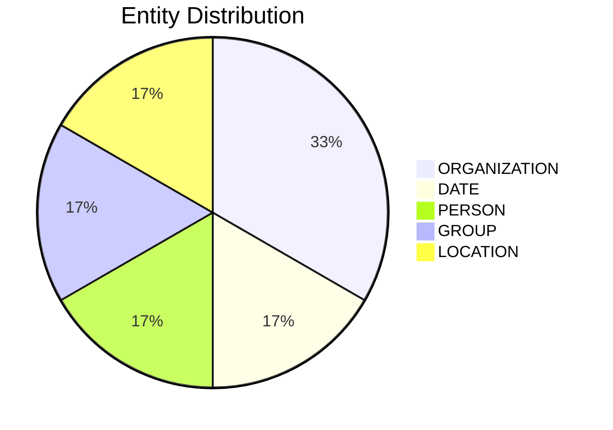

# Video Intelligence Report: 5 Things To Know: July 16, 2025

**URL**: https://www.youtube.com/watch?v=iz5vPelAs4g
**Channel**: CNBC Television
**Duration**: 2:37
**Published**: 2025-07-16
**Processed**: 2025-07-20 10:09:06

**Processing Cost**: 🟢 $0.0090

## Executive Summary

The broadcast opens with a segment on five key updates, starting with the news that two federal investigations into the online prediction betting platform, Polymarket, conducted by the Justice Department and the CFTC, have been closed without any charges filed. These investigations primarily focused on whether Polymarket was accepting wagers from individuals within the United States. Following this, the report shifts to political developments, detailing how Republicans narrowly succeeded in advancing a $9 billion package of spending cuts. This procedural vote passed the Senate by a slim 51-50 margin, with Vice President J.D. Vance casting the decisive tie-breaking vote. The proposed measure aims to claw back previously approved funds allocated for foreign aid and for the Corporation for Public Broadcasting, which is responsible for funding public media outlets like PBS and NPR.

In corporate news, SpaceX, led by Elon Musk, is reportedly planning an insider share sale. This sale is expected to value the aerospace company at an estimated $400 billion, according to a Bloomberg report. Concurrently, Tesla has experienced another high-level executive departure, with Troy Jones, the Vice President of Sales, Services Delivery in North America, leaving the company after 15 years. This exit, reported by The Wall Street Journal, marks Troy Jones as the latest in a series of top executives to depart Tesla since April, indicating a trend of leadership changes within the electric vehicle manufacturer.

The broadcast concludes with a discussion on the integration of technology in sports, specifically highlighting the use of the ABS automated ball strike system during the recent Major League Baseball All-Star game. During the first inning, catcher Cal Raleigh utilized the system to successfully challenge a call, which ultimately led to a strikeout. CNBC's Alex Sherman reported yesterday that MLB Commissioner Rob Manfred supports this new technology, suggesting it could be implemented across all MLB games as early as next year. The segment then transitions into a broader debate among the hosts about the merits and drawbacks of automated officiating versus human umpires, citing a controversial incident at Wimbledon this year where an AI system's error significantly impacted a match.

## 📊 Quick Stats Dashboard

<b>Click to toggle stats</b>

| Metric | Count | Visualization |
|--------|-------|---------------|
| Transcript Length | 2,610 chars | █ |
| Word Count | 459 words |  |
| Entities Extracted | 6  |  |
| Relationships Found | 0  |  |
| Key Points | 43  | 📌📌📌📌📌📌📌📌📌📌📌📌📌📌 |
| Topics | 8  | 🏷️🏷️🏷️🏷️🏷️🏷️🏷️🏷️ |
| Graph Nodes | 6  |  |
| Graph Edges | 0  |  |

## 🏷️ Main Topics

<b>View all topics</b>

1. Business News
2. Political Spending
3. Government Budget
4. Corporate Finance
5. Executive Leadership
6. Sports Technology
7. Automated Officiating
8. Public Broadcasting

## 🔍 Entity Analysis

### Entity Type Distribution

<b>📆 DATE (1 found)</b>

| Name | Confidence | Source |
|------|------------|--------|
| This Year | 🟨 0.74 | None |

<b>🏷️ GROUP (1 found)</b>

| Name | Confidence | Source |
|------|------------|--------|
| Republicans | 🟩 0.95 | None |

<b>📍 LOCATION (1 found)</b>

| Name | Confidence | Source |
|------|------------|--------|
| The Wall Street Journal | 🟨 0.71 | None |

<b>🏢 ORGANIZATION (2 found)</b>

| Name | Confidence | Source |
|------|------------|--------|
| The Justice Department | 🟨 0.71 | None |
| Corporation for Public Broadcasting | 🟨 0.71 | None |

<b>👤 PERSON (1 found)</b>

| Name | Confidence | Source |
|------|------------|--------|
| Trump | 🟨 0.71 | None |

## 💡 Key Insights

<b>Top 10 key points</b>

1. 🔴 Introduction to Squawk Box's 'five things to know' segment.
2. 🔴 Report on two federal investigations into online prediction betting site Polymarket.
3. 🔴 Investigations, conducted by Justice Department and CFTC, have been closed.
4. 🔴 No charges were filed against Polymarket following the federal investigations.
5. 🔴 Justice Department and CFTC investigated if Polymarket accepted bets from US individuals.
6. 🔴 Republicans narrowly voted to advance a package of spending cuts.
7. 🔴 The spending cuts package was proposed by President Trump.
8. 🔴 A procedural vote on the roughly $9 billion package passed the Senate.
9. 🔴 The Senate vote on the package was 51 to 50.
10. 🔴 Vice President J.D. Vance broke the tie vote in the Senate.

## 📁 Generated Files

<b>Click to see all files</b>

| File | Format | Size | Description |
|------|--------|------|-------------|
| `transcript.txt` | TXT | 2.5 KB | Plain text transcript |
| `transcript.json` | JSON | 33.4 KB | Full structured data |
| `entities.csv` | CSV | 307 B | All entities in spreadsheet format |
| `knowledge_graph.json` | JSON | 757 B | Complete graph structure |
| `knowledge_graph.gexf` | GEXF | 2.6 KB | Import into Gephi for visualization |
| `metadata.json` | JSON | 1.5 KB | Video metadata and statistics |
| `manifest.json` | JSON | 9.3 KB | File index with checksums |
| `report.md` | Markdown | 0 B | This report |
| `chimera_format.json` | JSON | 19.7 KB | Chimera-compatible format |

---
*Generated by ClipScribe v2.6.0 on 2025-07-20 at 10:09:06*

💡 **Tip**: This markdown file supports Mermaid diagrams. View it in a compatible editor for interactive diagrams.
