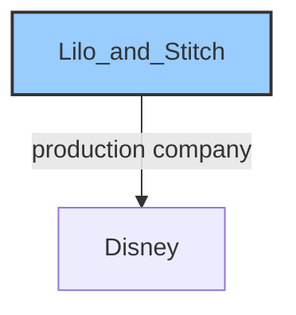
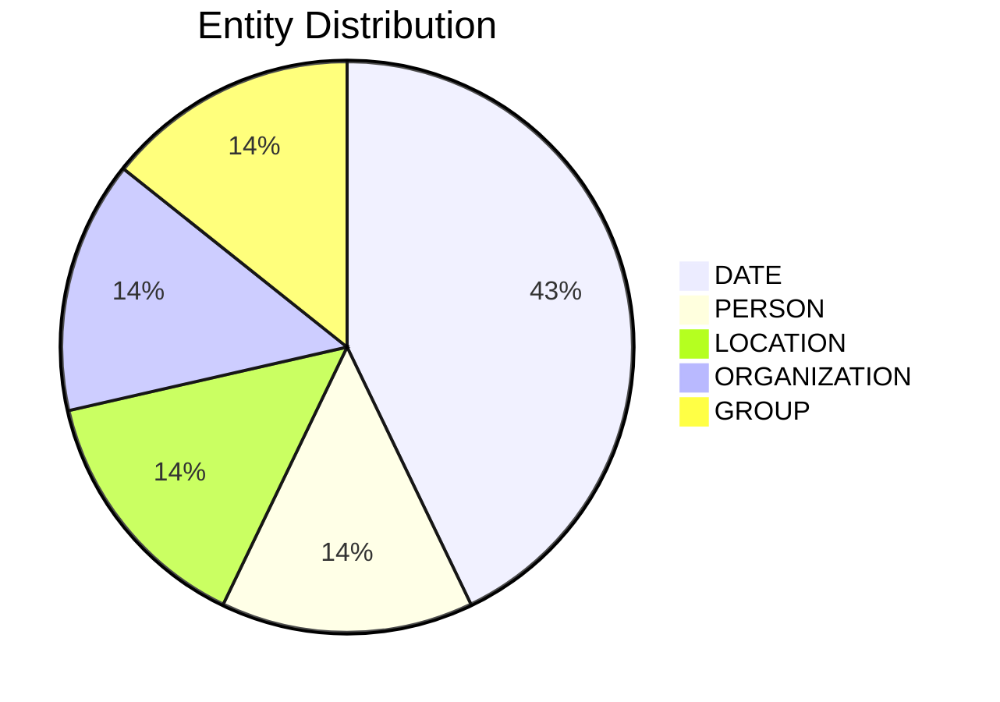

# Video Intelligence Report: 5 things to know: Monday, June 2

**URL**: https://www.youtube.com/watch?v=krTpPSI4Rqc
**Channel**: CNBC Television
**Duration**: 1:19
**Published**: 2025-06-02
**Processed**: 2025-07-19 10:38:55

**Processing Cost**: 🟢 $0.0045

## Executive Summary

Ahead of today's opening bell, several key developments are unfolding across different sectors. In politics, lawmakers are back at work this week, with the Senate prepared to take up the reconciliation bill. Republican Senator Ron Johnson is advocating for more significant spending cuts to address the national debt. Concurrently, the Trump administration's cost-cutting initiatives have expanded beyond consulting firms to include technology companies; the Wall Street Journal reports that ten tech firms, including Dell and CDW, received letters last week requesting justification for their work and identification of potential cuts.

On the international stage, Ukraine has claimed responsibility for a clandestine drone attack that reportedly destroyed numerous Russian warplanes, specifically targeting Russia's long-range bomber fleet. This significant event precedes a crucial meeting scheduled for today in Istanbul, where delegations from Russia and Ukraine are set to engage in negotiations for a ceasefire.

Domestically, a New York Airport is preparing to reopen a previously closed runway today. The closure of this runway had contributed to weeks of significant delays and operational disruptions. The Federal Aviation Administration (FAA) has assessed the completed repairs, deeming the runway safe for use, and notably, the work was completed thirteen days ahead of its projected schedule.

Finally, in entertainment news, Disney's 'Lilo and Stitch' performed well at the weekend box office, grossing $63 million. This performance positions it as the second highest-grossing movie of the year, trailing only the 'Minecraft movie.' 'Lilo and Stitch' has accumulated $280 million in ticket sales across the US and Canada to date.

## 📊 Quick Stats Dashboard

<b>Click to toggle stats</b>

| Metric | Count | Visualization |
|--------|-------|---------------|
| Transcript Length | 1,333 chars |  |
| Word Count | 229 words |  |
| Entities Extracted | 7  |  |
| Relationships Found | 1  |  |
| Key Points | 18  | 📌📌📌📌📌📌 |
| Topics | 6  | 🏷️🏷️🏷️🏷️🏷️🏷️ |
| Graph Nodes | 8  |  |
| Graph Edges | 1  |  |

## 🏷️ Main Topics

<b>View all topics</b>

1. Government & Politics
2. International Relations
3. Business & Technology
4. Aviation & Infrastructure
5. Entertainment & Box Office
6. Military Operations

## 🕸️ Knowledge Graph Visualization

<b>Interactive relationship diagram (Mermaid)</b>

*Note: This diagram shows the top 20 relationships. For the complete graph, use the GEXF file with Gephi.*

## 🔍 Entity Analysis

### Entity Type Distribution

<b>📆 DATE (3 found)</b>

| Name | Confidence | Source |
|------|------------|--------|
| The Weekend | 🟨 0.74 | None |
| The Year | 🟨 0.74 | None |
| This Week | 🟨 0.74 | None |

<b>🏷️ GROUP (1 found)</b>

| Name | Confidence | Source |
|------|------------|--------|
| Republican | 🟩 0.95 | None |

<b>📍 LOCATION (1 found)</b>

| Name | Confidence | Source |
|------|------------|--------|
| The Wall Street Journal | 🟨 0.71 | None |

<b>🏢 ORGANIZATION (1 found)</b>

| Name | Confidence | Source |
|------|------------|--------|
| Lilo and Stitch | 🟨 0.71 | None |

<b>👤 PERSON (1 found)</b>

| Name | Confidence | Source |
|------|------------|--------|
| Dell | 🟨 0.71 | None |

## 🔗 Relationship Network

<b>Relationship type distribution</b>

| Predicate | Count | Percentage |
|-----------|--------|------------|
| production company | 1 | ████████████████████ 100.0% |

<b>Key relationships (top 30)</b>

1. **Lilo and Stitch** *production company* **Disney** 🟩 (0.90)

## 💡 Key Insights

<b>Top 10 key points</b>

1. 🔴 Lawmakers are returning to work this week, with the Senate set to address the reconciliation bill.
2. 🔴 Republican Senator Ron Johnson intends to demand deeper spending cuts to alleviate the debt burden.
3. 🔴 The Trump administration's effort to reduce government costs has broadened to include technology companies.
4. 🔴 Executives from these firms are being asked to justify their work and identify areas for cost reduction.
5. 🔴 Ukraine claims to have destroyed dozens of Russian war planes in a clandestine drone attack.
6. 🔴 The drone attack targeted Russia's long-range bomber fleet.
7. 🔴 This attack occurs as delegations from Russia and Ukraine are scheduled to meet today in Istanbul.
8. 🔴 The meeting in Istanbul is for negotiations aimed at a ceasefire.
9. 🔴 A New York Airport is set to reopen a previously closed runway today.
10. 🔴 The FAA evaluated the runway repairs and officially deemed it safe for use.

## 📁 Generated Files

<b>Click to see all files</b>

| File | Format | Size | Description |
|------|--------|------|-------------|
| `transcript.txt` | TXT | 1.3 KB | Plain text transcript |
| `transcript.json` | JSON | 26.8 KB | Full structured data |
| `entities.csv` | CSV | 274 B | All entities in spreadsheet format |
| `relationships.csv` | CSV | 93 B | All relationships in spreadsheet format |
| `knowledge_graph.json` | JSON | 980 B | Complete graph structure |
| `knowledge_graph.gexf` | GEXF | 3.2 KB | Import into Gephi for visualization |
| `metadata.json` | JSON | 653 B | Video metadata and statistics |
| `manifest.json` | JSON | 10.9 KB | File index with checksums |
| `report.md` | Markdown | 0 B | This report |
| `chimera_format.json` | JSON | 13.9 KB | Chimera-compatible format |

---
*Generated by ClipScribe v2.6.0 on 2025-07-19 at 10:38:55*

💡 **Tip**: This markdown file supports Mermaid diagrams. View it in a compatible editor for interactive diagrams.
