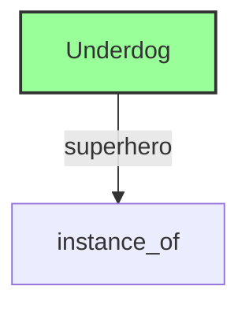
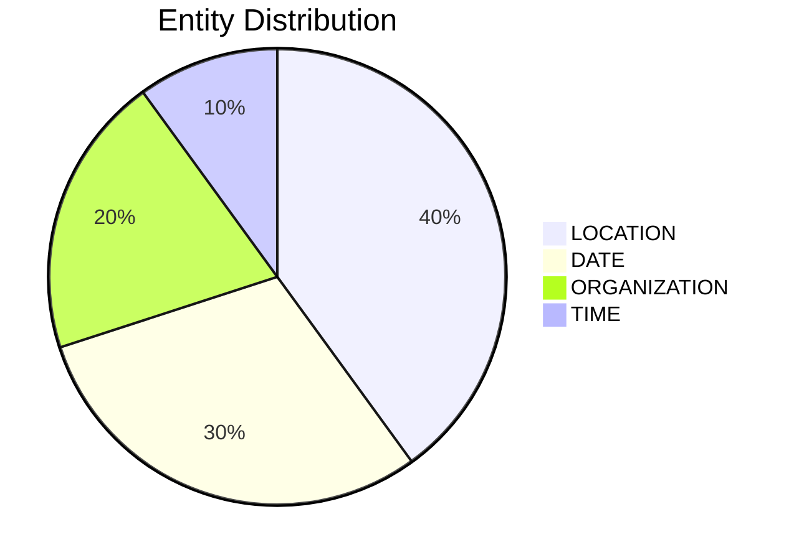

# Video Intelligence Report: 5 Things To Know: July 14, 2025

**URL**: https://www.youtube.com/watch?v=sSo_8Q1V3yU
**Channel**: CNBC Television
**Duration**: 3:23
**Published**: 2025-07-14
**Processed**: 2025-07-18 23:27:18

**Processing Cost**: 🟢 $0.0116

## Executive Summary

The transcript provides five key updates across different sectors. Warner Brothers' 'Superman' reboot led the recent weekend box office, earning $122 million in North America and $217 million globally, despite costing $225 million to produce. The film's success was partly attributed to the dog character, Crypto, a CGI mutt inspired by director James Gunn's rescue dog, Ozu, which was deemed a 'cute' and potentially impactful element for the movie's appeal.

E-commerce experienced a significant boost from online spending, labeled 'Black Friday in summer,' primarily driven by Amazon's Prime Day. Adobe Analytics reported a growth of over $24 billion in online spending across US retailers, surpassing earlier forecasts and indicating robust consumer activity.

In the technology and geopolitical spheres, Nvidia CEO Jensen Huang is scheduled for a media briefing in Beijing this week, marking his second visit to China in three months. Huang recently dismissed US concerns that Nvidia's chips could aid the Chinese military. Meanwhile, China's export growth exceeded expectations last month, buoyed by shipments to non-US markets and a temporary reprieve from US tariffs.

## 📊 Quick Stats Dashboard

<b>Click to toggle stats</b>

| Metric | Count | Visualization |
|--------|-------|---------------|
| Transcript Length | 3,453 chars | █ |
| Word Count | 635 words | █ |
| Entities Extracted | 10  | 🔵 |
| Relationships Found | 1  |  |
| Key Points | 32  | 📌📌📌📌📌📌📌📌📌📌 |
| Topics | 12  | 🏷️🏷️🏷️🏷️🏷️🏷️🏷️🏷️🏷️🏷️🏷️🏷️ |
| Graph Nodes | 11  | ⭕ |
| Graph Edges | 1  |  |

## 🏷️ Main Topics

<b>View all topics</b>

1. Film Industry
2. Box Office Performance
3. E-commerce
4. Retail Spending
5. Technology Sector
6. Semiconductor Industry
7. International Trade
8. Geopolitics
9. Financial Markets
10. Private Credit
11. Banking
12. Corporate Strategy

## 🕸️ Knowledge Graph Visualization

<b>Interactive relationship diagram (Mermaid)</b>

*Note: This diagram shows the top 20 relationships. For the complete graph, use the GEXF file with Gephi.*

## 🔍 Entity Analysis

### Entity Type Distribution

<b>📆 DATE (3 found)</b>

| Name | Confidence | Source |
|------|------------|--------|
| About The Past Three Months | 🟨 0.79 | None |
| last Tuesday to Friday | 🟨 0.79 | None |
| This Week | 🟨 0.74 | None |

<b>📍 LOCATION (4 found)</b>

| Name | Confidence | Source |
|------|------------|--------|
| United States | 🟩 0.95 | None |
| Beijing | 🟩 0.95 | None |
| Underdog | 🟩 0.82 | None |
| the Wall Street Journal | 🟨 0.71 | None |

<b>🏢 ORGANIZATION (2 found)</b>

| Name | Confidence | Source |
|------|------------|--------|
| Warner Brothers | 🟩 0.95 | None |
| Reuters | 🟩 0.95 | None |

<b>🏷️ TIME (1 found)</b>

| Name | Confidence | Source |
|------|------------|--------|
| This Morning | 🟨 0.72 | None |

## 🔗 Relationship Network

<b>Relationship type distribution</b>

| Predicate | Count | Percentage |
|-----------|--------|------------|
| superhero | 1 | ████████████████████ 100.0% |

<b>Key relationships (top 30)</b>

1. **Underdog** *superhero* **instance of** 🟩 (0.85)

## 💡 Key Insights

<b>Top 10 key points</b>

1. 🔴 Warner Brothers' Superman reboot topped the recent weekend box office.
2. 🔴 Shoppers engaged in heavy online spending from last Tuesday to Friday, a period some call 'Black Friday in summer'.
3. 🔴 Adobe Analytics reported that online spending grew by more than $24 billion across United States retailers.
4. 🔴 Reuters is reporting that Nvidia's CEO, Jensen Huang, will hold a media briefing in Beijing this week.
5. 🔴 In a CNN interview yesterday, Huang downplayed United States' fears that Nvidia's chips would assist the Chinese military.
6. 🔴 China's export growth surpassed expectations last month.
7. 🔴 Jamie Dimon of J.P. Morgan issued a warning about the dangers of private credit.
8. 🔴 Despite Dimon's warnings, J.P. Morgan is increasing its efforts in the private credit sector.
9. 🔴 A new Wall Street Journal report indicates Dimon is racing to secure a stake in the private credit market before J.P. Morgan is left behind.
10. 🔴 J.P. Morgan's strategy in private credit is to 'swoop in strategically and profit if there is a meltdown'.

## 📁 Generated Files

<b>Click to see all files</b>

| File | Format | Size | Description |
|------|--------|------|-------------|
| `transcript.txt` | TXT | 3.4 KB | Plain text transcript |
| `transcript.json` | JSON | 39.3 KB | Full structured data |
| `entities.csv` | CSV | 382 B | All entities in spreadsheet format |
| `relationships.csv` | CSV | 83 B | All relationships in spreadsheet format |
| `knowledge_graph.json` | JSON | 1.2 KB | Complete graph structure |
| `knowledge_graph.gexf` | GEXF | 4.1 KB | Import into Gephi for visualization |
| `metadata.json` | JSON | 1.6 KB | Video metadata and statistics |
| `manifest.json` | JSON | 10.7 KB | File index with checksums |
| `report.md` | Markdown | 0 B | This report |
| `chimera_format.json` | JSON | 21.9 KB | Chimera-compatible format |

---
*Generated by ClipScribe v2.6.0 on 2025-07-18 at 23:27:18*

💡 **Tip**: This markdown file supports Mermaid diagrams. View it in a compatible editor for interactive diagrams.
