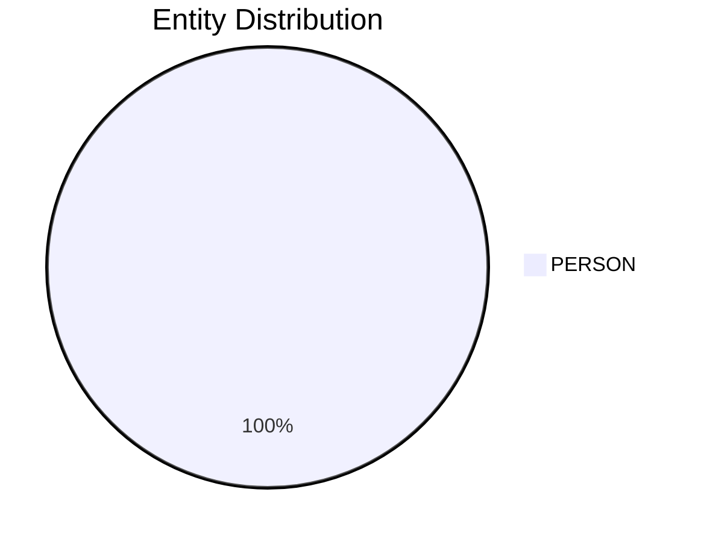

# Video Intelligence Report: 5 Things To Know: July 11, 2025

**URL**: https://www.youtube.com/watch?v=Mz3K4UmdgmA
**Channel**: CNBC Television
**Duration**: 1:14
**Published**: 2025-07-11
**Processed**: 2025-07-20 10:09:11

**Processing Cost**: 🟢 $0.0042

## Executive Summary

The broadcast provides an overview of several key business and political developments. President Trump has announced new 35% tariffs on imports from Canada, effective August 1st, citing Fentanyl as the reason in a letter to Prime Minister Mark Carney posted on Truth Social. This move signals a significant shift in trade relations with Canada.

In international diplomacy, Secretary of State Marco Rubio held his first in-person meeting with China's Foreign Minister in Malaysia, amidst ongoing trade tensions. Following the discussion, Rubio suggested that a summit between President Trump and Chinese leader Xi is a likely next step. Domestically, Google is reportedly close to finalizing a deal to provide cloud computing services to the US government at a heavily discounted rate, a week after Oracle secured a similar agreement.

Looking ahead, Apple is preparing for a major product launch in the first half of 2026, which is expected to include a new low-end iPhone, several iPads, and updated Mac computers, according to a Bloomberg report. Finally, in the sports betting industry, Flutter Entertainment is set to gain full ownership of FanDuel by acquiring Boyd Gaming's remaining 5% stake for $1.76 billion, valuing FanDuel at an impressive $31 billion. Flutter highlights FanDuel's dominant position, holding 43% of the sports betting market.

## 📊 Quick Stats Dashboard

<b>Click to toggle stats</b>

| Metric | Count | Visualization |
|--------|-------|---------------|
| Transcript Length | 1,284 chars |  |
| Word Count | 210 words |  |
| Entities Extracted | 1  |  |
| Relationships Found | 0  |  |
| Key Points | 28  | 📌📌📌📌📌📌📌📌📌 |
| Topics | 7  | 🏷️🏷️🏷️🏷️🏷️🏷️🏷️ |
| Graph Nodes | 1  |  |
| Graph Edges | 0  |  |

## 🏷️ Main Topics

<b>View all topics</b>

1. International Trade
2. US Politics
3. Technology Deals
4. Cloud Computing
5. Consumer Electronics
6. Sports Betting
7. Corporate Acquisitions

## 🔍 Entity Analysis

### Entity Type Distribution

<b>👤 PERSON (1 found)</b>

| Name | Confidence | Source |
|------|------------|--------|
| Trump | 🟨 0.71 | None |

## 💡 Key Insights

<b>Top 10 key points</b>

1. 🔴 President Trump announced tariffs on imports from Canada.
2. 🔴 Secretary of State Marco Rubio met with China's Foreign Minister in Malaysia.
3. 🔴 Google has reportedly reached a deal to provide cloud computing services for the US government.
4. 🔴 Apple is planning a slate of new product releases for the first half of 2026.
5. 🔴 Flutter Entertainment has reached a deal to acquire full ownership of FanDuel.
6. 🔴 The tariffs imposed on Canadian imports are set at 35%.
7. 🔴 The new tariffs will be effective starting August 1st.
8. 🔴 Trump stated that Fentanyl was the reason for the higher tariff rate.
9. 🔴 This was the first in-person meeting between Marco Rubio and China's Foreign Minister.
10. 🔴 Marco Rubio indicated that a summit between President Trump and Xi is likely.

## 📁 Generated Files

<b>Click to see all files</b>

| File | Format | Size | Description |
|------|--------|------|-------------|
| `transcript.txt` | TXT | 1.3 KB | Plain text transcript |
| `transcript.json` | JSON | 21.1 KB | Full structured data |
| `entities.csv` | CSV | 74 B | All entities in spreadsheet format |
| `knowledge_graph.json` | JSON | 214 B | Complete graph structure |
| `knowledge_graph.gexf` | GEXF | 1.1 KB | Import into Gephi for visualization |
| `metadata.json` | JSON | 1.6 KB | Video metadata and statistics |
| `manifest.json` | JSON | 9.2 KB | File index with checksums |
| `report.md` | Markdown | 0 B | This report |
| `chimera_format.json` | JSON | 9.9 KB | Chimera-compatible format |

---
*Generated by ClipScribe v2.6.0 on 2025-07-20 at 10:09:11*

💡 **Tip**: This markdown file supports Mermaid diagrams. View it in a compatible editor for interactive diagrams.
