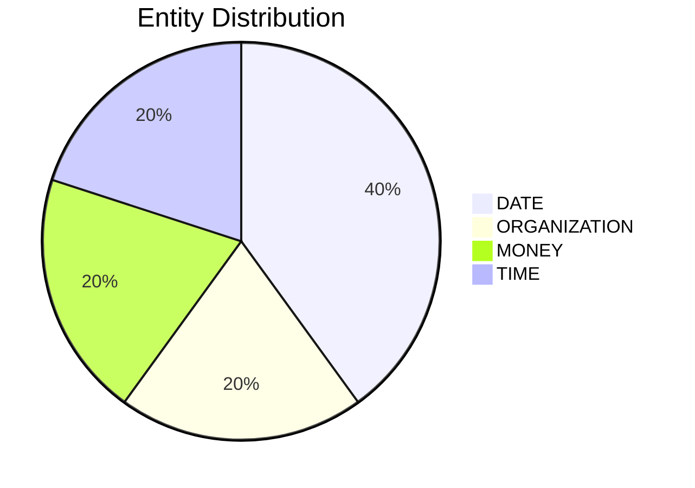

# Video Intelligence Report: 5 Things To Know: July 9, 2025

**URL**: https://www.youtube.com/watch?v=UPHSONoV3So
**Channel**: CNBC Television
**Duration**: 1:17
**Published**: 2025-07-09
**Processed**: 2025-07-20 10:09:13

**Processing Cost**: 🟢 $0.0044

## Executive Summary

The transcript provides an overview of five significant news items concerning business and public policy. SpaceX is reportedly engaged in discussions to secure new funding and facilitate the sale of insider shares, a move that could elevate the company's valuation to approximately $400 billion. This financial initiative, as reported by the Financial Times, was presented to investors yesterday.

In the realm of corporate divestitures, Starbucks' China division is drawing considerable interest, having received offers for a potential stake sale that could value the business at up to $10 billion. Key entities exploring this opportunity include the Carlyle Group, KKR, and Centurium Capital, with the latter already a majority shareholder in China's Luckin Coffee.

Meanwhile, in the aviation industry, Boeing announced its latest delivery figures, with 60 airplanes delivered last month, marking its highest monthly total since December 2023. This brings the company's total second-quarter deliveries to 150 airplanes, ahead of its full second-quarter results release scheduled for July 29th. Concurrently, a notable change in travel security policy was confirmed yesterday by the Transportation Security Administration (TSA), which will now permit many travelers to keep their shoes on at U.S. airport checkpoints. Homeland Security Secretary Christie Noam attributed the cessation of the two-decade-old rule to advancements in screening technology.

Finally, the city of Philadelphia and its largest municipal union have reached a tentative agreement early this morning, aimed at concluding a labor strike that has disrupted garbage collection since July 1st. Philadelphia's mayor indicated that the new deal spans three years and is expected to include a 9% wage increase, distributed over the three-year term of the agreement.

## 📊 Quick Stats Dashboard

<b>Click to toggle stats</b>

| Metric | Count | Visualization |
|--------|-------|---------------|
| Transcript Length | 1,348 chars |  |
| Word Count | 223 words |  |
| Entities Extracted | 5  |  |
| Relationships Found | 0  |  |
| Key Points | 29  | 📌📌📌📌📌📌📌📌📌 |
| Topics | 7  | 🏷️🏷️🏷️🏷️🏷️🏷️🏷️ |
| Graph Nodes | 5  |  |
| Graph Edges | 0  |  |

## 🏷️ Main Topics

<b>View all topics</b>

1. Business News
2. Corporate Finance
3. Aerospace Industry
4. Travel Security
5. Labor Relations
6. Technology
7. Supply Chain

## 🔍 Entity Analysis

### Entity Type Distribution

<b>📆 DATE (2 found)</b>

| Name | Confidence | Source |
|------|------------|--------|
| The End Of The | 🟨 0.79 | None |
| December of 2023 | 🟨 0.79 | None |

<b>💰 MONEY (1 found)</b>

| Name | Confidence | Source |
|------|------------|--------|
| Up To $10 Billion | 🟨 0.78 | None |

<b>🏢 ORGANIZATION (1 found)</b>

| Name | Confidence | Source |
|------|------------|--------|
| Boeing | 🟩 0.95 | None |

<b>🏷️ TIME (1 found)</b>

| Name | Confidence | Source |
|------|------------|--------|
| Early This Morning | 🟨 0.77 | None |

## 💡 Key Insights

<b>Top 10 key points</b>

1. 🔴 The proposed deal would value SpaceX at approximately $400 billion.
2. 🔴 The stake sale could value Starbucks China's business at up to $10 billion.
3. 🔴 The TSA confirmed a policy change yesterday regarding footwear at airport checkpoints.
4. 🔴 Many travelers will now be permitted to keep their shoes on at US Airport checkpoints.
5. 🔴 Starbucks China's unit has received offers for a potential stake sale.
6. 🔴 Boeing reported delivering 60 airplanes last month.
7. 🔴 Boeing's second-quarter delivery total has reached 150 airplanes.
8. 🔴 Homeland Security Secretary Christie Noam announced the new TSA policy.
9. 🔴 Philadelphia's largest municipal union reached a tentative deal with the city.
10. 🔴 The deal, reached early this morning, aims to end a labor strike.

## 📁 Generated Files

<b>Click to see all files</b>

| File | Format | Size | Description |
|------|--------|------|-------------|
| `transcript.txt` | TXT | 1.3 KB | Plain text transcript |
| `transcript.json` | JSON | 26.7 KB | Full structured data |
| `entities.csv` | CSV | 189 B | All entities in spreadsheet format |
| `knowledge_graph.json` | JSON | 577 B | Complete graph structure |
| `knowledge_graph.gexf` | GEXF | 2.2 KB | Import into Gephi for visualization |
| `metadata.json` | JSON | 649 B | Video metadata and statistics |
| `manifest.json` | JSON | 9.9 KB | File index with checksums |
| `report.md` | Markdown | 0 B | This report |
| `chimera_format.json` | JSON | 13.9 KB | Chimera-compatible format |

---
*Generated by ClipScribe v2.6.0 on 2025-07-20 at 10:09:13*

💡 **Tip**: This markdown file supports Mermaid diagrams. View it in a compatible editor for interactive diagrams.
