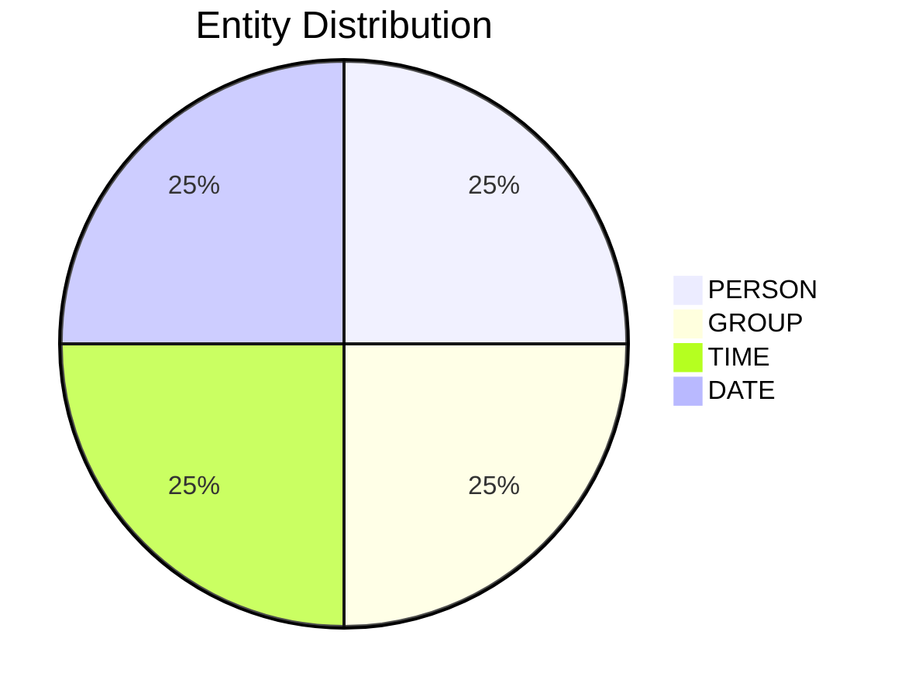

# Video Intelligence Report: 5 Things To Know: July 7, 2025

**URL**: https://www.youtube.com/watch?v=_0hrAR1NeIk
**Channel**: CNBC Television
**Duration**: 1:25
**Published**: 2025-07-07
**Processed**: 2025-07-20 10:09:16

**Processing Cost**: 🟢 $0.0049

## Executive Summary

The briefing outlines five key developments ahead of the day's opening bell, focusing primarily on US economic policy, international diplomacy, and domestic political shifts. President Trump announced that letters detailing new tariff rates and deadlines would begin delivery at noon Eastern time today to various trade partners, signaling an aggressive stance on trade. This follows Treasury Secretary Scott Bason's statement yesterday, warning that tariffs would revert to April's higher rates if countries fail to finalize trade deals by an August 1st deadline, with Secretary Bason slated for a live interview to discuss these developments further.

In international affairs, President Trump is scheduled to meet with Israeli Prime Minister Benjamin Netanyahu at the White House today. This high-level meeting occurs against the backdrop of recently concluded ceasefire talks between Israel and Hamas, which ended this morning without achieving a breakthrough, highlighting ongoing tensions in the region.

Domestically, the technology sector is seeing shifts as Oracle has offered the US government significant discounts: a 75% reduction on its licensed-based software and substantial savings on its cloud services, valid until the end of November. This move by Oracle is part of a broader trend where major tech companies are reducing prices, responding to the government's push for cost-cutting measures. Simultaneously, Tennessee Republican Congressman Mark Green announced his resignation from Congress, effective July 20th, to return to the private sector and start his own business. His departure will narrow the Republican majority in the House to 219 Republicans against 212 Democrats, at least until his seat is filled. The briefing concluded by teasing an upcoming discussion on President Trump's administration's agenda, following what is described as his first major legislative victory of his second term.

## 📊 Quick Stats Dashboard

<b>Click to toggle stats</b>

| Metric | Count | Visualization |
|--------|-------|---------------|
| Transcript Length | 1,456 chars |  |
| Word Count | 249 words |  |
| Entities Extracted | 4  |  |
| Relationships Found | 0  |  |
| Key Points | 32  | 📌📌📌📌📌📌📌📌📌📌 |
| Topics | 7  | 🏷️🏷️🏷️🏷️🏷️🏷️🏷️ |
| Graph Nodes | 4  |  |
| Graph Edges | 0  |  |

## 🏷️ Main Topics

<b>View all topics</b>

1. US Trade Policy
2. International Diplomacy
3. US Politics
4. Technology and Government
5. Tariffs
6. Ceasefire Talks
7. Congressional Resignations

## 🔍 Entity Analysis

### Entity Type Distribution

<b>📆 DATE (1 found)</b>

| Name | Confidence | Source |
|------|------------|--------|
| the end of November | 🟨 0.79 | None |

<b>🏷️ GROUP (1 found)</b>

| Name | Confidence | Source |
|------|------------|--------|
| Republicans | 🟩 0.95 | None |

<b>👤 PERSON (1 found)</b>

| Name | Confidence | Source |
|------|------------|--------|
| Trump | 🟨 0.71 | None |

<b>🏷️ TIME (1 found)</b>

| Name | Confidence | Source |
|------|------------|--------|
| This Morning | 🟨 0.72 | None |

## 💡 Key Insights

<b>Top 10 key points</b>

1. 🔴 President Trump scheduled to deliver letters to trade partners.
2. 🔴 Delivery of tariff letters set to begin at noon Eastern time today.
3. 🔴 Tariffs would revert to rates announced in April.
4. 🔴 This reversion would occur if countries fail to make a trade deal.
5. 🔴 The deadline for countries to make a deal is August 1st.
6. 🔴 President Trump is scheduled to meet with Israeli Prime Minister Benjamin Netanyahu.
7. 🔴 The meeting between Trump and Netanyahu will take place at the White House.
8. 🔴 The first round of ceasefire talks between Israel and Hamas recently concluded.
9. 🔴 The talks between Israel and Hamas ended without a breakthrough.
10. 🔴 Oracle is offering a significant discount to the US government.

## 📁 Generated Files

<b>Click to see all files</b>

| File | Format | Size | Description |
|------|--------|------|-------------|
| `transcript.txt` | TXT | 1.4 KB | Plain text transcript |
| `transcript.json` | JSON | 28.4 KB | Full structured data |
| `entities.csv` | CSV | 159 B | All entities in spreadsheet format |
| `knowledge_graph.json` | JSON | 485 B | Complete graph structure |
| `knowledge_graph.gexf` | GEXF | 1.9 KB | Import into Gephi for visualization |
| `metadata.json` | JSON | 640 B | Video metadata and statistics |
| `manifest.json` | JSON | 11.1 KB | File index with checksums |
| `report.md` | Markdown | 0 B | This report |
| `chimera_format.json` | JSON | 14.5 KB | Chimera-compatible format |

---
*Generated by ClipScribe v2.6.0 on 2025-07-20 at 10:09:16*

💡 **Tip**: This markdown file supports Mermaid diagrams. View it in a compatible editor for interactive diagrams.
