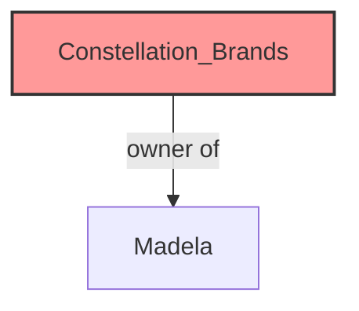
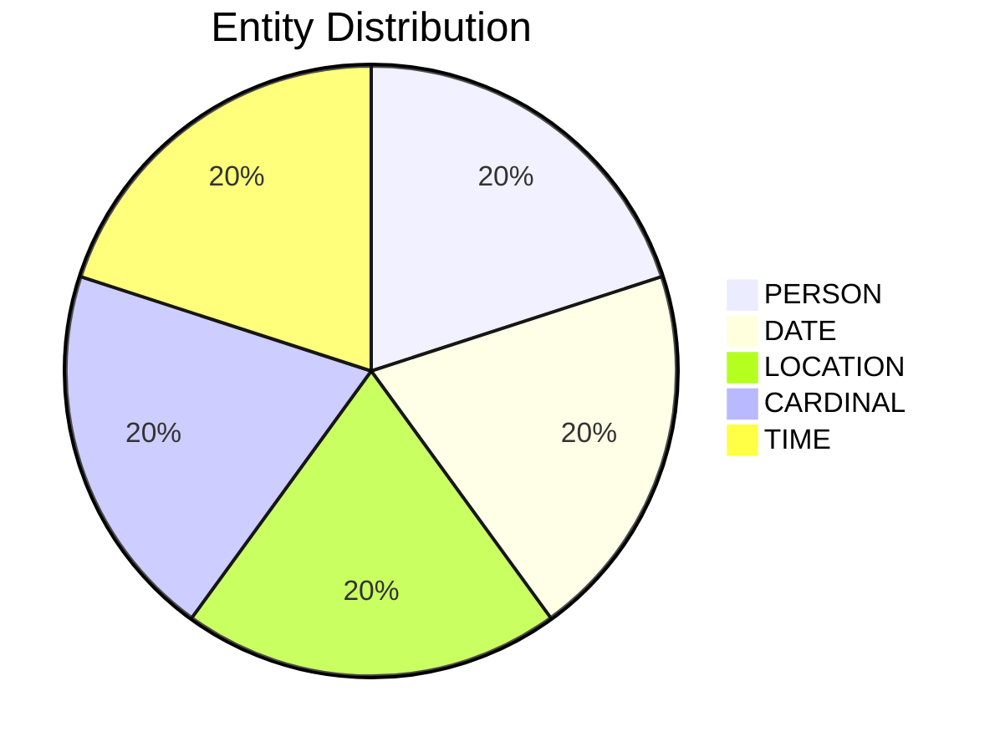

# Video Intelligence Report: 5 Things To Know: July 2, 2025

**URL**: https://www.youtube.com/watch?v=lHc9xeM0lQk
**Channel**: CNBC Television
**Duration**: 1:28
**Published**: 2025-07-02
**Processed**: 2025-07-19 10:38:23

**Processing Cost**: 🟢 $0.0050

## Executive Summary

This market update provides five key insights for the opening bell. Firstly, upcoming jobs data for June from ADP is anticipated, with economists projecting an addition of 120,000 private sector jobs for the preceding month. Secondly, Tesla's second-quarter delivery metrics are highly awaited; industry consensus, as of late last month, pointed to 393,000 vehicle deliveries, which would represent an 11% decline compared to the second quarter of the previous year. Phil Labow is expected to release these figures.

Thirdly, health insurer Centene experienced a significant drop in its shares during pre-market trading, losing approximately a quarter of its value. This downturn followed the company's decision to withdraw its 2025 earnings guidance, citing market trends that diverged from its initial assumptions. Other health insurance companies also faced negative impacts this morning.

Fourthly, Constellation Brands, the owner of Madela, reported earnings and revenue for its most recent quarter that fell short of estimates. This miss was attributed to a combination of falling consumer demand and increased prices for aluminum cans, the latter being a consequence of tariffs. Despite these disappointing results, Constellation Brands confirmed it would maintain its full-year guidance. Finally, Netflix is reportedly in discussions with Spotify regarding potential partnerships on various projects, including music award shows and live concert series. This information comes from a Wall Street Journal report, which also indicated that Netflix is exploring opportunities for major celebrity interviews and quick-turnaround documentaries.

## 📊 Quick Stats Dashboard

<b>Click to toggle stats</b>

| Metric | Count | Visualization |
|--------|-------|---------------|
| Transcript Length | 1,518 chars |  |
| Word Count | 255 words |  |
| Entities Extracted | 5  |  |
| Relationships Found | 1  |  |
| Key Points | 23  | 📌📌📌📌📌📌📌 |
| Topics | 8  | 🏷️🏷️🏷️🏷️🏷️🏷️🏷️🏷️ |
| Graph Nodes | 6  |  |
| Graph Edges | 1  |  |

## 🏷️ Main Topics

<b>View all topics</b>

1. Market Outlook
2. Economic Indicators
3. Corporate Earnings
4. Automotive Industry
5. Healthcare Industry
6. Beverage Industry
7. Media & Entertainment
8. Technology Partnerships

## 🕸️ Knowledge Graph Visualization

<b>Interactive relationship diagram (Mermaid)</b>

*Note: This diagram shows the top 20 relationships. For the complete graph, use the GEXF file with Gephi.*

## 🔍 Entity Analysis

### Entity Type Distribution

<b>🏷️ CARDINAL (1 found)</b>

| Name | Confidence | Source |
|------|------------|--------|
| About A Quarter | 🟨 0.71 | None |

<b>📆 DATE (1 found)</b>

| Name | Confidence | Source |
|------|------------|--------|
| The Most Recent Quarter | 🟨 0.79 | None |

<b>📍 LOCATION (1 found)</b>

| Name | Confidence | Source |
|------|------------|--------|
| the Wall Street Journal | 🟨 0.71 | None |

<b>👤 PERSON (1 found)</b>

| Name | Confidence | Source |
|------|------------|--------|
| Constellation Brands | 🟩 0.87 | None |

<b>🏷️ TIME (1 found)</b>

| Name | Confidence | Source |
|------|------------|--------|
| This Morning | 🟨 0.72 | None |

## 🔗 Relationship Network

<b>Relationship type distribution</b>

| Predicate | Count | Percentage |
|-----------|--------|------------|
| owner of | 1 | ████████████████████ 100.0% |

<b>Key relationships (top 30)</b>

1. **Constellation Brands** *owner of* **Madela** 🟩 (1.00)

## 💡 Key Insights

<b>Top 10 key points</b>

1. 🔴 Five key things to know ahead of the opening bell are presented.
2. 🔴 The jobs picture for June is set to be released at 8:15 Eastern time.
3. 🔴 ADP will release its latest look at private sector hiring.
4. 🔴 Economists expect an addition of 120,000 jobs for last month.
5. 🔴 Second quarter delivery metrics are expected from Tesla.
6. 🔴 Consensus for Tesla's deliveries as of late last month was 393,000 vehicles.
7. 🔴 393,000 Tesla deliveries would be a drop of more than 11% compared to the second quarter of last year.
8. 🔴 Shares of health insurer Centene are losing about a quarter of their value in the pre-market.
9. 🔴 Centene pulled its 2025 earnings guidance.
10. 🔴 Constellation Brands, owner of Madela, missed earnings and revenue estimates for the most recent quarter.

## 📁 Generated Files

<b>Click to see all files</b>

| File | Format | Size | Description |
|------|--------|------|-------------|
| `transcript.txt` | TXT | 1.5 KB | Plain text transcript |
| `transcript.json` | JSON | 28.0 KB | Full structured data |
| `entities.csv` | CSV | 254 B | All entities in spreadsheet format |
| `relationships.csv` | CSV | 88 B | All relationships in spreadsheet format |
| `knowledge_graph.json` | JSON | 830 B | Complete graph structure |
| `knowledge_graph.gexf` | GEXF | 2.8 KB | Import into Gephi for visualization |
| `metadata.json` | JSON | 643 B | Video metadata and statistics |
| `manifest.json` | JSON | 10.9 KB | File index with checksums |
| `report.md` | Markdown | 0 B | This report |
| `chimera_format.json` | JSON | 13.1 KB | Chimera-compatible format |

---
*Generated by ClipScribe v2.6.0 on 2025-07-19 at 10:38:23*

💡 **Tip**: This markdown file supports Mermaid diagrams. View it in a compatible editor for interactive diagrams.
