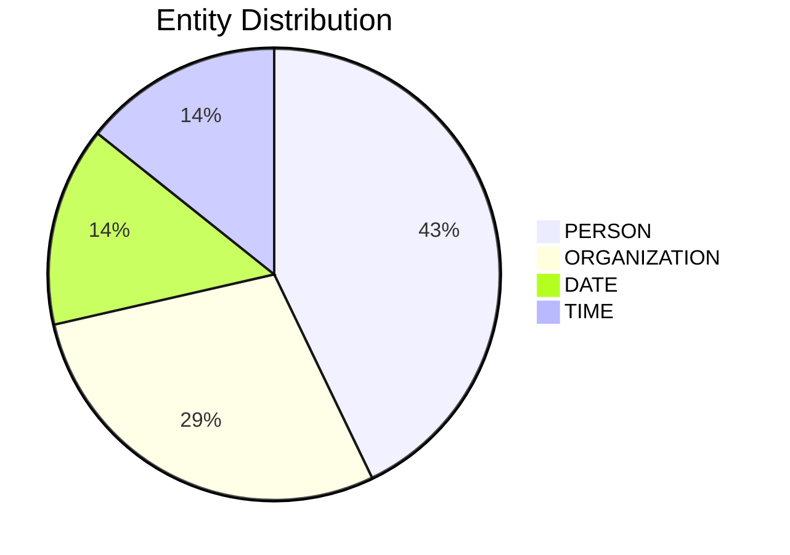

# Video Intelligence Report: 5 Things To Know: July 1, 2025

**URL**: https://www.youtube.com/watch?v=HcAQBfKLMjA
**Channel**: CNBC Television
**Duration**: 1:30
**Published**: 2025-07-01
**Processed**: 2025-07-20 10:09:21

**Processing Cost**: 🟢 $0.0051

## Executive Summary

Stablecoin issuer Circle has applied for a national trust bank charter, a move that, if approved by the Office of the Controller of the Currency, would enable them to offer custody services for institutional clients, potentially including tokenized stocks and bonds on a blockchain. This highlights a growing trend of traditional financial structures intersecting with digital assets.

In corporate leadership news, Boeing's Chief Financial Officer Brian West is set to step down on August 15th. He will be succeeded by J Malave, formerly an executive at Lockheed Martin. West will remain involved with Boeing as an advisor to the CEO, ensuring a smooth transition.

Financial technology firm Robin Hood saw significant gains, with shares climbing nearly 13% yesterday and continuing to rise this morning. This surge follows Robin Hood's introduction of tokenized shares of prominent companies like Open AI and SpaceX to its European user base, signifying an expansion of their product offerings and market reach. Additionally, NASA's live programming, including rocket launches and spacewalks, is slated to begin streaming on Netflix this summer, though the financial terms of this partnership remain undisclosed.

Finally, a high-profile legal dispute between President Trump and Paramount Global is reportedly nearing a settlement. The lawsuit stems from Trump's accusation that CBS deceptively edited a 60 Minutes interview featuring then-Vice President Kamala Harris. While Trump initially sought $20 billion, reports suggest a mediator has proposed a $20 million payment. Paramount is also scheduled to hold its annual shareholder meeting tomorrow, amidst these negotiations.

## 📊 Quick Stats Dashboard

<b>Click to toggle stats</b>

| Metric | Count | Visualization |
|--------|-------|---------------|
| Transcript Length | 1,459 chars |  |
| Word Count | 237 words |  |
| Entities Extracted | 7  |  |
| Relationships Found | 0  |  |
| Key Points | 28  | 📌📌📌📌📌📌📌📌📌 |
| Topics | 9  | 🏷️🏷️🏷️🏷️🏷️🏷️🏷️🏷️🏷️ |
| Graph Nodes | 7  |  |
| Graph Edges | 0  |  |

## 🏷️ Main Topics

<b>View all topics</b>

1. Financial Services Regulation
2. Cryptocurrency and Blockchain
3. Corporate Management Changes
4. Stock Market Trends
5. Digital Asset Offerings
6. Space Exploration
7. Media Partnerships
8. Legal Disputes
9. Political Lawsuits

## 🔍 Entity Analysis

### Entity Type Distribution

<b>📆 DATE (1 found)</b>

| Name | Confidence | Source |
|------|------------|--------|
| This Summer | 🟨 0.74 | None |

<b>🏢 ORGANIZATION (2 found)</b>

| Name | Confidence | Source |
|------|------------|--------|
| Boeing | 🟩 0.95 | None |
| Lockheed Martin | 🟩 0.95 | None |

<b>👤 PERSON (3 found)</b>

| Name | Confidence | Source |
|------|------------|--------|
| Brian West | 🟨 0.71 | None |
| Trump | 🟨 0.71 | None |
| President | 🟨 0.71 | None |

<b>🏷️ TIME (1 found)</b>

| Name | Confidence | Source |
|------|------------|--------|
| This Morning | 🟨 0.72 | None |

## 💡 Key Insights

<b>Top 10 key points</b>

1. 🔴 Stablecoin issuer Circle has applied for a national trust bank charter.
2. 🔴 Boeing's Chief Financial Officer Brian West is stepping down.
3. 🔴 J Malave will succeed Brian West.
4. 🔴 Robin Hood rolled out tokenized shares of Open AI.
5. 🔴 Robin Hood also rolled out tokenized shares of SpaceX.
6. 🔴 NASA's live programming will begin streaming on Netflix.
7. 🔴 President Trump and Paramount Global are in advanced settlement negotiations.
8. 🔴 The application is with the Office of the Controller of the Currency (OCC).
9. 🔴 If granted, Circle would be able to offer custody services to institutional clients.
10. 🔴 Brian West's departure is effective August 15th.

## 📁 Generated Files

<b>Click to see all files</b>

| File | Format | Size | Description |
|------|--------|------|-------------|
| `transcript.txt` | TXT | 1.4 KB | Plain text transcript |
| `transcript.json` | JSON | 28.9 KB | Full structured data |
| `entities.csv` | CSV | 269 B | All entities in spreadsheet format |
| `knowledge_graph.json` | JSON | 781 B | Complete graph structure |
| `knowledge_graph.gexf` | GEXF | 2.7 KB | Import into Gephi for visualization |
| `metadata.json` | JSON | 639 B | Video metadata and statistics |
| `manifest.json` | JSON | 10.2 KB | File index with checksums |
| `report.md` | Markdown | 0 B | This report |
| `chimera_format.json` | JSON | 16.0 KB | Chimera-compatible format |

---
*Generated by ClipScribe v2.6.0 on 2025-07-20 at 10:09:21*

💡 **Tip**: This markdown file supports Mermaid diagrams. View it in a compatible editor for interactive diagrams.
