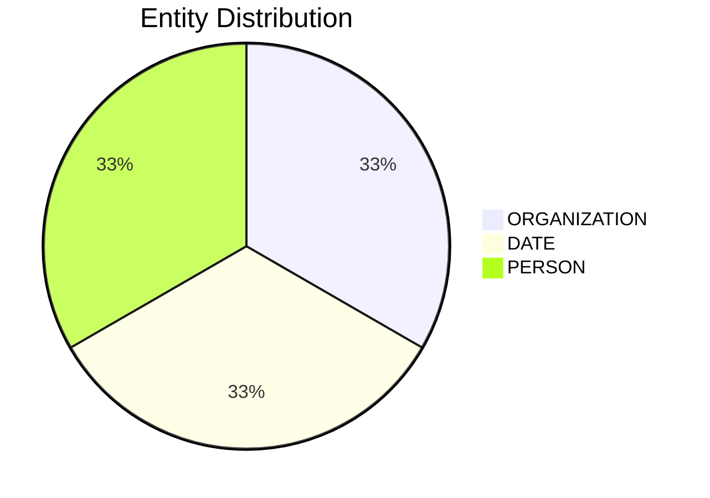

# Video Intelligence Report: 5 Things To Know: June 30, 2025

**URL**: https://www.youtube.com/watch?v=OMPgdeIhpsw
**Channel**: CNBC Television
**Duration**: 1:27
**Published**: 2025-06-30
**Processed**: 2025-07-20 10:09:23

**Processing Cost**: 🟢 $0.0050

## Executive Summary

The transcript provides an overview of several key business and economic headlines. First, China's manufacturing sector experienced its third consecutive month of contraction in June, a development that occurred despite the government's ongoing stimulus efforts designed to stabilize its industrial sector. This suggests persistent economic challenges in the region.

Secondly, President Trump has hinted at a major upcoming announcement concerning the ownership of the short-form video app TikTok. He informed Fox News that a group of wealthy individuals is prepared to acquire the app, and he expects to disclose their identities within approximately two weeks. However, Trump also noted that any such deal would likely require the approval of the Chinese government, highlighting the complex geopolitical dimension of the potential transaction.

Finally, the update covers three distinct corporate and philanthropic news items. The Department of Justice has settled its lawsuit challenging Hewlett-Packard Enterprise's $14 billion all-cash acquisition of Juniper Networks. Separately, Tesla announced a milestone, completing its first driverless delivery of a new car, with a video on its X account showing a Model Y being driven autonomously to a customer in Austin, Texas. Lastly, Warren Buffett has made a significant charitable contribution, donating $6 billion worth of his company's stock to five foundations, with the largest share going to the Bill and Melinda Gates Foundation Trust, which will receive over 9 million shares. This latest donation brings Buffett's total charitable giving since 2006 to over $60 billion.

## 📊 Quick Stats Dashboard

<b>Click to toggle stats</b>

| Metric | Count | Visualization |
|--------|-------|---------------|
| Transcript Length | 1,367 chars |  |
| Word Count | 221 words |  |
| Entities Extracted | 3  |  |
| Relationships Found | 0  |  |
| Key Points | 17  | 📌📌📌📌📌 |
| Topics | 8  | 🏷️🏷️🏷️🏷️🏷️🏷️🏷️🏷️ |
| Graph Nodes | 3  |  |
| Graph Edges | 0  |  |

## 🏷️ Main Topics

<b>View all topics</b>

1. Global Economy
2. China's Economy
3. US Politics
4. Technology Acquisitions
5. Corporate Law
6. Automotive Innovation
7. Philanthropy
8. Business News

## 🔍 Entity Analysis

### Entity Type Distribution

<b>📆 DATE (1 found)</b>

| Name | Confidence | Source |
|------|------------|--------|
| A Third Consecutive Month | 🟨 0.79 | None |

<b>🏢 ORGANIZATION (1 found)</b>

| Name | Confidence | Source |
|------|------------|--------|
| Juniper Networks | 🟩 0.95 | None |

<b>👤 PERSON (1 found)</b>

| Name | Confidence | Source |
|------|------------|--------|
| Trump | 🟨 0.71 | None |

## 💡 Key Insights

<b>Top 10 key points</b>

1. 🔴 An official survey indicates China's manufacturing activity contracted for a third consecutive month in June.
2. 🔴 President Trump teased a potentially significant development in the TikTok (referred to as Tic-Tac) ownership saga.
3. 🔴 Court filings show that the Department of Justice has settled its lawsuit challenging Hewlett-Packard Enterprise's acquisition of Juniper Networks.
4. 🔴 Tesla announced it has completed its first driverless delivery of a new car.
5. 🔴 Warren Buffett made a massive charitable contribution.
6. 🔴 Since 2006, Warren Buffett's total charitable contributions have exceeded $60 billion.
7. 🔴 The contraction occurred despite China's stimulus efforts aimed at stabilizing the industrial sector.
8. 🔴 Trump told Fox News that he has a group of 'very wealthy people' ready to buy the short-form video app.
9. 🔴 Trump also added that the deal would likely require China's approval.
10. 🔴 The acquisition of Juniper Networks by Hewlett-Packard Enterprise was an all-cash deal valued at $14 billion.

## 📁 Generated Files

<b>Click to see all files</b>

| File | Format | Size | Description |
|------|--------|------|-------------|
| `transcript.txt` | TXT | 1.3 KB | Plain text transcript |
| `transcript.json` | JSON | 20.1 KB | Full structured data |
| `entities.csv` | CSV | 151 B | All entities in spreadsheet format |
| `knowledge_graph.json` | JSON | 415 B | Complete graph structure |
| `knowledge_graph.gexf` | GEXF | 1.7 KB | Import into Gephi for visualization |
| `metadata.json` | JSON | 648 B | Video metadata and statistics |
| `manifest.json` | JSON | 8.0 KB | File index with checksums |
| `report.md` | Markdown | 0 B | This report |
| `chimera_format.json` | JSON | 10.6 KB | Chimera-compatible format |

---
*Generated by ClipScribe v2.6.0 on 2025-07-20 at 10:09:23*

💡 **Tip**: This markdown file supports Mermaid diagrams. View it in a compatible editor for interactive diagrams.
