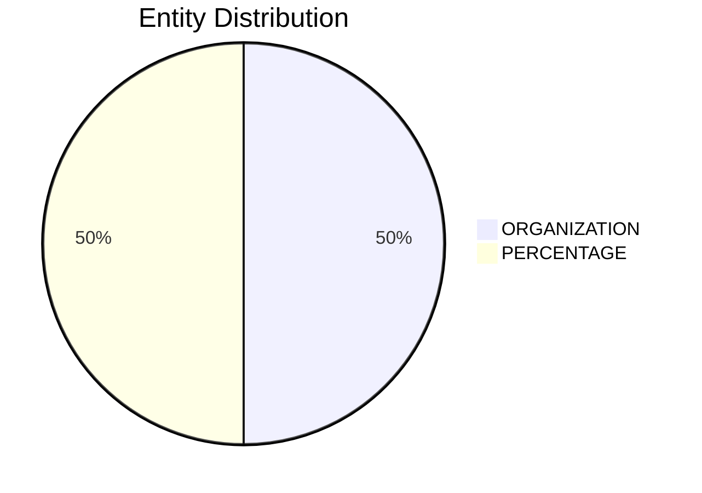

# Video Intelligence Report: 5 Things To Know: July 18, 2025

**URL**: None
**Channel**: CNBC Television
**Duration**: 1:24
**Published**: 2025-07-18
**Processed**: 2025-07-18 22:29:04

**Processing Cost**: 🟢 $0.0048

## Executive Summary

The day's market opened with significant corporate and economic news. Chevron announced its success in mediation with Exxon concerning the highly contested Guyana oil assets, a resolution that clears the path for Chevron's planned acquisition of Hess. Following this news, Hess's stock saw a substantial premarket surge of 8.5%, while Chevron also experienced a positive uplift of 3.7%, indicating positive investor reception to the strategic development in the energy sector.

Further economic updates included Federal Reserve Chair Jay Powell's formal response to inquiries from the White House regarding the extensive renovations at the Central Bank's Washington D.C. headquarters. In a detailed letter to the Office of Management and Budget, Powell addressed concerns over project cost overruns. He also explicitly refuted allegations that the renovated facilities would incorporate luxury amenities, providing transparency on the expenditures.

In the tech sector, AI startup Perplexity's valuation remarkably jumped to $18 billion, a significant increase from its $14 billion valuation just two months prior. This rapid ascent occurred after its last funding round closed, attracting new investors willing to acquire equity at the higher valuation. Separately, Amazon announced layoffs within its cloud computing division. A company spokesperson clarified that these job cuts were primarily driven by efforts to streamline the workforce and refocus strategic priorities, rather than being a direct consequence of investments in artificial intelligence. Finally, the Commerce Department revealed its intent to impose anti-dumping duties exceeding 90% on graphite imported from China, a crucial material for electric vehicle batteries, after determining it was being sold in the U.S. below fair market value.

## 📊 Quick Stats Dashboard

<b>Click to toggle stats</b>

| Metric | Count | Visualization |
|--------|-------|---------------|
| Transcript Length | 1,501 chars |  |
| Word Count | 249 words |  |
| Entities Extracted | 2  |  |
| Relationships Found | 0  |  |
| Key Points | 31  | 📌📌📌📌📌📌📌📌📌📌 |
| Topics | 0  |  |
| Graph Nodes | 2  |  |
| Graph Edges | 0  |  |

## 🏷️ Main Topics

<b>View all topics</b>

## 🔍 Entity Analysis

### Entity Type Distribution

<b>🏢 ORGANIZATION (1 found)</b>

| Name | Confidence | Source |
|------|------------|--------|
| Federal Reserve | 🟩 0.95 | None |

<b>🏷️ PERCENTAGE (1 found)</b>

| Name | Confidence | Source |
|------|------------|--------|
| 8 And A Half% | 🟨 0.71 | None |

## 💡 Key Insights

<b>Top 10 key points</b>

1. 🔴 The broadcast highlights five key things to know ahead of the day's opening bell.
2. 🔴 Chevron has successfully concluded its mediation with Exxon regarding the Guyana oil assets.
3. 🔴 This decision by Chevron clears the path for its acquisition of Hess.
4. 🔴 Hess stock saw a significant premarket increase of 8.5%.
5. 🔴 Chevron's stock also rose by 3.7% in premarket trading.
6. 🔴 Federal Reserve Chair Jay Powell formally responded to questions from the White House.
7. 🔴 The questions concerned renovations to the Central Bank's DC headquarters.
8. 🔴 Powell provided details on project cost overruns in a letter to the Office of Management and Budget.
9. 🔴 He refuted accusations that the renovated buildings would feature luxury amenities.
10. 🔴 The Financial Times reported on the valuation of AI startup Perplexity.

## 📁 Generated Files

<b>Click to see all files</b>

| File | Format | Size | Description |
|------|--------|------|-------------|
| `transcript.txt` | TXT | 1.5 KB | Plain text transcript |
| `transcript.json` | JSON | 21.9 KB | Full structured data |
| `entities.csv` | CSV | 123 B | All entities in spreadsheet format |
| `knowledge_graph.json` | JSON | 325 B | Complete graph structure |
| `knowledge_graph.gexf` | GEXF | 1.4 KB | Import into Gephi for visualization |
| `metadata.json` | JSON | 598 B | Video metadata and statistics |
| `manifest.json` | JSON | 9.9 KB | File index with checksums |
| `report.md` | Markdown | 0 B | This report |
| `chimera_format.json` | JSON | 11.2 KB | Chimera-compatible format |

---
*Generated by ClipScribe v2.6.0 on 2025-07-18 at 22:29:04*

💡 **Tip**: This markdown file supports Mermaid diagrams. View it in a compatible editor for interactive diagrams.
