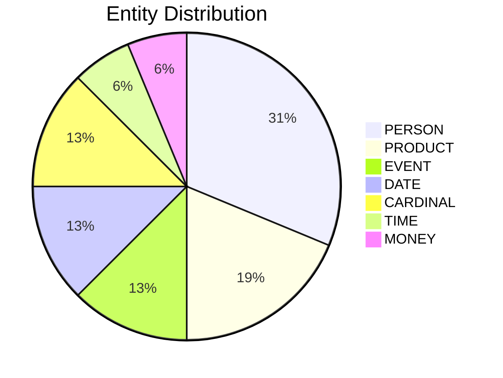

# Video Intelligence Report: 5 Things To Know: June 6, 2025

**URL**: https://www.youtube.com/watch?v=EMX1oO-RpnM
**Channel**: CNBC Television
**Duration**: 2:25
**Published**: 2025-06-06
**Processed**: 2025-07-20 13:23:47

**Processing Cost**: 🟢 $0.0083

## Executive Summary

Today's pre-opening market analysis highlights key economic data and corporate earnings. On Jobs Friday, forecasters anticipate a 125,000 increase in non-farm payrolls for May, with the unemployment rate expected to hold steady. This follows earlier weak indicators from ADP, jobless claims, and JOLTS data, setting a cautious tone for the labor market report.

Company-specific news reveals significant stock movements. Circle, a stablecoin company, saw its shares surge dramatically in pre-market trading, climbing to $94 after opening at $69, marking a 13% increase today. In contrast, Lulu Lemon's shares faced pressure despite revenue beating estimates, as its 1% comparable sales growth missed the 3% target. The company subsequently cut its full-year guidance, attributing the revision to a dynamic macro environment, and indicated plans for strategic price increases to offset tariff impacts.

DocuSign also experienced a sharp decline in its shares, as weaker-than-expected first-quarter billings and below-estimate current quarter guidance overshadowed stronger earnings and revenue. Conversely, Broadcom delivered positive news with earnings and revenue slightly exceeding analyst expectations and robust current quarter guidance driven by strong AI revenue growth. However, Broadcom's stock is pulling back after a substantial 70% rally since early April, a period that began after President Trump announced a sweeping tariff plan. Concerns were also voiced during Broadcom's recent earnings call regarding the sustainability of AI growth expectations.

## 📊 Quick Stats Dashboard

<b>Click to toggle stats</b>

| Metric | Count | Visualization |
|--------|-------|---------------|
| Transcript Length | 2,281 chars | █ |
| Word Count | 408 words |  |
| Entities Extracted | 16  | 🔵 |
| Relationships Found | 52  | 🔗🔗🔗🔗🔗 |
| Key Points | 17  | 📌📌📌📌📌 |
| Topics | 9  | 🏷️🏷️🏷️🏷️🏷️🏷️🏷️🏷️🏷️ |
| Graph Nodes | 88  | ⭕⭕⭕⭕⭕⭕⭕⭕ |
| Graph Edges | 52  | ➡️➡️➡️➡️➡️ |

## 🏷️ Main Topics

<b>View all topics</b>

1. Market Analysis
2. Economic Indicators
3. Corporate Earnings
4. Stock Performance
5. Trade Policy
6. Artificial Intelligence
7. Retail Sector
8. Software Sector
9. Semiconductor Industry

## 🕸️ Knowledge Graph Visualization

<b>Interactive relationship diagram (Mermaid)</b>

```mermaid
graph TD
    %% Top Entity Relationships
    Lulu_Lemon_revenue -->|"beat"| estimates
    DocuSign_earnings -->|"beat"| estimates
    DocuSign_revenue -->|"beat"| estimates
    Broadcom_current_quarter_guidance -->|"beat"| estimates
    Circle_shares -->|"traded"| sharply_higher
    CFO_(Lulu_Lemon) -->|"planning"| strategic_price_increases
    DocuSign_shares -->|"traded"| sharply_lower
    Broadcom_earnings -->|"were_higher_than"| analysts_expected
    Broadcom_revenue -->|"were_higher_than"| analysts_expected
    DocuSign_guidance_for_billings -->|"came_in"| below_estimates
    Broadcom_current_quarter_guidance -->|"attributed_to"| strong_AI_revenue_growth
    Lulu_Lemon_sales_growth -->|"missed_estimates_of"| 3%
    DocuSign_guidance_for_billings -->|"applies_to"| current_quarter
    Circle_stock -->|"opened_at"| 69
    Circle_stock -->|"rose_to"| 94
    Circle_stock -->|"increased_by"| 13%
    Lulu_Lemon_sales_growth -->|"was"| 1%
    Lulu_Lemon -->|"cut"| full_year_guidance
    DocuSign_billings -->|"were"| weaker_than_expected
    President_Trump -->|"announced"| sweeping_tariff_plan

    %% Styling
    class Lulu_Lemon personClass
    classDef personClass fill:#ff9999,stroke:#333,stroke-width:2px
    classDef organizationClass fill:#99ccff,stroke:#333,stroke-width:2px
    classDef locationClass fill:#99ff99,stroke:#333,stroke-width:2px
    classDef productClass fill:#ffcc99,stroke:#333,stroke-width:2px
```

*Note: This diagram shows the top 20 relationships. For the complete graph, use the GEXF file with Gephi.*

## 🔍 Entity Analysis

### Entity Type Distribution

<b>🏷️ CARDINAL (2 found)</b>

| Name | Confidence | Source |
|------|------------|--------|
| Number one | 🟩 0.95 | None |
| The First Quarter | 🟩 0.82 | None |

<b>📆 DATE (2 found)</b>

| Name | Confidence | Source |
|------|------------|--------|
| May | 🟩 0.95 | None |
| the April | 🟨 0.74 | None |

<b>📅 EVENT (2 found)</b>

| Name | Confidence | Source |
|------|------------|--------|
| Opening Bell | 🟩 0.95 | None |
| Pre-Market Trading | 🟩 0.95 | None |

<b>💰 MONEY (1 found)</b>

| Name | Confidence | Source |
|------|------------|--------|
| Revenue | 🟨 0.74 | None |

<b>👤 PERSON (5 found)</b>

| Name | Confidence | Source |
|------|------------|--------|
| Xi | 🟩 0.95 | None |
| Trump | 🟨 0.71 | None |
| Lulu Lemon | 🟨 0.71 | None |
| Jobless Claims | 🟨 0.71 | None |
| Forecaster | 🟨 0.71 | None |

<b>📦 PRODUCT (3 found)</b>

| Name | Confidence | Source |
|------|------------|--------|
| Estimates | 🟩 0.95 | None |
| Macro Environment | 🟩 0.95 | None |
| Unemployment Rate | 🟩 0.82 | None |

<b>🏷️ TIME (1 found)</b>

| Name | Confidence | Source |
|------|------------|--------|
| This Morning | 🟨 0.72 | None |

## 🔗 Relationship Network

<b>Relationship type distribution</b>

| Predicate | Count | Percentage |
|-----------|--------|------------|
| reports | 6 | ██ 11.5% |
| beat | 4 | █ 7.7% |
| were | 2 |  3.8% |
| traded | 2 |  3.8% |
| were_higher_than | 2 |  3.8% |
| expect_increase_of | 1 |  1.9% |
| expected_in | 1 |  1.9% |
| expected_to_hold | 1 |  1.9% |
| was_a_bit | 1 |  1.9% |
| is_a | 1 |  1.9% |
| rose_in | 1 |  1.9% |
| was_priced_at | 1 |  1.9% |
| opened_at | 1 |  1.9% |
| rose_to | 1 |  1.9% |
| increased_by | 1 |  1.9% |

<b>Key relationships (top 30)</b>

1. **Lulu Lemon revenue** *beat* **estimates** 🟩 (1.00)
2. **DocuSign earnings** *beat* **estimates** 🟩 (1.00)
3. **DocuSign revenue** *beat* **estimates** 🟩 (1.00)
4. **Broadcom current quarter guidance** *beat* **estimates** 🟩 (1.00)
5. **Circle shares** *traded* **sharply higher** 🟩 (1.00)
6. **CFO (Lulu Lemon)** *planning* **strategic price increases** 🟩 (0.98)
7. **DocuSign shares** *traded* **sharply lower** 🟩 (0.97)
8. **Broadcom earnings** *were_higher_than* **analysts expected** 🟩 (0.97)
9. **Broadcom revenue** *were_higher_than* **analysts expected** 🟩 (0.97)
10. **DocuSign guidance for billings** *came_in* **below estimates** 🟩 (0.95)
11. **Broadcom current quarter guidance** *attributed_to* **strong AI revenue growth** 🟩 (0.95)
12. **Lulu Lemon sales growth** *missed_estimates_of* **3%** 🟩 (0.94)
13. **DocuSign guidance for billings** *applies_to* **current quarter** 🟩 (0.92)
14. **Circle stock** *opened_at* **69** 🟩 (0.90)
15. **Circle stock** *rose_to* **94** 🟩 (0.90)
16. **Circle stock** *increased_by* **13%** 🟩 (0.90)
17. **Lulu Lemon sales growth** *was* **1%** 🟩 (0.90)
18. **Lulu Lemon** *cut* **full year guidance** 🟩 (0.90)
19. **DocuSign billings** *were* **weaker than expected** 🟩 (0.90)
20. **President Trump** *announced* **sweeping tariff plan** 🟩 (0.90)
21. **President** *officeholder* **Xi** 🟩 (0.89)
22. **Xi** *position held* **President** 🟩 (0.89)
23. **Broadcom stock** *is* **pulling back** 🟩 (0.88)
24. **strategic price increases** *aim_to_mitigate* **effects of tariffs** 🟩 (0.88)
25. **DocuSign billings weakness** *occurred_in* **first quarter** 🟩 (0.88)
26. **stock price** *reflects* **company performance** 🟩 (0.87)
27. **jobless claims** *were* **weak** 🟩 (0.86)
28. **DocuSign** *reports* **earnings** 🟩 (0.85)
29. **DocuSign** *reports* **revenue** 🟩 (0.85)
30. **Lulu Lemon** *cited_as_reason_for* **dynamic macro environment** 🟩 (0.85)

## 💡 Key Insights

<b>Top 10 key points</b>

1. 🔴 Shares of stablecoin company Circle rose sharply in pre-market trading after a significant move yesterday.
2. 🔴 Forecasters expect an increase of 125,000 non-farm payrolls in May.
3. 🔴 Circle's stock opened at $69, rose to $94, and was up another 13% today.
4. 🔴 Lulu Lemon's revenue beat estimates, but comparable sales growth of 1% missed estimates of 3%.
5. 🔴 Lulu Lemon cut its full-year guidance, citing a dynamic macro environment.
6. 🔴 DocuSign shares fell sharply.
7. 🔴 Broadcom's earnings and revenue were slightly higher than analysts expected.
8. 🔴 Broadcom's current quarter guidance also beat estimates due to strong AI revenue growth.
9. 🔴 Concerns were raised during the Broadcom earnings call yesterday that AI growth might not be as strong as anticipated.
10. 🔴 The unemployment rate is expected to hold steady.

## 📁 Generated Files

<b>Click to see all files</b>

| File | Format | Size | Description |
|------|--------|------|-------------|
| `transcript.txt` | TXT | 2.2 KB | Plain text transcript |
| `transcript.json` | JSON | 110.8 KB | Full structured data |
| `entities.csv` | CSV | 826 B | All entities in spreadsheet format |
| `relationships.csv` | CSV | 2.7 KB | All relationships in spreadsheet format |
| `knowledge_graph.json` | JSON | 15.3 KB | Complete graph structure |
| `knowledge_graph.gexf` | GEXF | 36.6 KB | Import into Gephi for visualization |
| `metadata.json` | JSON | 641 B | Video metadata and statistics |
| `report.md` | Markdown | 8.0 KB | This report |

---
*Generated by ClipScribe v2.6.0 on 2025-07-20 at 13:23:47*

💡 **Tip**: This markdown file supports Mermaid diagrams. View it in a compatible editor for interactive diagrams.
