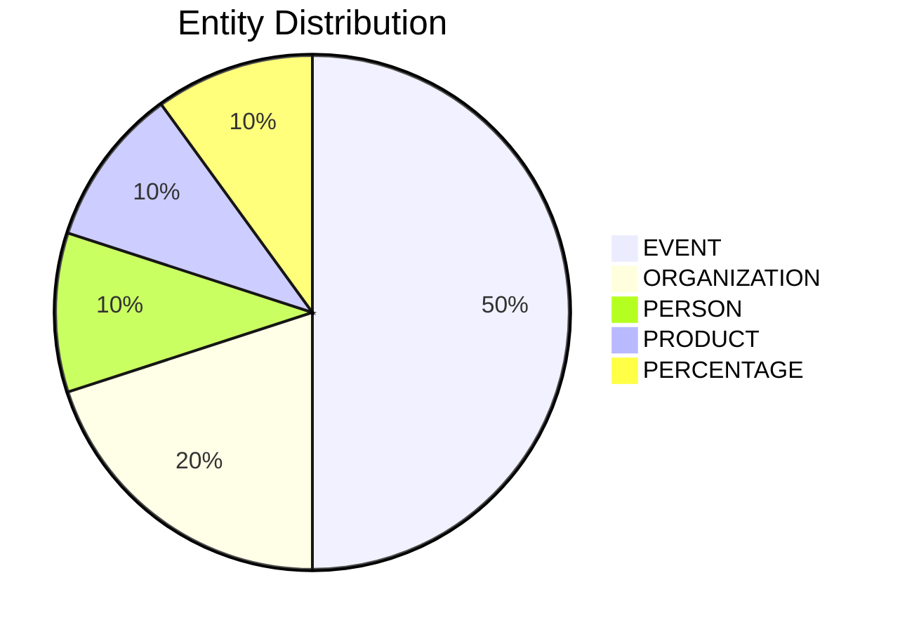

# Video Intelligence Report: 5 Things To Know: July 18, 2025

**URL**: https://www.youtube.com/watch?v=tRvZty3Ub4g
**Channel**: CNBC Television
**Duration**: 1:24
**Published**: 2025-07-18
**Processed**: 2025-07-20 17:09:14

**Processing Cost**: 🟢 $0.0048

## Executive Summary

The financial markets are anticipating the day's opening bell with significant pre-market movements. In the energy sector, Chevron has successfully concluded its mediation with Exxon concerning the contentious Guyana oil assets. This resolution is pivotal as it removes the last major hurdle for Chevron's planned acquisition of Hess, a development that has already seen Hess's stock surge by 8.5% and Chevron's by 3.7% in pre-market trading, signaling strong investor confidence in the deal. The news was first broken by Becky.

Meanwhile, Federal Reserve Chair Jay Powell has addressed inquiries from the White House regarding the substantial renovations at the Central Bank's Washington D.C. headquarters. In his detailed letter to the Office of Management and Budget, Powell acknowledged project cost overruns but emphatically refuted allegations that the renovated facilities would incorporate luxury amenities, providing transparency on the expenditures.

The rapidly evolving artificial intelligence sector continues to draw attention, with the Financial Times reporting a significant increase in the valuation of AI startup Perplexity. Just two months after a funding round valued the company at $14 billion, new investors have pushed its valuation to an impressive $18 billion by purchasing equity at a higher price. In the tech giant space, Amazon's cloud computing division is undergoing staff reductions. A spokesperson clarified these layoffs are primarily a result of ongoing workforce streamlining and strategic re-prioritization, rather than a direct consequence of AI investments.

Finally, international trade policy is seeing action as the Commerce Department announced plans to impose anti-dumping duties exceeding 90% on graphite imported from China. This crucial material is widely used in the production of electric vehicle batteries. The decision comes after the government's conclusion that the graphite is being sold in the U.S. market at a price below its fair market value, indicating a move to protect domestic industries from unfair competition.

## 📊 Quick Stats Dashboard

<b>Click to toggle stats</b>

| Metric | Count | Visualization |
|--------|-------|---------------|
| Transcript Length | 1,498 chars |  |
| Word Count | 248 words |  |
| Entities Extracted | 10  | 🔵 |
| Relationships Found | 57  | 🔗🔗🔗🔗🔗 |
| Key Points | 22  | 📌📌📌📌📌📌📌 |
| Topics | 13  | 🏷️🏷️🏷️🏷️🏷️🏷️🏷️🏷️🏷️🏷️🏷️🏷️🏷️ |
| Graph Nodes | 69  | ⭕⭕⭕⭕⭕⭕ |
| Graph Edges | 52  | ➡️➡️➡️➡️➡️ |

## 🏷️ Main Topics

<b>View all topics</b>

1. Corporate Mergers and Acquisitions
2. Energy Sector
3. Financial Markets
4. Monetary Policy
5. Government Oversight
6. Artificial Intelligence (AI)
7. Startup Valuation
8. Tech Industry Layoffs
9. Cloud Computing
10. International Trade Policy
11. Anti-Dumping Duties
12. Electric Vehicles (EV)
13. Raw Materials

## 🕸️ Knowledge Graph Visualization

<b>Interactive relationship diagram (Mermaid)</b>

```mermaid
graph TD
    %% Top Entity Relationships
    Chevron -->|"prevailed_in_mediation_with"| Exxon
    Mediation_decision -->|"clears_way_for"| Chevrons_acquisition_of_Hess
    Chevron -->|"will_acquire"| Hess
    Jay_Powell -->|"holds_title_of"| Federal_Reserve_chair
    Jay_Powell -->|"sent_letter_to"| Office_of_Management_and_Budget
    Financial_Times -->|"reported_on"| AI_startup_Perplexity
    Hess_stock -->|"increased_by"| 8_and_a_half%
    Chevron_stock -->|"increased_by"| 3.7%
    Chevron -->|"impacts_stock_of"| acquisition_of_Hess
    Hess -->|"impacts_stock_of"| acquisition_of_Hess
    Mediation -->|"concerned_in_mediation"| Guyana_oil_assets
    Jay_Powell -->|"responded_to_questions_from"| White_House
    renovations -->|"are_for"| Central_Banks_DC_headquarters
    Jay_Powell -->|"provided_details_on"| project_cost_overruns
    Exxon -->|"resolved_dispute_with"| Chevron
    Chevron -->|"target_of_acquisition_by"| Hess
    Federal_Reserve -->|"are_located_at"| DC_headquarters
    Central_Bank -->|"is_also_known_as"| Federal_Reserve
    Perplexity -->|"valuation_rose_to"| $18_billion
    White_House -->|"posed_questions_about"| renovations

    %% Styling
    class Hess personClass
    class Federal_Reserve organizationClass
    classDef personClass fill:#ff9999,stroke:#333,stroke-width:2px
    classDef organizationClass fill:#99ccff,stroke:#333,stroke-width:2px
    classDef locationClass fill:#99ff99,stroke:#333,stroke-width:2px
    classDef productClass fill:#ffcc99,stroke:#333,stroke-width:2px
```

*Note: This diagram shows the top 20 relationships. For the complete graph, use the GEXF file with Gephi.*

## 🔍 Entity Analysis

### Entity Type Distribution

<b>📅 EVENT (5 found)</b>

| Name | Confidence | Source |
|------|------------|--------|
| Acquisition | 🟩 0.95 | None |
| Mediation | 🟩 0.95 | None |
| Renovations | 🟩 0.95 | None |
| Funding Round | 🟩 0.95 | None |
| Project Cost Overruns | 🟨 0.71 | None |

<b>🏢 ORGANIZATION (2 found)</b>

| Name | Confidence | Source |
|------|------------|--------|
| Federal Reserve | 🟩 0.95 | None |
| Cloud Computing Division | 🟨 0.71 | None |

<b>🏷️ PERCENTAGE (1 found)</b>

| Name | Confidence | Source |
|------|------------|--------|
| 8 And A Half% | 🟨 0.71 | None |

<b>👤 PERSON (1 found)</b>

| Name | Confidence | Source |
|------|------------|--------|
| Hess | 🟨 0.71 | None |

<b>📦 PRODUCT (1 found)</b>

| Name | Confidence | Source |
|------|------------|--------|
| Valuation | 🟩 0.95 | None |

## 🔗 Relationship Network

<b>Relationship type distribution</b>

| Predicate | Count | Percentage |
|-----------|--------|------------|
| increased_by | 2 |  3.5% |
| at | 2 |  3.5% |
| are_result_of | 2 |  3.5% |
| impacts_stock_of | 2 |  3.5% |
| prevailed_in_mediation_with | 1 |  1.8% |
| concerned_in_mediation | 1 |  1.8% |
| clears_way_for | 1 |  1.8% |
| will_acquire | 1 |  1.8% |
| holds_title_of | 1 |  1.8% |
| responded_to_questions_from | 1 |  1.8% |
| posed_questions_about | 1 |  1.8% |
| are_for | 1 |  1.8% |
| sent_letter_to | 1 |  1.8% |
| provided_details_on | 1 |  1.8% |
| batted_down_accusations_of | 1 |  1.8% |

<b>Key relationships (top 30)</b>

1. **Chevron** *prevailed_in_mediation_with* **Exxon** 🟩 (1.00)
2. **Mediation decision** *clears_way_for* **Chevron's acquisition of Hess** 🟩 (1.00)
3. **Chevron** *will_acquire* **Hess** 🟩 (1.00)
4. **Jay Powell** *holds_title_of* **Federal Reserve chair** 🟩 (1.00)
5. **Jay Powell** *sent_letter_to* **Office of Management and Budget** 🟩 (1.00)
6. **Financial Times** *reported_on* **AI startup Perplexity** 🟩 (1.00)
7. **Hess stock** *increased_by* **8 and a half%** 🟩 (0.98)
8. **Chevron stock** *increased_by* **3.7%** 🟩 (0.98)
9. **Chevron** *impacts_stock_of* **acquisition of Hess** 🟩 (0.98)
10. **Hess** *impacts_stock_of* **acquisition of Hess** 🟩 (0.98)
11. **Mediation** *concerned_in_mediation* **Guyana oil assets** 🟩 (0.97)
12. **Jay Powell** *responded_to_questions_from* **White House** 🟩 (0.97)
13. **renovations** *are_for* **Central Bank's DC headquarters** 🟩 (0.97)
14. **Jay Powell** *provided_details_on* **project cost overruns** 🟩 (0.97)
15. **Exxon** *resolved_dispute_with* **Chevron** 🟩 (0.97)
16. **Chevron** *target_of_acquisition_by* **Hess** 🟩 (0.97)
17. **Federal Reserve** *are_located_at* **DC headquarters** 🟩 (0.96)
18. **Central Bank** *is_also_known_as* **Federal Reserve** 🟩 (0.96)
19. **Perplexity** *valuation_rose_to* **$18 billion** 🟩 (0.95)
20. **White House** *posed_questions_about* **renovations** 🟩 (0.95)
21. **Jay Powell** *batted_down_accusations_of* **luxury amenities** 🟩 (0.95)
22. **Guyana** *pertain_to* **oil assets** 🟩 (0.95)
23. **Jay Powell** *is_governed_by* **Federal Reserve** 🟩 (0.95)
24. **Chevron** *subsidiary* **Hess** 🟩 (0.95)
25. **Hess** *parent organization* **Chevron** 🟩 (0.95)
26. **White House** *are_subject_of_scrutiny_from* **renovations** 🟩 (0.93)
27. **renovations** *addressed_in_letter* **project cost overruns** 🟩 (0.93)
28. **opening bell** *is_related_to* **financial news** 🟩 (0.93)
29. **Perplexity** *raised_money_at* **$14 billion valuation** 🟩 (0.92)
30. **new investors** *approached* **Perplexity** 🟩 (0.92)

## 💡 Key Insights

<b>Top 10 key points</b>

1. 🔴 The mediation decision removes obstacles for Chevron's acquisition of Hess.
2. 🔴 Perplexity's valuation has surged to $18 billion.
3. 🔴 These duties will target a specific type of graphite imported from China.
4. 🔴 Chevron has successfully concluded its mediation with Exxon regarding the Guyana oil assets.
5. 🔴 Hess stock has risen by 8.5% in pre-market trading.
6. 🔴 Chevron's stock is up by 3.7% in pre-market trading.
7. 🔴 The Financial Times reported a significant increase in the valuation of AI startup Perplexity.
8. 🔴 This new valuation follows a previous funding round two months ago where Perplexity was valued at $14 billion.
9. 🔴 The Commerce Department plans to impose anti-dumping duties exceeding 90%.
10. 🔴 The U.S. government concluded that the imported graphite is being sold in the US at prices below fair market value.

## 📁 Generated Files

<b>Click to see all files</b>

| File | Format | Size | Description |
|------|--------|------|-------------|
| `transcript.txt` | TXT | 1.5 KB | Plain text transcript |
| `transcript.json` | JSON | 113.0 KB | Full structured data |
| `entities.csv` | CSV | 543 B | All entities in spreadsheet format |
| `relationships.csv` | CSV | 3.3 KB | All relationships in spreadsheet format |
| `knowledge_graph.json` | JSON | 11.1 KB | Complete graph structure |
| `knowledge_graph.gexf` | GEXF | 31.9 KB | Import into Gephi for visualization |
| `metadata.json` | JSON | 642 B | Video metadata and statistics |
| `report.md` | Markdown | 8.0 KB | This report |

---
*Generated by ClipScribe v2.6.0 on 2025-07-20 at 17:09:14*

💡 **Tip**: This markdown file supports Mermaid diagrams. View it in a compatible editor for interactive diagrams.
