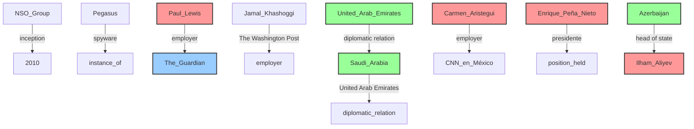
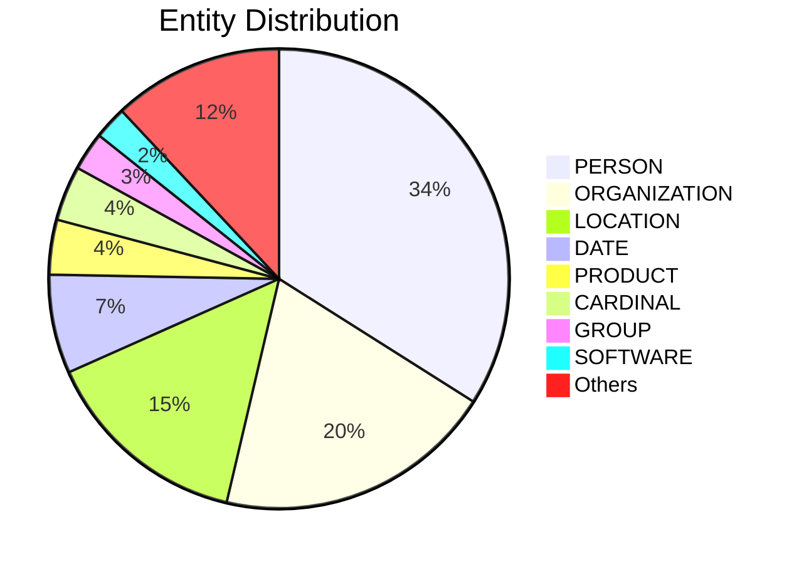

# Video Intelligence Report: Global Spyware Scandal: Exposing Pegasus Part One (full documentary) | FRONTLINE

**URL**: https://www.youtube.com/watch?v=6ZVj1_SE4Mo
**Channel**: FRONTLINE PBS | Official
**Duration**: 53:15
**Published**: 2023-01-03
**Processed**: 2025-06-30 00:42:05

**Processing Cost**: 🟡 $0.1826

## Executive Summary

The transcript details the pervasive use of Pegasus spyware, developed by the Israeli NSO Group, to clandestinely monitor journalists, human rights activists, and dissidents globally. Initially founded with the ambition to enhance global safety, NSO's powerful spyware is now characterized as a "military weapon used against civilians," raising significant international concern over its lack of regulation and potential for abuse by authoritarian regimes. A joint investigation, spearheaded by Forbidden Films and featuring collaborations with 17 news outlets including The Washington Post, The Guardian, and Le Monde, unveiled a list of 50,000 targeted phone numbers from 2016 to 2020, revealing the scale of this cyber surveillance.

The investigation highlighted Pegasus's advanced capabilities, which allow it to infect iPhones and Androids, turning them into comprehensive surveillance devices. Once installed, it can extract all data, including encrypted messages from Signal and WhatsApp, access geolocation, record audio, and remotely control the phone's microphone and camera. Despite NSO's claims that its software is sold only to governments for legitimate purposes like fighting terrorism and serious crime, and that it has strict mechanisms to prevent misuse (citing only three cases of misuse in a decade), the findings suggest widespread abuse.

Key to the investigation was the challenging task of identifying the individuals behind the phone numbers and conducting forensic analysis to prove Pegasus infection. Claudio Guarnieri, head of Amnesty International's Security Lab, developed the crucial methodology for phone analysis. The project, involving over 80 journalists who set aside professional rivalries to collaborate, uncovered alarming patterns, including potential targeting of individuals associated with Jamal Khashoggi, the Washington Post opinion writer murdered in 2018, whose critical voice against the Saudi regime made him a key target.

## 📊 Quick Stats Dashboard

<b>Click to toggle stats</b>

| Metric | Count | Visualization |
|--------|-------|---------------|
| Transcript Length | 29,274 chars | ██████████████ |
| Word Count | 5,229 words | ██████████ |
| Entities Extracted | 259  | 🔵🔵🔵🔵🔵🔵🔵🔵🔵🔵🔵🔵🔵🔵🔵🔵🔵🔵🔵🔵 |
| Relationships Found | 9  |  |
| Key Points | 43  | 📌📌📌📌📌📌📌📌📌📌📌📌📌📌 |
| Topics | 8  | 🏷️🏷️🏷️🏷️🏷️🏷️🏷️🏷️ |
| Graph Nodes | 245  | ⭕⭕⭕⭕⭕⭕⭕⭕⭕⭕⭕⭕⭕⭕⭕⭕⭕⭕⭕⭕ |
| Graph Edges | 9  |  |

## 🏷️ Main Topics

<b>View all topics</b>

1. Pegasus Spyware
2. NSO Group
3. Cyber Surveillance
4. Human Rights
5. Journalism
6. International Relations
7. Digital Security
8. Investigative Journalism

## 🕸️ Knowledge Graph Visualization

<b>Interactive relationship diagram (Mermaid)</b>

*Note: This diagram shows the top 20 relationships. For the complete graph, use the GEXF file with Gephi.*

## 🔍 Entity Analysis

### Entity Type Distribution

<b>🏷️ BOOK (1 found)</b>

| Name | Confidence | Source |
|------|------------|--------|
| 1984 | 🟩 0.86 | SpaCy |

<b>🏷️ CARDINAL (10 found)</b>

| Name | Confidence | Source |
|------|------------|--------|
| 10 | 🟩 0.85 | SpaCy |
| 17 | 🟩 0.85 | SpaCy |
| 40 | 🟩 0.85 | SpaCy |
| About 50,000 | 🟩 0.85 | SpaCy |
| More Than 15,000 | 🟩 0.85 | SpaCy |
| More Than 80 | 🟩 0.85 | SpaCy |
| One | 🟩 0.85 | SpaCy |
| Tens Of Thousands | 🟩 0.85 | SpaCy |
| Three | 🟩 0.85 | SpaCy |
| Two | 🟩 0.85 | SpaCy |

<b>🏷️ CHANNEL (1 found)</b>

| Name | Confidence | Source |
|------|------------|--------|
| Amazon Prime Video | 🟨 0.71 | SpaCy |

<b>🏷️ CHARACTER (3 found)</b>

| Name | Confidence | Source |
|------|------------|--------|
| Hanan Atar | 🟩 0.95 | SpaCy |
| Jamal Khashoggi | 🟩 0.89 | SpaCy |
| Maggie | 🟩 0.87 | SpaCy |

<b>🏷️ COMPANY (3 found)</b>

| Name | Confidence | Source |
|------|------------|--------|
| Company | 🟩 0.92 | SpaCy |
| Apple Music | 🟩 0.86 | SpaCy |
| Pegasus | 🟨 0.71 | SpaCy |

<b>📆 DATE (18 found)</b>

| Name | Confidence | Source |
|------|------------|--------|
| July 2021 | 🟩 0.88 | SpaCy |
| 2010 | 🟩 0.85 | SpaCy |
| 1984 | 🟩 0.85 | SpaCy |
| A Big Year | 🟩 0.85 | SpaCy |
| A Couple Of Weeks Ago | 🟩 0.85 | SpaCy |
| About A Year | 🟩 0.85 | SpaCy |
| Four Days | 🟩 0.85 | SpaCy |
| Months | 🟩 0.85 | SpaCy |
| The 12Th | 🟩 0.85 | SpaCy |
| The Last 10 Years | 🟩 0.85 | SpaCy |
| Today | 🟩 0.85 | SpaCy |
| 2015 | 🟩 0.81 | SpaCy |
| October of 2018 | 🟨 0.79 | SpaCy |
| About 2006, 2007 | 🟨 0.77 | SpaCy |
| June of 2019 | 🟨 0.77 | SpaCy |

*... and 3 more date entities*

<b>📅 EVENT (5 found)</b>

| Name | Confidence | Source |
|------|------------|--------|
| Global Spyware Scandal | 🟩 0.95 | SpaCy |
| Investigation | 🟩 0.95 | SpaCy |
| COVID crisis | 🟨 0.80 | SpaCy |
| March | 🟨 0.76 | SpaCy |
| Islamic ceremony | 🟨 0.70 | SpaCy |

<b>🏷️ FACILITY (2 found)</b>

| Name | Confidence | Source |
|------|------------|--------|
| Del Lado Derecho | 🟩 0.85 | SpaCy |
| Tenía Cada Una De Las Aplicaciones De Las Que | 🟩 0.85 | SpaCy |

<b>🏷️ GROUP (7 found)</b>

| Name | Confidence | Source |
|------|------------|--------|
| Aliyev | 🟩 0.85 | SpaCy |
| Islamic | 🟩 0.85 | SpaCy |
| Jamal | 🟩 0.85 | SpaCy |
| Mexican | 🟩 0.85 | SpaCy |
| Moroccan | 🟩 0.85 | SpaCy |
| Saudis | 🟩 0.85 | SpaCy |
| Turkish | 🟩 0.85 | SpaCy |

<b>📍 LOCATION (38 found)</b>

| Name | Confidence | Source |
|------|------------|--------|
| World | 🟩 0.95 | SpaCy |
| Azerbaijan | 🟩 0.93 | SpaCy |
| Turkey | 🟩 0.92 | SpaCy |
| Israel | 🟩 0.92 | SpaCy |
| Istanbul | 🟩 0.92 | SpaCy |
| Hungary | 🟩 0.91 | SpaCy |
| Kazakhstan | 🟩 0.91 | SpaCy |
| India | 🟩 0.90 | SpaCy |
| Mexico | 🟩 0.89 | SpaCy |
| Paris | 🟩 0.88 | SpaCy |
| Casa Blanca | 🟩 0.88 | SpaCy |
| Washington | 🟩 0.88 | SpaCy |
| Brighton | 🟩 0.88 | SpaCy |
| Baku | 🟩 0.88 | SpaCy |
| UAE airport | 🟩 0.87 | SpaCy |

*... and 23 more location entities*

<b>💰 MONEY (2 found)</b>

| Name | Confidence | Source |
|------|------------|--------|
| $1 Billion | 🟩 0.87 | SpaCy |
| Money | 🟩 0.86 | SpaCy |

<b>🏷️ OPERATION (1 found)</b>

| Name | Confidence | Source |
|------|------------|--------|
| Surveillance | 🟩 0.95 | SpaCy |

<b>🏷️ ORDINAL (3 found)</b>

| Name | Confidence | Source |
|------|------------|--------|
| 6Th | 🟩 0.85 | SpaCy |
| 9Th | 🟩 0.85 | SpaCy |
| First | 🟩 0.85 | SpaCy |

<b>🏢 ORGANIZATION (51 found)</b>

| Name | Confidence | Source |
|------|------------|--------|
| Aristegui Noticias | 🟩 0.95 | SpaCy |
| Frontline | 🟩 0.95 | SpaCy |
| The Guardian | 🟩 0.92 | SpaCy |
| The Washington Post | 🟩 0.92 | SpaCy |
| Proceso | 🟩 0.91 | SpaCy |
| Amnesty International's | 🟩 0.90 | SpaCy |
| Cnn | 🟩 0.90 | SpaCy |
| Forbidden team | 🟩 0.90 | SpaCy |
| Le Monde | 🟩 0.90 | SpaCy |
| Emirates Airlines | 🟩 0.88 | SpaCy |
| Lemon | 🟩 0.87 | SpaCy |
| The NSO Group | 🟩 0.87 | SpaCy |
| Amazon Prime Video | 🟩 0.85 | SpaCy |
| Android | 🟩 0.85 | SpaCy |
| Casa | 🟩 0.85 | SpaCy |

*... and 36 more organization entities*

<b>👤 PERSON (88 found)</b>

| Name | Confidence | Source |
|------|------------|--------|
| Alejandro Caballero | 🟩 0.99 | SpaCy |
| Alejandro Encinas | 🟩 0.98 | SpaCy |
| De Shouji | 🟩 0.98 | SpaCy |
| George Orwell | 🟩 0.95 | SpaCy |
| Journalists | 🟩 0.95 | SpaCy |
| Khadija Ismayilova | 🟩 0.95 | SpaCy |
| Hatice Khashoggi's | 🟩 0.95 | SpaCy |
| Karina Maciel | 🟩 0.95 | SpaCy |
| Enrique Peña Nieto | 🟩 0.94 | SpaCy |
| Jamal | 🟩 0.93 | SpaCy |
| Presidente | 🟩 0.93 | SpaCy |
| Ilham Aliyev | 🟩 0.92 | SpaCy |
| Huang Shi | 🟩 0.92 | SpaCy |
| Sandra Nogales | 🟩 0.91 | SpaCy |
| Zheng Dang Yao Ren | 🟩 0.91 | SpaCy |

*... and 73 more person entities*

<b>🏷️ PLATFORM (1 found)</b>

| Name | Confidence | Source |
|------|------------|--------|
| Platform | 🟨 0.79 | SpaCy |

<b>📦 PRODUCT (10 found)</b>

| Name | Confidence | Source |
|------|------------|--------|
| Device | 🟩 0.95 | SpaCy |
| Visa | 🟩 0.90 | SpaCy |
| Pegasus | 🟩 0.86 | SpaCy |
| Crown | 🟩 0.85 | SpaCy |
| Emilio | 🟩 0.85 | SpaCy |
| Pero | 🟩 0.85 | SpaCy |
| Androids | 🟩 0.80 | SpaCy |
| Phones | 🟨 0.77 | SpaCy |
| Technology | 🟨 0.74 | SpaCy |
| WhatsApp | 🟨 0.72 | SpaCy |

<b>🏷️ SOFTWARE (6 found)</b>

| Name | Confidence | Source |
|------|------------|--------|
| Spyware | 🟩 0.95 | SpaCy |
| Telegram | 🟩 0.91 | SpaCy |
| WhatsApp | 🟩 0.84 | SpaCy |
| Program | 🟨 0.75 | SpaCy |
| Software | 🟨 0.72 | SpaCy |
| Equipo Móvil | 🟨 0.70 | SpaCy |

<b>🏷️ TECHNOLOGY (3 found)</b>

| Name | Confidence | Source |
|------|------------|--------|
| Technology | 🟩 0.91 | SpaCy |
| System | 🟩 0.91 | SpaCy |
| Pegasus | 🟨 0.70 | SpaCy |

<b>🏷️ TIME (2 found)</b>

| Name | Confidence | Source |
|------|------------|--------|
| The minute | 🟩 0.85 | SpaCy |
| 17 Hours | 🟨 0.75 | SpaCy |

<b>🏷️ WEAPON (2 found)</b>

| Name | Confidence | Source |
|------|------------|--------|
| Military Weapon | 🟨 0.77 | SpaCy |
| Pegasus | 🟨 0.73 | SpaCy |

<b>🏷️ WORK_OF_ART (2 found)</b>

| Name | Confidence | Source |
|------|------------|--------|
| Global Spyware Scandal exposing Pegasus | 🟩 0.85 | SpaCy |
| Pues ¿ | 🟩 0.85 | SpaCy |

## 🔗 Relationship Network

<b>Relationship type distribution</b>

| Predicate | Count | Percentage |
|-----------|--------|------------|
| employer | 2 | ████ 22.2% |
| spyware | 1 | ██ 11.1% |
| inception | 1 | ██ 11.1% |
| The Washington Post | 1 | ██ 11.1% |
| diplomatic relation | 1 | ██ 11.1% |
| United Arab Emirates | 1 | ██ 11.1% |
| presidente | 1 | ██ 11.1% |
| head of state | 1 | ██ 11.1% |

<b>Key relationships (top 30)</b>

1. **Pegasus** *spyware* **instance of** 🟩 (0.85)
2. **NSO Group** *inception* **2010** 🟩 (0.85)
3. **Paul Lewis** *employer* **The Guardian** 🟩 (0.85)
4. **Jamal Khashoggi** *The Washington Post* **employer** 🟩 (0.85)
5. **United Arab Emirates** *diplomatic relation* **Saudi Arabia** 🟩 (0.85)
6. **Saudi Arabia** *United Arab Emirates* **diplomatic relation** 🟩 (0.85)
7. **Carmen Aristegui** *employer* **CNN en México** 🟩 (0.85)
8. **Enrique Peña Nieto** *presidente* **position held** 🟩 (0.85)
9. **Azerbaijan** *head of state* **Ilham Aliyev** 🟩 (0.85)

## 💡 Key Insights

<b>Top 10 key points</b>

1. 🔴 Pegasus spyware is used to monitor and track journalists, human rights activists, and dissidents globally.
2. 🔴 A two-part investigation was launched in collaboration with Forbidden Films.
3. 🔴 NSO was established with the ambition to make the world a safer place, developing powerful spyware.
4. 🔴 Pegasus is described as a military weapon used against civilians, raising serious concerns for democracies.
5. 🔴 There is no control over how countries use Pegasus, and it has been used in the worst imaginable ways.
6. 🔴 Frontline presents part one of the Global Spyware Scandal, exposing Pegasus.
7. 🔴 Phones are viewed as computers and extensions of our body, capable of being turned into surveillance devices beyond George Orwell's imagination.
8. 🔴 Pegasus technology is far ahead of government regulation and public understanding.
9. 🔴 It was suspected that NSO Group's powerful surveillance instrument would be abused by authoritarian regimes.
10. 🔴 A joint investigation by 17 news outlets including The Washington Post, The Guardian, and Le Monde, revealed targets.

## 📁 Generated Files

<b>Click to see all files</b>

| File | Format | Size | Description |
|------|--------|------|-------------|
| `transcript.txt` | TXT | 28.7 KB | Plain text transcript |
| `transcript.json` | JSON | 167.5 KB | Full structured data |
| `entities.csv` | CSV | 10.8 KB | All entities in spreadsheet format |
| `relationships.csv` | CSV | 471 B | All relationships in spreadsheet format |
| `knowledge_graph.json` | JSON | 24.4 KB | Complete graph structure |
| `knowledge_graph.gexf` | GEXF | 70.6 KB | Import into Gephi for visualization |
| `metadata.json` | JSON | 4.2 KB | Video metadata and statistics |
| `manifest.json` | JSON | 7.7 KB | File index with checksums |
| `report.md` | Markdown | 8.0 KB | This report |
| `chimera_format.json` | JSON | 92.1 KB | Chimera-compatible format |

---
*Generated by ClipScribe v2.6.0 on 2025-06-30 at 00:42:05*

💡 **Tip**: This markdown file supports Mermaid diagrams. View it in a compatible editor for interactive diagrams.
