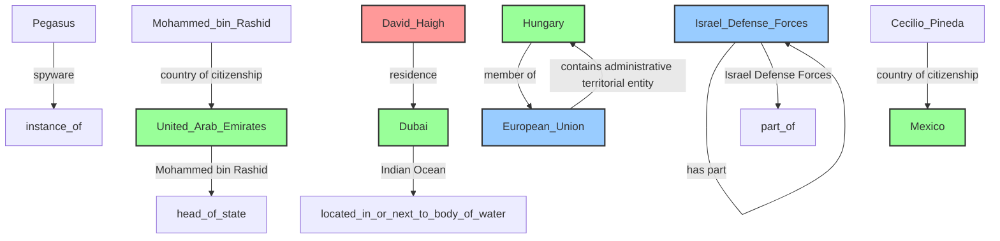
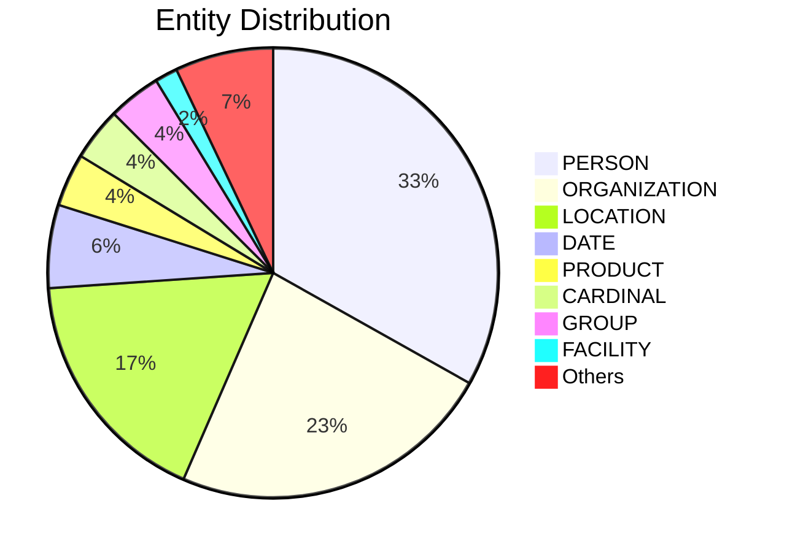

# Video Intelligence Report: Global Spyware Scandal: Exposing Pegasus Part Two (full documentary) | FRONTLINE

**URL**: https://www.youtube.com/watch?v=xYMWTXIkANM
**Channel**: FRONTLINE PBS | Official
**Duration**: 53:18
**Published**: 2023-01-10
**Processed**: 2025-06-30 00:42:07

**Processing Cost**: 🟡 $0.1827

## Executive Summary

The transcript details a comprehensive investigation, 'Global Spyware Scandal, exposing Pegasus,' a powerful spyware developed by NSO. Initially aiming to make the world safer, Pegasus has become a military weapon widely used against civilians, including activists, lawyers, journalists, and politicians, with no international control. The technology allows complete surveillance, accessing emails, encrypted communications, and user's visual data, effectively trapping the infected individual. This pervasive misuse led to a major joint investigation by 17 news outlets, including The Washington Post, The Guardian, Le Monde, and Forbidden Stories.

The investigation uncovered several high-profile targets. In France, former minister François de Rugy was confirmed to have been targeted by the Kingdom of Morocco, and analysis revealed that up to 14 ministers and ex-ministers were affected. The phone number of President Emmanuel Macron also appeared on the list, prompting an SMS inquiry that led to a high-level meeting at the Élysée. This meeting highlighted significant concerns regarding the judicial, diplomatic, and security implications, with state experts confirming infection attempts on phones of French officials, though the President's phone analysis was classified 'secret defense.'

Beyond France, the scandal implicated the UAE in the case of Princess Latifa, daughter of Sheikh Mohammed bin Rashid Al Maktoum of Dubai. Imprisoned by her father, Princess Latifa attempted a daring escape. Her phone number, and those of her associates, appeared on the Pegasus list around the time of her disappearance and during her journey. Indian special forces subsequently intercepted her yacht, and she was forcibly returned to Dubai, with Pegasus technology seemingly used as a key tool in her recapture. Human rights campaigner David Haigh, who was working to free Princess Latifa, also had his phone infected with Pegasus while on British soil, reinforcing concerns about the spyware's reach and lack of oversight.

The broader implications are severe: the technology allows autocratic leaders to track dissidents and suppress freedom, fostering a culture of fear among those targeted. The transcript emphasizes the critical need for accountability for NSO and the governments abusing Pegasus, warning that a failure to bring those responsible to justice will only encourage other companies to develop similar intrusive technologies, leading to a worsening global surveillance landscape. NSO's ability to compromise advanced systems like iPhones stems from its 'vulnerability researchers,' often recruited from specialized military units like Israel's Unit 8200, highlighting a pipeline from offensive cyber warfare to civilian high-tech.

## 📊 Quick Stats Dashboard

<b>Click to toggle stats</b>

| Metric | Count | Visualization |
|--------|-------|---------------|
| Transcript Length | 17,251 chars | ████████ |
| Word Count | 3,089 words | ██████ |
| Entities Extracted | 184  | 🔵🔵🔵🔵🔵🔵🔵🔵🔵🔵🔵🔵🔵🔵🔵🔵🔵🔵 |
| Relationships Found | 10  | 🔗 |
| Key Points | 39  | 📌📌📌📌📌📌📌📌📌📌📌📌📌 |
| Topics | 10  | 🏷️🏷️🏷️🏷️🏷️🏷️🏷️🏷️🏷️🏷️ |
| Graph Nodes | 179  | ⭕⭕⭕⭕⭕⭕⭕⭕⭕⭕⭕⭕⭕⭕⭕⭕⭕ |
| Graph Edges | 10  | ➡️ |

## 🏷️ Main Topics

<b>View all topics</b>

1. Cyber Espionage
2. Human Rights Violations
3. Government Surveillance
4. Pegasus Spyware
5. NSO Group
6. Journalism Investigations
7. National Security
8. Political Targeting
9. Digital Privacy
10. Israeli Technology

## 🕸️ Knowledge Graph Visualization

<b>Interactive relationship diagram (Mermaid)</b>

*Note: This diagram shows the top 20 relationships. For the complete graph, use the GEXF file with Gephi.*

## 🔍 Entity Analysis

### Entity Type Distribution

<b>🏷️ CARDINAL (7 found)</b>

| Name | Confidence | Source |
|------|------------|--------|
| 14 | 🟩 0.85 | SpaCy |
| 17 | 🟩 0.85 | SpaCy |
| 8200 | 🟩 0.85 | SpaCy |
| Five | 🟩 0.85 | SpaCy |
| More than 15,000 | 🟩 0.85 | SpaCy |
| One | 🟩 0.85 | SpaCy |
| Two | 🟩 0.85 | SpaCy |

<b>📆 DATE (11 found)</b>

| Name | Confidence | Source |
|------|------------|--------|
| July 2017 | 🟩 0.87 | SpaCy |
| 3rd of August 2020 | 🟩 0.85 | SpaCy |
| 18-Year-Old | 🟩 0.85 | SpaCy |
| Eight days | 🟩 0.85 | SpaCy |
| Every Day | 🟩 0.85 | SpaCy |
| Just Three Weeks | 🟩 0.85 | SpaCy |
| Several Years Ago | 🟩 0.85 | SpaCy |
| That week | 🟩 0.85 | SpaCy |
| The Days | 🟩 0.85 | SpaCy |
| The Next Day | 🟩 0.85 | SpaCy |
| February 2018 | 🟩 0.82 | SpaCy |

<b>📅 EVENT (2 found)</b>

| Name | Confidence | Source |
|------|------------|--------|
| Global Spyware Scandal | 🟩 0.95 | SpaCy |
| State Visit | 🟩 0.85 | SpaCy |

<b>🏷️ FACILITY (3 found)</b>

| Name | Confidence | Source |
|------|------------|--------|
| Del Del Narcotráfico | 🟩 0.85 | SpaCy |
| Global Spyware Scandal | 🟩 0.85 | SpaCy |
| La Lista | 🟩 0.85 | SpaCy |

<b>🏷️ GROUP (7 found)</b>

| Name | Confidence | Source |
|------|------------|--------|
| British | 🟩 0.85 | SpaCy |
| Dans | 🟩 0.85 | SpaCy |
| Indian | 🟩 0.85 | SpaCy |
| Israeli | 🟩 0.85 | SpaCy |
| Moroccan | 🟩 0.85 | SpaCy |
| N'Y | 🟩 0.85 | SpaCy |
| Palestinians | 🟩 0.85 | SpaCy |

<b>🏷️ LAW (1 found)</b>

| Name | Confidence | Source |
|------|------------|--------|
| the Dubai Princess | 🟩 0.85 | SpaCy |

<b>📍 LOCATION (32 found)</b>

| Name | Confidence | Source |
|------|------------|--------|
| Dubai | 🟩 0.95 | SpaCy |
| Hungary | 🟩 0.95 | SpaCy |
| Uae | 🟩 0.95 | SpaCy |
| Country | 🟩 0.95 | SpaCy |
| Bahrain | 🟩 0.91 | SpaCy |
| Región | 🟩 0.91 | SpaCy |
| Jumeirah | 🟩 0.90 | SpaCy |
| Burj Al Arab | 🟩 0.90 | SpaCy |
| Guerrero | 🟩 0.90 | SpaCy |
| London | 🟩 0.89 | SpaCy |
| the State of Israel | 🟩 0.88 | SpaCy |
| United Arab Emirates | 🟩 0.87 | SpaCy |
| Villa 96 | 🟩 0.87 | SpaCy |
| Saudi Arabia | 🟩 0.87 | SpaCy |
| Morocco | 🟩 0.85 | SpaCy |

*... and 17 more location entities*

<b>🏷️ MILITARY_UNIT (1 found)</b>

| Name | Confidence | Source |
|------|------------|--------|
| 8200 | 🟩 0.86 | SpaCy |

<b>💰 MONEY (1 found)</b>

| Name | Confidence | Source |
|------|------------|--------|
| Money | 🟩 0.90 | SpaCy |

<b>🏷️ ORDINAL (1 found)</b>

| Name | Confidence | Source |
|------|------------|--------|
| First | 🟩 0.85 | SpaCy |

<b>🏢 ORGANIZATION (43 found)</b>

| Name | Confidence | Source |
|------|------------|--------|
| Forbidden Films | 🟩 0.95 | SpaCy |
| Frontline | 🟩 0.95 | SpaCy |
| Le Monde | 🟩 0.93 | SpaCy |
| Israeli intelligence | 🟩 0.93 | SpaCy |
| The Washington Post | 🟩 0.90 | SpaCy |
| Detained International | 🟩 0.90 | SpaCy |
| The Guardian | 🟩 0.89 | SpaCy |
| El Crimen Organizado | 🟩 0.87 | SpaCy |
| Forbidden Stories | 🟩 0.86 | SpaCy |
| Bien Été Ciblé Par Le Client | 🟩 0.85 | SpaCy |
| C'Est De Lui Écrire | 🟩 0.85 | SpaCy |
| De acuerdo | 🟩 0.85 | SpaCy |
| El Gobierno | 🟩 0.85 | SpaCy |
| el grupo del Tequilero | 🟩 0.85 | SpaCy |
| El Que Fue Asesinado | 🟩 0.85 | SpaCy |

*... and 28 more organization entities*

<b>👤 PERSON (61 found)</b>

| Name | Confidence | Source |
|------|------------|--------|
| François de Rugy | 🟩 0.99 | SpaCy |
| Emmanuel Macron qui | 🟩 0.95 | SpaCy |
| People | 🟩 0.95 | SpaCy |
| Princess Latifa | 🟩 0.92 | SpaCy |
| David Haigh | 🟩 0.92 | SpaCy |
| remito al caso de Cecilio Pineda | 🟩 0.92 | SpaCy |
| Viktor Orbán | 🟩 0.92 | SpaCy |
| Bibi Netanyahu's | 🟩 0.91 | SpaCy |
| Sheikh Mohammed bin Rashid Al Maktoum | 🟩 0.88 | SpaCy |
| Cecilio | 🟩 0.86 | SpaCy |
| Ancien Ministre | 🟩 0.85 | SpaCy |
| Actif Aujourd'Hui Et | 🟩 0.85 | SpaCy |
| Afirmar Categóricamente Que | 🟩 0.85 | SpaCy |
| Aussi Bien | 🟩 0.85 | SpaCy |
| Bah | 🟩 0.85 | SpaCy |

*... and 46 more person entities*

<b>📦 PRODUCT (7 found)</b>

| Name | Confidence | Source |
|------|------------|--------|
| Pegasus | 🟩 0.87 | SpaCy |
| Pero | 🟩 0.85 | SpaCy |
| Qu'Il Va | 🟩 0.85 | SpaCy |
| iPhone | 🟩 0.82 | SpaCy |
| Yacht | 🟩 0.82 | SpaCy |
| Numéro De Téléphone | 🟨 0.79 | SpaCy |
| Jet Skis | 🟨 0.73 | SpaCy |

<b>🏷️ PROTOCOL (1 found)</b>

| Name | Confidence | Source |
|------|------------|--------|
| Sms | 🟨 0.72 | SpaCy |

<b>🏷️ TECHNOLOGY (3 found)</b>

| Name | Confidence | Source |
|------|------------|--------|
| Technology | 🟩 0.95 | SpaCy |
| Phone | 🟨 0.78 | SpaCy |
| Pegasus | 🟨 0.77 | SpaCy |

<b>🏷️ TIME (2 found)</b>

| Name | Confidence | Source |
|------|------------|--------|
| The several hours | 🟩 0.85 | SpaCy |
| 3:00 A.M. | 🟨 0.75 | SpaCy |

<b>🏷️ WEAPON (1 found)</b>

| Name | Confidence | Source |
|------|------------|--------|
| Pegasus | 🟩 0.89 | SpaCy |

## 🔗 Relationship Network

<b>Relationship type distribution</b>

| Predicate | Count | Percentage |
|-----------|--------|------------|
| country of citizenship | 2 | ████ 20.0% |
| spyware | 1 | ██ 10.0% |
| Mohammed bin Rashid | 1 | ██ 10.0% |
| residence | 1 | ██ 10.0% |
| Indian Ocean | 1 | ██ 10.0% |
| has part | 1 | ██ 10.0% |
| Israel Defense Forces | 1 | ██ 10.0% |
| member of | 1 | ██ 10.0% |
| contains administrative territorial entity | 1 | ██ 10.0% |

<b>Key relationships (top 30)</b>

1. **Pegasus** *spyware* **instance of** 🟩 (0.85)
2. **United Arab Emirates** *Mohammed bin Rashid* **head of state** 🟩 (0.85)
3. **Mohammed bin Rashid** *country of citizenship* **United Arab Emirates** 🟩 (0.85)
4. **David Haigh** *residence* **Dubai** 🟩 (0.85)
5. **Dubai** *Indian Ocean* **located in or next to body of water** 🟩 (0.85)
6. **Israel Defense Forces** *has part* **Israel Defense Forces** 🟩 (0.85)
7. **Israel Defense Forces** *Israel Defense Forces* **part of** 🟩 (0.85)
8. **Hungary** *member of* **European Union** 🟩 (0.85)
9. **European Union** *contains administrative territorial entity* **Hungary** 🟩 (0.85)
10. **Cecilio Pineda** *country of citizenship* **Mexico** 🟩 (0.85)

## 💡 Key Insights

<b>Top 10 key points</b>

1. 🔴 A joint investigation by 17 news outlets, including The Washington Post, The Guardian, and Le Monde, along with Forbidden Stories, revealed widespread targeting.
2. 🔴 Emmanuel Macron's phone number was found on the list, and an SMS was sent to confirm its activity.
3. 🔴 State experts confirmed attempts or actual infections on phones of several French ministers and high-ranking officials.
4. 🔴 The analysis results of the French President's phone were classified as 'secret defense' and made inaccessible.
5. 🔴 Princess Latifa, daughter of Sheikh Mohammed bin Rashid Al Maktoum of Dubai, was unhappy and incarcerated by her father's regime.
6. 🔴 Princess Latifa attempted an escape involving jet skis, a yacht, and a trip to the Indian Ocean.
7. 🔴 Princess Latifa's phone number was entered into the Pegasus list the day after she went missing from Dubai.
8. 🔴 Eight days after her escape, Indian special forces boarded the yacht, and Princess Latifa was forcibly returned to Dubai.
9. 🔴 NSO's technology appears to have been one of the tools used by the state in a 'desperate attempt' to find and kidnap Princess Latifa.
10. 🔴 David Haigh was infected with Pegasus on August 3, 2020, even while on British soil.

## 📁 Generated Files

<b>Click to see all files</b>

| File | Format | Size | Description |
|------|--------|------|-------------|
| `transcript.txt` | TXT | 17.0 KB | Plain text transcript |
| `transcript.json` | JSON | 126.7 KB | Full structured data |
| `entities.csv` | CSV | 7.7 KB | All entities in spreadsheet format |
| `relationships.csv` | CSV | 594 B | All relationships in spreadsheet format |
| `knowledge_graph.json` | JSON | 18.5 KB | Complete graph structure |
| `knowledge_graph.gexf` | GEXF | 52.8 KB | Import into Gephi for visualization |
| `metadata.json` | JSON | 4.1 KB | Video metadata and statistics |
| `manifest.json` | JSON | 11.3 KB | File index with checksums |
| `report.md` | Markdown | 8.0 KB | This report |
| `chimera_format.json` | JSON | 65.9 KB | Chimera-compatible format |

---
*Generated by ClipScribe v2.6.0 on 2025-06-30 at 00:42:07*

💡 **Tip**: This markdown file supports Mermaid diagrams. View it in a compatible editor for interactive diagrams.
