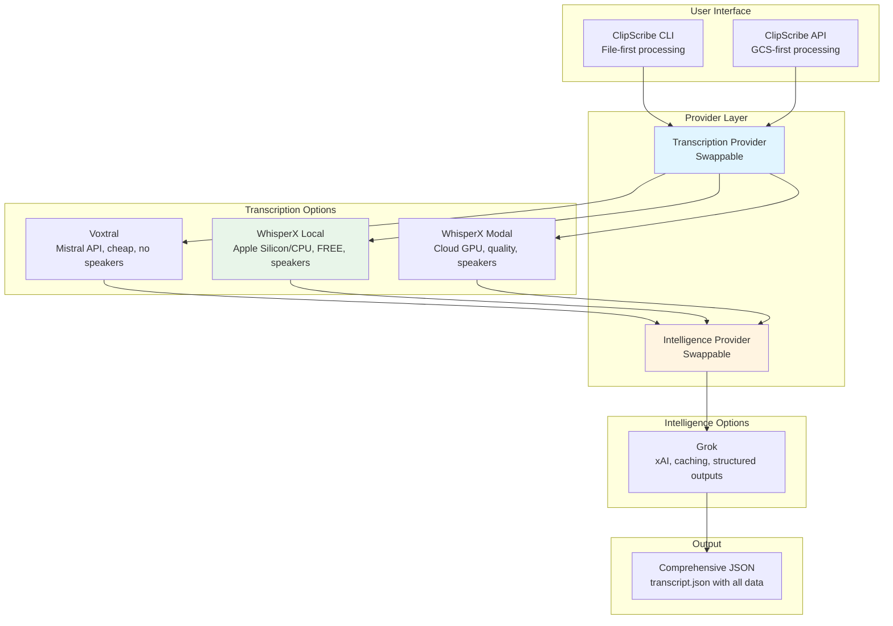
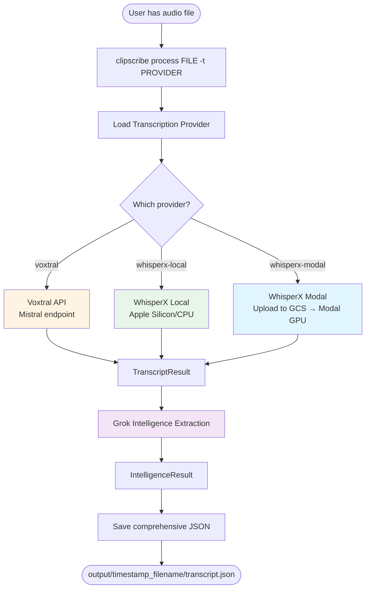
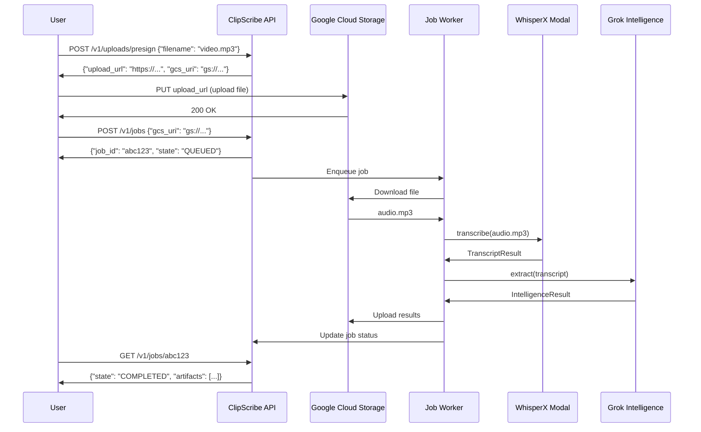

# ClipScribe v3.1.10 Architecture

**Last Updated:** November 2025  
**Version:** v3.1.10  
**Status:** Provider-based architecture, file-first processing, GEOINT engine (Beta)

Professional intelligence extraction from audio/video files with provider flexibility.

---

## Table of Contents

- [Executive Summary](#executive-summary)
- [System Overview](#system-overview)
- [Provider Architecture](#provider-architecture)
- [Processing Flows](#processing-flows)
- [Cost Model](#cost-model)
- [Data Structures](#data-structures)
- [Extensibility](#extensibility)

---

## Executive Summary

**For Stakeholders & Decision Makers**

ClipScribe v3.1.10 is a provider-based intelligence extraction platform for audio/video files. Built on swappable provider architecture, users can choose optimal transcription and intelligence providers for their use case. Includes optional GEOINT engine for geolocation intelligence from drone footage.

**Key Capabilities:**
- **Flexibility:** 3 transcription providers, 1 intelligence provider (extensible)
- **Cost Range:** FREE to $0.06 per 30min video
- **Quality:** Speaker diarization, entity extraction, relationship mapping
- **Scale:** Local (Apple Silicon) to Cloud (Modal GPU)
- **Intelligence:** Entities, relationships, topics, key moments, sentiment

**Provider Options:**
- Voxtral (Mistral API): $0.03/30min, no speakers, API-based
- WhisperX Modal: $0.06/30min, speakers, Cloud GPU (10x realtime)
- WhisperX Local: FREE, speakers, Apple Silicon/CPU (1-2x realtime)

---

## System Overview

### v3.1.10 Architecture



### Key Architectural Decisions

**1. File-First Design**
- Removed download infrastructure (~11k lines)
- Users obtain files via yt-dlp or other tools
- ClipScribe focuses on intelligence extraction
- Simpler, more reliable, better separation of concerns

**2. Provider Abstraction**
- Swappable transcription providers
- Swappable intelligence providers
- Easy testing (mock providers)
- Easy extensibility (add Claude, GPT, etc.)

**3. 100% Capability Preservation**
- Wrapped existing working code (not rewrites)
- All Grok features preserved (caching, tools, pricing)
- All WhisperX features preserved (diarization, quality)
- Zero feature loss

---

## Provider Architecture

### Design Pattern: Adapter Pattern

ClipScribe v3.1.0 uses the **Adapter Pattern** to wrap existing transcription and intelligence engines with a standardized interface.

**Benefits:**
- Single source of truth (no code duplication)
- Bug fixes propagate automatically
- Low refactoring risk
- Easy testing and mocking

### Provider Interface

```python
# Base abstraction
class TranscriptionProvider(ABC):
    @property
    def name(self) -> str: ...
    
    @property
    def supports_diarization(self) -> bool: ...
    
    async def transcribe(
        self,
        audio_path: str,
        language: Optional[str] = None,
        diarize: bool = True
    ) -> TranscriptResult: ...
    
    def estimate_cost(self, duration_seconds: float) -> float: ...
    def validate_config(self) -> bool: ...

class IntelligenceProvider(ABC):
    @property
    def name(self) -> str: ...
    
    async def extract(
        self,
        transcript: TranscriptResult,
        metadata: Optional[Dict] = None
    ) -> IntelligenceResult: ...
    
    def estimate_cost(self, transcript_length: int) -> float: ...
    def validate_config(self) -> bool: ...
```

### Implemented Providers

#### 1. VoxtralProvider (Transcription)

**Implementation:**
```python
class VoxtralProvider(TranscriptionProvider):
    def __init__(self):
        # Wraps existing VoxtralTranscriber (375 lines preserved)
        self.transcriber = VoxtralTranscriber(api_key=...)
    
    async def transcribe(self, audio_path, ...):
        # Calls existing transcriber, converts to standard format
        result = await self.transcriber.transcribe_audio(audio_path)
        return TranscriptResult(segments=result.segments, ...)
```

**Features:**
- Mistral Voxtral API integration
- $0.001/min cost
- NO speaker diarization
- Retry logic with exponential backoff

**Best for:** Single-speaker content, budget-conscious processing

#### 2. WhisperXLocalProvider (Transcription)

**Implementation:**
```python
class WhisperXLocalProvider(TranscriptionProvider):
    def __init__(self):
        # Wraps existing WhisperXTranscriber (383 lines preserved)
        self.transcriber = WhisperXTranscriber(
            model_name="large-v3",
            enable_diarization=True
        )
```

**Features:**
- WhisperX large-v3 locally
- PyAnnote speaker diarization
- FREE ($0 transcription cost)
- CPU mode (MPS not supported by faster-whisper)
- Performance: 1-2x realtime on Apple Silicon CPU

**Best for:** Privacy, cost savings, offline processing

#### 3. WhisperXModalProvider (Transcription)

**Implementation:**
```python
class WhisperXModalProvider(TranscriptionProvider):
    def __init__(self):
        # Wraps existing station10_modal.py (2,184 lines preserved)
        self.modal_app = App.lookup("clipscribe-transcription")
        self.transcriber = self.modal_app.get_class("ClipScribeTranscriber")
```

**Features:**
- Modal Cloud GPU (A10G)
- WhisperX + pyannote diarization
- Gemini speaker verification
- OOM retry, language validation
- Performance: 10x realtime

**Best for:** Cloud processing, professional quality, multi-speaker content

#### 4. GrokProvider (Intelligence)

**Implementation:**
```python
class GrokProvider(IntelligenceProvider):
    def __init__(self):
        # Wraps existing GrokAPIClient (572 lines preserved)
        self.client = GrokAPIClient(api_key=...)
```

**Features:**
- Prompt caching (75% savings on cached tokens)
- Two-tier pricing (<128K vs >128K context)
- Server-side tools (web_search, x_search)
- json_schema structured outputs
- Detailed cost breakdowns

**Cost:** $0.20/M input, $0.50/M output, $0.05/M cached

---

## Processing Flows

### CLI File-First Processing



### API GCS-First Processing



---

## Cost Model

### Provider-Based Pricing

**Transcription Costs:**

| Provider | Cost/Min | 30min Video | Speakers | Speed |
|----------|----------|-------------|----------|-------|
| Voxtral | $0.001 | $0.03 | ❌ No | API (fast) |
| WhisperX Modal | $0.0018 | $0.054 | ✅ Yes | 10x realtime |
| WhisperX Local | $0.00 | $0.00 | ✅ Yes | 1-2x realtime |

**Intelligence Costs:**

| Provider | Input | Output | Cached | Typical 30min |
|----------|-------|--------|--------|---------------|
| Grok | $0.20/M | $0.50/M | $0.05/M | $0.005 |

**Total Cost Examples (30min video):**
- Voxtral + Grok: ~$0.035
- WhisperX Modal + Grok: ~$0.06
- WhisperX Local + Grok: ~$0.005 (only Grok!)

**Validated Actual Costs:**
- 7.1min file (Voxtral + Grok): $0.0082
- 16.3min file (WhisperX Local + Grok): $0.0018 (FREE transcription!)

---

## Data Structures

### TranscriptResult (Standardized Output)

```python
{
  "segments": [
    {
      "start": 0.0,
      "end": 5.0,
      "text": "Transcript text",
      "speaker": "SPEAKER_01",
      "words": [...],  # Word-level timing
      "confidence": 0.95
    }
  ],
  "language": "en",
  "duration": 980.7,
  "speakers": 2,
  "word_level": true,
  "provider": "whisperx-local",
  "model": "whisperx-large-v3",
  "cost": 0.0
}
```

### IntelligenceResult (Standardized Output)

```python
{
    "entities": [
        {
      "name": "Entity Name",
      "type": "PERSON|ORG|GPE|...",
      "confidence": 0.9,
      "evidence": "Exact quote from transcript"
    }
  ],
  "relationships": [
    {
      "subject": "Entity A",
      "predicate": "action_verb",
      "object": "Entity B",
      "evidence": "Supporting quote",
      "confidence": 0.8
    }
  ],
  "topics": [...],
  "key_moments": [...],
  "sentiment": {...},
  "provider": "grok",
  "model": "grok-4-1-fast-reasoning",
  "cost": 0.0018,
  "cost_breakdown": {
    "input_cost": 0.000705,
    "cached_cost": 0.0,
    "output_cost": 0.000345,
    "cache_savings": 0.0,
    "total": 0.00105,
    "pricing_tier": "standard"
  },
  "cache_stats": {
    "cache_hits": 0,
    "cached_tokens": 0,
    "hit_rate_percent": 0.0,
    "cache_savings": 0.0
  }
}
```

### Comprehensive JSON Output (v3.1.10 format)

All providers save a comprehensive JSON file containing transcript + intelligence:

```json
{
  "transcript": {
    "segments": [...],
    "language": "en",
    "duration": 980.7,
    "speakers": 2,
    "provider": "whisperx-local",
    "model": "whisperx-large-v3",
    "cost": 0.0
  },
  "intelligence": {
    "entities": [...],
    "relationships": [...],
    "topics": [...],
    "key_moments": [...],
    "sentiment": {...},
    "provider": "grok",
    "model": "grok-4-1-fast-reasoning",
    "cost": 0.0018,
    "cost_breakdown": {...},
    "cache_stats": {...}
  },
  "file_metadata": {
    "filename": "medical_lxFd5xAN4cg.mp3",
    "processed_at": "20251113_001556",
    "total_cost": 0.0018
  }
}
```

**Saved to:** `output/timestamp_filename/transcript.json`

---

## GEOINT Engine (Optional Component)

**Status:** Beta / Optional Feature

The GEOINT engine is an optional component that extracts geospatial telemetry from video files. It runs automatically during `clipscribe process` if supported file types are detected, but core intelligence extraction works without it.

### Architecture

**Unified Telemetry Schema:**
- Both military KLV (MISB ST 0601) and consumer drone subtitles (DJI/Autel) are normalized to the same internal format
- Downstream processors (correlation, visualization) don't need to know the source format
- Schema keys: `SensorLatitude`, `SensorLongitude`, `SensorTrueAltitude`, `PrecisionTimeStamp` (or `video_time` for relative)

**Fallback Logic:**
1. Attempt KLV extraction (binary stream, military/government format)
2. If no KLV found, attempt subtitle extraction (text-based, consumer drones)
3. If no telemetry found, continue without GEOINT (no error, graceful degradation)

**Components:**
- `MetadataExtractor`: Extracts raw telemetry (KLV or SRT)
- `KlvParser`: Custom zero-dependency parser for MISB ST 0601
- `DjiParser`: Regex-based parser for DJI/Autel subtitle telemetry
- `GeoCorrelator`: Correlates telemetry timestamps with transcript segments
- `GeoIntProcessor`: Orchestrates the full pipeline
- `GeoIntExporter`: Generates KML and HTML visualizations

### Integration Point

GEOINT processing occurs in `cli.py` after transcription and intelligence extraction:

```python
# Auto-detect for video files
if file_ext in ['.mpg', '.ts', '.mkv', '.mp4']:
    geoint_result = geoint_proc.process(video_path, transcript_segments)
    if geoint_result:
        # Enrich transcript.json with geoint blocks
        comprehensive_data['transcript']['segments'] = geoint_result['enriched_segments']
```

**Key Design Decision:**
- GEOINT failures don't break the main pipeline (wrapped in try/except)
- Returns `None` if no telemetry found (not an error condition)
- Enriches existing transcript data (additive, not replacement)

### Use Cases

**Primary:** Consumer drone OSINT analysis
- Extract GPS coordinates from DJI footage
- Verify geolocation claims in social media
- Analyze flight paths and timelines

**Secondary:** Military/government video analysis
- Process MISB ST 0601 compliant feeds
- Requires access to properly formatted video files

### Limitations

- **Test Data:** Military KLV samples are extremely limited (essentially one public sample)
- **Beta Status:** Needs real-world DJI sample validation
- **Format Support:** Currently supports KLV and DJI/Autel subtitles only

**For detailed GEOINT documentation, see [GEOINT.md](advanced/GEOINT.md)**

---

## Extensibility

### Adding New Providers

**1. Create Provider Class**

```python
# src/clipscribe/providers/transcription/new_provider.py
class NewProvider(TranscriptionProvider):
    @property
    def name(self) -> str:
        return "new-provider"
    
    @property
    def supports_diarization(self) -> bool:
        return True  # or False
    
    async def transcribe(self, audio_path, language=None, diarize=True):
        # Your implementation
        return TranscriptResult(...)
    
    def estimate_cost(self, duration_seconds):
        return cost_calculation
    
    def validate_config(self):
        return bool(api_key)
```

**2. Register in Factory**

```python
# src/clipscribe/providers/factory.py
from .transcription.new_provider import NewProvider

providers = {
    "voxtral": VoxtralProvider,
    "whisperx-modal": WhisperXModalProvider,
    "whisperx-local": WhisperXLocalProvider,
    "new-provider": NewProvider,  # Add here
}
```

**3. Update CLI**

```python
# src/clipscribe/commands/cli.py
@click.option(
    "--transcription-provider",
    type=click.Choice(["voxtral", "whisperx-modal", "whisperx-local", "new-provider"]),
    ...
)
```

**4. Add Tests**

```python
# tests/unit/providers/test_new_provider.py
def test_new_provider():
    provider = get_transcription_provider("new-provider")
    assert provider.name == "new-provider"
```

### Provider Requirements

**All providers MUST:**
- Implement required interface methods
- Return standardized result objects
- Provide cost estimation
- Validate configuration
- Handle errors gracefully

**All providers SHOULD:**
- Preserve detailed metadata
- Track actual costs
- Provide helpful error messages
- Support common audio formats

---

## Comparison: v2 vs v3

| Aspect | v2.x | v3.1.10 |
|--------|------|--------|
| Input | URLs | Files |
| Download | Built-in (yt-dlp, 15 files) | External (yt-dlp separately) |
| Transcription | Hard-coded Voxtral | Swappable providers |
| Intelligence | Hard-coded Grok | Swappable providers |
| Cost Options | One tier | Three tiers (FREE to $0.06) |
| Codebase | ~15k lines | ~10.5k lines (-36%) |
| Testing | Hard to mock | Easy (provider mocks) |
| Extensibility | Add features | Add providers |

**Breaking Changes:**
- CLI: `clipscribe process video "URL"` → `clipscribe process FILE`
- API: URL submission → GCS presigned upload
- Removed: YouTube monitoring, collection commands

**Benefits:**
- Simpler architecture (no download complexity)
- More reliable (no YouTube SABR bans, 403s)
- Flexible (swap providers per use case)
- Cheaper (FREE local option)
- Cleaner code (-4,461 lines)

---

**For complete provider documentation, see [PROVIDERS.md](PROVIDERS.md)**  
**For CLI usage, see [CLI.md](CLI.md)**  
**For API usage, see [API.md](API.md)**
