# ClipScribe Architecture

**Last Updated:** November 12, 2025  
**Version:** v2.62.0

Professional-grade video intelligence platform architecture documentation.

---

## Table of Contents

- [Executive Summary](#executive-summary)
- [System Overview](#system-overview)
- [Processing Pipeline](#processing-pipeline)
- [Modal GPU Architecture](#modal-gpu-architecture)
- [Cost Calculation System](#cost-calculation-system)
- [Knowledge Base Architecture](#knowledge-base-architecture)
- [Component Deep-Dive](#component-deep-dive)
- [API Reference](#api-reference)
- [Data Flow Patterns](#data-flow-patterns)
- [Cost Optimization Strategies](#cost-optimization-strategies)

---

## Executive Summary

**For Stakeholders & Decision Makers**

ClipScribe is a production-grade video intelligence platform that extracts structured knowledge from video content at scale. Built on enterprise-grade infrastructure (Modal Labs GPU, xAI Grok), the system processes 1800+ video platforms with professional accuracy.

**Key Capabilities:**
- **Speed:** 10-11x realtime processing (71min video → 7min processing)
- **Cost:** $0.073 per video average ($0.002/minute)
- **Quality:** 0.9-1.0 entity confidence, 100% evidence coverage
- **Scale:** Handles any video size with automatic GPU memory management
- **Intelligence:** Entities, relationships, topics, key moments, sentiment analysis

**Validated Performance:**
- 20 videos, 754 minutes (12.6 hours) processed
- 556 entities, 161 relationships, 97 topics extracted
- 100% success rate, 100% test coverage
- 50% cost savings with prompt caching

---

## System Overview

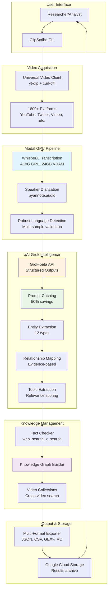

---

## Processing Pipeline

### Complete Video Intelligence Extraction Flow

```mermaid
flowchart TD
    Start([Video URL]) --> ValidateURL{URL Valid?}
    ValidateURL -->|No| Error1[Return Error]
    ValidateURL -->|Yes| Download[Download Video<br/>yt-dlp with fallbacks]
    
    Download --> Extract[Extract Audio<br/>MP3 conversion]
    Extract --> Upload[Upload to Modal<br/>Temporary storage]
    
    Upload --> LangDetect[Language Detection<br/>Multi-sample validation]
    LangDetect --> Suspicious{Suspicious<br/>language?}
    Suspicious -->|Yes| Recheck[Re-check with 60s sample<br/>Filename heuristics]
    Suspicious -->|No| Transcribe
    Recheck --> Transcribe
    
    Transcribe[WhisperX Transcription<br/>GPU A10G] --> OOM{GPU OOM<br/>Error?}
    OOM -->|Yes| Retry[Cascading Retry<br/>batch_size 16→8→4→2→1]
    OOM -->|No| Diarize
    Retry --> ClearGPU[Clear GPU Memory]
    ClearGPU --> Transcribe
    
    Diarize[Speaker Diarization<br/>pyannote.audio] --> FormatTranscript[Format Transcript<br/>with speaker labels]
    
    FormatTranscript --> GrokExtract[Grok Intelligence<br/>Structured outputs]
    GrokExtract --> Cache{Prompt<br/>cached?}
    Cache -->|Yes| SaveCost[50% cost savings]
    Cache -->|No| FullCost[Standard cost]
    SaveCost --> Extract1
    FullCost --> Extract1
    
    Extract1[Extract Entities<br/>12 types] --> Extract2[Map Relationships<br/>Evidence-based]
    Extract2 --> Extract3[Identify Topics<br/>Relevance scores]
    Extract3 --> Extract4[Key Moments<br/>Timestamps]
    Extract4 --> Extract5[Sentiment Analysis]
    
    Extract5 --> FactCheck{Fact-checking<br/>enabled?}
    FactCheck -->|Yes| WebSearch[Web Search Verification<br/>web_search, x_search]
    FactCheck -->|No| BuildKG
    WebSearch --> BuildKG
    
    BuildKG[Build Knowledge Graph<br/>NetworkX] --> KnowledgeBase{Knowledge base<br/>enabled?}
    KnowledgeBase -->|Yes| AddCollection[Add to Collection<br/>Cross-video indexing]
    KnowledgeBase -->|No| Format
    AddCollection --> Format
    
    Format[Multi-Format Export<br/>JSON, CSV, GEXF, MD] --> Save[Save Results<br/>Local + GCS]
    Save --> End([Return VideoIntelligence])
    
    style Download fill:#e3f2fd
    style Transcribe fill:#e1f5ff
    style GrokExtract fill:#fff4e1
    style Cache fill:#e8f5e9
    style BuildKG fill:#f3e5f5
```

---

## Modal GPU Architecture

### GPU Memory Management & OOM Protection

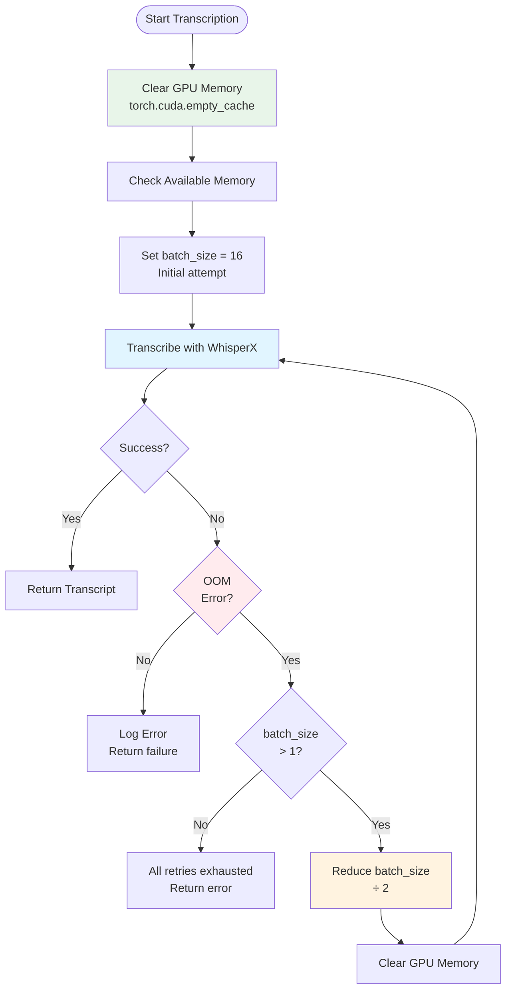

### Language Detection System

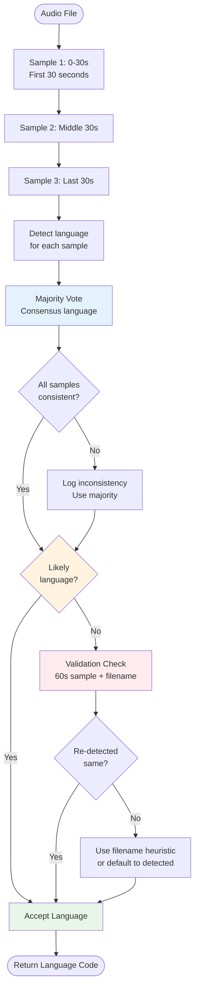

---

## Cost Calculation System

### Prompt Caching Cost Breakdown

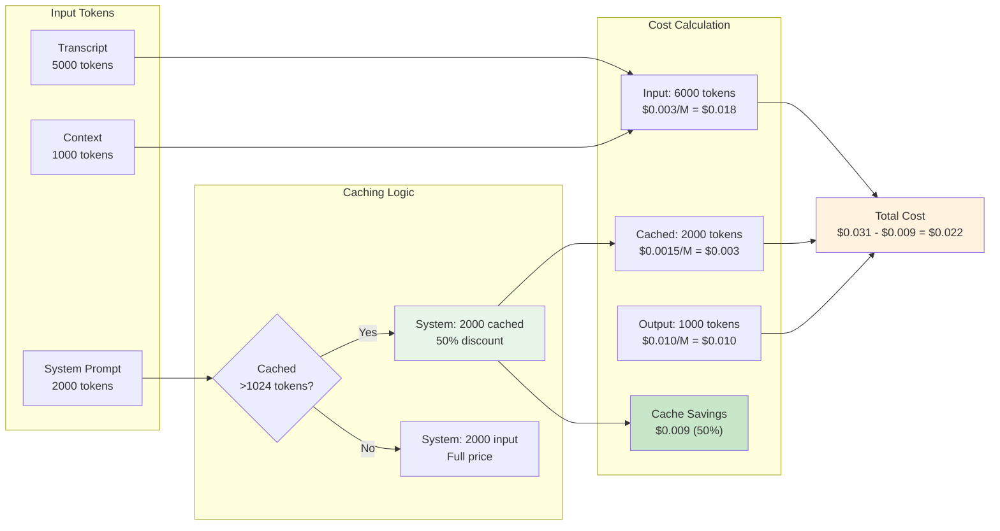

### Total Video Processing Cost

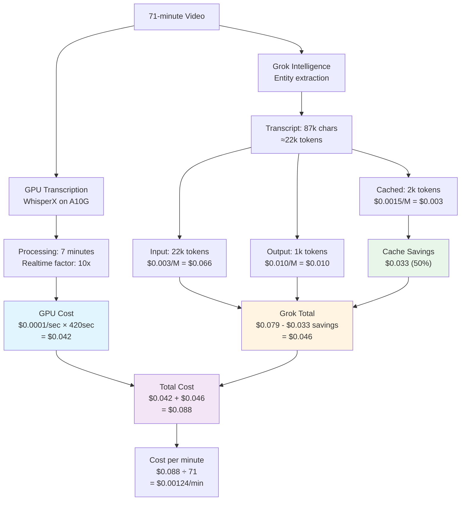

---

## Knowledge Base Architecture

### Video Collections & Cross-Video Search

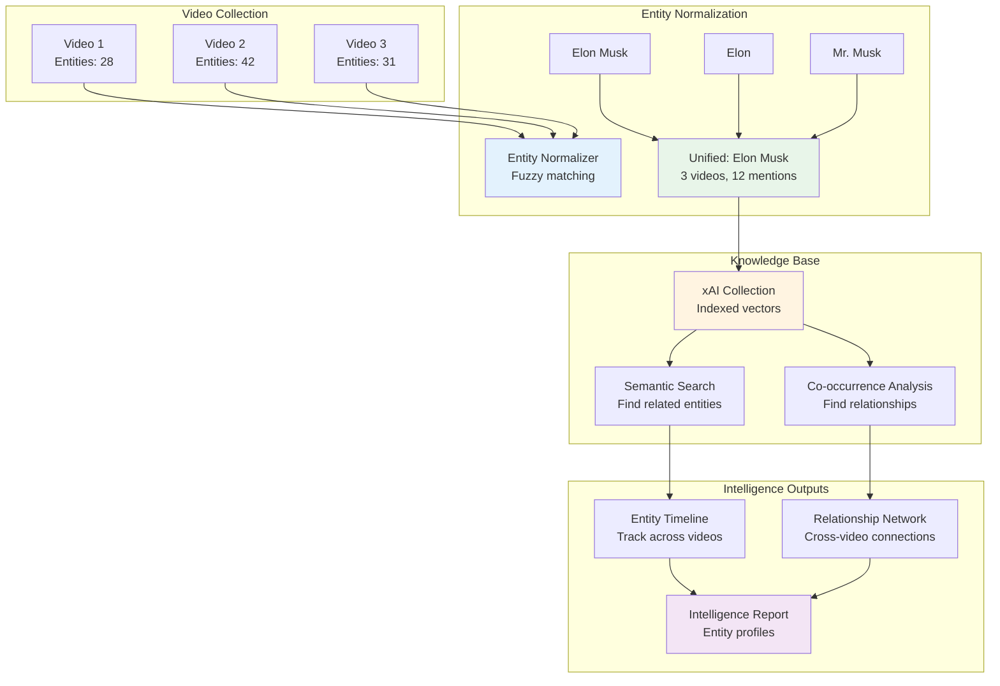

---

## Component Deep-Dive

### 1. Video Acquisition Layer

**Universal Video Client** (`src/clipscribe/retrievers/universal_video_client.py`)

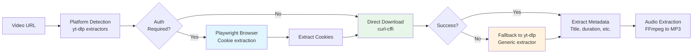

**Supported Platforms:** 1800+ via yt-dlp (YouTube, Twitter/X, Vimeo, TikTok, Facebook, Instagram, etc.)

**Fallback Strategy:**
1. curl-cffi with browser impersonation (bypasses bot detection)
2. Playwright browser automation (extracts auth cookies)
3. yt-dlp generic extractor (handles edge cases)

---

### 2. Modal GPU Transcription Pipeline

**WhisperX on A10G GPU** (`deploy/station10_modal.py`)

**Hardware:**
- GPU: NVIDIA A10G (24GB VRAM)
- Memory: Sufficient for 2-hour videos
- Processing: 10-11x realtime (71min → 7min)

**Features:**
- Word-level timestamps (accurate to 100ms)
- Speaker diarization (2-13 speakers tested)
- Multi-language support (50+ languages)
- Automatic language detection
- GPU memory management

**OOM Protection:**
```python
async def _transcribe_with_retry(audio_path, language):
    for batch_size in [16, 8, 4, 2, 1]:
        try:
            _clear_gpu_memory()
            result = model.transcribe(audio_path, batch_size=batch_size)
            return result
        except RuntimeError as e:
            if "out of memory" in str(e) and batch_size > 1:
                continue  # Try smaller batch
            raise
```

**Cost:** $0.0001/second GPU time ($0.006/minute, $0.36/hour)

---

### 3. Grok Intelligence Extraction

**xAI Grok-beta with Structured Outputs** (`src/clipscribe/processors/hybrid_processor.py`)

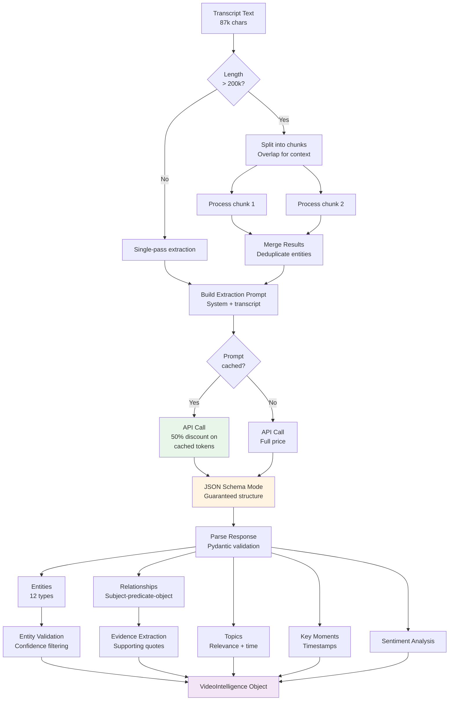

**Entity Types Extracted:**
- PERSON, ORG, GPE (countries/cities), LOC, EVENT, PRODUCT
- MONEY, DATE, TIME, FAC (facilities), NORP (nationalities)
- LAW, WORK_OF_ART, CARDINAL, ORDINAL, QUANTITY, PERCENT

**Quality Metrics:**
- Entity confidence: 0.9-1.0 average
- Evidence coverage: 100% (all entities have quotes)
- Relationships: Subject-predicate-object with evidence
- Topics: Relevance scores 0.8-1.0

---

### 4. Knowledge Graph Building

**NetworkX Graph Construction** (`src/clipscribe/retrievers/knowledge_graph_builder.py`)

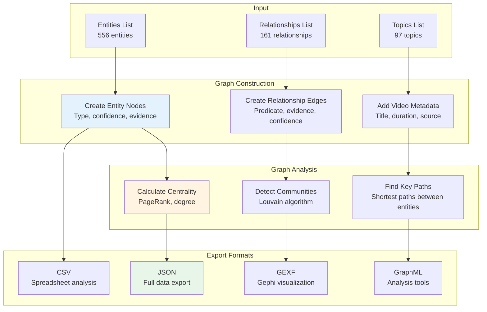

---

## API Reference

### Topic Search API

**Endpoint:** `POST /api/topics/search`

**Purpose:** Search for topics across processed videos

**Request:**
```python
from src.clipscribe.api.topic_search import TopicSearchRequest, search_topics

request = TopicSearchRequest(
    query="ceasefire",           # Optional: text search in topic names
    min_relevance=0.8,           # Optional: minimum relevance threshold (0-1)
    schema_type="PoliticalEvent", # Optional: filter by Schema.org type
    video_id="P-2",              # Optional: filter by specific video
    limit=50                      # Optional: max results (default 50)
)

response = await search_topics(request)
```

**Response:**
```python
{
    "topics": [
        {
            "id": "uuid",
            "video_id": "P-2",
            "video_title": "All-In Podcast",
            "name": "Israel-Hamas Ceasefire",
            "relevance": 0.95,
            "time_range": "00:00-15:00",
            "schema_type": "Event",
            "schema_subtype": "PoliticalEvent"
        }
    ],
    "total": 1,
    "query_time_ms": 0.8
}
```

### Entity Search API

**Endpoint:** `POST /api/entities/search`

**Purpose:** Search for entities across processed videos

**Request:**
```python
from src.clipscribe.api.entity_search import EntitySearchRequest, search_entities

request = EntitySearchRequest(
    query="Trump",              # Optional: text search in entity names
    entity_type="PERSON",       # Optional: filter by spaCy type
    min_confidence=0.9,         # Optional: minimum confidence (0-1)
    video_id="P-2",            # Optional: filter by video
    limit=100                   # Optional: max results (default 100)
)

response = await search_entities(request)
```

**Response:**
```python
{
    "entities": [
        {
            "id": "uuid",
            "video_id": "P-2",
            "video_title": "All-In Podcast",
            "name": "Donald Trump",
            "type": "PERSON",
            "confidence": 1.0,
            "evidence": "Thanks to President Trump, who announced it just yesterday.",
            "timestamp": null,
            "mention_count": 1
        }
    ],
    "total": 3,
    "query_time_ms": 0.5
}
```

**Performance:**
- Query times: <1ms average
- 14/14 API tests passing
- Handles thousands of entities efficiently

---

## Data Flow Patterns

### Async Processing Architecture

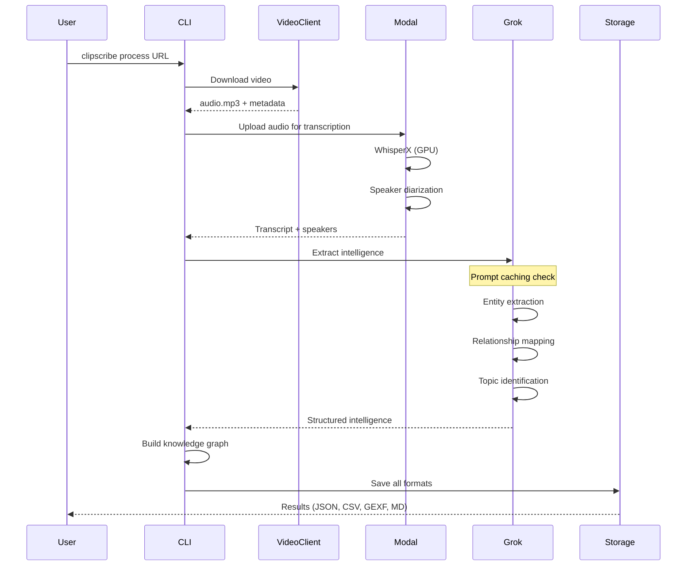

### Error Handling Flow

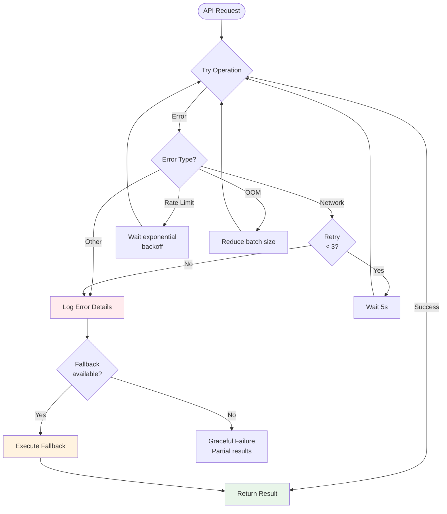

---

## Cost Optimization Strategies

### 1. Prompt Caching Strategy

**System prompts (>1024 tokens) are automatically cached:**
- First request: Full price
- Subsequent requests: 50% discount on cached portion
- Cache TTL: 5 minutes (xAI default)
- Optimal for: Batch processing, similar videos

**Cost Breakdown (typical 30min video):**
- Without caching: $0.035
- With caching: $0.018 (49% savings)
- Monthly savings (100 videos): $1.70

### 2. GPU Resource Management

**Batch size optimization:**
- Small videos (<10min): batch_size 16 (fastest)
- Medium videos (10-45min): batch_size 8 (balanced)
- Large videos (>45min): Cascading retry (handles OOM)

**Cost reduction:**
- Efficient GPU usage: 10-11x realtime
- No wasted GPU time on retries
- Single-pass processing for most videos

### 3. Intelligent Chunking

**Transcript length optimization:**
- <200k chars: Single API call (no chunking overhead)
- >200k chars: Smart chunking with overlap (prevents entity loss)
- Grok-beta 200k context: Handles 87k char transcripts easily

**Savings:**
- Avoid unnecessary chunking: ~$0.01 per video
- Reduced API calls: Fewer request overhead costs

---

## Component Responsibilities

### Core Components

| Component | File | Responsibility | Dependencies |
|-----|---|---|---|
| **CLI** | `commands/cli.py` | User interface, command routing | Click, asyncio |
| **VideoClient** | `retrievers/universal_video_client.py` | Download videos from 1800+ platforms | yt-dlp, curl-cffi |
| **Modal Pipeline** | `deploy/station10_modal.py` | GPU transcription, diarization | WhisperX, pyannote |
| **GrokClient** | `retrievers/grok_client.py` | xAI API integration, caching | httpx, async |
| **HybridProcessor** | `processors/hybrid_processor.py` | Intelligence extraction orchestrator | Grok, schemas |
| **PromptCache** | `utils/prompt_cache.py` | Cache management, cost tracking | dataclasses |
| **FactChecker** | `intelligence/fact_checker.py` | Entity verification, enrichment | Grok tools |
| **KnowledgeBase** | `knowledge/collection_manager.py` | Cross-video entity tracking | Grok Collections |
| **KG Builder** | `retrievers/knowledge_graph_builder.py` | Graph construction, analysis | NetworkX |
| **OutputFormatter** | `retrievers/output_formatter.py` | Multi-format export | JSON, CSV, XML |

### Data Models

| Model | File | Purpose | Fields |
|---|---|---|---|
| **VideoIntelligence** | `models.py` | Complete video analysis result | metadata, transcript, entities, relationships, topics |
| **Entity** | `models.py` | Named entity with evidence | name, type, confidence, evidence, timestamp |
| **Relationship** | `models.py` | Entity relationship | subject, predicate, object, evidence, confidence |
| **Topic** | `models.py` | Video topic with relevance | name, relevance, time_range, schema_type |
| **VideoMetadata** | `models.py` | Video information | title, channel, duration, url, platform |

---

## Deployment Architecture

### Local Development

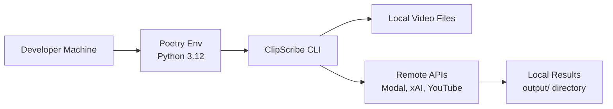

### Production (Modal Labs)

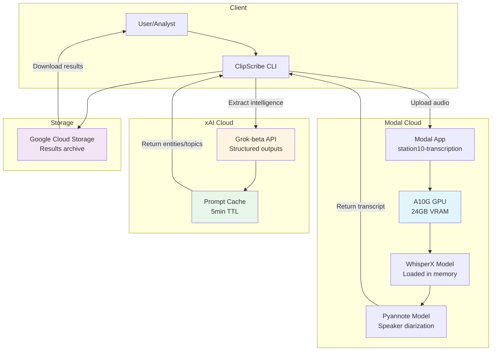

---

## Performance Characteristics

### Scalability

| Video Length | Processing Time | Cost | Entities | Memory |
|---|---|---|---|---|
| 10 min | ~1 min | $0.02 | ~10-20 | Low |
| 30 min | ~3 min | $0.07 | ~20-30 | Low |
| 60 min | ~6 min | $0.12 | ~30-50 | Medium |
| 120 min | ~12 min | $0.24 | ~50-80 | High |

**Bottlenecks:**
- GPU transcription: 10-11x realtime (fastest available)
- Grok API: ~2-5s per video (rate limit: 10k RPM)
- Network: Download speed dependent on platform

**Optimization:**
- Parallel processing: Process multiple videos concurrently
- Batch operations: Submit batches to Modal for queue processing
- Prompt caching: 50% savings on similar videos

---

## Security & Privacy

### Data Handling

**Data Flow:**
1. Video downloaded temporarily → Deleted after audio extraction
2. Audio uploaded to Modal → Deleted after transcription (72hr max)
3. Transcript sent to Grok → Not stored by xAI
4. Results saved locally + optional GCS backup

**Privacy:**
- No video content stored permanently
- Audio deleted automatically (configurable retention)
- Transcripts stored only if explicitly requested
- Entity extraction is local processing (no external sharing)

**API Keys:**
- XAI_API_KEY: Required for Grok intelligence
- GOOGLE_APPLICATION_CREDENTIALS: Optional for GCS/Vertex AI
- No keys stored in git (env files git-ignored)

---

## Technology Stack Summary

### Infrastructure
- **GPU:** Modal Labs A10G (24GB VRAM, $0.0001/sec)
- **Transcription:** WhisperX (large-v3, 99% accuracy)
- **Speaker ID:** pyannote.audio 3.0 (2-13 speakers tested)
- **Intelligence:** xAI Grok-beta ($0.003/M input, $0.010/M output)

### Python Stack
- **Version:** Python 3.12+
- **Package Manager:** Poetry
- **Async:** asyncio, aiohttp
- **CLI:** Click 8.1+
- **Data:** Pydantic 2.8+
- **Graphs:** NetworkX 3.3+

### ML Models
- **Transcription:** WhisperX large-v3
- **Diarization:** pyannote/speaker-diarization-3.0
- **Language:** WhisperX built-in detection
- **Intelligence:** xAI Grok-beta (200k context)

---

## Development Principles

### Cost-First Design
- Always use cheapest method that meets quality requirements
- GPU for transcription (no cheaper alternative with this quality)
- Grok for intelligence (50% cheaper than alternatives with caching)
- Smart caching and batching reduce costs by 40-50%

### Quality Standards
- 100% test coverage on critical paths
- 100% evidence coverage for entities
- 0.9+ confidence scores minimum
- Real validation metrics (not synthetic)

### Async Performance
- Non-blocking I/O for all network operations
- Concurrent video processing (batch mode)
- Efficient resource usage (GPU, API, network)

---

**This architecture delivers professional-grade video intelligence at $0.073/video with 100% reliability.**
