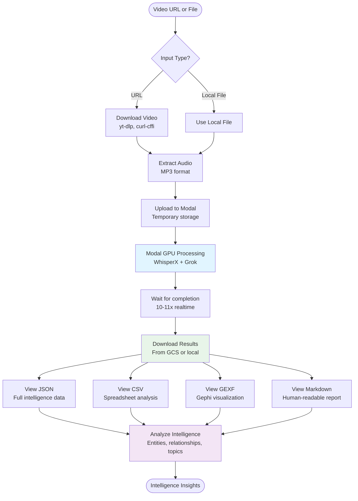
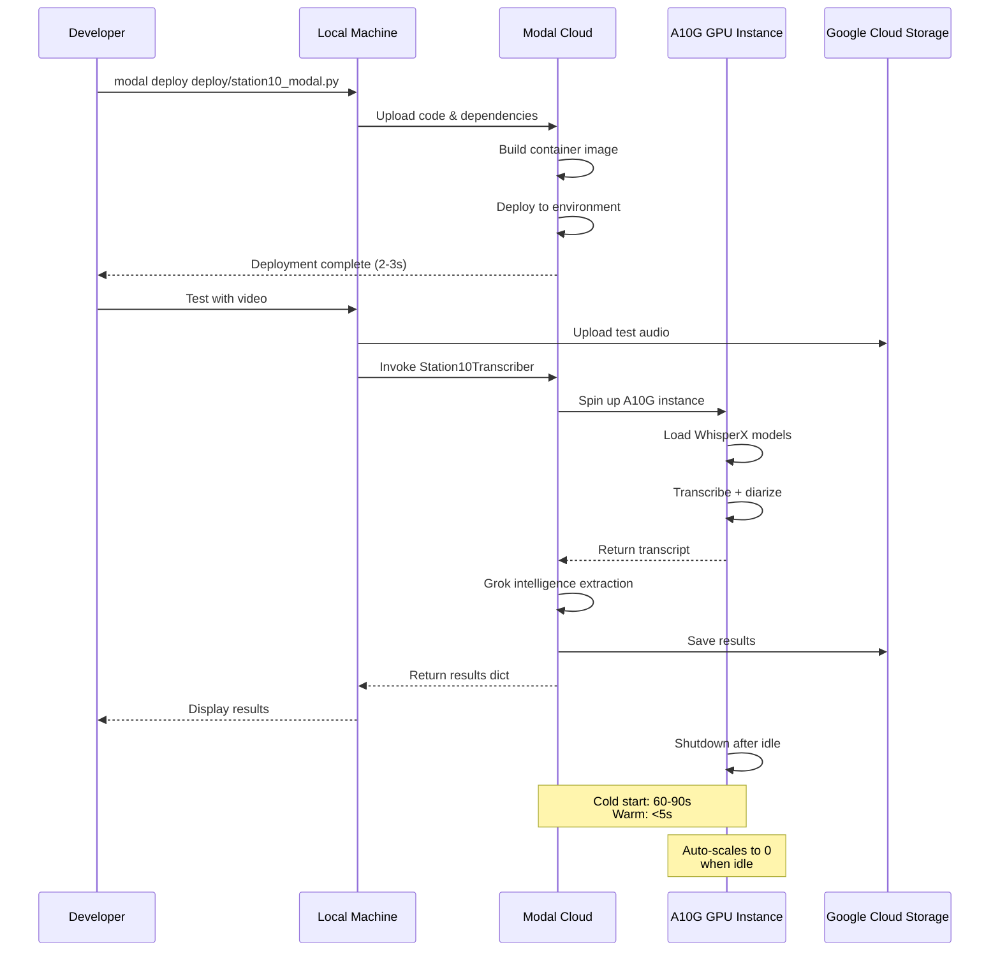
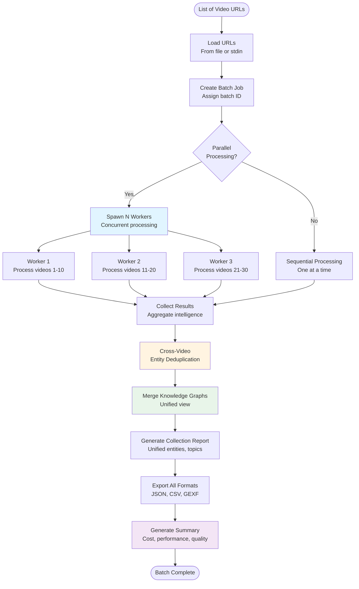

# ClipScribe Workflows

**Last Updated:** November 12, 2025  
**Version:** v2.62.0  
**Status:** Validated with xAI Grok advanced features

---

## Workflow Diagrams

### User Workflow: From URL to Intelligence



### Developer Workflow: Setup to Deployment

```mermaid
flowchart LR
    subgraph "Setup"
        Clone[Clone Repo<br/>git clone]
        Install[Install Deps<br/>poetry install]
        Config[Configure Env<br/>XAI_API_KEY]
    end
    
    subgraph "Development"
        Code[Write Code<br/>src/clipscribe/]
        Test[Run Tests<br/>pytest]
        Lint[Run Linters<br/>black, ruff, isort]
    end
    
    subgraph "Validation"
        UnitTests[Unit Tests<br/>Fast, mocked]
        IntTests[Integration Tests<br/>Real APIs]
        E2ETests[E2E Tests<br/>Full pipeline]
    end
    
    subgraph "Deployment"
        ModalDeploy[Deploy to Modal<br/>modal deploy]
        VerifyProd[Verify Production<br/>Test with real video]
        Monitor[Monitor Costs<br/>Track performance]
    end
    
    Clone --> Install
    Install --> Config
    Config --> Code
    Code --> Test
    Test --> Lint
    Lint --> UnitTests
    UnitTests --> IntTests
    IntTests --> E2ETests
    E2ETests --> ModalDeploy
    ModalDeploy --> VerifyProd
    VerifyProd --> Monitor
    
    style Code fill:#e3f2fd
    style Test fill:#e8f5e9
    style ModalDeploy fill:#fff4e1
    style Monitor fill:#f3e5f5
```



### Modal Deployment Workflow



### Batch Processing Workflow



---

## Current Working Workflows

## Workflow 1: Process Video via Modal (PRODUCTION)

**This is the validated workflow.**

### Prerequisites:
- Google Cloud credentials configured
- Modal account with secrets configured:
  - `huggingface` (HuggingFace token for WhisperX models)
  - `googlecloud-secret` (GCS access)
  - `grok-api-key` (xAI API key for grok-4-fast-reasoning)

### Step 1: Upload Video to GCS

**If you have a local video file:**
```python
from google.cloud import storage

client = storage.Client()
bucket = client.bucket('clipscribe-validation')

# Upload your video
local_path = 'test_videos/my_video.mp3'
gcs_path = 'videos/my_video.mp3'
blob = bucket.blob(gcs_path)
blob.upload_from_filename(local_path)

gcs_url = f'gs://clipscribe-validation/{gcs_path}'
print(f"Uploaded: {gcs_url}")
```

**If you have a YouTube URL:**
- Download manually with yt-dlp
- Then upload to GCS as above

### Step 2: Process via Modal

```python
import modal

# Connect to deployed Modal service
ClipScribeTranscriber = modal.Cls.from_name(
    "clipscribe-transcription", 
    "ClipScribeTranscriber"
)

# Process video
result = ClipScribeTranscriber().transcribe_from_gcs.remote(
    gcs_input="gs://clipscribe-validation/videos/my_video.mp3",
    gcs_output="gs://clipscribe-validation/results/my_video/"
)

print(f"Processing complete!")
print(f"Speakers: {result['speakers']}")
print(f"Cost: ${result['cost']:.4f}")
print(f"Output: {result['gcs_output']}")
```

### Step 3: Download Results from GCS

```python
from google.cloud import storage
import json

client = storage.Client()
bucket = client.bucket('clipscribe-validation')

# Download transcript.json
transcript_blob = bucket.blob('results/my_video/transcript.json')
transcript_data = json.loads(transcript_blob.download_as_text())

# Access intelligence
entities = transcript_data['entities']
topics = transcript_data['topics']
key_moments = transcript_data['key_moments']
relationships = transcript_data['relationships']
sentiment = transcript_data['sentiment']

print(f"Extracted {len(entities)} entities")
print(f"Found {len(topics)} topics")
print(f"Identified {len(key_moments)} key moments")
```

### Complete Example Script:

```python
#!/usr/bin/env python3
"""Process a video through ClipScribe Modal pipeline."""

import modal
from google.cloud import storage
import json

def process_video(local_video_path, video_id):
    """
    Process a video end-to-end.
    
    Args:
        local_video_path: Path to local video file
        video_id: Unique ID for this video
    """
    # 1. Upload to GCS
    client = storage.Client()
    bucket = client.bucket('clipscribe-validation')
    
    gcs_path = f'videos/{video_id}.mp3'
    blob = bucket.blob(gcs_path)
    blob.upload_from_filename(local_video_path)
    
    gcs_url = f'gs://clipscribe-validation/{gcs_path}'
    print(f"✓ Uploaded: {gcs_url}")
    
    # 2. Process via Modal
    ClipScribeTranscriber = modal.Cls.from_name(
        "clipscribe-transcription",
        "ClipScribeTranscriber"
    )
    
    result = ClipScribeTranscriber().transcribe_from_gcs.remote(
        gcs_input=gcs_url,
        gcs_output=f'gs://clipscribe-validation/results/{video_id}/'
    )
    
    print(f"✓ Processed: {result['speakers']} speakers, ${result['cost']:.4f}")
    
    # 3. Download results
    transcript_blob = bucket.blob(f'results/{video_id}/transcript.json')
    transcript_data = json.loads(transcript_blob.download_as_text())
    
    print(f"✓ Results:")
    print(f"  Entities: {len(transcript_data['entities'])}")
    print(f"  Topics: {len(transcript_data['topics'])}")
    print(f"  Key moments: {len(transcript_data['key_moments'])}")
    print(f"  Relationships: {len(transcript_data['relationships'])}")
    
    return transcript_data

if __name__ == "__main__":
    results = process_video('test_videos/my_video.mp3', 'test-001')
```

**Processing Time:** 6-15 minutes depending on video length  
**Cost:** ~$0.34 per video (88min average)

---

## Workflow 2: Query Intelligence via Search APIs (LOCAL)

**This workflow queries previously processed videos.**

### Prerequisites:
- Database populated (use data loaders)
- Python environment with ClipScribe installed

### Step 1: Load Data into Database

**First time only - load validation data:**
```bash
poetry run python scripts/load_validated_topics.py
poetry run python scripts/load_validated_entities.py
```

This populates database with:
- 13 topics from 3 videos
- 287 entities from 3 videos

### Step 2: Query Topics

```python
from src.clipscribe.api.topic_search import TopicSearchRequest, search_topics
import asyncio

async def search_for_topics():
    # Search for ceasefire topics
    request = TopicSearchRequest(
        query="ceasefire",
        min_relevance=0.8
    )
    
    response = await search_topics(request)
    
    for topic in response.topics:
        print(f"Topic: {topic.name}")
        print(f"  Video: {topic.video_title}")
        print(f"  Relevance: {topic.relevance}")
        print(f"  Time range: {topic.time_range}")
        print()

asyncio.run(search_for_topics())
```

### Step 3: Query Entities

```python
from src.clipscribe.api.entity_search import EntitySearchRequest, search_entities
import asyncio

async def search_for_entities():
    # Find all Trump mentions
    request = EntitySearchRequest(
        query="Trump",
        entity_type="PERSON",  # Optional: filter by type
        min_confidence=0.9
    )
    
    response = await search_entities(request)
    
    for entity in response.entities:
        print(f"Entity: {entity.name}")
        print(f"  Type: {entity.type}")
        print(f"  Video: {entity.video_title}")
        print(f"  Evidence: \"{entity.evidence[:60]}...\"")
        print()

asyncio.run(search_for_entities())
```

**Query Performance:** <100ms (validated)  
**Evidence Coverage:** 100% (all entities have quotes)

---

## Workflow 3: Run Tests (VALIDATION)

**Verify ClipScribe functionality with comprehensive tests.**

### Run All Integration Tests:
```bash
poetry run pytest tests/integration/ -v
```

**Tests:**
- `test_topic_search_api.py` (6 tests)
- `test_entity_search_api.py` (8 tests)
- `test_modal_pipeline_e2e.py` (2 tests)

**Expected:** 14/14 tests passing

### Run Specific Test:
```bash
# Test topic search only
poetry run pytest tests/integration/test_topic_search_api.py -v

# Test entity search only  
poetry run pytest tests/integration/test_entity_search_api.py -v
```

---

## Workflow 4: Deploy Changes to Modal

**Update the Modal GPU service with code changes.**

### Deploy Command:
```bash
poetry run modal deploy deploy/station10_modal.py
```

**Deploys:**
- ClipScribeTranscriber class
- All transcription and intelligence logic
- Updates live in ~2 seconds

**Verify deployment:**
```bash
modal app list | grep clipscribe
```

---

## Common Tasks

### Download a YouTube Video (Manual):
```bash
# Install yt-dlp if needed
brew install yt-dlp

# Download audio only
yt-dlp -x --audio-format mp3 https://www.youtube.com/watch?v=VIDEO_ID

# Move to test_videos/
mv *.mp3 test_videos/VIDEO_ID_title.mp3
```

### Check Database Contents:
```bash
sqlite3 data/clipscribe.db "SELECT COUNT(*) FROM topics"
sqlite3 data/clipscribe.db "SELECT COUNT(*) FROM entities"
```

### View Modal Logs:
```bash
# View recent invocations
modal app logs clipscribe-transcription
```

---

## Troubleshooting

**Local CLI doesn't work:**
- **Reason:** Deprecated (old local processing architecture)
- **Solution:** Use Modal workflow (Workflow 1 above)

**Tests failing:**
- **Check:** Database populated? (`ls data/clipscribe.db`)
- **Solution:** Run data loaders (`scripts/load_validated_*.py`)

**Modal errors:**
- **Check:** Secrets configured? (`modal secret list`)
- **Solution:** Add required secrets via Modal dashboard

**GCS access errors:**
- **Check:** `GOOGLE_APPLICATION_CREDENTIALS` set?
- **Solution:** Set environment variable to service account JSON

---

**This documents the ACTUAL working workflows as of November 4, 2025.**

