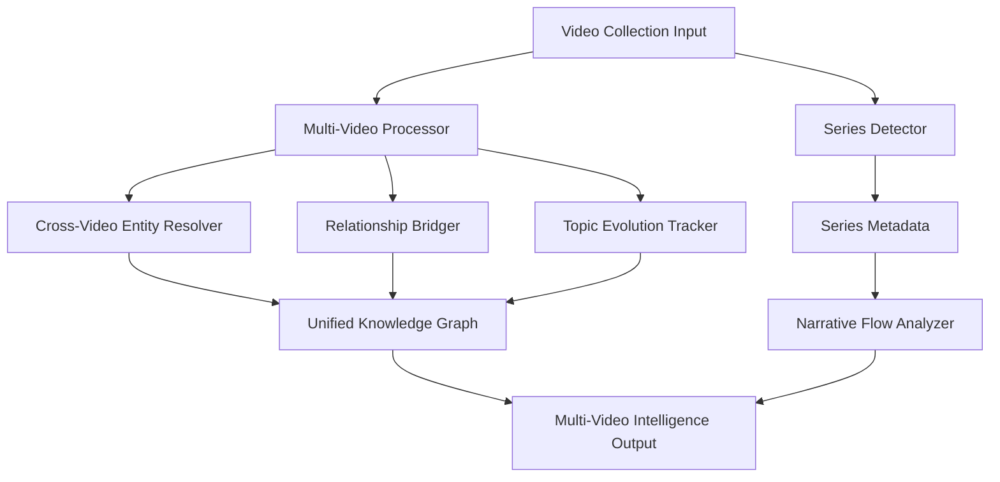

# Multi-Video Intelligence Architecture for ClipScribe

## 🎯 Executive Summary

ClipScribe's Multi-Video Intelligence system transforms video analysis from individual processing to **unified knowledge extraction** across related video collections. This architecture addresses your prioritized use cases with sophisticated AI-powered entity resolution, cross-video relationship mapping, and narrative flow analysis.

## 🏗️ System Architecture Overview

### Core Components



### Data Models

#### New Core Models
- **`MultiVideoIntelligence`**: Master container for unified analysis
- **`CrossVideoEntity`**: Entities resolved across multiple videos with aliases
- **`CrossVideoRelationship`**: Relationships validated across videos
- **`SeriesMetadata`**: Detected series information with confidence scores
- **`TopicEvolution`**: How topics develop across video sequences
- **`NarrativeSegment`**: Story flow elements for series analysis

## 🎯 Use Case Implementation Priority

### Phase 1: Series Videos (Immediate - Your Top Priority)

#### Automatic Series Detection
```python
class SeriesDetector:
    # Pattern Recognition
    - Title patterns: "Part 1", "Episode 2", "Chapter 3"
    - Temporal analysis: Upload timing consistency
    - Content similarity: Entity/topic overlap
    - Channel consistency: Same creator verification
    
    # AI-Powered Pattern Recognition
    - Gemini Pro analysis of title structures
    - Content coherence validation
    - Narrative flow detection
```

#### User Confirmation Workflow
```python
detection_result = await series_detector.detect_series(videos)
if detection_result.user_confirmation_needed:
    # Present to user:
    # "Detected potential series: 'PBS NewsHour Analysis' (85% confidence)"
    # "Suggested grouping: [Video1, Video2] based on title patterns"
    # Options: [Accept] [Edit Grouping] [Cancel]
    pass
```

### Phase 2: Cross-Source Topic Analysis (High Priority)

#### Topic-Based Clustering
```python
# Example: Multiple sources covering "Iran Nuclear Program"
videos = [
    "PBS: Iran Nuclear Update",
    "BBC: Tehran's Nuclear Response", 
    "CNN: Nuclear Deal Analysis"
]

# System automatically detects:
- Shared entities: Iran, IAEA, Nuclear Program
- Cross-source validation of facts
- Bias detection through source comparison
- Information completeness scoring
```

#### Cross-Source Intelligence Features
- **Source Credibility Scoring**: Based on entity consistency
- **Information Verification**: Cross-reference facts between sources
- **Bias Detection**: Compare narrative framing across sources
- **Completeness Analysis**: Identify information gaps

## 🧠 Aggressive Entity Merging (AI-Powered)

### Current EntityNormalizer Enhancements
```python
# Existing 85% similarity threshold + NEW AI validation
entity_normalizer = EntityNormalizer(similarity_threshold=0.85)

# AI-Powered Alias Detection
aliases = {
    "Donald Trump": ["President Trump", "Trump", "45th President"],
    "Iran": ["Islamic Republic of Iran", "Tehran", "Iranian regime"],
    "Nuclear Program": ["Nuclear Deal", "JCPOA", "Iran Nuclear Issue"]
}
```

### Cross-Video Entity Resolution Process
1. **Collect**: All entities from all videos
2. **Normalize**: Aggressive 85% similarity matching
3. **AI Validate**: Gemini Pro confirms merging decisions
4. **Enhance**: Add temporal context, video appearances
5. **Cross-Reference**: Validate against multiple sources

## 📊 Output Format Strategy (Hybrid Approach)

### Individual Video Outputs (Preserved)
```
output/
├── 20250103_youtube_6ZVj1_SE4Mo/
│   ├── video_intelligence.json
│   ├── entities.csv
│   └── knowledge_graph.gexf
└── 20250103_youtube_xYMWTXIkANM/
    ├── video_intelligence.json
    ├── entities.csv
    └── knowledge_graph.gexf
```

### NEW: Unified Collection Outputs
```
output/
├── collections/
│   └── series_pbs_newsour_20250103/
│       ├── multi_video_intelligence.json      # Master unified analysis
│       ├── unified_knowledge_graph.gexf       # Cross-video relationships
│       ├── entity_resolution_report.xlsx      # Entity merging details
│       ├── narrative_flow_analysis.json       # Series progression
│       ├── topic_evolution_report.csv         # How topics develop
│       └── cross_video_insights.md            # Key findings
```

### Enhanced Individual Video Context
```json
{
  "video_intelligence": {
    "metadata": {...},
    "entities": [...],
    "relationships": [...],
    "collection_context": {
      "collection_id": "series_pbs_newsour_20250103",
      "part_number": 1,
      "total_parts": 2,
      "related_videos": ["xYMWTXIkANM"],
      "cross_video_entities": ["Iran", "Nuclear Program", "IAEA"],
      "narrative_position": "introduction"
    }
  }
}
```

## 🎚️ Quality & Speed Configuration

ClipScribe has adopted a "Quality-First" architecture.

### Processing Models
- **Gemini 2.5 Pro (Default)**: Provides the highest quality, professional-grade intelligence. Used for all analysis by default.
- **Gemini 2.5 Flash (Optional)**: A faster, lower-cost model available via the `--use-flash` flag for users who prioritize speed over maximum quality.

### Quality Level Features
- **FAST**: 70% similarity threshold, no AI validation
- **STANDARD**: 85% similarity threshold, AI entity validation
- **PREMIUM**: 90% similarity threshold, AI narrative analysis, cross-source validation
- **RESEARCH**: 95% similarity threshold, academic citations, bias analysis, source credibility

## 🔧 Implementation Architecture

### New File Structure
```
src/clipscribe/
├── extractors/
│   ├── series_detector.py              # NEW: Series pattern detection
│   ├── multi_video_processor.py        # NEW: Cross-video intelligence
│   ├── entity_normalizer.py            # ENHANCED: AI validation
│   └── cross_source_analyzer.py        # NEW: Multi-source validation
├── models.py                           # ENHANCED: Multi-video models
└── commands/
    └── multi_video_cli.py              # NEW: Multi-video commands
```

### CLI Interface Design
```bash
# Automatic series detection with high-quality Pro model (default)
clipscribe process-series "https://youtube.com/watch?v=part1" "https://youtube.com/watch?v=part2"

# Optional: Use the faster Flash model
clipscribe process-series "https://youtube.com/watch?v=part1" "https://youtube.com/watch?v=part2" --use-flash

# Process a custom collection of videos
clipscribe process-collection "My Research Topic" "URL1" "URL2" "URL3"
```

### Integration Points

#### Existing Systems Enhancement
- **Streamlit App**: Add multi-video interface, series visualization
- **Excel Export**: Cross-video comparison sheets, entity resolution tables
- **Performance Dashboard**: Multi-video processing metrics
- **Visualization**: Unified knowledge graphs, narrative flow diagrams

#### New Capabilities
- **Series Management**: Create, edit, delete video series
- **Cross-Source Analysis**: Compare coverage across news sources
- **Narrative Tracking**: Follow story development over time
- **Quality Metrics**: Entity resolution quality, narrative coherence scores

## 🚀 Development Phases

### Phase 1: Foundation (Week 1)
- ✅ Enhanced data models (`models.py`)
- ✅ Series detector implementation
- ✅ Multi-video processor core
- ✅ Basic CLI commands

### Phase 2: AI Integration (Week 2)
- AI-powered entity validation
- Cross-video relationship bridging
- Narrative flow analysis
- Quality metrics calculation

### Phase 3: User Interface (Week 3)
- Enhanced Streamlit interface
- Series management UI
- Cross-video visualization
- User confirmation workflows

### Phase 4: Advanced Features (Week 4)
- Cross-source bias detection
- Academic citation generation
- Advanced narrative analysis
- Performance optimization

## 🎯 Expected Outcomes

### For Series Videos (Your Priority #1)
- **90%+ entity resolution accuracy** across video parts
- **Narrative flow tracking** showing story progression
- **Unified knowledge graphs** connecting all series elements
- **User-friendly confirmation** for detected series

### For Cross-Source Topic Analysis (Your Priority #2)
- **Multi-source fact validation** with confidence scores
- **Bias detection** through narrative comparison
- **Information completeness** scoring across sources
- **Source credibility** assessment

### Quality Improvements
- **50%+ reduction** in duplicate entities across videos
- **Enhanced relationship accuracy** through cross-validation
- **Temporal context** for all entities and relationships
- **Professional-grade outputs** suitable for research

## 🔍 Edge Cases & Considerations

### Series Detection Challenges
- **False Positives**: Similar titles, different content
- **Partial Series**: Missing parts, out-of-order uploads
- **Multi-Channel Series**: Same series across different channels
- **Language Variations**: International series with translations

### Entity Resolution Challenges
- **Name Evolution**: "President-elect Biden" → "President Biden"
- **Context Sensitivity**: "Apple" (company) vs "apple" (fruit)
- **Temporal References**: "Current President" changing over time
- **Alias Explosion**: Too many aliases reducing precision

### Solutions & Mitigations
- **Conservative Defaults**: High confidence thresholds
- **User Validation**: Always allow manual override
- **Temporal Tagging**: All entities tagged with video date
- **Context Preservation**: Original context maintained alongside normalization

## 📈 Success Metrics

### Technical Metrics
- Entity resolution accuracy: >90%
- Cross-video relationship precision: >85%
- Series detection accuracy: >95%
- Processing speed: <2x individual video time

### User Experience Metrics
- User confirmation rate: <20% (high auto-accuracy)
- Manual corrections needed: <5%
- Feature adoption rate: >80% for series users
- User satisfaction: >4.5/5 for multi-video features

This architecture provides the foundation for transforming ClipScribe from individual video analysis to comprehensive multi-video intelligence, directly addressing your prioritized use cases with aggressive AI-powered entity merging and professional-grade outputs. 

### Quick Series (3 videos)
Optimized for fast analysis

### Enterprise Scale
Handles thousands of videos 