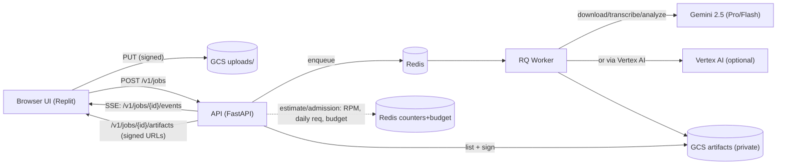

# ClipScribe Architecture (High-Level)

Last Updated: August 11, 2025

Mermaid Diagram (source of truth):

- Browser uploads via presigned GCS URL
- API (FastAPI): job submission, SSE progress, artifacts (signed URLs)
- Redis + RQ: queue/worker for processing
- GCS: artifact storage; API signs URLs
- Gemini 2.5 Pro/Flash; Vertex AI optional path
