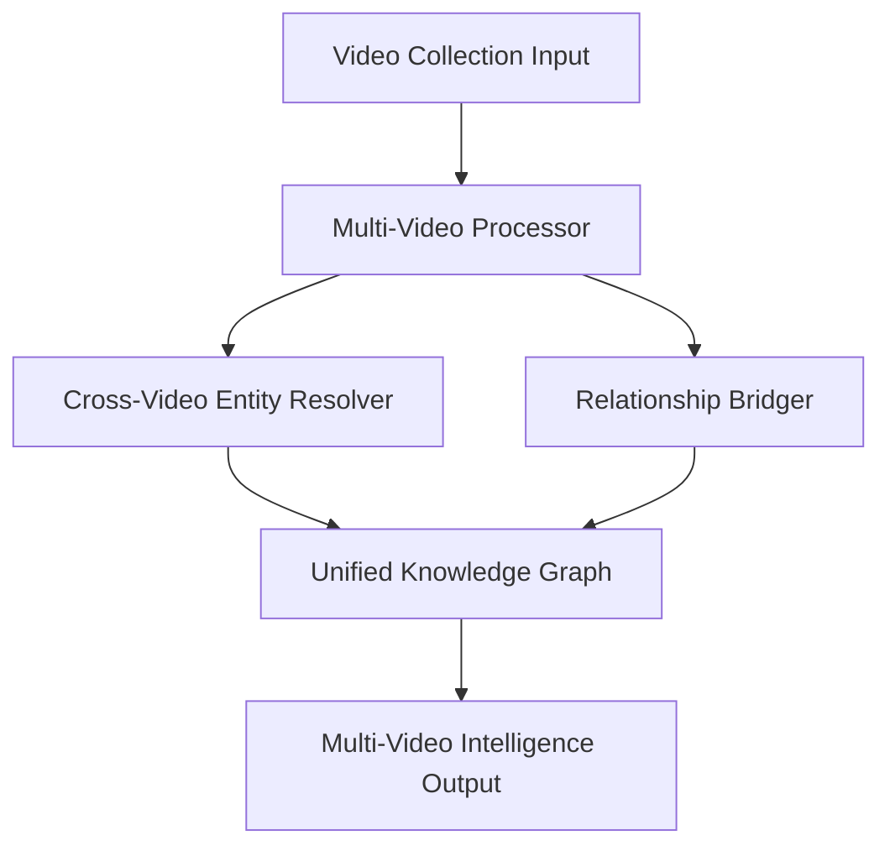

# Multi-Video Intelligence Architecture for ClipScribe

*Last Updated: July 31, 2025*

##  Executive Summary

ClipScribe's Multi-Video Intelligence system transforms video analysis from individual processing to **unified knowledge extraction** across related video collections. This architecture uses a simplified, robust pipeline that leverages the power of Gemini 2.5 Pro for entity resolution and cross-video relationship mapping.

##  System Architecture Overview

### Core Components


### Data Models
- **`MultiVideoIntelligence`**: Master container for unified analysis
- **`CrossVideoEntity`**: Entities resolved across multiple videos with aliases
- **`CrossVideoRelationship`**: Relationships validated across videos

##  Entity Merging (AI-Powered)

### Cross-Video Entity Resolution Process
1. **Collect**: All entities from all videos in a collection.
2. **Normalize**: Entities are normalized using an 85% similarity threshold.
3. **AI Validate**: Gemini Pro confirms merging decisions to ensure accuracy.
4. **Enhance**: Add temporal context and video appearances to each entity.
5. **Cross-Reference**: Validate entities against multiple sources within the collection.

##  Output Format Strategy (Hybrid Approach)

### Individual Video Outputs (Preserved)
Each video in a collection still produces its own set of output files, ensuring granular data is always accessible.
```
output/
└── YYYYMMDD_youtube_collectionID/
    ├── YYYYMMDD_youtube_video1/
    │   ├── video_intelligence.json
    │   └── ... (all other individual files)
    └── YYYYMMDD_youtube_video2/
        ├── video_intelligence.json
        └── ...
```

### NEW: Unified Collection Outputs
A separate directory is created for the unified analysis of the entire collection.
```
output/
└── YYYYMMDD_youtube_collectionID/
    └── unified_collection/
        ├── multi_video_intelligence.json      # Master unified analysis
        ├── unified_knowledge_graph.gexf       # Cross-video relationships
        └── cross_video_insights.md            # Key findings
```

##  Quality & Speed Configuration

ClipScribe has adopted a "Quality-First" architecture.

### Processing Models
- **Gemini 2.5 Pro (Default)**: Provides the highest quality, professional-grade intelligence. Used for all analysis by default.
- **Gemini 2.5 Flash (Optional)**: A faster, lower-cost model available via the `--use-flash` flag for users who prioritize speed over maximum quality.

##  Implementation Architecture

### File Structure
```
src/clipscribe/
├── extractors/
│   ├── multi_video_processor.py  # Cross-video intelligence
│   └── entity_normalizer.py      # AI-powered normalization
├── models.py                   # Multi-video Pydantic models
└── commands/
    └── cli.py                    # Multi-video CLI commands
```

### CLI Interface Design
```bash
# Process a series of videos
clipscribe collection series "https://youtube.com/watch?v=part1" "https://youtube.com/watch?v=part2"

# Optional: Use the faster Flash model
clipscribe collection series "https://youtube.com/watch?v=part1" "https://youtube.com/watch?v=part2" --use-flash

# Process a custom collection of videos
clipscribe collection custom "My Research Topic" "URL1" "URL2" "URL3"
```

##  Expected Outcomes

- **90%+ entity resolution accuracy** across video parts.
- **Unified knowledge graphs** connecting all series elements.
- **50%+ reduction** in duplicate entities across videos.
- **Enhanced relationship accuracy** through cross-validation.
- **Professional-grade outputs** suitable for research.
