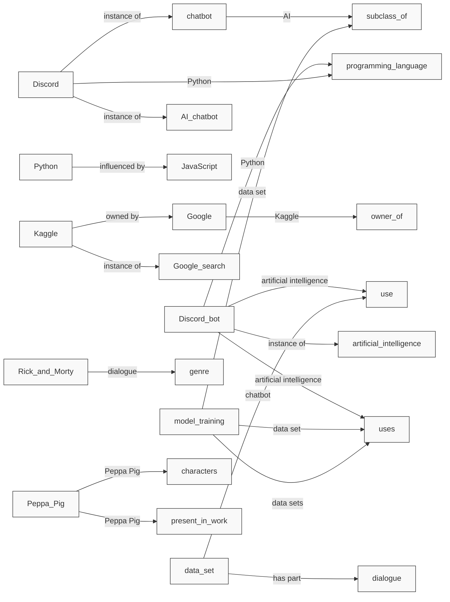
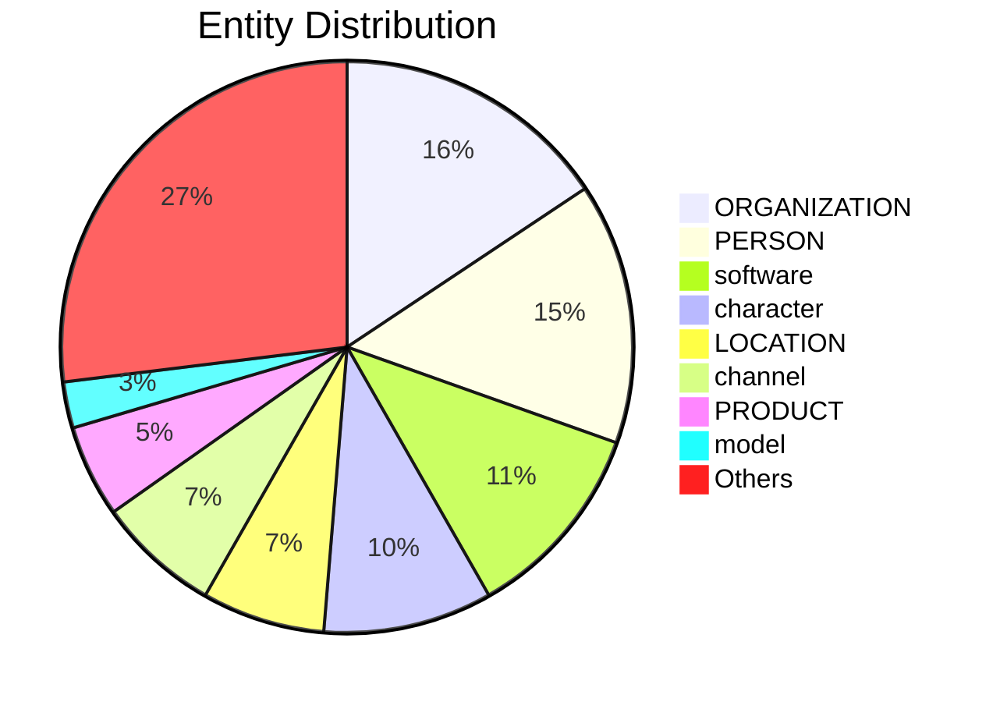

# Video Intelligence Report: Code a Discord Chat Bot That Talks Like Your Favorite Character - Tutorial

**URL**: https://www.youtube.com/watch?v=UjDpW_SOrlw
**Channel**: freeCodeCamp.org
**Duration**: 57:52
**Published**: 2021-08-26
**Processed**: 2025-06-24 12:48:34

**Processing Cost**: 🟡 $0.4427

## Executive Summary

This tutorial details how to build a Discord AI chatbot that speaks like any chosen character.  It starts by outlining various data sources for character dialogue, including Kaggle, Transcript Wiki, and fandom websites.  The process involves gathering data, cleaning and preparing it (using tools like Google Colab, regular expressions, and Pandas), then training a GPT model using a GPU for acceleration. The tutorial emphasizes handling potential issues like overfitting and missing data, ensuring a comprehensive guide to creating a functional and engaging chatbot.

## 📊 Quick Stats Dashboard

<b>Click to toggle stats</b>

| Metric | Count | Visualization |
|--------|-------|---------------|
| Transcript Length | 28,461 chars | ██████████████ |
| Word Count | 5,258 words | ██████████ |
| Entities Extracted | 107 | 🔵🔵🔵🔵🔵🔵🔵🔵🔵🔵 |
| Relationships Found | 210 | 🔗🔗🔗🔗🔗🔗🔗🔗🔗🔗🔗🔗🔗🔗🔗🔗🔗🔗🔗🔗 |
| Key Points | 19 | 📌📌📌📌📌📌 |
| Topics | 3 | 🏷️🏷️🏷️ |
| Graph Nodes | 198 | ⭕⭕⭕⭕⭕⭕⭕⭕⭕⭕⭕⭕⭕⭕⭕⭕⭕⭕⭕ |
| Graph Edges | 191 | ➡️➡️➡️➡️➡️➡️➡️➡️➡️➡️➡️➡️➡️➡️➡️➡️➡️➡️➡️ |

## 🏷️ Main Topics

<b>View all topics</b>

1. Discord Bot Development
2. AI Chatbot Creation
3. Data Acquisition and Processing

## 🕸️ Knowledge Graph Visualization

<b>Interactive relationship diagram (Mermaid)</b>

*Note: This diagram shows the top 20 relationships. For the complete graph, use the GEXF file with Gephi.*

## 🔍 Entity Analysis

### Entity Type Distribution

<b>📍 LOCATION (8 found)</b>

| Name | Confidence | Source |
|------|------------|--------|
| Google Colab | 🟩 0.95 | SpaCy |
| Python | 🟩 0.90 | SpaCy |
| Kaggle | 🟩 0.90 | SpaCy |
| the Discord | 🟩 0.90 | SpaCy |
| Google Drive | 🟩 0.85 | SpaCy |
| OAuth | 🟨 0.80 | SpaCy |
| Node | 🟨 0.80 | SpaCy |
| UTF-8 | 🟨 0.75 | SpaCy |

<b>🏢 ORGANIZATION (18 found)</b>

| Name | Confidence | Source |
|------|------------|--------|
| Google Colab | 🟩 1.00 | SpaCy |
| Hugging Face | 🟩 1.00 | SpaCy |
| Uptime Robot | 🟩 1.00 | SpaCy |
| Discord | 🟩 0.90 | SpaCy |
| Google | 🟩 0.90 | SpaCy |
| Transformer | 🟩 0.90 | SpaCy |
| JavaScript | 🟩 0.90 | SpaCy |
| ChattyBot Python | 🟩 0.90 | SpaCy |
| Repl | 🟩 0.90 | SpaCy |
| ChattyBot | 🟩 0.90 | SpaCy |
| Git Large File Storage | 🟩 0.85 | SpaCy |
| Python Repl | 🟩 0.85 | SpaCy |
| Discord Python | 🟩 0.85 | SpaCy |
| Pandas | 🟨 0.80 | SpaCy |
| PyTorch | 🟨 0.80 | SpaCy |

*... and 3 more organization entities*

<b>👤 PERSON (17 found)</b>

| Name | Confidence | Source |
|------|------------|--------|
| Harry Potter | 🟩 1.00 | SpaCy |
| Transcript Wiki | 🟩 1.00 | SpaCy |
| Kaggle | 🟩 0.90 | SpaCy |
| Peppa Pig | 🟩 0.90 | SpaCy |
| Peppa | 🟩 0.90 | SpaCy |
| Harry | 🟩 0.90 | SpaCy |
| Git | 🟩 0.90 | SpaCy |
| Python | 🟩 0.90 | SpaCy |
| Besides Transcript Wiki | 🟩 0.85 | SpaCy |
| Generative Pre-trained | 🟩 0.85 | SpaCy |
| Harry Potter 1.csv | 🟩 0.85 | SpaCy |
| Rick | 🟨 0.80 | SpaCy |
| Morty | 🟨 0.80 | SpaCy |
| Lynn | 🟨 0.80 | SpaCy |
| PyTorch | 🟨 0.80 | SpaCy |

*... and 2 more person entities*

<b>📦 PRODUCT (6 found)</b>

| Name | Confidence | Source |
|------|------------|--------|
| JavaScript | 🟩 0.85 | SpaCy |
| PeppaPig.csv | 🟩 0.85 | SpaCy |
| Batman on Transcript Wiki | 🟨 0.80 | SpaCy |
| The Word Ends With You | 🟨 0.80 | SpaCy |
| Discord bot.py | 🟨 0.80 | SpaCy |
| message.content | 🟨 0.75 | SpaCy |

<b>🏷️ algorithm (1 found)</b>

| Name | Confidence | Source |
|------|------------|--------|
| regular expression | 🟩 0.81 | SpaCy |

<b>🔌 api (3 found)</b>

| Name | Confidence | Source |
|------|------------|--------|
| Hugging Face API | 🟩 0.93 | SpaCy |
| Discord API | 🟩 0.93 | SpaCy |
| API | 🟨 0.78 | SpaCy |

<b>📺 channel (8 found)</b>

| Name | Confidence | Source |
|------|------------|--------|
| general channel | 🟩 0.96 | SpaCy |
| Python channel | 🟩 0.96 | SpaCy |
| JS channel | 🟩 0.89 | SpaCy |
| Discord channel | 🟩 0.85 | SpaCy |
| JavaScript channel | 🟩 0.84 | SpaCy |
| HTTP | 🟨 0.76 | SpaCy |
| npm | 🟨 0.71 | SpaCy |
| channel | 🟨 0.70 | SpaCy |

<b>🏷️ character (11 found)</b>

| Name | Confidence | Source |
|------|------------|--------|
| PeppaPig | 🟩 0.98 | SpaCy |
| favorite character | 🟩 0.95 | SpaCy |
| you | 🟩 0.95 | SpaCy |
| Peppa Pig | 🟩 0.94 | SpaCy |
| Harry | 🟩 0.94 | SpaCy |
| Mama Pig | 🟩 0.90 | SpaCy |
| Lynn | 🟩 0.90 | SpaCy |
| George | 🟩 0.89 | SpaCy |
| character | 🟩 0.85 | SpaCy |
| we | 🟩 0.81 | SpaCy |
| our character | 🟨 0.79 | SpaCy |

<b>🏷️ company (2 found)</b>

| Name | Confidence | Source |
|------|------------|--------|
| Microsoft | 🟩 0.91 | SpaCy |
| Google | 🟨 0.74 | SpaCy |

<b>🛠️ framework (2 found)</b>

| Name | Confidence | Source |
|------|------------|--------|
| Discord | 🟩 0.95 | SpaCy |
| Git | 🟨 0.72 | SpaCy |

<b>🏷️ game (3 found)</b>

| Name | Confidence | Source |
|------|------------|--------|
| video game | 🟩 0.95 | SpaCy |
| video games | 🟩 0.95 | SpaCy |
| game | 🟩 0.95 | SpaCy |

<b>🏷️ hardware (1 found)</b>

| Name | Confidence | Source |
|------|------------|--------|
| drive | 🟩 0.95 | SpaCy |

<b>🤖 model (3 found)</b>

| Name | Confidence | Source |
|------|------------|--------|
| model | 🟩 0.95 | SpaCy |
| GPT model | 🟩 0.80 | SpaCy |
| bot | 🟨 0.71 | SpaCy |

<b>🏷️ movie (2 found)</b>

| Name | Confidence | Source |
|------|------------|--------|
| Rick and Morty | 🟩 0.82 | SpaCy |
| Harry Potter | 🟩 0.80 | SpaCy |

<b>🏷️ organization (1 found)</b>

| Name | Confidence | Source |
|------|------------|--------|
| University of Chicago | 🟨 0.73 | SpaCy |

<b>🏷️ person (2 found)</b>

| Name | Confidence | Source |
|------|------------|--------|
| user | 🟩 0.95 | SpaCy |
| username | 🟩 0.87 | SpaCy |

<b>🌐 platform (1 found)</b>

| Name | Confidence | Source |
|------|------------|--------|
| Discord | 🟩 0.95 | SpaCy |

<b>🏷️ programming_language (2 found)</b>

| Name | Confidence | Source |
|------|------------|--------|
| Python | 🟩 0.95 | SpaCy |
| JavaScript | 🟩 0.94 | SpaCy |

<b>🏷️ protocol (2 found)</b>

| Name | Confidence | Source |
|------|------------|--------|
| HTTPS | 🟩 0.91 | SpaCy |
| HTTP | 🟩 0.91 | SpaCy |

<b>💻 software (13 found)</b>

| Name | Confidence | Source |
|------|------------|--------|
| Discord bot | 🟩 0.95 | SpaCy |
| bot | 🟩 0.95 | SpaCy |
| chatbot | 🟩 0.95 | SpaCy |
| Uptime Robot | 🟩 0.94 | SpaCy |
| Git | 🟩 0.91 | SpaCy |
| Harry Potter | 🟩 0.90 | SpaCy |
| Google Colab | 🟩 0.89 | SpaCy |
| Kaggle | 🟩 0.89 | SpaCy |
| Discord JS bot | 🟩 0.88 | SpaCy |
| Discord | 🟩 0.84 | SpaCy |
| web server | 🟨 0.80 | SpaCy |
| Google | 🟨 0.75 | SpaCy |
| Transcript Wiki | 🟨 0.74 | SpaCy |

<b>🏷️ time (1 found)</b>

| Name | Confidence | Source |
|------|------------|--------|
| 12 epochs | 🟨 0.71 | SpaCy |

## 🔗 Relationship Network

<b>Relationship type distribution</b>

| Predicate | Count | Percentage |
|-----------|--------|------------|
| instance of | 33 | ███ 15.7% |
| part of | 21 | ██ 10.0% |
| has part | 17 | █ 8.1% |
| Python | 14 | █ 6.7% |
| JavaScript | 9 |  4.3% |
| chatbot | 6 |  2.9% |
| Peppa Pig | 6 |  2.9% |
| data set | 5 |  2.4% |
| sibling | 5 |  2.4% |
| Mama Pig | 4 |  1.9% |
| hyperparameters | 3 |  1.4% |
| artificial intelligence | 2 |  1.0% |
| influenced by | 2 |  1.0% |
| character line | 2 |  1.0% |
| two-column | 2 |  1.0% |

<b>Key relationships (top 30)</b>

1. **Discord bot** *artificial intelligence* **use** 🟩 (0.90)
2. **Discord bot** *instance of* **artificial intelligence** 🟩 (0.90)
3. **Discord bot** *artificial intelligence* **uses** 🟩 (0.90)
4. **chatbot** *AI* **subclass of** 🟩 (0.90)
5. **Discord** *instance of* **chatbot** 🟩 (0.90)
6. **Discord** *instance of* **AI chatbot** 🟩 (0.90)
7. **Python** *influenced by* **JavaScript** 🟩 (0.90)
8. **Discord bot** *Python* **programming language** 🟩 (0.90)
9. **Discord** *Python* **programming language** 🟩 (0.90)
10. **Kaggle** *owned by* **Google** 🟩 (0.90)
11. **Google** *Kaggle* **owner of** 🟩 (0.90)
12. **Kaggle** *instance of* **Google search** 🟩 (0.90)
13. **data set** *chatbot* **use** 🟩 (0.90)
14. **Rick and Morty** *dialogue* **genre** 🟩 (0.90)
15. **data set** *has part* **dialogue** 🟩 (0.90)
16. **model training** *data set* **uses** 🟩 (0.90)
17. **model training** *data set* **subclass of** 🟩 (0.90)
18. **model training** *data sets* **uses** 🟩 (0.90)
19. **Peppa Pig** *Peppa Pig* **characters** 🟩 (0.90)
20. **Peppa Pig** *Peppa Pig* **present in work** 🟩 (0.90)
21. **The Word Ends With You** *instance of* **game** 🟩 (0.90)
22. **The Word Ends With You** *instance of* **fandom website** 🟩 (0.90)
23. **chatbot** *dialogues* **uses** 🟩 (0.90)
24. **dialogues** *chatbot* **used by** 🟩 (0.90)
25. **chatbot** *text messages* **uses** 🟩 (0.90)
26. **text messages** *chatbot* **used by** 🟩 (0.90)
27. **chatbot** *text message* **uses** 🟩 (0.90)
28. **text message** *chatbot* **used by** 🟩 (0.90)
29. **two-column** *character line* **uses** 🟩 (0.90)
30. **character line** *two-column* **used by** 🟩 (0.90)

## 💡 Key Insights

<b>Top 10 key points</b>

1. 🔴 Create a Discord bot using AI to mimic your favorite character's speech.
2. 🔴 Tutorial evolved from a joke between friends into a popular project.
3. 🔴 Updated tutorial includes more characters and data sourcing techniques.
4. 🔴 Covers model training, deployment, common errors, and solutions.
5. 🔴 Builds the bot using Python and JavaScript.
6. 🔴 Deploys the bot to a Discord server, limiting it to specific channels and ensuring continuous operation.
7. 🔴 Data sources include Kaggle, Transcript Wiki, and fandom websites.
8. 🔴 Kaggle offers pre-made dialogue datasets for various characters.
9. 🔴 If Kaggle data is unavailable, Transcript Wiki and Google searches for transcripts are used.
10. 🔴 For real-life characters, interview scripts or personal messages can be used.

## 📁 Generated Files

<b>Click to see all files</b>

| File | Format | Size | Description |
|------|--------|------|-------------|
| `transcript.txt` | TXT | 27.8 KB | Plain text transcript |
| `transcript.json` | JSON | 209.6 KB | Full structured data |
| `entities.csv` | CSV | 4.2 KB | All entities in spreadsheet format |
| `relationships.csv` | CSV | 28.8 KB | All relationships in spreadsheet format |
| `knowledge_graph.json` | JSON | 42.2 KB | Complete graph structure |
| `knowledge_graph.gexf` | GEXF | 97.0 KB | Import into Gephi for visualization |
| `metadata.json` | JSON | 2.2 KB | Video metadata and statistics |
| `report.md` | Markdown | 8.0 KB | This report |

---
*Generated by ClipScribe v2.5.2 on 2025-06-24 at 12:48:34*

💡 **Tip**: This markdown file supports Mermaid diagrams. View it in GitHub, GitLab, or any Markdown viewer with Mermaid support for interactive diagrams.
