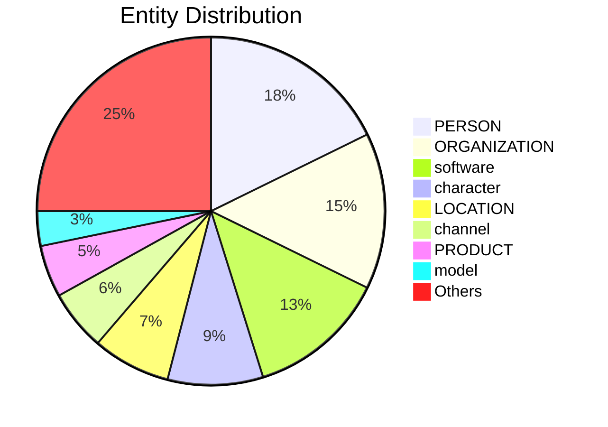

# Video Intelligence Report: Code a Discord Chat Bot That Talks Like Your Favorite Character - Tutorial

**URL**: https://www.youtube.com/watch?v=UjDpW_SOrlw
**Channel**: freeCodeCamp.org
**Duration**: 57:52
**Published**: 2021-08-26
**Processed**: 2025-06-24 13:17:45

**Processing Cost**: 🟡 $0.4427

## Executive Summary

This tutorial demonstrates how to create a Discord AI chatbot that can speak like any character, real or fictional.  It guides users through the process of gathering data from sources like Kaggle, Transcript Wiki, and fandom websites; handling various data formats, including raw transcripts which need parsing using Google Colab, regular expressions, and Pandas; and training a GPT model (Generative Pre-trained Transformer) using a GPU for faster processing.  The tutorial also addresses crucial aspects like preventing overfitting by splitting data into training and testing sets and deploying the bot to a Discord server, while restricting access to specific channels to ensure smooth operation.

## 📊 Quick Stats Dashboard

<details open>
<summary><b>Click to toggle stats</b></summary>

| Metric | Count | Visualization |
|--------|-------|---------------|
| Transcript Length | 28,202 chars | ██████████████ |
| Word Count | 5,180 words | ██████████ |
| Entities Extracted | 116 | 🔵🔵🔵🔵🔵🔵🔵🔵🔵🔵🔵 |
| Relationships Found | 198 | 🔗🔗🔗🔗🔗🔗🔗🔗🔗🔗🔗🔗🔗🔗🔗🔗🔗🔗🔗 |
| Key Points | 18 | 📌📌📌📌📌📌 |
| Topics | 4 | 🏷️🏷️🏷️🏷️ |
| Graph Nodes | 197 | ⭕⭕⭕⭕⭕⭕⭕⭕⭕⭕⭕⭕⭕⭕⭕⭕⭕⭕⭕ |
| Graph Edges | 178 | ➡️➡️➡️➡️➡️➡️➡️➡️➡️➡️➡️➡️➡️➡️➡️➡️➡️ |

</details>

## 🏷️ Main Topics

<details>
<summary><b>View all topics</b></summary>

1. Discord bot creation
2. AI chatbot development
3. Data acquisition and processing
4. Model training and deployment

</details>

## 🕸️ Knowledge Graph Visualization

<details>
<summary><b>Interactive relationship diagram (Mermaid)</b></summary>

    %% Top Entity Relationships
    Discord_bot -->|"artificial intelligence"| use
    Discord_bot -->|"instance of"| artificial_intelligence
    Discord_bot -->|"artificial intelligence"| uses
    chatbot -->|"AI"| subclass_of
    Discord -->|"instance of"| chatbot
    Discord -->|"instance of"| AI_chatbot
    Discord_bot -->|"video game"| use
    Discord_bot -->|"video games"| use
    Discord -->|"instance of"| video_game
    train_the_model -->|"part of"| model_training_and_deployment_pipeline
    model_training_and_deployment_pipeline -->|"has part"| train_the_model
    train_the_model -->|"part of"| deployment
    deploy -->|"has part"| train_the_model
    Python -->|"influenced by"| JavaScript
    JavaScript -->|"influenced by"| Python
    Discord -->|"Python"| programming_language
    data_set -->|"chatbot"| facet_of
    data_set -->|"chatbot"| use
    data_set -->|"has part"| dialogue
    Peppa_Pig -->|"instance of"| video_game

    %% Styling
    classDef personClass fill:#ff9999,stroke:#333,stroke-width:2px
    classDef organizationClass fill:#99ccff,stroke:#333,stroke-width:2px
    classDef locationClass fill:#99ff99,stroke:#333,stroke-width:2px
    classDef productClass fill:#ffcc99,stroke:#333,stroke-width:2px
```

*Note: This diagram shows the top 20 relationships. For the complete graph, use the GEXF file with Gephi.*

</details>

## 🔍 Entity Analysis

### Entity Type Distribution




<details>
<summary><b>📍 LOCATION (9 found)</b></summary>

| Name | Confidence | Source |
|------|------------|--------|
| Google Colab | 🟩 0.95 | SpaCy |
| Python | 🟩 0.90 | SpaCy |
| Kaggle | 🟩 0.90 | SpaCy |
| the Discord | 🟩 0.90 | SpaCy |
| Google Drive | 🟩 0.85 | SpaCy |
| Node | 🟨 0.80 | SpaCy |
| model_train_upload_workflow.ipynb | 🟨 0.80 | SpaCy |
| discord_bot.js | 🟨 0.80 | SpaCy |
| UTF-8 | 🟨 0.75 | SpaCy |

</details>

<details>
<summary><b>🏢 ORGANIZATION (18 found)</b></summary>

| Name | Confidence | Source |
|------|------------|--------|
| Google Colab | 🟩 1.00 | SpaCy |
| Hugging Face | 🟩 1.00 | SpaCy |
| Discord | 🟩 0.90 | SpaCy |
| Google | 🟩 0.90 | SpaCy |
| Transformer | 🟩 0.90 | SpaCy |
| JavaScript | 🟩 0.90 | SpaCy |
| ChattyBot Python | 🟩 0.90 | SpaCy |
| Repl | 🟩 0.90 | SpaCy |
| ChattyBot | 🟩 0.90 | SpaCy |
| Uptime Robot | 🟩 0.90 | SpaCy |
| Git Large File Storage | 🟩 0.85 | SpaCy |
| Python Repl | 🟩 0.85 | SpaCy |
| Discord Python Bot | 🟩 0.85 | SpaCy |
| Pandas | 🟨 0.80 | SpaCy |
| the University of Chicago | 🟨 0.80 | SpaCy |

*... and 3 more organization entities*

</details>

<details>
<summary><b>👤 PERSON (22 found)</b></summary>

| Name | Confidence | Source |
|------|------------|--------|
| Harry Potter | 🟩 1.00 | SpaCy |
| Transcript Wiki | 🟩 1.00 | SpaCy |
| Kaggle | 🟩 0.90 | SpaCy |
| Peppa Pig | 🟩 0.90 | SpaCy |
| Peppa | 🟩 0.90 | SpaCy |
| Harry | 🟩 0.90 | SpaCy |
| Git | 🟩 0.90 | SpaCy |
| Python | 🟩 0.90 | SpaCy |
| Harry Potter Bot Python | 🟩 0.90 | SpaCy |
| Besides Transcript Wiki | 🟩 0.85 | SpaCy |
| Generative Pre-trained | 🟩 0.85 | SpaCy |
| Wanna | 🟨 0.80 | SpaCy |
| Rick | 🟨 0.80 | SpaCy |
| Morty | 🟨 0.80 | SpaCy |
| Lynn | 🟨 0.80 | SpaCy |

*... and 7 more person entities*

</details>

<details>
<summary><b>📦 PRODUCT (6 found)</b></summary>

| Name | Confidence | Source |
|------|------------|--------|
| JavaScript | 🟩 0.85 | SpaCy |
| PeppaPig.csv | 🟩 0.85 | SpaCy |
| Batman on Transcript Wiki | 🟨 0.80 | SpaCy |
| The Word Ends With You | 🟨 0.80 | SpaCy |
| model_train_upload_workflow.ipynb | 🟨 0.80 | SpaCy |
| message.content | 🟨 0.75 | SpaCy |

</details>

<details>
<summary><b>🏷️ algorithm (1 found)</b></summary>

| Name | Confidence | Source |
|------|------------|--------|
| regular expression | 🟨 0.78 | SpaCy |

</details>

<details>
<summary><b>🔌 api (4 found)</b></summary>

| Name | Confidence | Source |
|------|------------|--------|
| Discord API | 🟩 0.93 | SpaCy |
| Hugging Face API | 🟩 0.92 | SpaCy |
| API | 🟨 0.80 | SpaCy |
| OAuth2 | 🟨 0.75 | SpaCy |

</details>

<details>
<summary><b>📺 channel (7 found)</b></summary>

| Name | Confidence | Source |
|------|------------|--------|
| general channel | 🟩 0.96 | SpaCy |
| Python channel | 🟩 0.96 | SpaCy |
| channel | 🟩 0.95 | SpaCy |
| JS channel | 🟩 0.89 | SpaCy |
| Discord channel | 🟩 0.86 | SpaCy |
| JavaScript channel | 🟩 0.85 | SpaCy |
| HTTP | 🟨 0.76 | SpaCy |

</details>

<details>
<summary><b>🏷️ character (11 found)</b></summary>

| Name | Confidence | Source |
|------|------------|--------|
| PeppaPig | 🟩 0.98 | SpaCy |
| favorite character | 🟩 0.95 | SpaCy |
| you | 🟩 0.95 | SpaCy |
| Peppa Pig | 🟩 0.94 | SpaCy |
| Harry | 🟩 0.94 | SpaCy |
| George | 🟩 0.92 | SpaCy |
| Mama Pig | 🟩 0.90 | SpaCy |
| Lynn | 🟩 0.87 | SpaCy |
| character | 🟩 0.85 | SpaCy |
| we | 🟩 0.82 | SpaCy |
| our character | 🟨 0.80 | SpaCy |

</details>

<details>
<summary><b>🏷️ company (2 found)</b></summary>

| Name | Confidence | Source |
|------|------------|--------|
| Microsoft | 🟩 0.91 | SpaCy |
| Google | 🟨 0.71 | SpaCy |

</details>

<details>
<summary><b>🛠️ framework (2 found)</b></summary>

| Name | Confidence | Source |
|------|------------|--------|
| Discord | 🟩 0.95 | SpaCy |
| Git | 🟨 0.71 | SpaCy |

</details>

<details>
<summary><b>🏷️ game (3 found)</b></summary>

| Name | Confidence | Source |
|------|------------|--------|
| video game | 🟩 0.95 | SpaCy |
| video games | 🟩 0.95 | SpaCy |
| game | 🟩 0.95 | SpaCy |

</details>

<details>
<summary><b>🏷️ hardware (1 found)</b></summary>

| Name | Confidence | Source |
|------|------------|--------|
| drive | 🟩 0.89 | SpaCy |

</details>

<details>
<summary><b>🤖 model (4 found)</b></summary>

| Name | Confidence | Source |
|------|------------|--------|
| model | 🟩 0.95 | SpaCy |
| Hugging Face model | 🟩 0.82 | SpaCy |
| GPT model | 🟩 0.80 | SpaCy |
| bot | 🟨 0.72 | SpaCy |

</details>

<details>
<summary><b>🏷️ movie (2 found)</b></summary>

| Name | Confidence | Source |
|------|------------|--------|
| Rick and Morty | 🟩 0.82 | SpaCy |
| Harry Potter | 🟩 0.81 | SpaCy |

</details>

<details>
<summary><b>🏷️ operation (1 found)</b></summary>

| Name | Confidence | Source |
|------|------------|--------|
| get | 🟨 0.70 | SpaCy |

</details>

<details>
<summary><b>🏷️ organization (1 found)</b></summary>

| Name | Confidence | Source |
|------|------------|--------|
| University of Chicago | 🟨 0.72 | SpaCy |

</details>

<details>
<summary><b>🏷️ person (2 found)</b></summary>

| Name | Confidence | Source |
|------|------------|--------|
| user | 🟩 0.95 | SpaCy |
| username | 🟨 0.79 | SpaCy |

</details>

<details>
<summary><b>🌐 platform (1 found)</b></summary>

| Name | Confidence | Source |
|------|------------|--------|
| Discord | 🟩 0.97 | SpaCy |

</details>

<details>
<summary><b>🏷️ programming_language (2 found)</b></summary>

| Name | Confidence | Source |
|------|------------|--------|
| Python | 🟩 0.95 | SpaCy |
| JavaScript | 🟩 0.94 | SpaCy |

</details>

<details>
<summary><b>🏷️ protocol (1 found)</b></summary>

| Name | Confidence | Source |
|------|------------|--------|
| HTTP | 🟩 0.91 | SpaCy |

</details>

<details>
<summary><b>💻 software (16 found)</b></summary>

| Name | Confidence | Source |
|------|------------|--------|
| Git | 🟩 0.96 | SpaCy |
| Discord bot | 🟩 0.95 | SpaCy |
| bot | 🟩 0.95 | SpaCy |
| Rick and Morty | 🟩 0.95 | SpaCy |
| Harry Potter | 🟩 0.95 | SpaCy |
| chatbot | 🟩 0.95 | SpaCy |
| Harry Potter Bot | 🟩 0.95 | SpaCy |
| Google Colab | 🟩 0.89 | SpaCy |
| Kaggle | 🟩 0.89 | SpaCy |
| Uptime Robot | 🟩 0.88 | SpaCy |
| Discord JS Bot | 🟩 0.88 | SpaCy |
| Discord | 🟩 0.84 | SpaCy |
| Python bot | 🟨 0.80 | SpaCy |
| Google | 🟨 0.74 | SpaCy |
| Transcript Wiki | 🟨 0.73 | SpaCy |

*... and 1 more software entities*

</details>

## 🔗 Relationship Network

<details>
<summary><b>Relationship type distribution</b></summary>

| Predicate | Count | Percentage |
|-----------|--------|------------|
| instance of | 41 | ████ 20.7% |
| part of | 22 | ██ 11.1% |
| Python | 16 | █ 8.1% |
| has part | 12 | █ 6.1% |
| JavaScript | 7 |  3.5% |
| chatbot | 5 |  2.5% |
| Peppa Pig | 4 |  2.0% |
| sibling | 4 |  2.0% |
| influenced by | 3 |  1.5% |
| media | 3 |  1.5% |
| data set | 3 |  1.5% |
| HTTP | 3 |  1.5% |
| artificial intelligence | 2 |  1.0% |
| Google Colab | 2 |  1.0% |
| CSV | 2 |  1.0% |

</details>

<details>
<summary><b>Key relationships (top 30)</b></summary>

1. **Discord bot** *artificial intelligence* **use** 🟩 (0.90)
2. **Discord bot** *instance of* **artificial intelligence** 🟩 (0.90)
3. **Discord bot** *artificial intelligence* **uses** 🟩 (0.90)
4. **chatbot** *AI* **subclass of** 🟩 (0.90)
5. **Discord** *instance of* **chatbot** 🟩 (0.90)
6. **Discord** *instance of* **AI chatbot** 🟩 (0.90)
7. **Discord bot** *video game* **use** 🟩 (0.90)
8. **Discord bot** *video games* **use** 🟩 (0.90)
9. **Discord** *instance of* **video game** 🟩 (0.90)
10. **train the model** *part of* **model training and deployment pipeline** 🟩 (0.90)
11. **model training and deployment pipeline** *has part* **train the model** 🟩 (0.90)
12. **train the model** *part of* **deployment** 🟩 (0.90)
13. **deploy** *has part* **train the model** 🟩 (0.90)
14. **Python** *influenced by* **JavaScript** 🟩 (0.90)
15. **JavaScript** *influenced by* **Python** 🟩 (0.90)
16. **Discord** *Python* **programming language** 🟩 (0.90)
17. **data set** *chatbot* **facet of** 🟩 (0.90)
18. **data set** *chatbot* **use** 🟩 (0.90)
19. **data set** *has part* **dialogue** 🟩 (0.90)
20. **Peppa Pig** *instance of* **video game** 🟩 (0.90)
21. **video game** *media* **subclass of** 🟩 (0.90)
22. **cartoon** *media* **subclass of** 🟩 (0.90)
23. **show** *media* **subclass of** 🟩 (0.90)
24. **Batman** *instance of* **movies** 🟩 (0.90)
25. **Peppa Pig** *Batman* **present in work** 🟩 (0.90)
26. **Batman** *Peppa Pig* **present in work** 🟩 (0.90)
27. **The Word Ends With You** *instance of* **game** 🟩 (0.90)
28. **The Word Ends With You** *instance of* **fandom website** 🟩 (0.90)
29. **chatbot** *dialogues* **uses** 🟩 (0.90)
30. **dialogues** *chatbot* **used by** 🟩 (0.90)

</details>

## 💡 Key Insights

<details open>
<summary><b>Top 10 key points</b></summary>

1. 🔴 Create a Discord bot using AI to mimic a chosen character's speech.
2. 🔴 Data sources include Kaggle, Transcript Wiki, and fandom websites.
3. 🔴 Regular expression pattern extracts character name and spoken lines.
4. 🔴 Use GPU for faster model training.
5. 🔴 Rename columns in the DataFrame to 'name' and 'line'.
6. 🔴 Deploy the bot to a Discord server and restrict it to specific channels.
7. 🟡 Tutorial covers building the bot in Python and JavaScript.
8. 🟡 For real-life characters, interview transcripts can be used.
9. 🟡 Use Google Colab and regular expressions to parse transcripts into a CSV.
10. 🟡 Train a GPT model (Generative Pre-trained Transformer) for character impersonation.

</details>

## 📁 Generated Files

<details>
<summary><b>Click to see all files</b></summary>

| File | Format | Size | Description |
|------|--------|------|-------------|
| `transcript.txt` | TXT | 27.5 KB | Plain text transcript |
| `transcript.json` | JSON | 205.8 KB | Full structured data |
| `entities.csv` | CSV | 4.6 KB | All entities in spreadsheet format |
| `relationships.csv` | CSV | 27.0 KB | All relationships in spreadsheet format |
| `knowledge_graph.json` | JSON | 40.4 KB | Complete graph structure |
| `knowledge_graph.gexf` | GEXF | 93.8 KB | Import into Gephi for visualization |
| `metadata.json` | JSON | 2.2 KB | Video metadata and statistics |
| `report.md` | Markdown | 8.0 KB | This report |

</details>

---
*Generated by ClipScribe v2.5.2 on 2025-06-24 at 13:17:45*

💡 **Tip**: This markdown file supports Mermaid diagrams. View it in GitHub, GitLab, or any Markdown viewer with Mermaid support for interactive diagrams.
