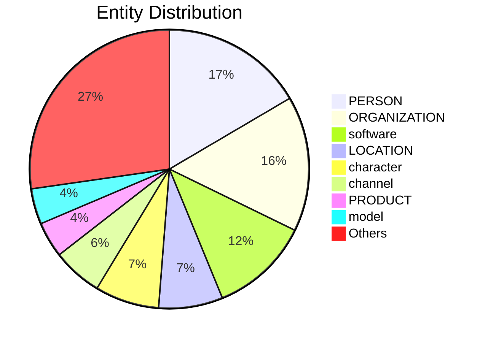

# Video Intelligence Report: Code a Discord Chat Bot That Talks Like Your Favorite Character - Tutorial

**URL**: https://www.youtube.com/watch?v=UjDpW_SOrlw
**Channel**: freeCodeCamp.org
**Duration**: 57:52
**Published**: 2021-08-26
**Processed**: 2025-06-24 14:18:16

**Processing Cost**: 🟡 $0.4427

## Executive Summary

This tutorial demonstrates how to build a Discord AI chatbot that can emulate the speech patterns of any character.  The instructor, Lynn, guides viewers through the entire process, from data acquisition to model deployment.  Data sources include readily available datasets on Kaggle, or through web searches and Transcript Wiki for less common characters, with the process of cleaning and formatting raw transcripts into usable datasets detailed. The core of the tutorial focuses on training a GPT model in Google Colab, emphasizing the importance of using a GPU for efficient training and splitting the data to avoid overfitting.  The final stages cover deploying the bot to a Discord server, configuring channel restrictions, and ensuring continuous operation.

## 📊 Quick Stats Dashboard

<details open>
<summary><b>Click to toggle stats</b></summary>

| Metric | Count | Visualization |
|--------|-------|---------------|
| Transcript Length | 28,520 chars | ██████████████ |
| Word Count | 5,195 words | ██████████ |
| Entities Extracted | 112 | 🔵🔵🔵🔵🔵🔵🔵🔵🔵🔵🔵 |
| Relationships Found | 211 | 🔗🔗🔗🔗🔗🔗🔗🔗🔗🔗🔗🔗🔗🔗🔗🔗🔗🔗🔗🔗 |
| Key Points | 21 | 📌📌📌📌📌📌📌 |
| Topics | 3 | 🏷️🏷️🏷️ |
| Graph Nodes | 205 | ⭕⭕⭕⭕⭕⭕⭕⭕⭕⭕⭕⭕⭕⭕⭕⭕⭕⭕⭕⭕ |
| Graph Edges | 190 | ➡️➡️➡️➡️➡️➡️➡️➡️➡️➡️➡️➡️➡️➡️➡️➡️➡️➡️➡️ |

</details>

## 🏷️ Main Topics

<details>
<summary><b>View all topics</b></summary>

1. Discord Bot Development
2. AI Chatbot Creation
3. Natural Language Processing

</details>

## 🕸️ Knowledge Graph Visualization

<details>
<summary><b>Interactive relationship diagram (Mermaid)</b></summary>

    %% Top Entity Relationships
    Discord_bot -->|"artificial intelligence"| use
    Discord_bot -->|"instance of"| artificial_intelligence
    Discord_bot -->|"artificial intelligence"| uses
    chatbot -->|"AI"| subclass_of
    Discord -->|"instance of"| chatbot
    Discord -->|"instance of"| AI_chatbot
    Python -->|"influenced by"| JavaScript
    JavaScript -->|"influenced by"| Python
    Discord -->|"Python"| programming_language
    Rick_and_Morty -->|"the character"| characters
    the_character -->|"Rick and Morty"| present_in_work
    Rick_and_Morty -->|"dialogue"| genre
    Harry_Potter -->|"dialogue"| genre
    Harry_Potter -->|"Rick and Morty"| present_in_work
    Peppa_Pig -->|"instance of"| dataset
    Peppa_Pig -->|"instance of"| datasets
    Batman -->|"instance of"| movies
    Batman -->|"instance of"| movie
    Peppa_Pig -->|"Batman"| present_in_work
    The_Word_Ends_With_You -->|"instance of"| bot

    %% Styling
    class The_Word_Ends_With_You productClass
    classDef personClass fill:#ff9999,stroke:#333,stroke-width:2px
    classDef organizationClass fill:#99ccff,stroke:#333,stroke-width:2px
    classDef locationClass fill:#99ff99,stroke:#333,stroke-width:2px
    classDef productClass fill:#ffcc99,stroke:#333,stroke-width:2px
```

*Note: This diagram shows the top 20 relationships. For the complete graph, use the GEXF file with Gephi.*

</details>

## 🔍 Entity Analysis

### Entity Type Distribution




<details>
<summary><b>📍 LOCATION (9 found)</b></summary>

| Name | Confidence | Source |
|------|------------|--------|
| Google Colab | 🟩 0.95 | SpaCy |
| Python | 🟩 0.90 | SpaCy |
| Kaggle | 🟩 0.90 | SpaCy |
| the Discord | 🟩 0.90 | SpaCy |
| Google Drive | 🟩 0.85 | SpaCy |
| OAuth | 🟨 0.80 | SpaCy |
| Node | 🟨 0.80 | SpaCy |
| model_train_upload_workflow.ipynb | 🟨 0.80 | SpaCy |
| UTF-8 | 🟨 0.75 | SpaCy |

</details>

<details>
<summary><b>🏢 ORGANIZATION (19 found)</b></summary>

| Name | Confidence | Source |
|------|------------|--------|
| Google Colab | 🟩 1.00 | SpaCy |
| Hugging Face | 🟩 1.00 | SpaCy |
| Uptime Robot | 🟩 1.00 | SpaCy |
| Discord | 🟩 0.90 | SpaCy |
| Google | 🟩 0.90 | SpaCy |
| Peppa Pig | 🟩 0.90 | SpaCy |
| Transformer | 🟩 0.90 | SpaCy |
| JavaScript | 🟩 0.90 | SpaCy |
| ChattyBot Python | 🟩 0.90 | SpaCy |
| Repl | 🟩 0.90 | SpaCy |
| ChattyBot | 🟩 0.90 | SpaCy |
| Git Large File Storage | 🟩 0.85 | SpaCy |
| Python Repl | 🟩 0.85 | SpaCy |
| Discord Python | 🟩 0.85 | SpaCy |
| the University of Chicago | 🟨 0.80 | SpaCy |

*... and 4 more organization entities*

</details>

<details>
<summary><b>👤 PERSON (20 found)</b></summary>

| Name | Confidence | Source |
|------|------------|--------|
| Harry Potter | 🟩 1.00 | SpaCy |
| Transcript Wiki | 🟩 1.00 | SpaCy |
| Kaggle | 🟩 0.90 | SpaCy |
| Peppa | 🟩 0.90 | SpaCy |
| Peppa Pig | 🟩 0.90 | SpaCy |
| Harry | 🟩 0.90 | SpaCy |
| Git | 🟩 0.90 | SpaCy |
| Python | 🟩 0.90 | SpaCy |
| Harry Potter Bot Python | 🟩 0.90 | SpaCy |
| Besides Transcript Wiki | 🟩 0.85 | SpaCy |
| Generative Pre-trained | 🟩 0.85 | SpaCy |
| Wanna | 🟨 0.80 | SpaCy |
| Rick | 🟨 0.80 | SpaCy |
| Morty | 🟨 0.80 | SpaCy |
| Lynn | 🟨 0.80 | SpaCy |

*... and 5 more person entities*

</details>

<details>
<summary><b>📦 PRODUCT (5 found)</b></summary>

| Name | Confidence | Source |
|------|------------|--------|
| JavaScript | 🟩 0.85 | SpaCy |
| Batman on Transcript Wiki | 🟨 0.80 | SpaCy |
| The Word Ends With You | 🟨 0.80 | SpaCy |
| model_train_upload_workflow.ipynb | 🟨 0.80 | SpaCy |
| message.content | 🟨 0.75 | SpaCy |

</details>

<details>
<summary><b>🏷️ algorithm (1 found)</b></summary>

| Name | Confidence | Source |
|------|------------|--------|
| regular expression | 🟨 0.79 | SpaCy |

</details>

<details>
<summary><b>🔌 api (5 found)</b></summary>

| Name | Confidence | Source |
|------|------------|--------|
| chatbot | 🟩 0.95 | SpaCy |
| Hugging Face API | 🟩 0.93 | SpaCy |
| Discord API | 🟩 0.93 | SpaCy |
| API | 🟩 0.82 | SpaCy |
| Hugging Face | 🟨 0.77 | SpaCy |

</details>

<details>
<summary><b>📺 channel (7 found)</b></summary>

| Name | Confidence | Source |
|------|------------|--------|
| general channel | 🟩 0.96 | SpaCy |
| Python channel | 🟩 0.96 | SpaCy |
| channel | 🟩 0.93 | SpaCy |
| JS channel | 🟩 0.89 | SpaCy |
| Discord channel | 🟩 0.84 | SpaCy |
| JavaScript channel | 🟩 0.84 | SpaCy |
| HTTP | 🟨 0.76 | SpaCy |

</details>

<details>
<summary><b>🏷️ character (9 found)</b></summary>

| Name | Confidence | Source |
|------|------------|--------|
| Harry | 🟩 0.97 | SpaCy |
| our character | 🟩 0.95 | SpaCy |
| favorite character | 🟩 0.95 | SpaCy |
| George | 🟩 0.94 | SpaCy |
| Peppa Pig | 🟩 0.93 | SpaCy |
| Mama Pig | 🟩 0.89 | SpaCy |
| peppapig | 🟩 0.89 | SpaCy |
| character | 🟩 0.87 | SpaCy |
| Lynn | 🟩 0.87 | SpaCy |

</details>

<details>
<summary><b>🏷️ company (2 found)</b></summary>

| Name | Confidence | Source |
|------|------------|--------|
| Microsoft | 🟩 0.91 | SpaCy |
| Google | 🟨 0.72 | SpaCy |

</details>

<details>
<summary><b>🛠️ framework (1 found)</b></summary>

| Name | Confidence | Source |
|------|------------|--------|
| Discord | 🟩 0.95 | SpaCy |

</details>

<details>
<summary><b>🏷️ game (2 found)</b></summary>

| Name | Confidence | Source |
|------|------------|--------|
| video games | 🟩 0.95 | SpaCy |
| game | 🟩 0.95 | SpaCy |

</details>

<details>
<summary><b>🏷️ hardware (1 found)</b></summary>

| Name | Confidence | Source |
|------|------------|--------|
| drive | 🟩 0.96 | SpaCy |

</details>

<details>
<summary><b>🤖 model (5 found)</b></summary>

| Name | Confidence | Source |
|------|------------|--------|
| model | 🟩 0.95 | SpaCy |
| Hugging Face model | 🟩 0.82 | SpaCy |
| GPT model | 🟨 0.78 | SpaCy |
| bot | 🟨 0.72 | SpaCy |
| Generative Pre-trained Transformer | 🟨 0.71 | SpaCy |

</details>

<details>
<summary><b>🏷️ movie (2 found)</b></summary>

| Name | Confidence | Source |
|------|------------|--------|
| Rick and Morty | 🟩 0.82 | SpaCy |
| Harry Potter | 🟩 0.81 | SpaCy |

</details>

<details>
<summary><b>🏷️ organization (1 found)</b></summary>

| Name | Confidence | Source |
|------|------------|--------|
| University of Chicago | 🟨 0.72 | SpaCy |

</details>

<details>
<summary><b>🏷️ person (1 found)</b></summary>

| Name | Confidence | Source |
|------|------------|--------|
| username | 🟨 0.71 | SpaCy |

</details>

<details>
<summary><b>🌐 platform (2 found)</b></summary>

| Name | Confidence | Source |
|------|------------|--------|
| Discord | 🟩 0.96 | SpaCy |
| Kaggle | 🟨 0.74 | SpaCy |

</details>

<details>
<summary><b>🏷️ programming_language (2 found)</b></summary>

| Name | Confidence | Source |
|------|------------|--------|
| Python | 🟩 0.95 | SpaCy |
| JavaScript | 🟩 0.94 | SpaCy |

</details>

<details>
<summary><b>🏷️ protocol (3 found)</b></summary>

| Name | Confidence | Source |
|------|------------|--------|
| HTTPS | 🟩 0.89 | SpaCy |
| HTTP POST | 🟩 0.82 | SpaCy |
| HTTP | 🟩 0.81 | SpaCy |

</details>

<details>
<summary><b>💻 software (14 found)</b></summary>

| Name | Confidence | Source |
|------|------------|--------|
| Discord bot | 🟩 0.95 | SpaCy |
| bot | 🟩 0.95 | SpaCy |
| chatbot | 🟩 0.95 | SpaCy |
| git | 🟩 0.95 | SpaCy |
| Uptime Robot | 🟩 0.92 | SpaCy |
| client | 🟩 0.91 | SpaCy |
| Kaggle | 🟩 0.88 | SpaCy |
| Google Colab | 🟩 0.87 | SpaCy |
| Discord JS bot | 🟩 0.86 | SpaCy |
| Python bot | 🟩 0.84 | SpaCy |
| Discord | 🟩 0.84 | SpaCy |
| Harry Potter | 🟩 0.81 | SpaCy |
| Google | 🟨 0.74 | SpaCy |
| Transcript Wiki | 🟨 0.74 | SpaCy |

</details>

<details>
<summary><b>🏷️ time (1 found)</b></summary>

| Name | Confidence | Source |
|------|------------|--------|
| 12 epochs | 🟨 0.71 | SpaCy |

</details>

## 🔗 Relationship Network

<details>
<summary><b>Relationship type distribution</b></summary>

| Predicate | Count | Percentage |
|-----------|--------|------------|
| instance of | 35 | ███ 16.6% |
| part of | 27 | ██ 12.8% |
| Python | 18 | █ 8.5% |
| has part | 14 | █ 6.6% |
| JavaScript | 7 |  3.3% |
| chatbot | 3 |  1.4% |
| sibling | 3 |  1.4% |
| Peppa Pig | 3 |  1.4% |
| hyperparameters | 3 |  1.4% |
| confused | 3 |  1.4% |
| artificial intelligence | 2 |  0.9% |
| influenced by | 2 |  0.9% |
| Rick and Morty | 2 |  0.9% |
| dialogue | 2 |  0.9% |
| text messages | 2 |  0.9% |

</details>

<details>
<summary><b>Key relationships (top 30)</b></summary>

1. **Discord bot** *artificial intelligence* **use** 🟩 (0.90)
2. **Discord bot** *instance of* **artificial intelligence** 🟩 (0.90)
3. **Discord bot** *artificial intelligence* **uses** 🟩 (0.90)
4. **chatbot** *AI* **subclass of** 🟩 (0.90)
5. **Discord** *instance of* **chatbot** 🟩 (0.90)
6. **Discord** *instance of* **AI chatbot** 🟩 (0.90)
7. **Python** *influenced by* **JavaScript** 🟩 (0.90)
8. **JavaScript** *influenced by* **Python** 🟩 (0.90)
9. **Discord** *Python* **programming language** 🟩 (0.90)
10. **Rick and Morty** *the character* **characters** 🟩 (0.90)
11. **the character** *Rick and Morty* **present in work** 🟩 (0.90)
12. **Rick and Morty** *dialogue* **genre** 🟩 (0.90)
13. **Harry Potter** *dialogue* **genre** 🟩 (0.90)
14. **Harry Potter** *Rick and Morty* **present in work** 🟩 (0.90)
15. **Peppa Pig** *instance of* **dataset** 🟩 (0.90)
16. **Peppa Pig** *instance of* **datasets** 🟩 (0.90)
17. **Batman** *instance of* **movies** 🟩 (0.90)
18. **Batman** *instance of* **movie** 🟩 (0.90)
19. **Peppa Pig** *Batman* **present in work** 🟩 (0.90)
20. **The Word Ends With You** *instance of* **bot** 🟩 (0.90)
21. **The Word Ends With You** *instance of* **game** 🟩 (0.90)
22. **Kaggle** *instance of* **dataset** 🟩 (0.90)
23. **chatbot** *text messages* **uses** 🟩 (0.90)
24. **text messages** *chatbot* **used by** 🟩 (0.90)
25. **Google search** *owned by* **Google** 🟩 (0.90)
26. **Google** *Google search* **owner of** 🟩 (0.90)
27. **chatbot** *text messages* **use** 🟩 (0.90)
28. **dataset** *has part* **text file** 🟩 (0.90)
29. **text file** *part of* **dataset** 🟩 (0.90)
30. **two-column** *character line* **uses** 🟩 (0.90)

</details>

## 💡 Key Insights

<details open>
<summary><b>Top 10 key points</b></summary>

1. 🔴 Create a Discord bot using AI to mimic a chosen character's speech.
2. 🔴 Data sources include Kaggle, Transcript Wiki, and web searches.
3. 🔴 The model is trained using a GPU for faster processing.
4. 🔴 The tutorial uses Python and JavaScript for bot development and deployment.
5. 🔴 Deployment includes instructions on deploying to a Discord server and limiting access to specific channels.
6. 🔴 The bot is designed to run indefinitely.
7. 🟡 Lynn, a software engineer and game developer, teaches the process.
8. 🟡 The tutorial expands upon a previous, popular bot.
9. 🟡 Use Google Colab and regular expressions to parse transcripts and create CSV files.
10. 🟡 The regular expression pattern is used to extract character names and lines.

</details>

## 📁 Generated Files

<details>
<summary><b>Click to see all files</b></summary>

| File | Format | Size | Description |
|------|--------|------|-------------|
| `transcript.txt` | TXT | 27.9 KB | Plain text transcript |
| `transcript.json` | JSON | 212.9 KB | Full structured data |
| `entities.csv` | CSV | 4.5 KB | All entities in spreadsheet format |
| `relationships.csv` | CSV | 29.0 KB | All relationships in spreadsheet format |
| `knowledge_graph.json` | JSON | 42.9 KB | Complete graph structure |
| `knowledge_graph.gexf` | GEXF | 99.0 KB | Import into Gephi for visualization |
| `metadata.json` | JSON | 2.2 KB | Video metadata and statistics |
| `report.md` | Markdown | 8.0 KB | This report |

</details>

---
*Generated by ClipScribe v2.5.2 on 2025-06-24 at 14:18:16*

💡 **Tip**: This markdown file supports Mermaid diagrams. View it in GitHub, GitLab, or any Markdown viewer with Mermaid support for interactive diagrams.
