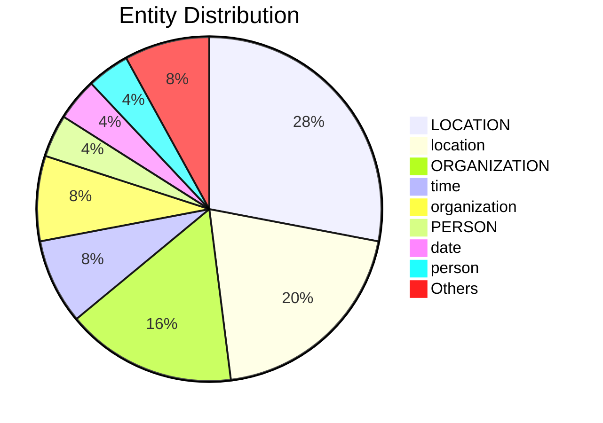

# Video Intelligence Report: James Webb Space Telescope Mission Overview (2023)

**URL**: https://www.youtube.com/watch?v=QNY6DPZNZII
**Channel**: James Webb Space Telescope (JWST)
**Duration**: 3:35
**Published**: 2023-07-12
**Processed**: 2025-06-24 14:39:51

**Processing Cost**: 🟢 $0.0274

## Executive Summary

The James Webb Space Telescope (JWST), launched on Christmas Day 2021, represents a monumental achievement in engineering and astronomy.  Its intricate deployment, involving the unfolding of numerous components, culminated in a fully operational observatory at the Lagrange Point 2. JWST's unprecedented capabilities stem from its massive primary mirror and advanced infrared instruments, enabling it to peer deeper into the universe than ever before.  This allows astronomers to study the earliest galaxies, analyze exoplanet atmospheres, and even observe details within our solar system, all with unprecedented clarity.

JWST's success is a testament to international collaboration, with thousands of individuals from the US, Canada, and Europe contributing to its design, construction, and launch.  Its scientific potential is immense, offering a unique opportunity to investigate fundamental questions about the cosmos, from the formation of galaxies to the potential for life beyond Earth. The telescope functions through an advanced cooling system kept colder than the surface of Pluto, aided by a large sun shield, which protects it from external heat sources.

Ultimately, JWST is more than just a telescope; it's a powerful tool for exploration, pushing the boundaries of our understanding of the universe and revealing unseen wonders of the cosmos.  It's our window to the uncharted territories of space, enabling scientists to delve into the unknown and unimagined realms of the universe.  The data gathered by JWST has already revolutionized our understanding of the universe, and promises further discoveries in the years to come.

## 📊 Quick Stats Dashboard

<details open>
<summary><b>Click to toggle stats</b></summary>

| Metric | Count | Visualization |
|--------|-------|---------------|
| Transcript Length | 2,697 chars | █ |
| Word Count | 435 words |  |
| Entities Extracted | 25 | 🔵🔵 |
| Relationships Found | 22 | 🔗🔗 |
| Key Points | 16 | 📌📌📌📌📌 |
| Topics | 3 | 🏷️🏷️🏷️ |
| Graph Nodes | 44 | ⭕⭕⭕⭕ |
| Graph Edges | 21 | ➡️➡️ |

</details>

## 🏷️ Main Topics

<details>
<summary><b>View all topics</b></summary>

1. Space Exploration
2. James Webb Space Telescope
3. Astronomy

</details>

## 🕸️ Knowledge Graph Visualization

<details>
<summary><b>Interactive relationship diagram (Mermaid)</b></summary>

    %% Top Entity Relationships
    James_Webb -->|"instance of"| space_telescope
    James_Webb -->|"December 25th, 2021"| start_time
    James_Webb -->|"December 25th, 2021"| date_of_official_opening
    Webb -->|"European Space Agency"| operator
    rocket_fairing -->|"owned by"| European_Space_Agency
    European_Space_Agency -->|"rocket fairing"| owner_of
    rocket_fairing -->|"European Space Agency"| operator
    Space_Telescope_Science_Institute -->|"Baltimore"| headquarters_location
    Space_Telescope_Science_Institute -->|"Baltimore"| located_in_the_administrative_territorial_entity
    JWST -->|"Space Telescope Science Institute"| operator
    galaxies -->|"Big Bang"| significant_event
    Big_Bang -->|"galaxies"| has_effect
    Hubble_Space_Telescope -->|"has part"| primary_mirror
    primary_mirror -->|"part of"| Hubble_Space_Telescope
    Hubble_Space_Telescope -->|"has part"| sun_shield
    sun_shield -->|"part of"| Hubble_Space_Telescope
    Hubble_Space_Telescope -->|"infrared"| field_of_work
    universe -->|"Big Bang"| significant_event
    Big_Bang -->|"universe"| has_effect
    star -->|"part of"| solar_system

    %% Styling
    class James_Webb personClass
    class Webb personClass
    class European_Space_Agency organizationClass
    class Space_Telescope_Science_Institute organizationClass
    classDef personClass fill:#ff9999,stroke:#333,stroke-width:2px
    classDef organizationClass fill:#99ccff,stroke:#333,stroke-width:2px
    classDef locationClass fill:#99ff99,stroke:#333,stroke-width:2px
    classDef productClass fill:#ffcc99,stroke:#333,stroke-width:2px
```

*Note: This diagram shows the top 20 relationships. For the complete graph, use the GEXF file with Gephi.*

</details>

## 🔍 Entity Analysis

### Entity Type Distribution




<details>
<summary><b>📍 LOCATION (7 found)</b></summary>

| Name | Confidence | Source |
|------|------------|--------|
| the United States | 🟨 0.80 | SpaCy |
| Baltimore | 🟨 0.75 | SpaCy |
| Earth | 🟨 0.75 | SpaCy |
| Canada | 🟨 0.75 | SpaCy |
| Europe | 🟨 0.75 | SpaCy |
| the Lagrange Point 2 | 🟨 0.75 | SpaCy |
| the Hubble Space Telescope | 🟨 0.75 | SpaCy |

</details>

<details>
<summary><b>🏢 ORGANIZATION (4 found)</b></summary>

| Name | Confidence | Source |
|------|------------|--------|
| Webb | 🟩 0.90 | SpaCy |
| the Big Bang | 🟩 0.85 | SpaCy |
| the European Space Agency's | 🟨 0.80 | SpaCy |
| the Space Telescope Science Institute | 🟨 0.80 | SpaCy |

</details>

<details>
<summary><b>👤 PERSON (1 found)</b></summary>

| Name | Confidence | Source |
|------|------------|--------|
| James Webb | 🟨 0.75 | SpaCy |

</details>

<details>
<summary><b>🏷️ date (1 found)</b></summary>

| Name | Confidence | Source |
|------|------------|--------|
| December 25th, 2021 | 🟩 0.88 | SpaCy |

</details>

<details>
<summary><b>🏷️ event (1 found)</b></summary>

| Name | Confidence | Source |
|------|------------|--------|
| Big Bang | 🟩 0.86 | SpaCy |

</details>

<details>
<summary><b>🏷️ hardware (1 found)</b></summary>

| Name | Confidence | Source |
|------|------------|--------|
| Webb telescope | 🟩 0.95 | SpaCy |

</details>

<details>
<summary><b>🏷️ location (5 found)</b></summary>

| Name | Confidence | Source |
|------|------------|--------|
| space | 🟩 0.95 | SpaCy |
| United States | 🟩 0.89 | SpaCy |
| Pluto | 🟩 0.88 | SpaCy |
| Lagrange Point 2 | 🟩 0.87 | SpaCy |
| moon | 🟩 0.84 | SpaCy |

</details>

<details>
<summary><b>🏷️ organization (2 found)</b></summary>

| Name | Confidence | Source |
|------|------------|--------|
| European Space Agency | 🟩 0.98 | SpaCy |
| Space Telescope Science Institute | 🟩 0.96 | SpaCy |

</details>

<details>
<summary><b>🏷️ person (1 found)</b></summary>

| Name | Confidence | Source |
|------|------------|--------|
| Webb | 🟩 0.95 | SpaCy |

</details>

<details>
<summary><b>🏷️ time (2 found)</b></summary>

| Name | Confidence | Source |
|------|------------|--------|
| Christmas Day | 🟩 0.95 | SpaCy |
| Six months later | 🟩 0.95 | SpaCy |

</details>

## 🔗 Relationship Network

<details>
<summary><b>Relationship type distribution</b></summary>

| Predicate | Count | Percentage |
|-----------|--------|------------|
| has part | 4 | ███ 18.2% |
| part of | 3 | ██ 13.6% |
| December 25th, 2021 | 2 | █ 9.1% |
| European Space Agency | 2 | █ 9.1% |
| Baltimore | 2 | █ 9.1% |
| Big Bang | 2 | █ 9.1% |
| instance of | 1 |  4.5% |
| owned by | 1 |  4.5% |
| rocket fairing | 1 |  4.5% |
| Space Telescope Science Institute | 1 |  4.5% |
| galaxies | 1 |  4.5% |
| infrared | 1 |  4.5% |
| universe | 1 |  4.5% |

</details>

<details>
<summary><b>Key relationships (top 30)</b></summary>

1. **James Webb** *instance of* **space telescope** 🟩 (0.90)
2. **James Webb** *December 25th, 2021* **start time** 🟩 (0.90)
3. **James Webb** *December 25th, 2021* **date of official opening** 🟩 (0.90)
4. **Webb** *European Space Agency* **operator** 🟩 (0.90)
5. **rocket fairing** *owned by* **European Space Agency** 🟩 (0.90)
6. **European Space Agency** *rocket fairing* **owner of** 🟩 (0.90)
7. **rocket fairing** *European Space Agency* **operator** 🟩 (0.90)
8. **Space Telescope Science Institute** *Baltimore* **headquarters location** 🟩 (0.90)
9. **Space Telescope Science Institute** *Baltimore* **located in the administrative territorial entity** 🟩 (0.90)
10. **JWST** *Space Telescope Science Institute* **operator** 🟩 (0.90)
11. **galaxies** *Big Bang* **significant event** 🟩 (0.90)
12. **Big Bang** *galaxies* **has effect** 🟩 (0.90)
13. **Hubble Space Telescope** *has part* **primary mirror** 🟩 (0.90)
14. **primary mirror** *part of* **Hubble Space Telescope** 🟩 (0.90)
15. **Hubble Space Telescope** *has part* **sun shield** 🟩 (0.90)
16. **sun shield** *part of* **Hubble Space Telescope** 🟩 (0.90)
17. **Hubble Space Telescope** *infrared* **field of work** 🟩 (0.90)
18. **universe** *Big Bang* **significant event** 🟩 (0.90)
19. **Big Bang** *universe* **has effect** 🟩 (0.90)
20. **star** *part of* **solar system** 🟩 (0.90)
21. **solar system** *has part* **star** 🟩 (0.90)
22. **solar system** *has part* **planets** 🟩 (0.90)

</details>

## 💡 Key Insights

<details open>
<summary><b>Top 10 key points</b></summary>

1. 🔴 The James Webb Space Telescope (JWST) launched on December 25th, 2021.
2. 🔴 JWST is designed to capture faint infrared light from the first galaxies after the Big Bang.
3. 🔴 Astronomers worldwide are using JWST to study fundamental questions about the universe.
4. 🔴 It's the largest, most powerful, and most complex space telescope ever built.
5. 🔴 Unfolding in space was a complex process involving 178 release mechanisms.
6. 🔴 It reached its orbital destination around Lagrange Point 2, nearly 1 million miles from Earth.
7. 🔴 Scientific exploration began six months after launch, once instruments cooled.
8. 🔴 JWST's instruments operate at extremely cold temperatures, colder than Pluto's surface.
9. 🔴 Thousands of people across the US, Canada, and Europe contributed to the project.
10. 🔴 JWST allows observation of the earliest galaxies after the Big Bang.

</details>

## 📁 Generated Files

<details>
<summary><b>Click to see all files</b></summary>

| File | Format | Size | Description |
|------|--------|------|-------------|
| `transcript.txt` | TXT | 2.6 KB | Plain text transcript |
| `transcript.json` | JSON | 39.3 KB | Full structured data |
| `entities.csv` | CSV | 1.1 KB | All entities in spreadsheet format |
| `relationships.csv` | CSV | 3.3 KB | All relationships in spreadsheet format |
| `knowledge_graph.json` | JSON | 7.2 KB | Complete graph structure |
| `knowledge_graph.gexf` | GEXF | 18.2 KB | Import into Gephi for visualization |
| `metadata.json` | JSON | 1.2 KB | Video metadata and statistics |
| `report.md` | Markdown | 8.0 KB | This report |

</details>

---
*Generated by ClipScribe v2.5.2 on 2025-06-24 at 14:39:51*

💡 **Tip**: This markdown file supports Mermaid diagrams. View it in GitHub, GitLab, or any Markdown viewer with Mermaid support for interactive diagrams.
