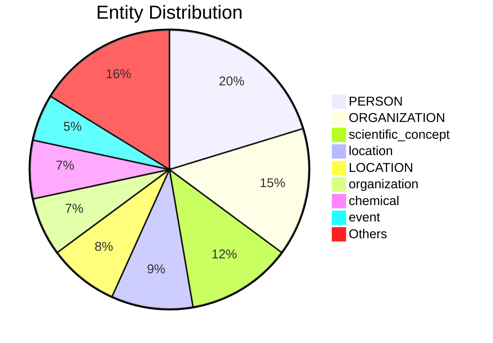

# Video Intelligence Report: NASA's James Webb Space Telescope: Stunning new images captured of the universe | 60 Minutes

**URL**: https://www.youtube.com/watch?v=dC1-qgR7YO0
**Channel**: 60 Minutes
**Duration**: 12:47
**Published**: 2023-04-09
**Processed**: 2025-06-24 14:41:25

**Processing Cost**: 🟢 $0.0978

## Executive Summary

The James Webb Space Telescope, launched on Christmas Day 2021, has revolutionized our understanding of the universe. Its primary goal is to study the universe's early stages after the Big Bang.  Early observations have revealed an unprecedented number of galaxies, including the most distant one ever discovered, formed just 320 million years post-Big Bang.  The telescope has also captured stunning images of galactic interactions and supernovae, providing insights into the formation of elements essential for life.  These discoveries are challenging our existing theories of galaxy formation and the nature of dark matter and dark energy, which constitute 95% of the universe.  

Webb's capabilities are transforming astronomy, with discoveries such as carbon dioxide detection in an exoplanet's atmosphere and potential evidence of unexpectedly early galaxy formation. The sheer number of galaxies revealed by Webb highlights the vastness and complexity of the universe, challenging our prior assumptions about 'empty space'. This telescope's long operational lifespan (up to 25 years) promises further groundbreaking discoveries and a shift in our understanding of cosmic history.  

The telescope's infrared capabilities are crucial for observing distant objects and events,  and the processing of the data to create the stunning images that we see shows the advanced work required behind creating those final images. The discoveries made have the potential to reshape our understanding of the universe, from the formation of the earliest galaxies to the composition and processes driving the expansion of space itself.   The project's collaborative nature, with contributions from numerous institutions and scientists worldwide, underscores the global effort to explore the cosmos and unlock its mysteries.

## 📊 Quick Stats Dashboard

<details open>
<summary><b>Click to toggle stats</b></summary>

| Metric | Count | Visualization |
|--------|-------|---------------|
| Transcript Length | 10,144 chars | █████ |
| Word Count | 1,794 words | ███ |
| Entities Extracted | 71 | 🔵🔵🔵🔵🔵🔵🔵 |
| Relationships Found | 79 | 🔗🔗🔗🔗🔗🔗🔗 |
| Key Points | 26 | 📌📌📌📌📌📌📌📌 |
| Topics | 5 | 🏷️🏷️🏷️🏷️🏷️ |
| Graph Nodes | 118 | ⭕⭕⭕⭕⭕⭕⭕⭕⭕⭕⭕ |
| Graph Edges | 73 | ➡️➡️➡️➡️➡️➡️➡️ |

</details>

## 🏷️ Main Topics

<details>
<summary><b>View all topics</b></summary>

1. James Webb Space Telescope
2. Cosmology
3. Galaxy Formation
4. Early Universe
5. Dark Matter and Dark Energy

</details>

## 🕸️ Knowledge Graph Visualization

<details>
<summary><b>Interactive relationship diagram (Mermaid)</b></summary>

    %% Top Entity Relationships
    James_Webb_Space_Telescope -->|"NASA"| operator
    universe -->|"Big Bang"| significant_event
    Big_Bang -->|"universe"| has_effect
    galaxies -->|"part of"| universe
    galaxies -->|"Astrophysicist"| studied_by
    Astrophysicist -->|"galaxies"| studies
    Milky_Way -->|"instance of"| galaxies
    Milky_Way -->|"instance of"| irregular_galaxy
    interacting -->|"galaxies"| facet_of
    Advanced_Deep_Extragalactic_Survey -->|"University of California, Santa Cruz"| operator
    most_distant_galaxy -->|"part of"| universe
    universe -->|"has part"| most_distant_galaxy
    the_most_distant_galaxy -->|"part of"| universe
    universe -->|"has part"| the_most_distant_galaxy
    the_Big_Bang -->|"universe"| has_effect
    universe -->|"the Big Bang"| significant_event
    Big_Bang -->|"the universe"| has_effect
    the_universe -->|"Big Bang"| significant_event
    most_distant_galaxy_so_far -->|"spectrum of its light"| studied_by
    spectrum_of_its_light -->|"most distant galaxy so far"| studies

    %% Styling
    class James_Webb_Space_Telescope personClass
    class Milky_Way locationClass
    class the_Big_Bang locationClass
    classDef personClass fill:#ff9999,stroke:#333,stroke-width:2px
    classDef organizationClass fill:#99ccff,stroke:#333,stroke-width:2px
    classDef locationClass fill:#99ff99,stroke:#333,stroke-width:2px
    classDef productClass fill:#ffcc99,stroke:#333,stroke-width:2px
```

*Note: This diagram shows the top 20 relationships. For the complete graph, use the GEXF file with Gephi.*

</details>

## 🔍 Entity Analysis

### Entity Type Distribution




<details>
<summary><b>📍 LOCATION (6 found)</b></summary>

| Name | Confidence | Source |
|------|------------|--------|
| the Big Bang | 🟩 0.95 | SpaCy |
| Webb | 🟩 0.85 | SpaCy |
| California | 🟨 0.80 | SpaCy |
| Milky Way | 🟨 0.75 | SpaCy |
| Santa Cruz | 🟨 0.75 | SpaCy |
| the Milky Way | 🟨 0.75 | SpaCy |

</details>

<details>
<summary><b>🏢 ORGANIZATION (11 found)</b></summary>

| Name | Confidence | Source |
|------|------------|--------|
| Webb | 🟩 0.90 | SpaCy |
| Milisavljevic | 🟩 0.90 | SpaCy |
| Northrop Grumman | 🟩 0.85 | SpaCy |
| Purdue University | 🟩 0.85 | SpaCy |
| Sun | 🟨 0.80 | SpaCy |
| the University of California | 🟨 0.80 | SpaCy |
| the Advanced Deep Extragalactic Survey | 🟨 0.80 | SpaCy |
| the Association of Universities for Research | 🟨 0.80 | SpaCy |
| the Space Telescope Science Institute | 🟨 0.80 | SpaCy |
| the University of Colorado Boulder | 🟨 0.80 | SpaCy |
| Neptune | 🟨 0.75 | SpaCy |

</details>

<details>
<summary><b>👤 PERSON (15 found)</b></summary>

| Name | Confidence | Source |
|------|------------|--------|
| Brent Robertson | 🟩 0.90 | SpaCy |
| Webb | 🟩 0.90 | SpaCy |
| James Webb | 🟩 0.90 | SpaCy |
| Matt Mountain | 🟩 0.90 | SpaCy |
| James Webb Space Telescope | 🟩 0.85 | SpaCy |
| Dan Milisavljevic | 🟩 0.85 | SpaCy |
| Alyssa Pagan | 🟩 0.85 | SpaCy |
| Joe DePasquale | 🟩 0.85 | SpaCy |
| Erika Nelson | 🟩 0.85 | SpaCy |
| James Webb Telescope | 🟩 0.85 | SpaCy |
| Robertson | 🟨 0.80 | SpaCy |
| Nelson | 🟨 0.80 | SpaCy |
| Amy Lowe | 🟨 0.75 | SpaCy |
| Wilbur | 🟨 0.75 | SpaCy |
| Carl Sagan | 🟨 0.75 | SpaCy |

</details>

<details>
<summary><b>🏷️ chemical (5 found)</b></summary>

| Name | Confidence | Source |
|------|------------|--------|
| oxygen | 🟩 0.94 | SpaCy |
| hydrogen | 🟩 0.92 | SpaCy |
| calcium | 🟩 0.85 | SpaCy |
| iron | 🟩 0.82 | SpaCy |
| helium | 🟨 0.77 | SpaCy |

</details>

<details>
<summary><b>🏷️ date (2 found)</b></summary>

| Name | Confidence | Source |
|------|------------|--------|
| 2021 | 🟩 0.85 | SpaCy |
| Christmas Day 2021 | 🟨 0.72 | SpaCy |

</details>

<details>
<summary><b>🏷️ event (4 found)</b></summary>

| Name | Confidence | Source |
|------|------------|--------|
| Big Bang | 🟩 0.90 | SpaCy |
| supernova explosion | 🟩 0.89 | SpaCy |
| supernova explosions | 🟩 0.89 | SpaCy |
| Advanced Deep Extragalactic Survey | 🟩 0.86 | SpaCy |

</details>

<details>
<summary><b>🏷️ hardware (2 found)</b></summary>

| Name | Confidence | Source |
|------|------------|--------|
| James Webb Telescope | 🟩 0.95 | SpaCy |
| JWST | 🟩 0.95 | SpaCy |

</details>

<details>
<summary><b>🏷️ location (7 found)</b></summary>

| Name | Confidence | Source |
|------|------------|--------|
| space | 🟩 0.95 | SpaCy |
| universe | 🟩 0.95 | SpaCy |
| Neptune | 🟩 0.85 | SpaCy |
| night sky | 🟩 0.82 | SpaCy |
| observatory | 🟨 0.75 | SpaCy |
| Sun | 🟨 0.72 | SpaCy |
| Webb operations | 🟨 0.71 | SpaCy |

</details>

<details>
<summary><b>🏷️ organization (5 found)</b></summary>

| Name | Confidence | Source |
|------|------------|--------|
| NASA | 🟩 0.97 | SpaCy |
| Space Telescope Science Institute | 🟩 0.95 | SpaCy |
| University of California | 🟩 0.93 | SpaCy |
| University of Colorado Boulder | 🟩 0.93 | SpaCy |
| Association of Universities for Research in Astronomy | 🟩 0.86 | SpaCy |

</details>

<details>
<summary><b>🏷️ percentage (3 found)</b></summary>

| Name | Confidence | Source |
|------|------------|--------|
| 95% | 🟩 0.91 | SpaCy |
| 2% | 🟩 0.86 | SpaCy |
| 4% | 🟨 0.79 | SpaCy |

</details>

<details>
<summary><b>🏷️ person (1 found)</b></summary>

| Name | Confidence | Source |
|------|------------|--------|
| we | 🟩 0.95 | SpaCy |

</details>

<details>
<summary><b>🏷️ scientific_concept (9 found)</b></summary>

| Name | Confidence | Source |
|------|------------|--------|
| dark matter | 🟩 0.99 | SpaCy |
| dark energy | 🟩 0.98 | SpaCy |
| Astronomy | 🟩 0.96 | SpaCy |
| galaxies | 🟩 0.95 | SpaCy |
| universe | 🟩 0.95 | SpaCy |
| galaxy | 🟩 0.95 | SpaCy |
| infrared light | 🟩 0.83 | SpaCy |
| heat radiation | 🟨 0.79 | SpaCy |
| stars | 🟨 0.72 | SpaCy |

</details>

<details>
<summary><b>🏷️ time (1 found)</b></summary>

| Name | Confidence | Source |
|------|------------|--------|
| time | 🟨 0.75 | SpaCy |

</details>

## 🔗 Relationship Network

<details>
<summary><b>Relationship type distribution</b></summary>

| Predicate | Count | Percentage |
|-----------|--------|------------|
| part of | 11 | ██ 13.9% |
| has part | 10 | ██ 12.7% |
| instance of | 7 | █ 8.9% |
| galaxies | 4 | █ 5.1% |
| Big Bang | 3 |  3.8% |
| universe | 2 |  2.5% |
| most distant galaxy so far | 2 |  2.5% |
| 2021 | 2 |  2.5% |
| Northrop Grumman | 2 |  2.5% |
| Purdue University | 2 |  2.5% |
| light | 2 |  2.5% |
| astronomer | 2 |  2.5% |
| Space Telescope Science Institute | 2 |  2.5% |
| carbon dioxide | 2 |  2.5% |
| Brent Robertson | 2 |  2.5% |

</details>

<details>
<summary><b>Key relationships (top 30)</b></summary>

1. **James Webb Space Telescope** *NASA* **operator** 🟩 (0.90)
2. **universe** *Big Bang* **significant event** 🟩 (0.90)
3. **Big Bang** *universe* **has effect** 🟩 (0.90)
4. **galaxies** *part of* **universe** 🟩 (0.90)
5. **galaxies** *Astrophysicist* **studied by** 🟩 (0.90)
6. **Astrophysicist** *galaxies* **studies** 🟩 (0.90)
7. **Milky Way** *instance of* **galaxies** 🟩 (0.90)
8. **Milky Way** *instance of* **irregular galaxy** 🟩 (0.90)
9. **interacting** *galaxies* **facet of** 🟩 (0.90)
10. **Advanced Deep Extragalactic Survey** *University of California, Santa Cruz* **operator** 🟩 (0.90)
11. **most distant galaxy** *part of* **universe** 🟩 (0.90)
12. **universe** *has part* **most distant galaxy** 🟩 (0.90)
13. **the most distant galaxy** *part of* **universe** 🟩 (0.90)
14. **universe** *has part* **the most distant galaxy** 🟩 (0.90)
15. **the Big Bang** *universe* **has effect** 🟩 (0.90)
16. **universe** *the Big Bang* **significant event** 🟩 (0.90)
17. **Big Bang** *the universe* **has effect** 🟩 (0.90)
18. **the universe** *Big Bang* **significant event** 🟩 (0.90)
19. **most distant galaxy so far** *spectrum of its light* **studied by** 🟩 (0.90)
20. **spectrum of its light** *most distant galaxy so far* **studies** 🟩 (0.90)
21. **most distant galaxy so far** *Big Bang* **follows** 🟩 (0.90)
22. **Big Bang** *most distant galaxy so far* **followed by** 🟩 (0.90)
23. **most distant galaxy so far** *instance of* **spectrum of its light** 🟩 (0.90)
24. **spectrum of its light** *astronomers* **studied by** 🟩 (0.90)
25. **earliest galaxy so far formed** *part of* **universe** 🟩 (0.90)
26. **universe** *has part* **earliest galaxy so far formed** 🟩 (0.90)
27. **earliest galaxy** *part of* **universe** 🟩 (0.90)
28. **universe** *has part* **earliest galaxy** 🟩 (0.90)
29. **Milky Way** *part of* **universe** 🟩 (0.90)
30. **early** *NASA administrator* **position held** 🟩 (0.90)

</details>

## 💡 Key Insights

<details open>
<summary><b>Top 10 key points</b></summary>

1. 🔴 James Webb Space Telescope launched on Christmas Day 2021.
2. 🔴 Webb discovered the most distant galaxy known, over 33 billion light-years away.
3. 🔴 This discovery may revise existing theories on galaxy formation and the early universe.
4. 🔴 Astronomy will be divided into "before Webb" and "after Webb" eras.
5. 🔴 Its primary mission is to observe the universe's early stages after the Big Bang.
6. 🔴 The telescope observed the "cosmic rose", a galaxy resembling a rose.
7. 🔴 This galaxy formed 320 million years after the Big Bang.
8. 🔴 The early galaxy formed stars rapidly, likened to a hummingbird's heartbeat.
9. 🔴 There is no "empty sky", galaxies are abundant everywhere.
10. 🔴 Dark energy and dark matter make up 95% of the universe, and their nature is unknown.

</details>

## 📁 Generated Files

<details>
<summary><b>Click to see all files</b></summary>

| File | Format | Size | Description |
|------|--------|------|-------------|
| `transcript.txt` | TXT | 9.9 KB | Plain text transcript |
| `transcript.json` | JSON | 108.8 KB | Full structured data |
| `entities.csv` | CSV | 3.1 KB | All entities in spreadsheet format |
| `relationships.csv` | CSV | 11.4 KB | All relationships in spreadsheet format |
| `knowledge_graph.json` | JSON | 21.2 KB | Complete graph structure |
| `knowledge_graph.gexf` | GEXF | 51.0 KB | Import into Gephi for visualization |
| `metadata.json` | JSON | 1.8 KB | Video metadata and statistics |
| `report.md` | Markdown | 8.0 KB | This report |

</details>

---
*Generated by ClipScribe v2.5.2 on 2025-06-24 at 14:41:25*

💡 **Tip**: This markdown file supports Mermaid diagrams. View it in GitHub, GitLab, or any Markdown viewer with Mermaid support for interactive diagrams.
