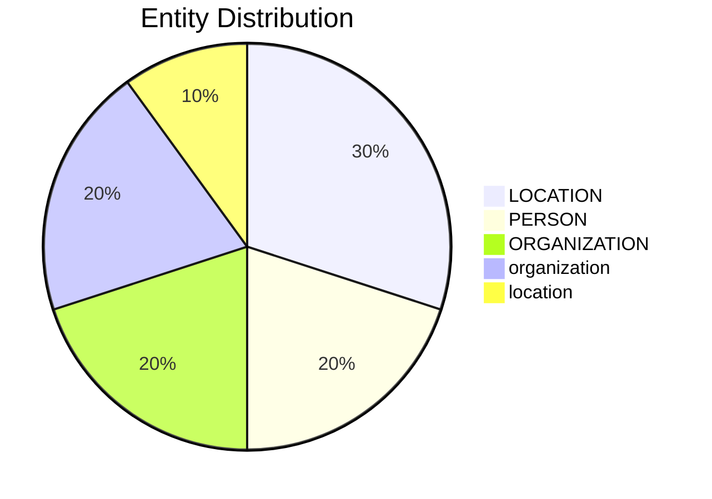

# Video Intelligence Report: Cynthia Gonzalez, the vice mayor of a small city in the Los Angeles County area, is under federal investigation for allegedly suggesting gangsters aren't defending their territory from ICE.

**URL**: https://www.tiktok.com/@foxnews/video/7519618205237742879
**Channel**: foxnews
**Duration**: 0:28
**Published**: 2025-06-24
**Processed**: 2025-06-24 14:11:30

**Processing Cost**: 🟢 $0.0036

## Executive Summary

Cynthia Gonzalez, vice mayor of Cudahy (a small city in Los Angeles), publicly criticized the notorious Latino gangs Florencia and 18th Street on Instagram for their inaction in protecting their territory.  She highlights their failure to respond to what she describes as an invasion of their turf, specifically mentioning locations like 82nd Street and Co danza where the gangs are known for their territorial markings.  Her statement implies a lack of responsibility on the part of these gangs in maintaining control over their claimed areas.  The criticism is notable for its direct call for the gangs to fulfill a role typically associated with law enforcement, highlighting a complex dynamic of community expectations and gang activity within the city.

## 📊 Quick Stats Dashboard

<details open>
<summary><b>Click to toggle stats</b></summary>

| Metric | Count | Visualization |
|--------|-------|---------------|
| Transcript Length | 409 chars |  |
| Word Count | 73 words |  |
| Entities Extracted | 10 | 🔵 |
| Relationships Found | 3 |  |
| Key Points | 7 | 📌📌 |
| Topics | 4 | 🏷️🏷️🏷️🏷️ |
| Graph Nodes | 10 | ⭕ |
| Graph Edges | 3 |  |

</details>

## 🏷️ Main Topics

<details>
<summary><b>View all topics</b></summary>

1. Gang Activity
2. Community Response
3. Law Enforcement
4. Social Media

</details>

## 🕸️ Knowledge Graph Visualization

<details>
<summary><b>Interactive relationship diagram (Mermaid)</b></summary>

    %% Top Entity Relationships
    Cudahy -->|"Los Angeles"| located_in_the_administrative_territorial_entity
    82nd_Street -->|"Los Angeles"| located_in_the_administrative_territorial_entity
    Cynthia_Gonzalez -->|"Cudahy"| place_of_birth

    %% Styling
    class Cudahy locationClass
    class 82nd_Street locationClass
    class Cynthia_Gonzalez personClass
    classDef personClass fill:#ff9999,stroke:#333,stroke-width:2px
    classDef organizationClass fill:#99ccff,stroke:#333,stroke-width:2px
    classDef locationClass fill:#99ff99,stroke:#333,stroke-width:2px
    classDef productClass fill:#ffcc99,stroke:#333,stroke-width:2px
```

*Note: This diagram shows the top 20 relationships. For the complete graph, use the GEXF file with Gephi.*

</details>

## 🔍 Entity Analysis

### Entity Type Distribution




<details>
<summary><b>📍 LOCATION (3 found)</b></summary>

| Name | Confidence | Source |
|------|------------|--------|
| Los Angeles | 🟩 0.85 | SpaCy |
| 82nd Street | 🟨 0.75 | SpaCy |
| 18th Street | 🟨 0.75 | SpaCy |

</details>

<details>
<summary><b>🏢 ORGANIZATION (2 found)</b></summary>

| Name | Confidence | Source |
|------|------------|--------|
| Cudahy | 🟨 0.75 | SpaCy |
| Instagram | 🟨 0.75 | SpaCy |

</details>

<details>
<summary><b>👤 PERSON (2 found)</b></summary>

| Name | Confidence | Source |
|------|------------|--------|
| Cynthia Gonzalez | 🟩 0.85 | SpaCy |
| Florencia | 🟨 0.75 | SpaCy |

</details>

<details>
<summary><b>🏷️ location (1 found)</b></summary>

| Name | Confidence | Source |
|------|------------|--------|
| Cudahy | 🟩 0.95 | SpaCy |

</details>

<details>
<summary><b>🏷️ organization (2 found)</b></summary>

| Name | Confidence | Source |
|------|------------|--------|
| Latino gangs | 🟩 0.95 | SpaCy |
| Florencia | 🟨 0.76 | SpaCy |

</details>

## 🔗 Relationship Network

<details>
<summary><b>Relationship type distribution</b></summary>

| Predicate | Count | Percentage |
|-----------|--------|------------|
| Los Angeles | 2 | █████████████ 66.7% |
| Cudahy | 1 | ██████ 33.3% |

</details>

<details>
<summary><b>Key relationships (top 30)</b></summary>

1. **Cudahy** *Los Angeles* **located in the administrative territorial entity** 🟩 (0.90)
2. **82nd Street** *Los Angeles* **located in the administrative territorial entity** 🟩 (0.90)
3. **Cynthia Gonzalez** *Cudahy* **place of birth** 🟩 (0.90)

</details>

## 💡 Key Insights

<details open>
<summary><b>Top 10 key points</b></summary>

1. 🔴 Vice Mayor Cynthia Gonzalez criticizes Latino gangs Florencia and 18th Street for not protecting their turf.
2. 🟡 The statement was made on Instagram.
3. 🟡 Gonzalez mentions 82nd Street and Co danza as locations relevant to the gangs' activity.
4. 🟡 The gangs are described as "the biggest gang there is."
5. 🟡 The criticism implies inaction by the gangs in the face of an invasion of their territory.
6. ⚪ The gangs are accused of "tagging everything up, claiming hood."
7. ⚪ Cudahy is a small city in Los Angeles.

</details>

## 📁 Generated Files

<details>
<summary><b>Click to see all files</b></summary>

| File | Format | Size | Description |
|------|--------|------|-------------|
| `transcript.txt` | TXT | 409 B | Plain text transcript |
| `transcript.json` | JSON | 11.2 KB | Full structured data |
| `entities.csv` | CSV | 437 B | All entities in spreadsheet format |
| `relationships.csv` | CSV | 543 B | All relationships in spreadsheet format |
| `knowledge_graph.json` | JSON | 1.6 KB | Complete graph structure |
| `knowledge_graph.gexf` | GEXF | 4.5 KB | Import into Gephi for visualization |
| `metadata.json` | JSON | 930 B | Video metadata and statistics |
| `report.md` | Markdown | 0 B | This report |

</details>

---
*Generated by ClipScribe v2.5.2 on 2025-06-24 at 14:11:30*

💡 **Tip**: This markdown file supports Mermaid diagrams. View it in GitHub, GitLab, or any Markdown viewer with Mermaid support for interactive diagrams.
