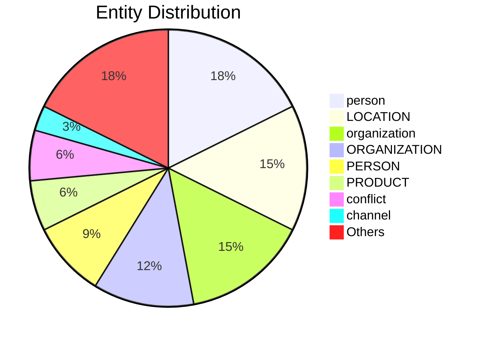

# Video Intelligence Report: CSPAN - Israeli Ambassador to the U.N. @dannydanon: "I think that President Trump deserves a Nobel Peace Prize."

**URL**: https://x.com/cspan/status/1937590662125244568
**Channel**: CSPAN
**Duration**: 3:04
**Published**: 2025-06-24
**Processed**: 2025-06-24 13:39:18

**Processing Cost**: 🟢 $0.0235

## Executive Summary

The transcript covers a press briefing where the ambassador discusses several key issues.  First, the ambassador supports a US Congressman's nomination of President Trump for the Nobel Peace Prize, praising the president's leadership.  Second, regarding the Gaza ceasefire, the ambassador expresses hope for a renewed negotiation based on an existing proposal, anticipating diplomatic efforts between Iran and Israel following any military operation.  The ambassador clarifies that the recent military action was necessary due to diplomatic failures and that further details regarding the ceasefire are premature.  Finally, regarding Hamas's claims and President Trump's statement about the dismantling of a weapons program, the ambassador confirms that Israel successfully neutralized the threat but refrains from providing specifics due to security concerns.  The UN's potential future involvement is also discussed.

## 📊 Quick Stats Dashboard

<details open>
<summary><b>Click to toggle stats</b></summary>

| Metric | Count | Visualization |
|--------|-------|---------------|
| Transcript Length | 2,784 chars | █ |
| Word Count | 490 words |  |
| Entities Extracted | 30 | 🔵🔵🔵 |
| Relationships Found | 25 | 🔗🔗 |
| Key Points | 11 | 📌📌📌 |
| Topics | 4 | 🏷️🏷️🏷️🏷️ |
| Graph Nodes | 49 | ⭕⭕⭕⭕ |
| Graph Edges | 24 | ➡️➡️ |

</details>

## 🏷️ Main Topics

<details>
<summary><b>View all topics</b></summary>

1. Nobel Peace Prize Nomination
2. Gaza Ceasefire
3. Iran-Israel Relations
4. Hamas Weapons Program

</details>

## 🕸️ Knowledge Graph Visualization

<details>
<summary><b>Interactive relationship diagram (Mermaid)</b></summary>

    %% Top Entity Relationships
    President_Trump -->|"Nobel Peace Prize"| award_received
    Nobel_Peace_Prize -->|"President Trump"| winner
    President_Trump -->|"Nobel Peace Prize"| nominated_for
    United_States -->|"diplomatic relation"| Israel
    Israel -->|"diplomatic relation"| United_States
    ceasefire_also_in_Gaza -->|"United States"| participant
    ceasefire -->|"Gaza"| location
    Iran -->|"diplomatic relation"| Israel
    Israel -->|"diplomatic relation"| Iran
    USA -->|"diplomatic relation"| Israel
    Iran -->|"diplomatic relation"| USA
    a_major_threat_in_the_Middle_East -->|"12 days ago"| point_in_time
    a_major_threat_in_the_Middle_East -->|"12 days ago"| start_time
    a_major_threat -->|"12 days ago"| point_in_time
    ceasefire_between_Israel_and_Iran -->|"President Trump"| participant
    ceasefire_between_Israel_and_Iran -->|"Iran"| country
    Hamas -->|"highly enriched uranium"| product_or_material_produced
    highly_enriched_uranium -->|"Hamas"| operator
    Ambassador,_Ambassador,_Ambassador -->|"part of"| UN_organization
    Hamas -->|"member of"| UN_organization

    %% Styling
    class President_Trump personClass
    class United_States organizationClass
    class Israel organizationClass
    class Iran locationClass
    class Hamas organizationClass
    classDef personClass fill:#ff9999,stroke:#333,stroke-width:2px
    classDef organizationClass fill:#99ccff,stroke:#333,stroke-width:2px
    classDef locationClass fill:#99ff99,stroke:#333,stroke-width:2px
    classDef productClass fill:#ffcc99,stroke:#333,stroke-width:2px
```

*Note: This diagram shows the top 20 relationships. For the complete graph, use the GEXF file with Gephi.*

</details>

## 🔍 Entity Analysis

### Entity Type Distribution




<details>
<summary><b>📍 LOCATION (5 found)</b></summary>

| Name | Confidence | Source |
|------|------------|--------|
| Iran | 🟩 0.90 | SpaCy |
| Israel | 🟩 0.90 | SpaCy |
| Gaza | 🟨 0.80 | SpaCy |
| the United States | 🟨 0.80 | SpaCy |
| the Middle East | 🟨 0.75 | SpaCy |

</details>

<details>
<summary><b>🏢 ORGANIZATION (4 found)</b></summary>

| Name | Confidence | Source |
|------|------------|--------|
| Security Council | 🟩 0.90 | SpaCy |
| China Central Television | 🟩 0.85 | SpaCy |
| the Security Council | 🟨 0.80 | SpaCy |
| Hamas | 🟨 0.75 | SpaCy |

</details>

<details>
<summary><b>👤 PERSON (3 found)</b></summary>

| Name | Confidence | Source |
|------|------------|--------|
| Trump | 🟩 0.90 | SpaCy |
| Witkoff | 🟨 0.75 | SpaCy |
| Netanyahu | 🟨 0.75 | SpaCy |

</details>

<details>
<summary><b>📦 PRODUCT (2 found)</b></summary>

| Name | Confidence | Source |
|------|------------|--------|
| Nobel Peace Prize | 🟩 0.85 | SpaCy |
| a Nobel Peace Prize | 🟨 0.75 | SpaCy |

</details>

<details>
<summary><b>📺 channel (1 found)</b></summary>

| Name | Confidence | Source |
|------|------------|--------|
| China Central Television | 🟩 0.95 | SpaCy |

</details>

<details>
<summary><b>🏷️ conflict (2 found)</b></summary>

| Name | Confidence | Source |
|------|------------|--------|
| ceasefire | 🟩 0.95 | SpaCy |
| conflict | 🟨 0.70 | SpaCy |

</details>

<details>
<summary><b>🏷️ event (1 found)</b></summary>

| Name | Confidence | Source |
|------|------------|--------|
| Nobel Peace Prize | 🟩 0.95 | SpaCy |

</details>

<details>
<summary><b>🏷️ location (1 found)</b></summary>

| Name | Confidence | Source |
|------|------------|--------|
| Middle East | 🟩 0.91 | SpaCy |

</details>

<details>
<summary><b>🏷️ organization (5 found)</b></summary>

| Name | Confidence | Source |
|------|------------|--------|
| UN | 🟩 0.96 | SpaCy |
| United States | 🟩 0.95 | SpaCy |
| program | 🟩 0.88 | SpaCy |
| Israel | 🟩 0.84 | SpaCy |
| RIA Novosti | 🟨 0.78 | SpaCy |

</details>

<details>
<summary><b>🏷️ person (6 found)</b></summary>

| Name | Confidence | Source |
|------|------------|--------|
| US Congressman | 🟩 0.95 | SpaCy |
| President Trump | 🟩 0.92 | SpaCy |
| Prime Minister Netanyahu | 🟩 0.91 | SpaCy |
| Ambassador Witkoff | 🟩 0.88 | SpaCy |
| Ambassador | 🟨 0.76 | SpaCy |
| Mr. Ambassador | 🟨 0.73 | SpaCy |

</details>

## 🔗 Relationship Network

<details>
<summary><b>Relationship type distribution</b></summary>

| Predicate | Count | Percentage |
|-----------|--------|------------|
| diplomatic relation | 6 | ████ 24.0% |
| 12 days ago | 3 | ██ 12.0% |
| Nobel Peace Prize | 2 | █ 8.0% |
| President Trump | 2 | █ 8.0% |
| Prime Minister | 2 | █ 8.0% |
| United States | 1 |  4.0% |
| Gaza | 1 |  4.0% |
| Iran | 1 |  4.0% |
| highly enriched uranium | 1 |  4.0% |
| Hamas | 1 |  4.0% |
| part of | 1 |  4.0% |
| member of | 1 |  4.0% |
| Netanyahu | 1 |  4.0% |
| Benjamin Netanyahu | 1 |  4.0% |
| employer | 1 |  4.0% |

</details>

<details>
<summary><b>Key relationships (top 30)</b></summary>

1. **President Trump** *Nobel Peace Prize* **award received** 🟩 (0.90)
2. **Nobel Peace Prize** *President Trump* **winner** 🟩 (0.90)
3. **President Trump** *Nobel Peace Prize* **nominated for** 🟩 (0.90)
4. **United States** *diplomatic relation* **Israel** 🟩 (0.90)
5. **Israel** *diplomatic relation* **United States** 🟩 (0.90)
6. **ceasefire also in Gaza** *United States* **participant** 🟩 (0.90)
7. **ceasefire** *Gaza* **location** 🟩 (0.90)
8. **Iran** *diplomatic relation* **Israel** 🟩 (0.90)
9. **Israel** *diplomatic relation* **Iran** 🟩 (0.90)
10. **USA** *diplomatic relation* **Israel** 🟩 (0.90)
11. **Iran** *diplomatic relation* **USA** 🟩 (0.90)
12. **a major threat in the Middle East** *12 days ago* **point in time** 🟩 (0.90)
13. **a major threat in the Middle East** *12 days ago* **start time** 🟩 (0.90)
14. **a major threat** *12 days ago* **point in time** 🟩 (0.90)
15. **ceasefire between Israel and Iran** *President Trump* **participant** 🟩 (0.90)
16. **ceasefire between Israel and Iran** *Iran* **country** 🟩 (0.90)
17. **Hamas** *highly enriched uranium* **product or material produced** 🟩 (0.90)
18. **highly enriched uranium** *Hamas* **operator** 🟩 (0.90)
19. **Ambassador, Ambassador, Ambassador** *part of* **UN organization** 🟩 (0.90)
20. **Hamas** *member of* **UN organization** 🟩 (0.90)
21. **Prime Minister** *Netanyahu* **officeholder** 🟩 (0.90)
22. **Netanyahu** *Prime Minister* **position held** 🟩 (0.90)
23. **Prime Minister** *Benjamin Netanyahu* **officeholder** 🟩 (0.90)
24. **Benjamin Netanyahu** *Prime Minister* **position held** 🟩 (0.90)
25. **UN** *employer* **Netanyahu** 🟩 (0.90)

</details>

## 💡 Key Insights

<details open>
<summary><b>Top 10 key points</b></summary>

1. 🔴 A US Congressman nominated President Trump for the Nobel Peace Prize.
2. 🔴 The ambassador believes President Trump deserves the Nobel Peace Prize for his leadership and brave decisions.
3. 🔴 Hamas claimed to have removed most of its highly enriched uranium before the strike, and President Trump stated the program was being dismantled.
4. 🔴 Israel's assessment is that it is too early to assess all the strikes but that they were able to push back the program and remove the imminent threat.
5. 🟡 Discussions are underway for a ceasefire in Gaza, with a proposal put forward by Ambassador Witkoff.
6. 🟡 The ambassador expects diplomatic talks between Iran and Israel to follow the ceasefire announcement.
7. 🟡 A reporter from RIA Novosti asks about a UN Security Council resolution on the ceasefire and potential discussions with Iranian counterparts.
8. 🟡 The ambassador doesn't believe a Security Council resolution is necessary, as the parties accepted President Trump's proposal but leaves open the possibility of UN involvement in the future.
9. 🟡 The ambassador explains that diplomacy failed, necessitating military action by the USA.
10. 🟡 The ambassador states that it's too early to discuss specific details of the ceasefire follow-up.

</details>

## 📁 Generated Files

<details>
<summary><b>Click to see all files</b></summary>

| File | Format | Size | Description |
|------|--------|------|-------------|
| `transcript.txt` | TXT | 2.7 KB | Plain text transcript |
| `transcript.json` | JSON | 42.1 KB | Full structured data |
| `entities.csv` | CSV | 1.3 KB | All entities in spreadsheet format |
| `relationships.csv` | CSV | 3.7 KB | All relationships in spreadsheet format |
| `knowledge_graph.json` | JSON | 8.1 KB | Complete graph structure |
| `knowledge_graph.gexf` | GEXF | 20.3 KB | Import into Gephi for visualization |
| `metadata.json` | JSON | 777 B | Video metadata and statistics |
| `report.md` | Markdown | 8.0 KB | This report |

</details>

---
*Generated by ClipScribe v2.5.2 on 2025-06-24 at 13:39:18*

💡 **Tip**: This markdown file supports Mermaid diagrams. View it in GitHub, GitLab, or any Markdown viewer with Mermaid support for interactive diagrams.
